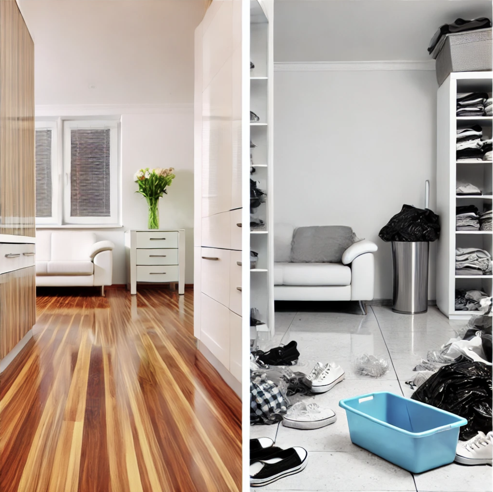

# 주인이 아닌데 어떻게 주인 의식을 가지죠

최근 [독서 모임](https://jojoldu.tistory.com/807)에서 다음과 같은 질문이 있었다.

"주인이 아닌데 어떻게 주인 의식을 가질 수 있죠?"  
  
이 질문은 구직자나 팀원이 아닌, 창업을 준비하는 예비 대표님의 질문이셨다.  
그간의 직장 생활 경험으로 오너십을 가진 팀원은 유니콘과 같은 환상속에만 있는 것은 아닌가? 이런 사람들을 채용할 수 있을까? 보통의 팀원들에겐 어떻게 오너십을 가지게 할 수 있을까? 등에 관한 질문이셨다.  
  
이 질문에 대한 여러 사람들의 답변이 있었는데,  
바로 옆자리에 계셨던 [태일님](https://www.linkedin.com/in/%ED%83%9C%EC%9D%BC-%EA%B9%80-06a53160/)의 답변이 너무 좋았다.

"집 주인이 아닌 세입자로 살고 있어도 우린 그 집을 깨끗하게 가꾸고 꾸민다.  
그게 주인의식이라고 생각한다."  

짧은 한 문장이였지만 굉장히 크게 와닿았다.  

---

전세/월세를 살다보면 어차피 내 집도 아닌데, 그냥 대충 살고 관리 안하고 있다가 떠나면 그만이라고 생각할 수 있다.   
작은 못질 하나 하려면 집 주인 허락을 받아야하고, 내가 원하는대로 인테리어 하려면 집주인의 양해가 필요하다.  
내가 원하는대로 100% 할 수 없고, 대부분의 작업은 집주인의 허락을 받아야만 한다.  
  
그럼에도 **2년 후면 떠날 공간을 할 수 있는 범위 내에서 최대한 집을 청소하고 깔끔하게 관리**한다.  
주말마다 화장실 청소를 하고 청소기를 돌리고 물걸레질을 한다.  
**이 집을 아무리 깔끔하게 꾸미고 관리를 해도 내 집이 되는 것은 아닌데도 말이다**.  
  
왜 그럴까?    
나는 **이 집에서 거주하는 기간 동안 만큼은 집에 들어왔을때 편안하고, 행복한 충만감을 느끼며 살고 싶었다**.  
집에만 들어오면 스트레스를 받는 그런 상황 보다는  
집에만 오면 스트레스가 풀리고 정말 쉰다는 느낌을 받는 그런 공간이 되었으면 했다.  
그게 설령 내 집이 아니더라도 말이다.  
  
2년 혹은 4년간 이 집에서 거주해야하는 것을 피할 수 없다.   그렇다면 "**내가 주인은 아닌 이 집에서 그 기간 동안 앞으로 어떻게 살 것인가?**" 에 대한 선택만 있을 뿐이다.  
  
"깨끗하게 정리되어 있고, 퇴근 후 어서 빨리 가고 싶고, 주말에도 나가지 않고 계속 쉬고 싶은 집"과  
"더럽게 어질러져있고, 퇴근 후 돌아가고 싶지 않고, 주말에 어떻게든 밖으로 나가고 싶은 집" 이 중에서 어디서 거주하길 원할까?

  
몇년을 어떤 형태로 거주하고 싶은지는 본인이 선택할 수 있다.   

---

회사 생활도 비슷한 것 같다.    
1인 기업가, 프리랜서 등을 하지 않는 이상 우리는 어딘가에서 속해서 일을 해야한다.   
그리고 **하루의 절반은 속한 회사에서 보내야하며 그걸 몇년간 지속해야한다**.  
  
그렇다면 나는 과연 "그 시간을 어떻게 보낼 것인가" 에 대해 선택해야한다.    
썩 마음에 드는 집은 아니지만, 그래도 **하루에 1/3 ~ 1/2를 있을 공간이니 그 안에서 최대한 만족도가 높은 생활을 하기 위해 노력할 것인가**,  
어떻게든 빨리 떠나고 싶은 공간으로 대할 것인가  
를 선택할 뿐이다.  
  
어차피 뭘 한다고 나한테 돌아오는 것도 없는데 그냥 대충하자 라고 할 수록 만족도는 계속 떨어졌다.  
집 청소, 설거지를 하지 않고 방치해둔 집에서 생활하듯이.  
회사가 아닌 나를 위해서 더 좋은 환경으로 바꿔나가자라고 생각하고 대할수록 만족도가 높아졌다.  
깨끗해진 내 집처럼.  
  
내가 주인이냐 아니냐는 크게 상관이 없었다. 
주인의 여부와 관계 없이 내가 이 공간에서 몇년간을 어떤 형태로 대할 것인가, 어떻게 해야만 만족감을 느낄 수 있을까 고민하고 실행하는 것만이 중요했다.  
  
그리고 채용은 룸메이트를 뽑는 것과 비슷하다.  
  
나는 깨끗하게 이 집을 사용하는데, **룸메이트는 설거지도 하지 않고 화장실도 더럽게 사용한다면 그 집에서 살고 싶을까?**  
내가 아무리 노력해도 같이 사는 사람들이 그렇지 않으면 결국 그 집을 떠나고 싶을 뿐이다.  
그러니 룸메이트를 뽑을때도 나와 같은 생각을 가진 사람을 뽑고 싶어한다.  
주말마다 깨끗하게 청소할때마다 시니컬하게 "어차피 우리집도 아닌데 왜 청소하세요? 내년에 나가실거잖아요" 라는 사람들도 가득찬 공간에서 거주하고 싶은 마음이 없다.  
  
그러니 이 집을 함께 이쁘게 가꿔나갈 같은 생각을 가진 사람들과 함께 해야한다.  
만약 그런 사람들이 아니라면 떠나던가 이끌던가 선택할 뿐이다.

