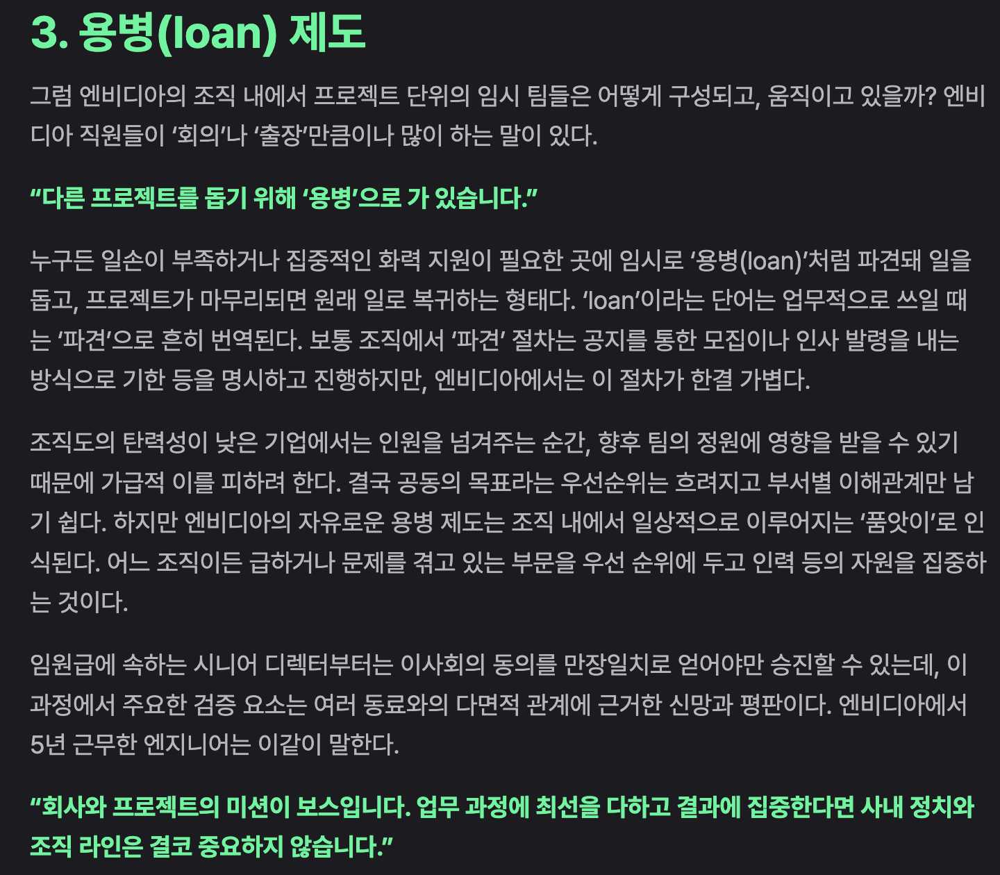

# 품앗이 문화

[지난번 독서모임에서 The Goal에 대해 이야기](https://jojoldu.tistory.com/807) 나누면서 우리 팀의 문화에 대해 소개 한 적이 있다.  
팀 내부에선 품앗이 문화라고 부르는데, 이 내용이 [엔비디아의 조직 문화에 대한 글](https://eopla.net/magazines/23435#)에서도 똑같이 소개하고 있어서 대단히 반가웠다.

소수의 팀원만 있던 회사가 규모가 커지면서 여러 내부 팀이 만들어지다보면 어느 순간 **회사의 목표에 align 되어 있지 않은 본인 팀의 목표에만 매몰되는 것**을 경험하게 된다.  
  
예를 들면 회사에서 대단히 중요한 프로젝트가 있고 규모 또한 커서 여러 팀이 참여해서 진행한다고 가정해보자.  
이때 **특정 조직이 여러 이유로 해당 프로젝트의 병목 지점이 되면** 다양한 상황이 연출된다.

- 다른 팀으로 인해 지연되는 기간동안 할당량을 채운 팀들이 각자 팀 내부 과제를 하고 있다던가
- 최상위 리더의 판단으로 병목 팀이 맡고 있는 일들을 다른 팀에게 분산시킨다던가
- 해당 팀의 인력이 부족하다 생각되어 그 팀의 인력을 집중적으로 추가 채용한다던가

이 외에도 여러 상황들이 발생한다.      
이 중 가장 조심해야할 상황은 **프로덱트 리더가 인력의 재분배를 하지 않고, 오로지 병목 팀만 채찍질 하는 동안 다른 팀에서는 목표와 무관한 팀 내부 과제를 진행**하는 경우이다.  
  
이런 현상이 발생하면 해당 팀들은 이 프로젝트의 성공과 팀의 목표가 align 되어있지 않음을 나타내기 때문이다.    
이건 회사가 조직의 목표를 팀 전체에게 제대로 전파시키지 못한 것이 가장 큰 원인이겠지만, 조직원들의 대부분이 팀별 RnR을 따지기 전에 **우리 모두는 조직의 문제를 풀기 위해 모인 것**임을 분명히 인지하고 있어야 한다.  
  
그런 관점에서 이런 **병목 지점을 만났을 때 구성원들이나 조직에서 이 병목 지점을 어떻게 바라볼지**가 대단히 중요하다.  
  
"A 팀이 지금 병목 지점이네? 저 팀은 참 퍼포먼스가 안나와"  
"B 개발자가 기능을 다 구현 못해서 배포를 못하잖아? 몇년차야 저사람?"  
"BE (혹은 FE) 파트가 지금 병목 지점이네? 저긴 항상 저래"  

등등 이야기가 나온다면 

- BE 개발자: "이번 스프린트는 FE가 일감이 많으니 BE가 코드 푸시 될 때마다 QA 할게요."

엔비디아의 용병 제도가 우리의 품앗이 문화와 완전히 동일한지는 알 수 없다.  
다만, **조직과 구성원이 모두 유연함을 추구**한다는 면에선 비슷하지 않을까 싶다.  

