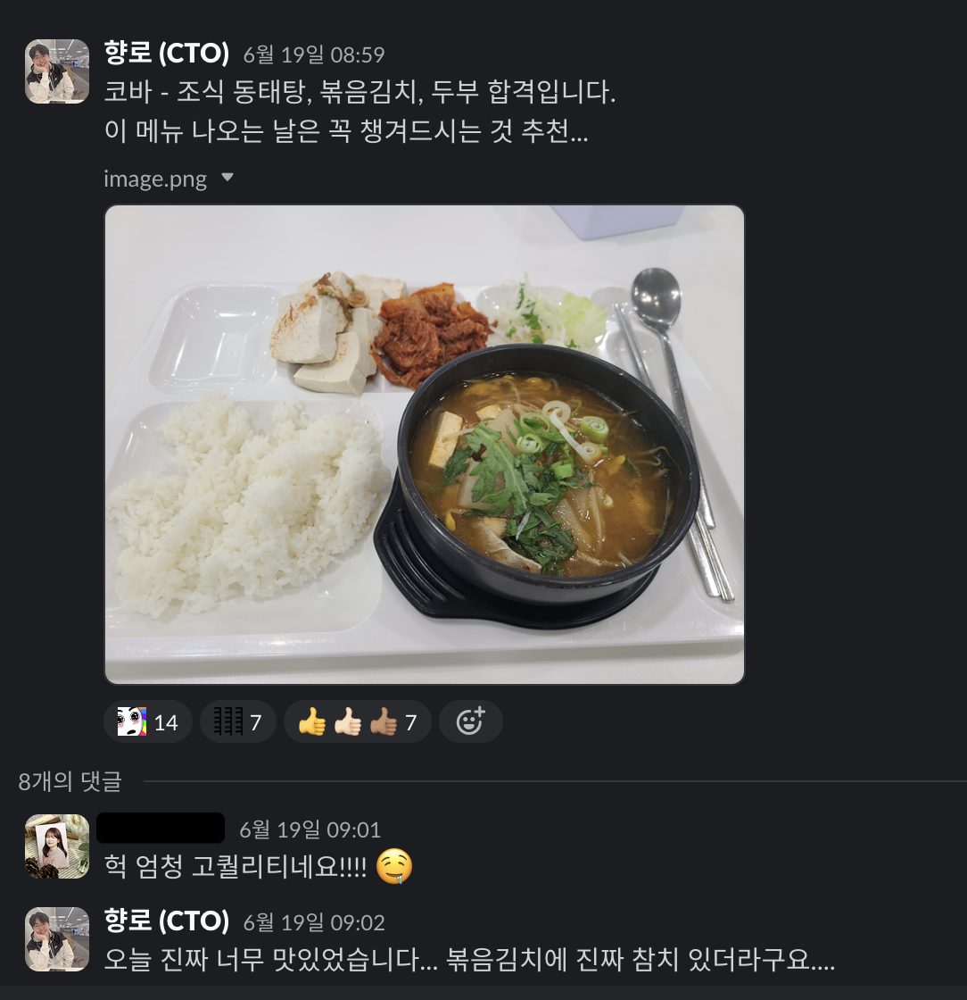

# 행복한 일들은 매일 있다.

예전에 곰돌이 푸? 동화에서 봤던 것 같은데,
다음의 글귀가 오래 오래 기억에 남았다.

"**매일 매일 행복할 순 없지만, 행복한 일은 매일 매일 있다**."

구내 식당에 내가 좋아하는 메뉴가 나왔을 때,
횡단보도에 도착하자마자 신호가 바뀔 때,
헬스장에서 내가 좋아하는 노래가 나올 때 등등
사소한 행복한 일들이 많다.

  
(아침 식사가 너무 맛있었던 날)  

하지만 이런 사소하지만 누가 봐도 좋은 것들이 아니더라도,  
하루의 대부분은 행복한 일들이다.

회의가 많은 날은 회의실 이동하느라 많이 걸어 1만보를 채우기 위해 굳이 따로 시간을 낼 필요가 없어서 좋다.
일이 많아 늦게 가는 날은 비싼 저녁 식사를 먹을 수 있고, 집까지 택시로 갈 수 있어서 좋다.
오전 회의가 늦게 끝나 점심을 늦게 먹는 날은 혼자서 조용히 식사를 하면서 생각을 정리할 수 있어서 좋다.

**행복한 것도 습관이다**.
작은 것에도 행복한 것을 습관으로 들이지 않으면,
큰 돈을 벌어도,
큰 지위에 올라도,
내가 원하는 어떠한 무언가를 얻는 그러한 아주 큰 쾌락이 와도 그걸 행복으로 만들 수 없다.

행복한 일은 매일 매일 있다.