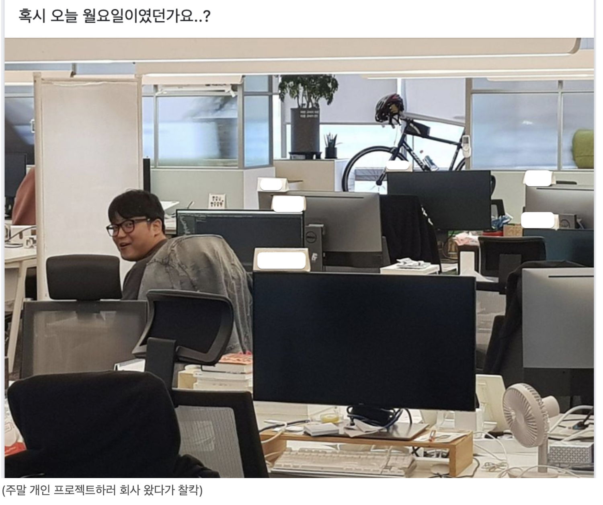

# 회사와 커뮤니티

전 직장에서는 문화 면접 혹은 수습 전환 인터뷰시에 창업자셨던 대표님이 참여하시면 꼭 물어보시는 질문이 있었다.  
  
"좋은 회사란 무엇이라고 생각하시나요?"  
  
보상/복지가 좋은 회사, 가족들에게 자랑할 수 있는 회사, 뛰어난 동료가 모여있는 회사 등등 여러 좋은 회사들의 조건들이 있다.  
  
그 당시에는 되게 남들이 하는 그런 흔한 좋은 회사의 모습을 이야기했다.  
그때의 답변이 나 스스로도 너무 마음에 들지 않고, 한번도 고민해보지 못했던 주제라서 이따금 "좋은 회사" 에 대해 생각한다.  
  
"좋은 회사" 라는게 결국 "계속 다니고 싶은 회사" 를 의미한다고 생각했다.  
그래서 2~3년 전부터 "**좋은 회사란 같은 관심사와 미션을 가진 사람들이 모인 커뮤니티**" 라고 나름 정리가 되었다.  
  
물론 회사의 제 1 목표는 **회사의 지속된 생존**이 되어야한다.  
우리끼리 좋더라도 망하면 결국은 해고통보, 임금삭감, 많은 동료들의 퇴사 등등 서로에게 큰 피해가 가기 때문에 이것이 가장 우선시 되어야 한다.  
이 부분을 얘기하지 않는 것은 낮은 순위라서 그런게 아니라, **이미 회사라는 단어 안에 생존이 포함**되어있기 때문이다.  
회사란 영속성을 목표로 하는 조직을 의미하기 때문에 저 부분을 제외하고 본다면 결국 **나와 같은 관심사와 미션을 가진 사람들이 모인 커뮤니티**가 되어야만 했다.   
  
이 부분을 언급하지 않은 것은 낮은 순위라서 그런게 아니라, **동호회와 회사를 구분 짓는 기준이기 때문에 이미 회사라는 단어 안에 생존이 포함**되어있어서 언급하지 않았던 것이긴 하다.  
    
여자친구 (현 와이프) 와 성시경 콘서트를 다녀오면 여자친구는 각종 SNS를 통해 그 콘서트에 참여했던 다른 사람들의 후기를 찾아본다.  
그리고 본인이 느꼈던 그 감동을 그들과 함께 나눈다.  
누가 시키지 않아도 시간이 될 때마다 열성적으로 콘서트 내용을 공유하고 감정을 교류했다.  
  
커리어에 도움 되는 것도 아닌데, 관심사를 가진 사람들끼리 SNS로 공유하고 공감하는 것을 낮/밤, 주말 구분 없이 한다는 것에 참 신기했다.  

비슷하게 직장 동료들이 휴가 중에도 회사 메신저에 접속해있고, 일 이야기를 하고, 잡담을 하는 등을 보면 이해가 안되었다.  
"개발이 좋으면 개발을 하면서 휴가를 보내면 되고, 취미가 있으면 취미를 하면 되지.  
왜 휴가 중에도 자꾸 회사 사람들과 이야기를 하려고 하지?" 라는 생각이 들었다.  
"같이 놀 사람이 회사 사람들 밖에 없나?" 와 같은 나쁜 생각도 했었다.  
  
당시의 나는 **회사와 개인 시간을 철저하게 분리**해서 서로가 침범 당하지 않는걸 선호하기 때문이다.  
  
(물론 개인 공부의 주제는 항상 회사 업무와 관련된 것을 공부했지만) **그 공부하는 시간, 연습하는 시간만큼은 회사 사람들과 이야기를 나누는데 쓸 생각을 전혀 하지 않았다**.  
  
그런 생각이 깨진 것은 실무자로서 가장 경험이 좋았던 팀에서 일하면서였다.  
  
* 이번에 배포된 feature 수치가 생각한거랑 다른데 내일 바로 이야기 해봐야지.
* 우리 서비스에 이 기능 있으면 좋을것 같은데 slack에 투표 올려봐야겠다.
* B 서비스는 이걸 이렇게 했네? 우리는 이걸 반대로 해볼 수 있을것 같은데 디자이너, PM분이랑 이야기해봐야겠다.
* 이번에 짠 코드가 뭔가 아쉬운데, 월요일에 코드 한번 봐달라고 해야겠다.
* 주말에 같이 코딩 할 사람들 있나 물어봐야겠다.

등등 빨리 이번 주말에 한 사이드 프로젝트 혹은 정리했던 기술 블로그 내용을 **팀 사람들에게 공유하고 서로 이야기를 나눠보고 싶은 생각에 정말 미친듯이 주말을 보냈다**.  
어떻게 하면 주말에도 좀 더 많은 걸 할 수 있을까 고민하다가 매주 주말마다 회사를 가서 가장 집중력이 좋은 상태를 오래 유지하려고도 했다.  
  
재밌는 점은 **나만 주말에 회사를 나온게 아니였다**.  
나와 같은 생각으로 우리팀 사람들도 주말에 회사를 나왔다.

  
과거 주말에도 메신저에 접속하던 동료들에겐, 그리고 당시의 나에겐 성시경을 좋아했던 와이프와 마찬가지로 본인이 속한 조직이 더이상 회사가 아니라 **나와 같은 관심과 미션을 가진 사람들이 모인 커뮤니티였던 것이다**.  
  
그리고 이런 커뮤니티는 조직의 많은 문제들이 자연스레 해소된다.  
동료들간의 갈등에도 서로간의 신뢰가 있어 아무리 격해져도 결국 좋은 방향으로 결론이 나기도 하고,  
자연스레 동기부여가 되고,  
아무리 어려운 문제를 만나도 끝까지 해결하기도 한다.  
일이 더이상 일이 아닌 조직이 된다.  
  
그래서 좋은 회사는 결국 **나와 공감대 형성이 가능한 사람들, 같은 미션을 가지고 있는 사람들이 모인 커뮤니티**가 되어야만 한다.  
  
사람을 뽑을 때도, 뽑고 난 뒤에도 이 점을 놓치지 말아야한다는 생각을 잊지말자.

