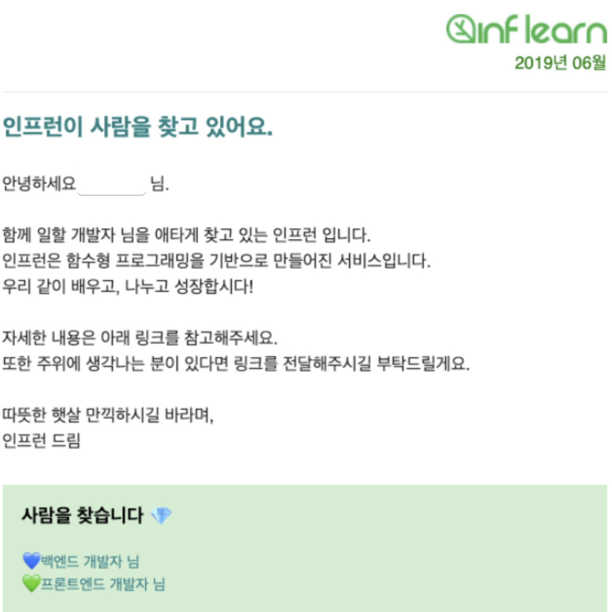

# 1. 48인의 프로덕트 조직이 될 때까지

안녕하세요 인프랩 향로입니다.  
인프랩 팀은 2015년에 첫 팀원이자 운영 매니저가, 2017년 8월에 첫 개발 팀원을 채용 후, 2025년 1월 현재 저를 포함하여 48명의 제품팀이 되었습니다.  
(전체 팀원은 80명이 되었습니다.)  
  
스타트업의 경험이 많지 않았던 저는 입사 초기까지만 하더라도 10명, 30명, 50명 규모에서 발생하는 문제는 어렵지 않게, 쉽게 해결할 수 있을 줄 알았습니다.  
  
하지만 웬 걸,  
10명일때는 10명의 어려문 문제가,  
30명일때는 30명의 어려문 문제가,  
50명일때는 50명의 어려문 문제가 있었습니다.  
  
흔히들 "20~30명일때가 가장 좋았다", "200~300명이 되면 예전이 그립다" 라는 이야기를 듣게 되는데요.  
문제의 크기는 다를 수 있으나, **빠르게 키우지 않고 20~30명 규모를 2~3년 유지할 때 발생하는 문제의 체감 난이도도 굉장히 어렵다**고 느껴졌습니다.  

> 그런 면에서 "팀 규모가 이렇게 작은데도 왜 이렇게 나는 힘들까?, 내가 부족한 것일까?" 라며 본인 탓을 하시는 많은 상위 리더분들께 본인의 탓이 아니라는 응원의 메세지를 보냅니다. 
  
창업한지 10년이 안되어서 수백명 ~ 수천명이 되는 조직은 **빠르게 조직의 규모가 몇배씩 성장하는 상황에서의 어려움**을 겪지만, 그때의 해결책이 천천히 규모를 늘려나가는 조직에서 발생하는 문제와는 또 다른 형태입니다.  
  
창업 5년, 7년 만에 100명, 200명, 500명으로 성장한 회사들의 경험담은 세상에 정말 많습니다.  
그 회사들의 경험담에서 **빠르게 규모가 커지는 팀에서 발생하는 문제와 그에 따른 해결 경험**을 공유 받을 수 있습니다.  
  
반면, **창업 5년, 7년동안 천천히 20~50명으로 제품팀 규모가 성장하는 스타트업 팀에서의 규모별 문제와 해결 경험 사례는 공유가 많이 없었습니다**.      
 
"왜 이 사례는 공유가 많이 없을까?" 라는 생각을 하다가 내린 결론은 "**천천히 규모가 커지는 조직의 경험은 좋은 해결책이 아니였다고 생각하셔서 다들 공유하지 않으시는 건가?**" 였습니다.  
  
사실 대부분의 스타트업은 이와 같은 경우이고 오히려 더 공유가 필요한 것임에도 불구하고 말이죠.  
  
그래서 **팀 규모를 천천히 키워나가는 조직에서의 경험 공유도 필요하다**고 생각했습니다.  
  
이 글에서는 **7년 5개월이라는 긴 시간동안 1명에서 45명의 제품 팀이 되는 과정에서 발생한 문제와 해결 경험**을 공유합니다.  
  
조직 전체의 성장에 관해서 작성하면 더 크게 생각해볼 여지가 있겠지만, 그건 대표님인 쭈의 역할로 남겨두고 (ㅋㅋ) 여기서는 **제품 조직의 성장 과정만 시간의 흐름 순**으로 나열해보겠습니다.  
  
그리고 이렇게 저희가 먼저 공유를 시작하면 다른 스타트업에서도 조직의 경험 공유를 많이 해주시지 않을까요?   
  
> 최근 입사하신 분들과 앞으로 입사하실 분들께 지금의 저희 제품팀이 이런 문화와 조직 구조를 가지게 된 과정을 설명하는 글이기도 합니다.
  
> 존경하는 [스마트 스터디의 전 CTO이신 박현우님의 발표](https://www.slideshare.net/slideshow/ss-36301654/36301654) 와 [리디의 전 CTO이신 남현우님의 발표 2017](https://speakerdeck.com/ridi/ridieseo-ctoga-haneun-il), [2018](https://speakerdeck.com/ridi/8nyeonjjae-gateun-jepumeul-mandeulgo-issseubnida) 를 함께 보시는 것을 추천드립니다.
 
## 1. 0 ~ 10명 (2015.05 ~ 2020.12)

인프런 서비스의 완전한 초창기라고 할 수 있는 시기입니다.  
이 시기는 제가 합류하기 전의 이야기라서 상세하게 전할 순 없지만, 대략적으로 다음과 같은 형태로 진행되었습니다.  

> 좀 더 자세한 내용은 [인프런 서비스 1차 발전 회고 (2015.05~2019.04)](https://story.inflab.com/inflearn-1st-review/) 를 참고해주세요.

- 2015.05 ~ 2017.07 까지 **대표님 혼자 워드프레스 기반으로 서비스 개발을 진행/운영**했습니다.
  - 2017.04 에 운영 팀원이 1명 채용되어 대표님이 개발에 좀 더 집중할 수 있었습니다.

**약 2년간 대표님 혼자서 서비스 개발을 하고**, 2017.08 부터 3명의 서로 다른 역할의 개발자를 채용하게 됩니다.

- 2015.12: 인프런 런칭
- 2017.08: 첫 개발자 (BE) 입사
- 2018.10: 두번째 개발자 (FE) 입사
- 2019.03: 세번째 개발자 (BE & DevOps) 입사

이 과정에서 **워드프레스로만 운영하던 인프런 서비스를 JavaScript 기반으로 완전한 전환**을 진행하게 됩니다.

- [Lv0 에서 Lv2 까지 – 인프런 서비스 리뉴얼](https://www.hyungjoo.me/4%EB%85%84%EC%9D%84-%EA%B8%B0%EB%8B%A4%EB%A6%B0-%EC%9D%B8%ED%94%84%EB%9F%B0-%EC%84%9C%EB%B9%84%EC%8A%A4-%EB%A6%AC%EB%89%B4%EC%96%BC-%EC%98%A4%ED%94%88/)

회원수 10만까지는 문제없던 워드프레스가 한계점에 도달했고, 이를 개편하기로 결정을 내린 것이죠.  
다만, 개편 프로젝트를 결정할 당시 (2018.11) 에는 개발팀원이 2명, 전체 팀원이 6명 뿐인 상태에서 **서비스 개선이 아닌 레거시 개편**이란 선택을 한 셈인데요.  
  

첫 개발자가 BE 이기에 이 시기부터 대표님은 이전처럼 풀스택 개발을 할 필요가 없어집니다.  
그래서 이때부터는 **대표 & PO & FE 개발자**로서의 역할을 하게 됩니다.  
  
다만, 이렇게 3명의 개발자가 채용되어서 여유가 생길것처럼 보이지만 실상은 **서로 다른 역할만 가능한 개발팀**이 되었습니다.  
풀스택 개발자로 채용을 한 것이 아니기에 **서로의 역할에 기여할 수 있는 부분이 적었습니다**.  
(모든 개발팀원을 풀스택으로 채용하는 것이 너무 어렵기도 하구요)  
    
소수의 개발팀 규모는 **누군가 퇴사할 경우 기존 멤버가 그 빈자리를 채워야하는 리스크**가 있습니다.  
BE, FE, DevOps 각각 1명밖에 없던 상황이였고, 당시엔 대표님도 개발에 참여하기 때문에 서로의 영역을 언제든 참여할 수 있도록 **제품을 개발하는데 있어 배워야할 영역을 최소화**하는 것이 중요하다고 판단했습니다.  
  
그래서 첫째로 **모든 제품 영역을 단일 기술 스택으로 통일** 합니다.  
백엔드, 프론트엔드, IaC (CDK) 까지 단일 언어로 선택할 수 있도록 선택한 언어는 JavaScript 였습니다.  
당시의 JavaScript 는 타입 안정성이 있진 않았지만, 쉽게 배울 수 있고, 빠르게 실행할 수 있으며, 어느 환경에서도 사용할 수 있다는 장점이 있었습니다.  
  
두번째로 영역별로 프레임워크 사용을 최소화 하였습니다.  
누구나 쉽게 배우고 시작할 수 있도록 **VanillaJS를 최대한 활용**하고, 당시에 유행하던 React, Vue, Angular 등과 같은 웹 프레임워크를 비롯해서 Sequelize와 같은 ORM 등도 사용하지 않기로 합니다.  
단, SQL 인잭션 등의 문제가 있으니 최소한의 쿼리 빌더는 필요했고 이를 위해 [MQL](https://github.com/marpple/MQL) 을 선택했습니다.  
이러면 HTML, CSS, SQL 에 대해 조금만 알아도 당장 작업을 시작할 수 있었습니다.  
  
이렇게 개발팀이 어느정도 채용이 되는 과정에서도 프로덕트 디자이너는 없었는데요.  
그래서 3명의 개발자가 입사할 때까지 **프로덕트 디자이너 없이 개발자가 직접 디자인 하거나 외주를 하는 등**으로 서비스를 운영합니다.  
  
그리고 **2019.04 가 되어서야 첫 프로덕트 디자이너가 채용**되어 제대로 된 프로덕트 팀의 형태가 갖춰졌습니다.

- 대표님 (PO & FE)
- PD (프로덕트 디자이너): 1명 
- BE: 1명
- FE: 1명
- BE & DevOps: 1명

이후에도 서비스의 성장에 맞춰 개발자를 계속해서 채용할 필요가 있었는데요.  
  
당시의 인프런은 지금처럼 많은 분들에게 알려진 서비스가 아니였기에 개발자를 채용 하는 것이 쉬운 일은 아니였습니다.  
특히나 **용병 같은 개발자가 아닌 선교사 같은 개발자 팀원**이 필요했습니다.  

스타트업에서는 많은 경우 용병을 만날 수 있습니다.  
본인의 분야에 있어서 전문성을 갖고 있지만, 조직의 최고 관심사를 염두에 두지 않고, 

그래서 (채용 플랫폼을 활용하는) 다른 회사와 동일한 채용 방식으로는 원하는 팀원을 채용할 확률이 대단히 낮았습니다.  
  
- 우리 서비스를 좋아하고
- 개발자로서 열정이 충만하신 분

이런 팀원을 찾으려고 보니 웬걸, "**인프런의 열정적인 유저와 일치하잖아**?" 라는 생각을 하게 됩니다.  
  
그래서 인프런을 통해 성장하고 계신 분들에게 최대한 저희 채용을 홍보하게 됩니다.

- 서비스 내 개발자 도구에서 볼 수 있도록 console 창에 개발자 채용 공고를 노출시키기
- [채용 페이지를 서비스 내 구축](https://www.inflearn.com/pages/withus)해서 서비스 이용하면서 언제든 볼 수 있도록 하기
- **우리가 쓰는 기술과 관련된 강의를 수강하신 분들께 채용 홍보 메일 보내기**

특히, 3번째의 경우 굉장히 타겟팅이 잘 된 채용 홍보가 되었는데요.  
당시 저희팀은 JS를 통한 함수형 프로그래밍과 유인동 CTO님께서 만든 [Fx 라이브러리](https://github.com/marpple)들을 사용중이였습니다.  
그리고 이러한 기술 스택과 개발 방법은 [인동님의 인프런 강좌](https://www.inflearn.com/users/31989/courses)에서 정말 재밌게 잘 소개가 되었는데요.  
  
"**[인동님의 인프런 강좌](https://www.inflearn.com/users/31989/courses)를 재밌게 들은 분들이라면 이 라이브러리들과 함수형 프로그래밍을 현업에서 너무 써보고 싶어하지 않을까?**"라는 생각이 들었습니다.  
  
그래서 이 강좌를 만족스럽게 수강하신 분들께 저희 팀의 채용 홍보를 이메일로 하였습니다.

이 채용 방식은 대단히 높은 타율(?)을 내주어 2020년 12월이 되었을땐 **개발자만 8명인 제품팀**이 구성 됩니다.

- 대표님 (PO)
- PD (프로덕트 디자이너): 1명 
- FE: 3명 
- BE: 4명 
- DevOps: 1명 

> 저희 외에도 문피아의 CTO이신 이상민님께서 속해 계신 조직의 서비스인 문피아에 직접 [문피아 개발 문화에 관심있는 개발자분들을 위한 웹 소설](https://novel.munpia.com/331262/page/1/neSrl/4888944) 을 집필해주신 사례도 있습니다.

### 정리

정리해보면 이 시기에는 
- 인력이 부족한 포지션은 최대한 대표님이 직접 해당 포지션으로 활동하시거나 외주 등을 통해 문제를 해결하고
- 포지션별 개발 인력이 부족하니 최대한 서로 다른 직무의 개발자도 서로를 도울 수 있도록 최대한 기술 스택을 비슷하게 구성하고
- 서비스가 유명하지 않은 상태이니 일반적인 채용 플랫폼을 사용하는 것은 효과가 없고, 서비스 내 유저들을 채용 대상으로 바라보기

같은 전략들이 필요했습니다.

## 2. 10 ~ 23명 (2021.01 ~ 2021.12) 

인프랩 첫 PO와 (예비) CTO가 합류했습니다.  
그간 대표님이 혼자서 PO 역할을 하시다가, 이제는 PO와 CTO가 합류하면서 완전히 새로운 게임의 시작이였습니다.  
  
기존에 오래 함께 일하던 개발 팀원이 승진하는 것이 아닌, 외부에서 CTO를 영입하는 것은 (특히 회사 내에서는 **첫 시니어 이자 C레벨의 채용**)걱정과 우려가 섞여 있었는데요.

- 충분히 만족해서 사용 중인 우리의 JavaScript 개발 환경을 갑자기 JVM 환경으로 바꿀려고 하지 않을까?
- 우리팀의 그간의 노력을 너무 펌훼하지 않을까?
- 다른 회사의 나쁜 사례처럼 개발조직을 본인의 왕국처럼 만들어버리진 않을까?
- 진짜 좋은 시니어가 맞을까?

등등 많은 걱정이 있었습니다.  
  
팀원 개개인의 걱정을 너머 조직적으로도 **스타트업의 첫 C레벨을 외부에서 채용하는 것**은 팀원들에게 잘못된 뉘앙스를 던지게 될 수도 있습니다.  
"**회사에서 계속 성장하는 것 보다 큰 회사로 이직한 뒤에 다시 돌아오는게 더 승진이 빠를 수도 있다**" 와 같은 것 말이죠.  
  
그간 팀 내에서 항상 "**동료들의 충분한 인정을 받은 사람이 리더가 되어야 한다**" 를 기조로 하고서 실제 C레벨 선택은 외부에서 온 사람이 바로 된다면 이 기조 자체가 깨질 수 있습니다.  
  
그래서 대표님과 이야기 나눈 것은 

- 짧게는 6개월, 길게는 1년은 시니어 엔지니어 팀원으로 활동한다.
- 그 사이에 팀원들의 인정을 받으면 CTO로 승진하고
- 그렇지 못한 경우 그때는 계속 팀원으로 남을지, 떠날지 선택한다.

> 이와 관련해서는 [저의 개인 회고](https://jojoldu.tistory.com/626)에 자세히 작성해두었습니다.

이렇게 첫 (예비) CTO가 합류합니다.  
  
당시엔 개발자 8명, PO 1명, PD 1명으로는 별도의 조직 형태가 필요하지 않아 **개발자 + PO를 합쳐 개발조직**이라 불렀고 PD (프로덕트 디자이너) 1분은 개발조직과 분리되어 업무를 함께 했습니다.  
  
개발조직 (9명+CTO) 는 2주 단위 스프린트를 시작했으나 사실 제대로 된 스프린트는 하지 못하고 산발적으로 진행되는 프로젝트들과 Task로 그저 정신없이 일을 진행하고 주간 단위로 싱크업 미팅을 진행했습니딘
 
모든 인프라 시스템 (AWS, DB, 모니터링, 배포)를 한명의 DevOps 개발자분이 관리하고 계셨고,  
모든 복잡한 비즈니스 구현 (주문, 할인, 쿠폰, 결제, 정산, B2B) 을 한명의 BE 개발자가 구현하고 관리하고 있었습니다.  

DevOps 1분, BE 개발자 1분의 영향력이 너무 커서 버스 팩터 (Bus Factor) 를 줄여나가는 작업을 진행합니다.

전사 공용 문서 도구인 Clickup을 유지한 채 제품팀만을 위해 Confluence와 Jira를 활성화해서 사용하기 시작했습니다.

모바일 앱에 대한 니즈가 계속해서 커지고 있어서, 앱을 출시하기로 결정.  
이때 채용 한다 vs 우리끼리 한다에서 후자를 선택.  
웹 프론트엔드 개발자분들이 RN을 배워서 앱을 출시하기로 함.  
  
사실은 제 3의 선택지를 못한 것이 아쉬웠음. 
영상 교육 서비스 특성상 플레이어, 에디터 등 작업해야할 부분이 많은데 너무 빨리 모바일 앱을 시작해버렸음.  

모바일은 당연히 있으면 좋지만, 회사의 필수 제품이냐? 라고 한다면 서비스 도메인 마다 다름.  
IT 교육 특성상 코드를 봐야하는데, 
코드를 확대해서 보기 힘든 경우엔 어차피 모바일로 보는데 한계가 있음.
PC에서 대부분 보고 있는 상황에서 굳이 벌써부터 개발팀 리소스를 쓸 필요가 없었음.

디자이너가 추가로 채용되어, 11명의 제품팀이 구성됩니다.

- 예비 CTO (+1명)
- PO: 1명 (+1명)
- PD: 2명
- FE: 3명 
- BE: 4명 
- DevOps: 1명 

- 시리즈 A 투자 성공
- 개발팀의 본격적 채용 
- 신규 서비스 (랠릿) 런칭과 기존 서비스 (인프런)의 확장 & 개선을 위해 PO 본격적 채용 시작
- 각 직군별 인원이 많이 늘어나 제품 조직 내에서도 PO파트/PD파트/개발파트로 파트를 나눠 협업 프로세스 시작
- 제품 조직 전체가 단일 프로젝트에 투입되어 업무 진행
- 신규 서비스이니 기존 서비스를 운영하시는 분들 보다는 신규 입사자들이 더 많이 참여하도록 조성
- 새로운 기술 환경 도입
	* CDK JS -> 테라폼 구축
	* JS -> TS 
	* Express -> Nest.js
	* FxSQL -> TypeORM
	* FxDom -> React

CTO
PO: 3명 (+2명)
PD: 3명 (+1명)
FE: 7명 (+4명)
BE: 7명 (+3명)
DevOps: 2명 (+1명)
Data: 0명
1명이 입사후, 6개월내 퇴사

### 정리

정리해보면 이 시기에는 
- 전체 구성원이 20명쯤 되는 시기
- 공동창업자가 아닌 상위 리더의 채용이 시작 (C레벨 혹은 그에 준하는 시니어)
- 회사의 첫 상위 리더 채용은 기존 구성원들의 의구심, 걱정, 경계 등 여러 복잡한 감정이 있고, 채용 실패시 리스크가 너무나 큰 상황이라 이에 대한 방어 전략이 꼭 필요
  - 수습기간 동안에는 일반 팀원으로 한다던가
  - C레벨이 아닌 다른 직책부터 시작하던가

- 투자금을 바탕으로 성장할 수 있는 상황 (시리즈 A 투자)
- 본격적으로 직무별 전문성을 채용 조건에 넣을 수 있음
  - FE, BE, DevOps 등으로 나눠서 해당 직무 전문성을 채용 조건에 넣을 수 있음
- 좋은 엔지니어 채용을 위해 채용 외부 활동을 본격적으로 시작
  - CTO의 개인기가 특히 중요하며 
  - HR에게 채용을 맡겨서 좋은 개발자를 채용하기는 어려움
  - 여러 개발 유튜브 채널이나 커뮤니티 활동을 기반으로 개발자 채용을 할 수 있음

같은 전략들이 필요했습니다.

# 4. 23 ~ 37명 (2022.01 ~ 2022.12)

- 회사에 대형 장애 가 발생하면서 회사의 주요 로드맵에서 제품 안정화가 본격적으로 상단에 랭크되었습니다.
- 기술 블로그 시작
	* 여전히 빅테크가 채용을 많이 하고 있던 상황
	* 16명의 개발 조직에서 더 키우려니 슬슬 한계점 오는 것이 느껴짐 
- 신입 위주의 채용을 적극적으로 시작함
	* 시니어 Node 개발자 풀이 적음을 인정
* 좋은 DevOps 분들을 사내 추천으로 계속 영입하게 됨
	* DevOps를 플랫폼 엔지니어링 & 사내 시스템팀 역할을 함께 하도록 전략 변경
* 큰 프로젝트가 끝난 후, 전시가 아닌 평시로 전환되니 그간 몰랐던 문제들 하나둘씩 드러남
	* PO 파트에 대해 사업/운영 조직간 불편 사항 나오기 시작
	* 그 전까지 대표님한테 바로 이야기하면, 개발자한테 바로 이야기하면 되던 것을 PO파트의 등장으로 일이 더 안되는 느낌을 받는다는 의견
	* PO 파트에서는 의견을 잘 취합해서 C레벨에게 전달하지만 C레벨에서 그 일을 할지 말지 결정 후 다시 PO가 담당 파트에 전달하는 과정이라 커뮤니케이션 로스만 발생
	* PO에서 하고 싶은것 + 운영/사업에서 하고 싶은 것 전달 -> CEO 의사결정 필요 & CTO 개발 조직 리소스 할당 필요로 일이 진척이 거의 안되고 있었음
	* CTO는 대형 장애 해결을 1순위로 보고 있으니
* 하고싶은 일과 해야하는 일들이 많으니 계속 해서 채용을 늘려나감

PO: 5명 (+2명)
PD: 5명 (+2명)
FE: 10명 (+3명)
BE: 10명 (+3명)
DevOps: 4명 (+2명)
Data: 2명 (+2명)

- 스타트업 혹한기의 시작
* 제품팀 규모가 처음으로 멈춰있는 시기
* 백엔드 개발자분들의 이탈이 시작
	* 퇴사 사유로 Node 스택에 대한 이야기가 종종 언급됨
* 일반적인 공고로는 알려지는데 한계가 있다고 생각해 개인 유튜브 채널에 백엔드 채용 홍보 진행
* 기존 업무 방식을 개선
	* 목적 조직과 기존 형태인 프로젝트 단위 TF 양립 시작
	* CTO의 개발자 할당이 필요 없고, CEO 와의 일정 이야기를 좀 더 쉽게 할 수 있도록

PM: 6명 (+1명)
PD: 5명
FE: 12명 (+2명)
BE: 8명 (-2명)
DevOps: 3명 (-1명)
Data: 3명 (+1명)

### 정리

정리해보면 이 시기에는 
- 전문성을 기반으로 한 직무 기능 조직이 생겨나기 시작하며
- 여러 조직이 신설되면서 일하는 방식과 커뮤니케이션에 대한 문제가 하나둘씩 드러나기 시작함
- 특히 제품 조직과 운영/사업 조직간 거리가 굉장히 멀어지기 시작하며
- 그 전까지 필요한 기능을 개발팀에게 바로바로 이야기하면 되는 것을 PM팀을 거치고 PM & C레벨 회의에서 일정과 리소스를 