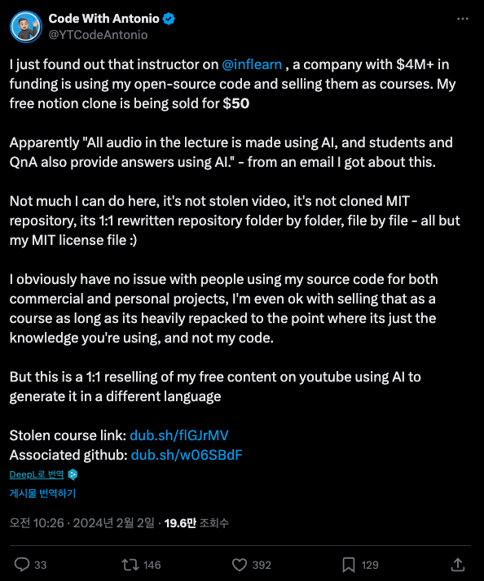

# 실수에서 더 나은 시작으로

미생이란 컨텐츠는 스토브리그와 더불어서 회사생활을 어떤 시각으로 바라봐야하는가에 대해 좋은 힌트를 많이 줬다.  
웹툰과 드라마 모두 다 봤지만, 특히나 드라마에서는 연출이 더 극적이라 그런지 감정과 생각이 잘 전달되었다.  
  
미생 13화에서는 주인공 장그래가 속한 영업 3팀이 `문제가 생긴 사업을 좋은 사업으로 전환` 하는 에피소드이다.  

이 에피소드에서는 오상식 차장이 PT를 하면서 임원진들에게 **그간 비리로 인해 그만두었던 사업들**에 대해 이야기한다.

> "문제가 생기자 회사는 각 사건을 신속하고 정확하게 해결했습니다.  
> 깔끔하게 정리한 것입니다.  
> **그리고 그 사건을 지워버렸습니다**."  
> ...
> "문제가 생긴 사업에 대해서 두 번 다시 입 밖에 꺼내지 않는 것은 우리가 선택하고 회사가 결정한 일입니다.  
그렇다면 우리가 지워버린 그 사업들은 어디에서 어떻게 되었는지 아십니까?  
**지금부터 보실 내용은 우리가 생각하기도 싫어 지워버렸던 그 사업을 가져간 타 업체들의 실적**입니다"
> ...
> "죄를 처벌했으니, 그 일은 잊혀져야 맞는 것입니까?
**저희는 ‘죄’만 들어내기로 했습니다**."  
> 출처: [ [#미생] 13화 13분만에 몰아보기](https://www.youtube.com/watch?v=BcMR3Ym2Tu0)

"**실수, 실패라고 불렀던 그 지점을 새로운 시작점으로 전환**" 하게 만드는 이야기에 보는 내내 두근거렸다.  
10년이 지났지만 생각이 날 정도로 이 에피소드는 내 회사 생활에 큰 영향을 줬다.
언젠간 나도 저렇게 실패를 새로운 시작으로 전환하는 일을 해봐야지 같은 생각을 하면서 말이다.  

---
  
2024년 2월, 인프런이 글로벌하게 트위터에서 언급된 적이 있다.  
전 세계 개발자들이 구독하는 유명 유튜버 [codewithantonio](https://www.youtube.com/@codewithantonio)님이 우리 플랫폼에 대해 언급한 것이였다.

> “I just found out that instructor on @inflearn, a company with $4M+ in funding is using my open-source code and selling them as courses.”  
> — [원문 트윗 보기](https://x.com/YTCodeAntonio/status/1753228303924670731)

인프런에 올라온 한 강의가 Antonio님의 유료 강의와 똑같다는 것이었다.  
완전히 처음 겪는 일에 잠시 멍해졌다.  
  
주말임에도 급하게 해당 강의를 확인했다.  
그 와중에 CS 문의들이 쏟아지기 시작했다.  
Antonio님의 팬인 수강생분들이 하나둘씩 “내가 너무 좋아하는 Antonio 강의인데, 이 강의랑 구조가 하나도 빠짐없이 똑같다”는 제보를 보내셨다.  
쏟아지는 CS에 대해 답변드리고, antonio님께 사과 메세지를 전달드리고, 내부적으로는 실제로 그런 일이 맞는지 검토하는 등 정신 없는 주말을 보냈다.  
  
강의 내용을 검토한 결과, 의심의 여지 없이 복제 강의였다.  
지식 공유자분께서 업로드한 강의였기에 혹시나 antonio님과 사전에 논의된 적이 있었는지 확인을 요청드렸다.  
두분의 소통 과정에 문제가 있었고, antonio님 입장에서는 전혀 생각하지 못했던 협업이였다.  
  
모든 것을 확인하였으니 플랫폼을 운영하는 입장에서 가만히 있을 순 없었다.  
곧바로 강의를 삭제하고 강의를 결제한 수강생분들께는 사과의 말씀과 함께 **전액 환불**을 진행했다.  
  
내부적으로 모든 내용이 정리가 되고나서는 대표님께서 직접 [공식 사과문](https://www.inflearn.com/notices/1184396)을 게시했다.  

이 일은 우리에게 플랫폼 내부의 강의 검수 시스템과 프로세스를 지속적으로 개선하는 계기가 되었다.  
  
해외에서 만들어지는 수많은 컨텐츠를 비교하면서 신규 강의에 대해 검수할 수는 없다.
그렇다면 앞으로도 이런 문제가 발생할 경우 어떻게 사전에 알 수 있을까?  
재발하지 않으려면 어떻게 하는 것이 좋은가? 등
  
등등 여러가지 생각과 고민을 하던 중 믿기 힘든 문의가 올라왔다.  

> “강의 철회 안내 메일을 받았습니다.  
> 그런데 저는 이 강의가 너무 좋았어요.  
> 이번 진행중인 프로젝트를 완료 하고나서 열공하려고 했거든요 ㅜㅜ
> 끝까지 보고 싶습니다.”  

강의를 환불받은 수강생분들의 문의였다.  
  
미생 13화 요르단 사업 PT가 다시금 떠올랐다.
  
---

**실수는 있었지만, 그것을 더 나은 시작으로 바꾸기로 했다**.  
글로벌 플랫폼으로 전환하고 나서 곧바로 Antonio님께 연락을 드렸다.   

> Hello Antonio,  
> I’m the CTO at Inflearn...  
> (중략)  
> **This collaboration is our way of making amends for the previous incident** and ensuring your invaluable content gets the recognition it deserves...

Antonio님은 놀라울 정도로 성숙하게, 따뜻하게 답해주셨다.

> “No hard feelings on my end.  
> I’m glad to see the positive changes you're implementing.”  
>  
> “I’m definitely interested in expanding my reach to Korean and Asian audiences.”

그리고 Antonio님과 같이 협업을 시작하게 되었다.  
  
Antonio님이 제안해주신 첫 강의는 그의 대표작 [YouTube Clone](https://www.codewithantonio.com/projects/youtube-clone) 프로젝트였다.  
Next.js 15 & React 19 기반 최신 스택을 기반으로 비디오 플레이어, 컨텐츠 피드, 구독, 좋아요 등을 다 만들어보는 강좌이다.  
  
아래의 기능들을 모두 다 구현해볼 수 있는 기회가 된 것이다.

•	🎥 화질 선택이 가능한 고급 비디오 플레이어
•	🎬 Mux를 활용한 실시간 영상 처리
•	📝 자동 자막 생성 기능
•	🖼️ 영상 기반 썸네일 자동 생성
•	🤖 AI 기반 제목 및 설명 자동 생성
•	📊 조회수, 좋아요, 트래픽을 확인할 수 있는 크리에이터 스튜디오
•	🗂️ 사용자 맞춤 재생목록 관리 기능
•	📱 모든 기기에 최적화된 반응형 디자인
•	🔄 여러 개의 콘텐츠 피드 구성
•	💬 댓글 및 답글을 포함한 인터랙티브한 댓글 시스템
•	👍 좋아요 및 구독 시스템
•	🎯 개인별 시청 기록 추적
•	🔐 완성도 높은 사용자 인증 시스템
•	📦 모듈 기반의 구조적 설계
•	🗄️ DrizzleORM 기반 PostgreSQL 연동
•	🚀 Next.js 15 & React 19 기반 최신 스택
•	🔄 완전한 타입 안정성을 보장하는 tRPC 기반 API
•	💅 TailwindCSS와 ShadcnUI를 활용한 세련된 UI 구성

단순히 “유튜브처럼 생긴 무언가”를 만드는 수준을 넘어서 지금 우리가 매일 쓰는 유튜브의 핵심 기능들을 하나하나 직접 구현하면서 배워나가는 구조다.

이 모든 것을 한 프로젝트 안에서 경험할 수 있는, 그야말로 **현업형 풀스택 클론 코딩 강의**였다.  
  
---

생각해보면 이 이야기는  
실수로 시작되었지만, 사과로 이어졌고 결국 협업으로 완성된 이야기다.

우리는 실수를 했다.  
하지만 그 실수를 투명하게 인정하고, 바로잡고,  
나아가 **진짜 창작자에게 제대로 된 기회를 만들 수 있었다.**

지금 인프런에서는  
Antonio님의 [YouTube Clone 프로젝트 강의](https://www.inflearn.com/course/youtube-clone-next)를  
만날 수 있다.

