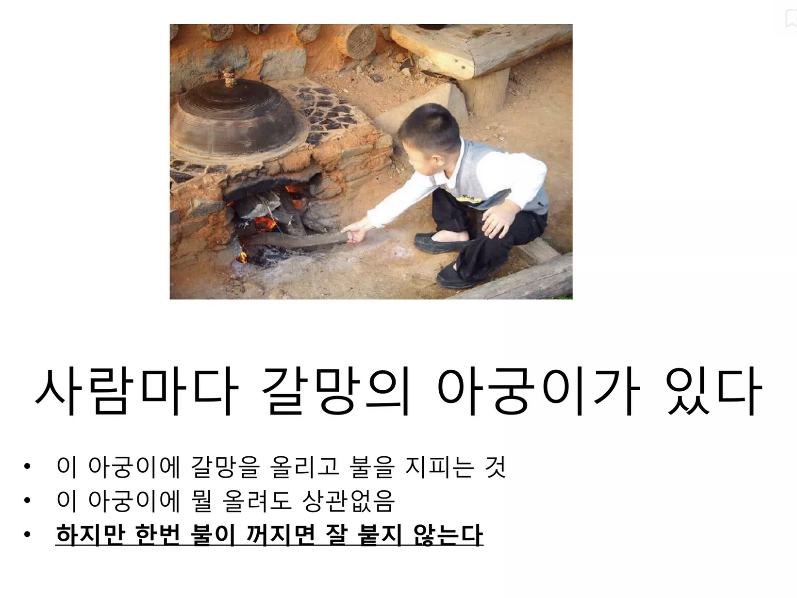

# 관계의 아궁이

예전에 본 [갈망의 아궁이](https://www.slideshare.net/slideshow/ss-6097436/6097436) 발표를 좋아한다.  

갈망이란 아궁이 속 불씨와 같아서 한번 완전히 꺼지면 다시 살리기가 어렵다.  
그래서 아궁이 속 불이 완전히 꺼지기 전에 다른 아궁이로 불씨를 옮기듯이 갈망의 대상도 (본업, 취미, 연인관계, 사이드 프로젝트 등) 계속해서 옮겨가야 한다는 이야기이다.  
  
이 이야기를 듣고나서 **회사에서의 일 외에도 기댈 곳을 만들어 두는 것이 얼마나 장기적으로 큰 힘이 되는 지** 알게 되었다.  
이후로 블로그나 커뮤니티, 멘토링 등 여러 방면에서 본업에서의 갈망이 식었을때 완전히 연소되는 일을 막아주었다.  
  
요즘은 이 아궁이가 꼭 갈망에만 적용되는 것이 아니라고 생각한다.  
사람간 관계에서도 비슷한 것 같다.
  
어떤 인간 관계든 오랫동안 함께 하다보면 서운한 상황이 생길 수 있다.  

이를테면 내 주변에는 다음과 같은 관계들이 있다.

- 와이프
- 부모님을 비롯한 가족들
- 학창 친구들
- (현재의) 회사 동료들
- (전) 회사 동료들
- 회사 밖 지인들

여러 관계가 있다보니 각 관계속에서의 여러 감정들이 서로 위로가 될 때가 많다.  
  
와이프와 어떤 문제를 가지고 주말에 싸우고 월요일에 출근을 하면 회사 동료들과 일 하면서 어느새 그 문제가 별것 아닌 일이 되어 있었다.  
평일에 회사일을 하면서 받은 여러 부정적 감정들이 주말에 와이프와 쉬거나 운동 선생님과 운동하면서 나누는 대화로 인해 금새 잊혀지게 된다.  
가족과 회사 일 모두에게 문제가 생길때는 친구들 혹은 전 회사 동료들과의 대화에서 위로를 받기도 한다.  
  
하나의 관계에만 너무 몰입했다면 그 관계에서 상처나 실망을 받았을 때 못 버티는 경우를 종종 봤다.  
그 관계에서 받은 여러 감정들을 다른 관계를 통해 해소할 수 있다.  
  
물론 어느 유튜브 속 대사처럼 나 자신에게 집중하면 굳이 타인과의 관계에 휩쓸리지 않을 수 있다.

<iframe 
    width="560" 
    height="315" 
    src="https://www.youtube.com/embed/AJJ7G9OfyfI" 
    frameborder="0" 
    allow="accelerometer; autoplay; clipboard-write; encrypted-media; gyroscope; picture-in-picture; web-share" 
    allowfullscreen>
</iframe>

그렇지만 우리 같은 직장인 특히나 어느정도 커리어를 쌓은 입장에서는 전문직이나 연예인처럼 온전히 나에게만 집중할 수 없다.  
  
나도 꽤나 나에게 집중하는 성향이 강한데도, 사회적인 상황이 달라지면 나에게만 온전히 집중할 수 없었다.  
커리어가 쌓일수록 결국 사람과의 관계가 더 중요한 상황이 되기 때문이다.  
  
관계로서 만나는 문제는 또 다른 관계로 해결할 수 있다.  
여러 사람간의 관계가 의외로 여러 부정적 감정에 대해 위로 받을 수 있으니 굳이 멀리하지 말자.
(물론 와이프에게 가장 집중해야하는 것은 두말할 필요 없지만 말이다.)