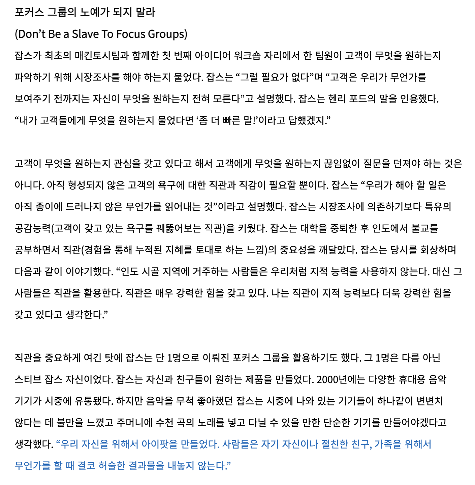
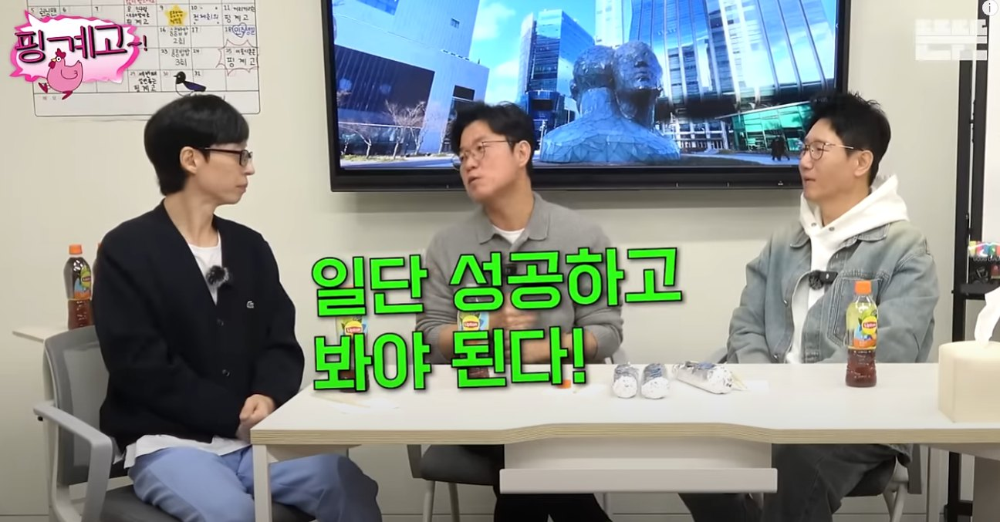
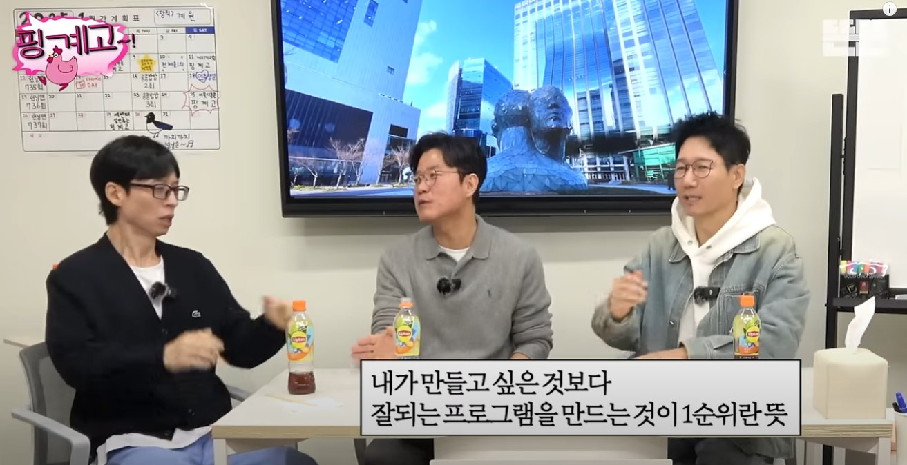

# 워크샵 질문 QnA

안녕하세요 향로입니다.  
최근 진행한 Cell별 워크샵에 대부분 참여를 하며 닥터기간 동안 나누지 못했던 여러 질문과 많은 이야기를 나누었습니다.    
(B2B Cell은 워크샵 스케줄 충돌로.... 다 끝나고 별도 QnA 시간을 가졌습니다)    
  
기존에는 각 Cell 워크샵에서 좀 더 솔직하게 많이 소통하길 바라는 마음에 적극적으로 참여하지 않았지만, 올해는 가능한 일정을 조율해서 대부분의 Cell의 워크샵에 참여했습니다.  
    
각 Cell에서 워크샵 참여 중 솔직한 질문을 많이 해주셔서 그 자리에서 답변했던 것들이 있는데, 질문 자체가 좋고 다른 분들이 중복적으로 질문해주신 것들도 많아 구두로 이야기 드린 내용을 텍스트로도 정리해서 공유드립니다.  

> 비슷한 질문들이 많았어서, 비슷한 질문과 그에 따른 답변들을 통합해서 남겨두었습니다.
> 1월 2일에 진행했던 [월간 프로덕트 모임에서의 QnA 이야기들](https://inflab-team.slack.com/archives/CHMHG8GFQ/p1735804913072399) 도 미리 보고 오시면 좋습니다.

## 1. 빠른 실패

> Q. [이번 성장 로그의 실패](https://inflab-team.slack.com/archives/C019V1KUQ8J/p1736416377916389)처럼 한번의 작업이 실패로 판정되기까지 너무 긴 시간이 걸리는 것 같다.  
좀 더 빨리 실패를 확정하고 거기서 빠르게 실패를 학습하는 것은 안될지?

A. 빠른 실행 -> 빠른 실패는 항상 하고 있습니다.  
이를테면 랠릿 이전에 [Zapier + Typeform + 구글 시트로 진행한 드래곤 프로젝트](https://inflab-team.slack.com/archives/CDC0CT9D3/p1722256028255029)가 있었고, 워밍업 클럽처럼 운영으로만 풀어보는 모델도 있습니다.  
그 외에도 강의 웹 빌더를 오픈소스로 최대한 빠르게 구축한 사례나 스터디 게시판을 그대로 복사해서 팀 프로젝트 게시판을 만든 사례 등 사실 쭈나 저나 성향이 **각잡고 제대로 구축해서 진행하는 것을 선호하지 않기 때문에 대부분의 일은 항상 빠르게 수행하는 것**을 선택해왔습니다.  
  
그래서 빠른 실행을 안한다고 볼 순 없을것 같고, 남은 것은 빠른 실패에 대한 인식일텐데요.  
  
빠른 실패를 하기 위해서는 서비스 전면에 신규 기능을 알리거나 신규 기능 소식을 많은 사람들에게 CRM을 돌리거나 하는 등 여러가지 방법을 통해 빠르게 신규 기능에 대한 트래픽을 모아 많은 유저들의 선택을 보고 성공 여부를 확인 할 수 있습니다.  
  
근데 저희는 이것 역시도 계속 해왔습니다.  
성장 로그의 경우 첫 오픈 당시 **강의실 진입시 무조건 기본 활성화된 탭**으로 선택하게 두었습니다.  
**서비스 내에서 가장 트래픽이 높은 강의실 진입을 하게되면 성장로그를 무조건 사용하도록** 액션을 취했던 것이죠.  
그렇지만 이 선택은 결국 수많은 고객들의 불평/불만 CS를 받고 철회할 수 밖에 없었습니다.  
그래서 지금처럼 커리큘럼이 기본 탭인 상태로 롤백이 되었죠.  
  
즉, 예시로 든 성장로그만 하더라도 다음과 같은 과정을 진행했던 것이죠.
- 빠르게 구현해서
- 트래픽을 몰아서 사람들이 사용하도록 한 뒤
- 사람들의 요청에 의해 성장로그의 성공 유무를 결정하고 빠르게 롤백 결정을 내린 경우 

성장 로그가 고객의 선택을 받지 못했음을 인정 한 뒤에는 남은 선택지는 3가지인데요.

1. 성장 로그 기능 자체를 롤백한다.
2. 성장 로그를 어떻게든 살리기 위해 이것 저것 액션을 취한다.
3. 성장 로그를 그대로 두고, 다른 중요한 일들을 하면서 시간을 두고 지켜본다.

성장 로그가 기본 활성화 탭이 아니면 고객을 불편/불쾌하게 하는 것은 아니기 때문에 일단은 그대로 두고 지켜보자고 생각했습니다.  
멘토링, 로드맵, 스터디처럼 말이죠.  
  
성장 로그를 더 개선해보는 것은 왜 선택하지 않았냐고 할 순 있겠지만,

- 저희는 성장 로그 외에도 해야할 수많은 중요한 작업들이 존재하며
- 그런 중요한 작업들을 하면서 틈틈이 성장로그 상단 대시보드 부터 시작해서 닉네임 미노출 등 여러 개선을 해왔습니다.

즉, **빠르게 실행하고 빠르게 실패하고 이에 대해 회사가 필요로 하는 다른 중요한 프로젝트들을 하면서 성장로그의 개선도 하면서 시간을 두고 지켜본 것**이죠.  
  
예상치 못했던 것은 "**자막 기능**" 이 저희가 생각한 것보다 훨씬 더 빠르게 런칭이 되어서 대부분의 유저는 **커리큘럼과 자막으로 양분화**되어 더더욱 성장 로그를 필요로 하지 않게 된 것이죠.  
  
물론 성장 로그를 기본 활성화 탭에서 롤백했을때, 그때 실패를 인정하고 회고를 하면 안되는 것이었냐? 라고 할 수도 있습니다.  
다만, 저희는 여태 **신규 런칭한 기능의 성공 유무를 단기간에 결정 내린 적이 없습니다**.  
현재 저희가 유데미, 패캠과 대비해서 차별점이라고 볼 수 있는 성공한 제품들인 멘토링, 스터디, 로드맵, 랠릿, 랠릿 허브까지 어느 것 하나 오픈 1개월, 길게는 6개월까지는 제대로 성과를 내 본적이 없습니다.  
1년, 2년이 지나면서 점점 성장세를 갖춰나가면서 이제는 제대로 된 제품으로서 강점을 갖게 된 것인데요.  
  
이렇게 긴 기간 동안 기다린 결과 성공한 제품들이 계속해서 등장하는 저희팀 특성에서 **단기간의 결과만 보고 실패를 결정하고 그에 대해 회고하는 것은 오히려 잘못된 결과를 도출할 수도 있습니다**.  
어느 서비스도 지금처럼 살아남지 못했을테니깐요.  
그런 의미에서 **짧은 기간의 결과 그 자체가 실제 그 프로젝트의 정확한 평가가 될 수 없습니다**.  
  
그래서 결론은,
- 우리는 항상 빠르게 실행하고 빠르게 고객들의 반응을 이끌기 위해 1차적 액션은 항상 해왔다.  
- 다만, 그 단기간의 결과가 반응이 적다고 한다면 더 중요한 다른 프로젝트를 하면서 뜸들이는 시간을 가진다.
- 2~3년의 충분히 시간이 지났음에도 여전히 고객에게 반응이 없다면 이건 실패로 인정하고 삭제 or 큰 개편을 진행한다.

이렇게 진행한다고 생각해주시면 됩니다.

## 2. 고객 인터뷰

> Q. 제품 파트에서도 고객 인터뷰를 해볼 수 없을까?    
SO 파트가 전달해주는 정보나 인프런에 바란다 채널을 통한 내용으로만 일이 진행되다보니 답답한 면이 있다.  
제품팀에서도 고객의 인터뷰를 진행해볼 수는 없을까?  

A. **후니와 시리처럼 해외여행을 간 김에 지인에게 글로벌 사용성을 테스트하고 인터뷰**를 하는 등 고객 인터뷰를 하는 것은 오히려 너무 응원합니다.  
저희는 절대 모르는 해외 유저의 목소리를 들을 수 있는 시간이였으니깐요.  
  
다만, 개인시간이 아니라 업무시간을 활용해서 진행하는 고객 인터뷰라면 "거기에 얼마나 에너지를 쏟을 것인가" 에 대해 생각을 전할 필요가 있을것 같아요.  
  
고객 인터뷰나 설문에 대해서는 '**고객의 의견은 기존 기능의 개선에 대한 아이디어는 얻을 수 있지만 회사의 방향과 신규 기능, 제품 혁신을 이끌 순 없다**' 라고 전제 하는 편입니다.  
서비스의 성공 사례에 대비되는 고객의 의견에 대한 사례가 너무 많기 때문인데요.  

- 쿠팡의 로켓배송 
  - 고객 설문 결과는 빠른 배송 < 낮은 가격이 항상 중요하다고 나옴
- 아이폰의 홈 버튼
  - 출시 초기 고객들이 계속해서 불편하다는 의견을 제보

그 외에도 [애플은 고객 인터뷰로 제품의 방향을 결정하지 않는다](https://dbr.donga.com/article/view/1401/article_no/5378/ac/magazine)는 꽤나 유명한 이야기입니다.  

기존 기능에 대한 개선에 대한 고객의 인터뷰는 **정말 좋은 질문**을 해야만 하는데요.  
자치 잘못하면 **잘못된 질문으로 잘못된 결과가 도출되고** 엄한데 에너지를 쓰게 됩니다.  
  
특히 위험하다고 생각하는 점은 **설문하는 측에서 본인이 원하는 결과를 이끌어내기 위해 유도할 수 있다**는 점인데요.  
"내가 생각한 가설에 대해 고객도 원할 것이야" 라는 믿음으로 **원하는 결과가 나올때까지 계속해서 설문과 인터뷰를 하는 것**과 **제대로 고객에게 좋은 질문을 한 것이 맞을까** 사이에서 제대로 인터뷰를 하고 있는지에 대해 끊임없는 검증이 필요합니다.  
  
저희는 누적 회원 140만, MAU 30~50만의 서비스를 하고 있는데 여기서 소수의 인터뷰이 의견이 진짜 고객을 대표한다고 판단하기도 어렵습니다.  
  
그러다보니 저는 **제품팀에 한해서의 고객 인터뷰**는 다음과 같이 생각합니다.

- 전반적으로는 Hotjar, Datadog RUM 등으로 고객이 실제 사용하는 Hit point 위주로 **전체 유저의 사용성을 데이터로** 확인한다
- B2C 서비스의 특성을 살려 **우리가 실제 고객으로서** 서비스를 사용하고 우리가 쓰면서 불편했던 점, 필요했던 점을 아이디어를 내고 개선한다 
- 같은 고객으로서 **이해가 잘 안되는 행동**에 대해서 인터뷰 한다.
  - 결제 버튼까지 누르고 나서 결제를 취소한 고객
  - 한번에 서로 다른 주제의 강의를 학습하는 고객
  - **해외에서 거주**하면서 인프런을 결제하고 수강하는 고객

이 3가지 규칙이 저는 꽤 중요하다고 보고, 제품팀에서는 이를 기반으로 고객 인터뷰를 바라보면 좋겠다고 생각합니다.  
  
다만, 이건 어디까지나 **우리가 고객이 될 수 있는 B2C 제품 파트**의 이야기입니다.  
**왜 고객이 가입하는지, 왜 유료 사용자로 전환 하는지**에 대해 인터뷰를 하고 마케팅을 해야하는 마케팅 파트나,  
**왜 이 지공자가 강의를 올리는지, 요즘 유저는 어떤 컨텐츠를 좋아하는지**를 알아야하는 컨텐츠 파트와는 다릅니다.  

그런 차이점을 이해하고서 바라보면 좋을것 같습니다.  
  
이야기해주신 것처럼 이미 저희는 이 서비스에 대해 충분히 익숙한 사람이기 때문에 **완전한 신규 유저나 VIP 고객으로 전환되지 못하는 고객 등 서비스 내에서 소외받는 고객분들을 잘 찾아내서 이들을 인터뷰하고 VIP 고객으로 전환하는 등에 대한 인터뷰**는 저도 좋은 것 같습니다.  
  
이와 같은 방식에 대해서는 쭈와도 이야기해보고 다시 말씀드릴게요.

> 내용을 정리하던 중에 최근 "[고작 다섯 명이 한 말을 어떻게 믿어요?](https://product.kyobobook.co.kr/detail/S000214928147)" 의 출간 소식을 듣게 되었습니다.  
> 아직 이 책을 보지 못했는데 이 책을 저도 보고 다른 분들도 보면서 좀 더 나은 방법을 함께 찾아보는 것도 좋을것 같아요.

## 3. 목표 지표를 설정하기

> Q. 프로젝트를 진행할 때 목표 지표를 설정하고 진행하면 안되나?  
목표 없이 프로젝트의 오픈만을 위해 달려가는 경우가 빈번하다.

A. 어떤 프로젝트를 런칭하기 전에 목표 수치를 정하고, 그걸 달성하기 위해 노력한다 << 이 부분에 대해 부정하진 않습니다.  
다만, 현재 저희 상황에서는 **기존 기능의 개선 작업에 한해서 효과적입니다**.  
현재 기능보다 좀 더 나은 지표를 냈다 아니다를 판단하기 위해 최소 몇%이상은 올랐으면 좋겠다는 형태의 지표 설정을 하는 것은 가능하나 **모든 프로젝트에 적용하는 것에는 어려움이 있습니다**.  
  
기존에 없던 새로운 신규 기능, 신규 서비스는 많은 부분에서 예상 목표치를 설정하기가 어렵습니다.  
어떻게든 설정할 순 있는데, **잘못 설정한 목표는 그 목표 수치 달성에 매몰되어서 회사 전체의 큰 그림, 큰 목표와 점점 멀어지게 되는 경우가 많습니다**.  
특히 자꾸만 **우리 Cell의 기능, 우리 Cell의 제품 지표에 집중하다보면 조직 내 사일로 현상이 심해지는 경우**를 자주 봅니다.  
  
이걸 해결하기 위해 조목조목 목표 설계를 해야하는데,  
그러기엔 현재의 저희 팀에서는 실행속도가 늦어질 수 밖에 없고,  
지금 저희가 하는 신규 기능과 서비스들이 대부분 **당장 있어야할 기능과 서비스가 없어서 해야만 하는 일**이 많습니다.  
  
그러다보니 처음 실행에 너무 많은 고민을 하고 설계를 하기 보다는 빠르게 시작하고 "고객이, 내부 구성원이 당장이라도 뭘 할 수는 있게 하자" 라는 성격이 강합니다.  
  
이미 구현된 기존 기능에 대한 개선 건은 "**기존보다 확실히 더 나은게 맞냐**?" 에 대한 확인이 필요하기 때문에 A/B 테스트 혹은 배포 전/후 지표를 통해 검증합니다.  
이건 **목표가 명확하고 이미 큰 그림의 조각을 채워두고, 더 나은 조각으로 교체하냐 마냐**이기 때문에 아주 쉽게 목표를 정할 수 있고 실행도 빠르게 가능합니다.  
  
반면 완전히 새로운 신규 서비스와 기능은 대부분 "**이건 없으면 우리의 비전을 달성할 수 없어**" (멘토링, 로드맵, 랠릿, 닥터, 퀴즈, 미션 등등) 혹은 "**이게 있으면 앞으로 할 수 있는게 대단히 많아져**" (모바일 앱, 코호트, 학습 독려 메세지, 웹 빌더, 에디터 개편 등) 와 같이 **필수적인 요소들을** 실행에 옮깁니다.  
그 이후엔 다른 필수제들도 빠르게 구현해서 **저희가 사용할 수 있는 무기의 가지수를 늘리는 것**이 중요합니다.  
  
저희는 **여러 Cell로 이루어져있지만, 결국 하나의 조직으로서 승리**를 목표로 합니다.  
수 많은 퍼즐 중 하나의 퍼즐이 계속해서 완벽해지는 것 보다, **그림 전체의 완성도를 높여나가는 것**이 조직에게 훨씬 더 큰 가치를 주는 일입니다.  

물론 제가 이렇게 이야기한다고 해서 **목표 설정을 하지 말라는 것은 아닙니다**.  
Cell 내에서 어떤 식으로 일을 해야하는지는 Cell 내에서 좀 더 자율성을 가지고 해주셔도 되어요.  
단, 아래의 항목들을 꼭 생각해주세요.

- 목표 '**설정**'에 매몰되지 않고 **빠르게 실행에 옮기는 것**을 잊지 않습니다.
- 목표 '**달성**'에 매몰되지 않고 **조직 전체에 도움이 되는 더 중요한 일을 항상 생각하며** 진행 합니다
  
언젠간 저희 팀의 규모가 더 커진다면 그땐 지금과는 다르게 일 할 수도 있습니다.  
그땐 하나의 기능이 나갈때도 투입해야할 리소스가 수십명에서 수백명이기 때문에 **투입된 리소스 대비 효과가 있는 작업들만 골라해야하기 때문**입니다.  
  
그 전 단계인 현재는 어떻게든 **더 빠르게 실행하고 더 빠르게 고객에게 가치를 전달**해야만 합니다.  
그게 스타트업이 대기업을 이기는 방법이니깐요.  

위에서 언급한 2가지에 대해 계속해서 잊지 않고 업무를 진행해주세요.  

## 4. 오픈한 프로젝트의 지속적인 추적

> Q. 제품팀 전체가 하나의 팀처럼 움직이기 위해 Cell 제품이 아니여도 일정이 되면 다른 Cell의 프로젝트를 해줄 때가 있다.  
근데 프로젝트가 단발성으로 진행이 되다보니 끝나면 원래 Cell이 그 제품을 이어가게 된다.  
그 프로젝트를 했던 Cell은 프로젝트에 대한 효과나 추적, 개선을 이어서 진행할 수 없다.  
프로젝트 런칭하고 다른 프로젝트 시작하고,  
그게 끝나면 다시 또 다른 프로젝트하고.  
수행한 프로젝트에 대한 추적과 개선을 계속 연결해서 가져갈 수 없나? 

A. 진행한 프로젝트에 대해서 잘 성장하고 있는지 지표를 계속해서 보는 것은 언제든지 하셔도 됩니다.  
그런면에서 우리는 핵클을 통한 AB테스트나, 믹스패널, 빅쿼리, 루커스튜디오 등 데이터를 볼 수 있는 환경은 잘 갖춰져있으니 데이터 보는 연습으로도 좋다고 봅니다.  
대부분의 PM 분들은 매일 출근하면 프로젝트나 제품의 지표들을 보고 있습니다.  
그만큼 데이터를 보는 것에 대해서는 현재까지 제약이나 제한을 두고 있진 않습니다.  
  
다만, "타 Cell의 업무를 임시로 한 것에 이어 계속 개선해 나가고 싶다" 는 것에 대해서는 조심스럽게 생각하고 있습니다.  
우리가 가진 가장 큰 경쟁력은 "**담당하는 제품이 아니더라도 중요하고 급하다면 일정이 가능한 어느 조직이든 그 일을 당장 해결한다**" 입니다.  
  
"**RnR은 있지만 RnR을 따지지는 않는 조직**"  
다른 수많은 회사들과 비교했을때 저희가 가징 가장 큰 장점인데요.  
[세계에서 가장 작은 대기업이라고 불리는 엔비디아 역시 저희와 비슷하게 용병제도를 운영하고 있습니다](https://inflab-team.slack.com/archives/CDC0CT9D3/p1732232560418989).  
저희는 이를 품앗이 문화라고 부르고 있으며, 굉장히 잘 운영되고 있습니다.  
  
이걸 계속해서 잘 지키려면 **내 것에 너무 매몰되지 않는 것이 중요**합니다.  
나 혹은 우리 Cell이 했으니 계속해서 개선해나가고 싶은 마음은 오너십 관점에서 대단히 좋다고 보고 장려합니다.   
다만, 그게 너무 강해지면 **일에 대한 위임이 어렵습니다**.  
"일은 일로 봐라" 같은 의미가 아니라,  
**다른 사람이, 다른 Cell이 이 일을 이어받아도 더 잘해줄 것이라는 믿음**이 중요합니다.  
그래야만 유기적으로 **각 Cell이 전사의 중요한 과제에 니것내것 구분 없이 빠르게 실행하고 몰입할 수 있습니다**.  

**꼭 내가 그 일을 하지 않더라도 혹은 내가 한 일을 다른 사람들이 이어가더라도 내 일처럼 도와주고 지원해준다면** 저희는 정말로 최고의 조직이 될 수 있다고 믿습니다.  
  
아직 저희가 그리고 있는 큰 그림에서 구현하지 못한 것들이 너무나 많습니다.  
여러 사업 전개에 필요한, 운영/사업에서 필요로 하는 도구들과 기능들도 너무나 많이 남아있습니다.  
이렇게 해야할 것들이 많을 때는 완성도 있게 하나하나 심혈을 기울이기 보다는 가능한 MVP를 빠르게 출시해서 **어디 하나 과락이 없는 상태**를 만들어가는 것이 중요합니다.  
    
그런 면에서 **RnR은 있지만, RnR을 따지지 않고 유기적으로 지원하고 위임할 수 있는 조직**의 형태를 계속 유지되길 바라고 있습니다.
  
## 5. 의사 결정 우선 순위

> Q. C레벨에서 여러 프로젝트들 간 우선순위를 결정하고, 어떤 프로젝트를 먼저 하고 어떤건 하지말아야 하는 등 여러 의사결정들을 전달 받으면 납득이 안될때도 종종 있다.  
C레벨 분들은 어떤 기준으로 우선순위를 결정하는지, 프로젝트마다 어떤 프로세스로 확신을 가지시는지 궁금하다.
  
A. 멘토링, 랠릿, 닥터, 코호트 등 이 프로젝트들을 시작할 때 항상 지금 시작하지 않으면 안되는 이유에 대해서는 충분히 전달드리는 편입니다.  
- [(타운홀) 프로덕트 브리핑&리뷰 발표 자료](https://drive.google.com/drive/folders/19Qo5uIdfV3c5zN6NHiAffnKuHADe1tkY)

물론 회사 내부의 사정이나 회사 외부의 사정들 중에서도 이야기 하지 못하는 것들도 종종 있습니다.  
그걸 다 이야기할 수는 없는 것이기도 하고요.  
그래도 가능한 이야기드릴 수 있는 범위내에서 최대한 맥락과 배경, 근거를 이야기 드리는 편입니다.  

예를 들어, 구텐베르크 (강의 소개 빌더) 프로젝트의 경우 다음과 같이 목표와 배경이 생성됩니다.

- 목표: 지공자가 에디터 파트의 도움 없이 강의 소개를 작성할 수 있도록 한다.
- 내용: 기존의 불편했던 에디터를 누구나 쉽게 생성할 수 있는 편리한 에디터로 이관한다.
- 배경: 지공자가 소개 페이지를 직접 작성할 수 있도록 편의성을 제공하여 에디터 파트와 컨텐츠 파트가 더 중요한 일에 에너지를 쓸 수 있도록 하고 싶다.

그럼 여기서 추가로 궁금증이 생길 수 있습니다.    
"왜 여러 불편함 중에서 이게 가장 우선 순위가 높은 것인가?"  
"왜 여러 배경들 사이에서도 이 배경이 우선 순위가 높은 것인가?"  
"팀원의 불편함이 가장 우선 순위가 높은 것인가?"  
"운영 파트의 불편함이 고객의 불편함 보다 우선 순위가 더 높은 것인가?"  
  
등등.   
  
이에 관해서는 운영팀의 의견도 많이 듣고, 지공자분들의 이야기도 많이 들었던 상태이긴 했습니다.  
다만, 지공자 몇분이 불편을 얘기하면 우선순위가 몇점이 된다 라던가,  
운영팀 몇분이 힘들어하면 우선순위가 몇점이 된다던가 그런 공식을 갖고 있진 않습니다.  
  
여러 맥락과 각 작업에 들어가는 리소스, 일정을 다 파악한 뒤 최종적으로는 **직관**에 의해 선택합니다.  
  
거의 대부분의 근거를 말씀드리지만 그럼에도 완전히 해소되지 않는다면 **'말하기 어려운 사정'과 '직관' 이 2가지가 겹쳐져있는 경우**에 있다고 생각해주시면 됩니다.  

([명확한 계산식](https://techblog.lycorp.co.jp/ko/a-formular-for-prioritizing)이 있길 바랬던 분들에겐 죄송...)  

일본 최대 배달앱인 데마에칸의 최고 리더이신 [김영재님의 글](https://techblog.lycorp.co.jp/ko/a-formular-for-prioritizing)을 보면서 이런 공식을 세우는게 어떨까? 하는 생각도 해봤는데요.  
  
이 방법이 맞다 아니다 보다는 **어떤 상황에 가장 적합한 해결책**이냐가 중요하다고 봤습니다.  
데마에칸은 "450여 명의 프로덕트 팀원들과 수천 명의 관계 부서 분들에게 우선순위를 설정하고 설명해야 하는 상황" 이 반복되기에 **우선 순위 공식**을 만들게 되었습니다.  
  
일을 진행하는데 있어 우선 순위를 선정하는 과정이 최고 병목이 되고서야 이런 공식이 만들어졌다고 생각합니다.  
  
특히나 저희처럼 "아니다 싶을땐 빠르게 전환할 수 있는 규모" 에서는 **공식이나 프레임워크로 일하기 보다는 주변의 상황을 계속 민감하게 체크하다가 이거다 싶을때 냅다 달려가는게** 큰 항공모함이 아닌 작은 소형함인 저희 같은 조직이 가진 주요 경쟁력이라고 생각합니다.  
  
그래서 이 일이 지금 어느 정도 리소스로 얼마만에 해결 될 것 같은데, 해결 되는 문제의 크기가 대략 어느 정도 된다가 판단되면 비슷한 규모의 일들을 나열해두고 우선 순위를 결정하고 가는 편입니다.  
  
답변을 정리하다보니 다음과 같은 결론이 생각나는데요.

- '직관' 이라고 불리는 영역을 [암묵지에서 형식지로 가져오기](https://jojoldu.tistory.com/809)
- 리더들의 '직관' 을 팀원들도 똑같이 생각할 수 있도록 하기

이 2가지 중 하나라도 갖춰진다면 아마도 이 문제가 자연스레 해결되지 않을까 생각됩니다.  

## 6. 작업자의 확신

> Q. C레벨이 직관으로서 결정을 내리고 설명하기 애매한 부분이 있다면 그럼 작업자들은 어떻게 확신을 갖고 시작할 수 있나?  
C레벨이 가지고 있는 확신이 작업자들까지 잘 전파가 안된 상태에서 작업자들도 프로젝트를 시작할 때 확신을 갖고 시작하고 싶다.

A. 모든 작업자들이 C레벨과 동일한 생각을 가질 순 없으니 '직관'에 의한 확신을 작업자분들이 할 순 없을것 같습니다.  
  
제가 작업자였던 경우를 보면 저도 리더들의 선택에 확신이 없을때가 많았습니다.  
그래도 몰입감 있게 일을 했던 경우는 **그 결정에 대한 확신 보다는 리더에 대한 확신**을 가졌기 때문입니다.  
  
[배민의 PC 웹 주문 종료](https://wepinfocenter.tistory.com/2), [앱 내 주문 수수료 0% 선언](https://brunch.co.kr/@businessinsight/56), 일정산 출시, 비마트의 출시, 가장 마지막엔 한집 배달 서비스 배민1의 출시 등 내부에서 여러가지 우려와 걱정, 반대가 많았던 것들을 모두 좋은 결과를 냈기 때문입니다.    
(물론 지금은 그 리더분들 대부분이 안계시긴 하지만요.)  
  
항상 성공했던 것은 아니고 실패한 경험도 많습니다.  
대표적인 사례로 메인 비즈니스 모델을 [월 광고에서 주문 수수료 기반으로 전환하자](https://biz.newdaily.co.kr/site/data/html/2020/04/01/2020040100213.html)는 결정이였는데요.  
  
회사의 미래를 위해서도, 월 500만원 이하 소상공인 분들의 영업 이익에도 도움이 된다는 계산하에 결정된 것이지만, 최종적으로는 [여론과 국회의 반대로 철회](https://it.chosun.com/news/articleView.html?idxno=2020050100612) 되었습니다.  
  
이 외에도 여러번의 실패 사례로 **아무리 내가 신뢰하는 리더라도 실패한 결정을 내릴 수도 있구나**라는 생각을 가지기도 했습니다.  
  
굉장히 훌륭한 경력과 똑똑함을 지닌 당시의 리더들도 성공과 실패를 번갈아하는걸 보면서 누구도 매번 성공할 수는 없다는걸 깨달았는데요.  
  
그러다보니 모두가 확신하는 어떤 100% 완벽한 프로젝트란 있을 수 없으니 뭐든 실행에 옮기려면 누군가가 확신한다면 실행해야만 합니다. 
그리고 저는 그 누군가가 그간 좋은 결정을 내렸던 상위 리더들이였고, 그들이 확신한다면 그냥 믿고 따라갔습니다.  
  
인프랩을 되돌아보면 진행한 여러 실패 프로젝트들도 있었지만,  
반대로 성공한 프로젝트나 의사결정들도 정말 많습니다.  
  
누구나 예상할 수 있었던 자막 기능 등을 제외하더라도, 많은 분들이 반대했던  

- (구) 인프런 앱 (a.k.a 블랙펜서)의 종료 결정  
- 이미 수많은 채용 서비스가 있는 상태에서의 랠릿 오픈    
- 오픈소스 디자인 시스템의 도입
- 채용 플랫폼 -> 지원자를 위한 구직 플랫폼으로의 랠릿 방향 전환  
- 부트캠프, 세미나를 위한 오프라인 강의 유형 추가
- 랠릿 이력서 허브 등등  
  
특히 (구) 인프런 앱은 **런칭한지 2년만에 종료**를 결정하는 과정에서 많은 고객의 불편함을 예상했는데요.  
- [(구) 인프런 앱 출시 소식](https://www.inflearn.com/notices/223610)
- [(구) 인프런 앱 스토어 중지 소식](https://www.inflearn.com/notices/845132)
  
생각보다 그렇게 많은 고객의 불편이 인입되진 않았고,  
오히려 그 기간 동안 앱과 서비스에 대한 브랜딩 하락을 막고 새로운 서비스 출시에 집중할 수 있게 되었습니다.  
현재 신규 앱은 각 스토어에서 수만명의 유저분들이 다운로드를 하고도 평균 4.5이상의 평점을 기록하고 있습니다.  
  
"리더들이 이만큼 잘났으니 믿어달라" 그런 류의 이야기는 아닙니다.  
(맨 위에 언급한 성장로그처럼) 저희도 실패한 프로젝트가 많습니다.  
성공을 예측할 수 있을정도로 경험이 엄청나게 많지도 않고요.  

다만, 가만히 아무것도 하지 않으려고 여기에 저희가 모인 것은 아니겠죠.  
가만히 있으면서 어떤 큰 성과를 이뤄낼 순 없고, 수많은 사람들이 100% 동의해야만 실행할 수 있는 일은 하나도 없기도 합니다.  
(오히려 수많은 사람들이 동의하는게 더 경쟁력이 떨어질수 있는 일이 아닌가 싶기도 하고요.)  
  
"**확신은 없는데, 그래도 우리 리더들이 하자고 하니 일단 믿고 해보자**" 라는게 중요한 것 같습니다.  

그럼에도 **납득이 안되서 동기부여가 안된다고 생각이 된다면 본인이 결심 해야할 때가 아닌가** 싶습니다.

**Lead, Follow or Get Out of the Way (이끌거나, 따르거나, 떠나거나)**    
제2차 세계 대전 당시 미 육군 대장이었던 조지 S. 패튼,  
CNN의 창립자 테드 터너,  
배달의 민족 등 수많은 기업에서 언급했던 이 말은 이때를 위한 것이라고 생각해요.

> ps. 저희 사내문화에는 '이끌거나, 함께하거나, 떠나거나' 로 사용하고 있습니다. 

## 7. 믿고 맡기는 것에 대해

> Q. 그럼 작업자들이 C레벨에 대해 믿는 만큼 C레벨도 작업자들의 방향성이나 기획에 대해 믿고 맡길 순 없는지?  

A. 기본적으로 작업자들에 대해 굉장히 신뢰하고 있습니다.  
신뢰하지 않았다면 코드 레벨 부터 시작해서 픽셀 단위까지 하나하나 리뷰를 했을 거에요.  
누구보다 서비스에 열정적인 것을 잘 알고 있습니다.  
  
다만, **맡긴 일에 대해 관심을 두지 않고 알아서 하게 신경을 끄는 것은 신뢰 보다는 방임**에 가깝다고 생각합니다.  
신뢰의 증표가 위임이라고 하면 무관심의 증표가 방임인 것이죠.   
  
그래서 "**신뢰 하되 방임하지 않는다**" 라는게 좀 더 정확한 표현일 것 같아요.  
  
조직 전체, 서비스 전체, 운영/사업/제품 전체의 관점에서의 방향, 브랜딩 등 전체적인 관점에서 다각도로 기획서나 아이디어에 대해 의견을 드릴 수 밖에 없습니다.  
  
각 Cell이 제안하는 방향이 Cell 내부적으로 긴 토론 끝에 나온 좋은 아이디어일지라도 서비스 전체로 봤을 때는 방향성이 맞지 않거나,  
그 Cell이 이번 시즌에 해줬으면 하는 더 중요한 프로젝트가 있거나 하는 사유로 거절 되는 경우도 많습니다.  
  
예전 사례로, 수강 바구니 -> 결제까지를 지금과 같은 1 Page가 아니라 2 Page로 나누는 것에 대한 의견이 나온적이 있습니다.  
대부분의 많은 컨텐츠 서비스 (리디, 교보 등) 에서 이러한 2 Page를 구현해서 수강바구니의 UI를 간소화하고 로직도 단순화 할 수 있기 때문이였는데요.  
  
결국 저와 쭈의 반대로 시작하지 못하고 지금의 1 Page로 수강바구니가 개편되었습니다.  
(토스의 결제위젯이 들어와서 결국 1Page + 1 Modal이 되긴 했지만요)  
  
저희같은 온라인 교육 서비스는 공부할 마음이 들었을 때 최대한 빠르게 그 결심을 들어주는 것이 중요하고, 그럴려면 계속해서 하나라도 퍼널이 더 늘어나는 것이 다른 장점들을 모두 상쇄할만큼 큰 장점이라고 생각했기 때문입니다.  
  
물론 이걸 A/B 테스트를 통해 검증하자는 의견도 있었는데요.  

- 당시엔 핵클을 도입한지도 얼마 안되어 숙련도가 낮았고  
- 앤트맨에서 2가지 버전의 수강바구니를 모두 다 구현해야 해서 개편 일정이 2배가 더 필요했고
- 지금 보다 유저도 훨씬 적었기에 얼마 안되는 사용자를 대상으로 하기 위해 굉장히 긴 기간의 테스트 시간

의 이유로 결국 A/B 테스트 없이 1 Page로의 개편을 C레벨의 결정하에 진행하였습니다.  
  
이 일은 작업자 분들의 작업물에 대해 신뢰하지 않기 때문이 아니라, 회사 전체의 사정을 고려했을 때 작업자들의 실망 보다 회사 전체의 이득이 더 크다는 판단하에 결정을 한 것이였습니다.  

이런 일들이 한번씩 발생하다보면 작업자분들의 열정을 감소시키는 이유가 된다고도 생각합니다.  
그런 면에서 [나의 자아를 만족시키는 것을 넘어 조직 전체의 승리](https://www.youtube.com/watch?v=9z3HYlFcc6Q&t=1711s)에 성취감을 느낄 수 있도록 열정의 방향이 개선 되는 것을 추천드리고 싶습니다.

## 8. 첫 B2C 매출 역성장 

> Q. B2C 매출이 처음으로 역성장했다.  
혹시 뭐 때문인 것 같은지 생각해보셨는지,    
올해는 우려 안되는지 궁금하다.
  
A. 크게 2가지 때문이였다고 생각하고 있어요.  
첫번째는 쭈와 제가 너무 국제화에 몰입되어 있어서 그 외 나머지 것들에 대해 세심하게 챙기지 못했기 때문입니다.  
  
지표적 하락에 대해서는 둘 다 어느정도 인지는 하고 있었던 상태였습니다만,    
그래도 **닥터를 2024년에 오픈하는게 가장 중요했기 때문에** 지표적 하락 개선을 위해 별도의 액션을 취하는 것 보다 완전히 닥터 오픈에 집중하자라는 선택을 했습니다.  
  
특히 하반기 하락폭이 전년대비 높은데,  
상반기에는 그래도 작년과 비슷한 기조로 일하면서 닥터와 기존 서비스에 대한 일을 어느정도 조절하면서 진행했었던 반면, 하반기는 오로지 닥터만 신경쓰면서 나머지 것들을 모두 후순위로 두었습니다.  
오픈을 못할 수도 있었기 때문이죠.  
  
[개발파트 상반기 워크샵 회고](https://inflab.atlassian.net/wiki/spaces/PartDev/pages/1313866080/2024) 에도 나와있었지만 **닥터와 인프런의 개선을 병행하는 것은 무리**라는 의견이 대부분이였고, 저 역시 동의하기에 하반기의 지표 하락에 대한 추가 액션을 취하지 않았습니다.  
  
상위 리더들이 완전히 닥터 오픈에만 올인하고 전체적으로 잘 챙기지 못했던 점이 주요했다고 생각하고 있습니다.  
  
두번째는 **국내 시장의 불황이 오니 성장하기 어렵다는 것을 너무 당연하게** 생각했던 것 같아요.  
많은 구조조정과 희망퇴직, 폐업, 경기둔화 등 여러가지 안좋은 소식들이 많았기에 성장에 대해서 보수적으로 생각했습니다.  
"남들도 우리와 같이 힘들것이야" 라고요.  
그게 굉장히 나이브했음을 이번 12월의 타사 성적을 보면서 깨달았습니다.  
  
2024년 타사의 성적을 보니 2023년에 비해 또 성장을 했습니다.  
생각보다 2024년의 국내 교육 시장은 그렇게 크기가 줄어들진 않았고, 성장이 주춤하는걸 너무 당연시여겼던 것에 많이 반성을 했었습니다.  
  
**남들이 다 어렵다고 할 때, 그럼에도 우리는 더 성장할 수 있다는 생각을 해야하는데 그러지 못했습니다**.  
  
그런면에서 올해는 예정에 둔 작업들이나 현재 일하는 모습등에서 많은 기대를 하고 있습니다.  
완전히 턴어라운드 할 수 있는 한해가 되지 않을까요?

## 9. C레벨과 좀 더 자주 소통하고 싶다.

> Q. 오늘 이야기를 다 못했다.  
좀 더 자주 이런 생각을 듣고 물어보고 싶다.  

A. 개인적으로 우리 팀 정도면 C레벨과 실무진 사이에 거리감이 타사대비 정말 가깝다고 생각해서 질문이나 이야기를 하는데 그간 어려움이 있었나? 라는 생각을 하고 있어요.  
  
필요하면 언제든 DM으로 티타임 요청을 해주시기도 했는데, 생각해보니 했던 사람들만 계속 했던 것 같기도 합니다.  
  
개인적인 것을 넘어 Cell 단위로 C레벨과 프로젝트 외 이야기 하는 시간이 잘 없고 Cell 단위의 티타임이라는게 부담스러울 순 있었을 것 같아요.  
  
월 단위 프로덕트 모임도 있고 1 on 1 티타임도 있고 하다보니 정기적으로 Cell과의 모임을 만들지는 아직은 확정할 순 없고, C 레벨에서 직접 건의한 프로젝트를 시작할 때는 함께 킥오프에 참여해서 여러 배경이나 질문에 대해 답변 가지는 시간을 갖도록 하겠습니다.  
  
Cell 단위로 티타임이나 식사도 언제든 환영이고요.  
먼저 제안하기엔 좀 부담스럽다면 눈치껏 먼저 제안해보겠습니다.
