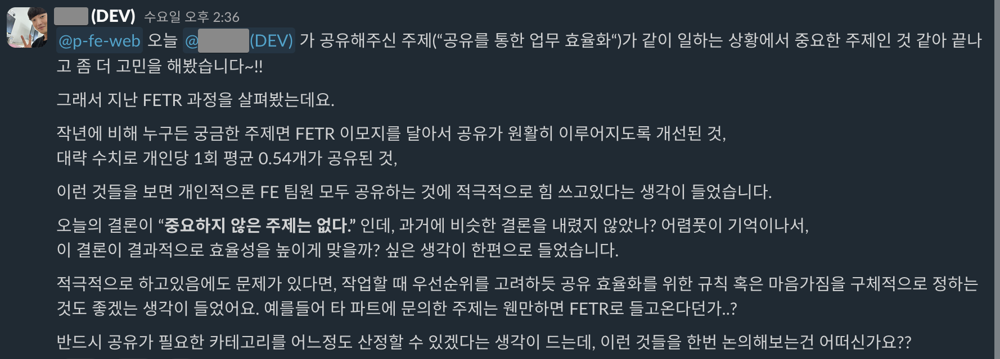

# 인프랩 개발팀의 커뮤니케이션

안녕하세요 인프랩의 향로입니다.  
[인프랩 개발팀의 미션과 가치](https://tech.inflab.com/20231117-devteam-value/) 라는 글을 2023년에 공유하고 이후에 내부에서 개발팀이 어떻게 일을 하는지 많은 분들이 질문을 주셨습니다.  
"그래서 구체적으로 어떻게 커뮤니케이션 하는지", "개발팀 외 다른 직무의 분들과 협업할 때도 이 원칙이 적용되는 것인지" 등등의 질문들이였습니다.  
   
좋은 질문들 덕에 저희 팀의 협업과 커뮤니케이션이 어떻게 진행되는지 다시금 정리하게 되었습니다.  
그리고 이런 새로 합류하신 신입 개발팀원들에게도 좋은 모범 사례들을 공유할 수 있도록 구체적 사례와 함께 내용을 정리해서 공유드립니다.

## 1. 신뢰 자본을 쌓는다.

> 회사라는 조직의 특성상 여러 사람들의 협업을 이끌어내야하는 경우가 대다수이다.
> 이때 필요한 것은 토론에서의 승리가 아니다.
> 말도 안되는 방향이라도 나를 믿고 따라갈 수 있을정도로 동료와의 신뢰관계를 쌓는 것이 중요하다.
> 전략, 전술보다 실행이 중요하다. (4번째 가치)
> 이를 위해서는 결론적으로 별로인 전략이라도 먼저 실행에 옮기면서 함께 수정해나가는 것이 중요하다.
> 나를 신뢰하고 계속해서 실행을 옮길 수 있도록 동료들과의 신뢰 관계를 구축한다.

함께 일하는 동료를 내 편으로 만드는 것

## 2. 상대를 먼저 인정한다.

> 여기 있는 모두는 기존 구성원들의 기술면접과 CTO & CEO의 문화면접을 통과하여 합류한 사람들이다.
**따라서 다른 구성원들이 본인 보다 부족한 사람임을 전제하고 대화를 하지 않는다**.
왜 다른 구성원이 그러한 주장을, 의견을 하는지 다시 한번 생각해보자.
> **감정을 뱉어내는 것과 명확한 소통은 다른 문제이다**.
> “이것 모르세요?” 등의 문장은 적절하지 않다.
내가 무엇을 모른다고 솔직하게 이야기하기 위해서는 **내 부족한 점을 드러내도 저 사람에게 부정적인 표현을 듣지 않는다는 심리적 안정감이 있어야만 가능하다**.
> 우리는 더 큰일을 더 잘하기 위해서 모인 전문가 집단이다.
상대가 모르는 것이 무엇인지, 아는 것은 무엇인지 빠르게 확인해서 문제를 해결해야만 한다.
**상대를 주눅들게 하여 커뮤니케이션의 장벽을 쌓는 것은 더 빠르게 문제를 해결하는 방식이 아니다**.
> 고압적인, 강압적인 태도로 상대를 존중하지 않는 커뮤니케이션을 한다면 점점 그 동료와의 대화는 회피하게 된다.
> “내 차 주변에서 운전 조심하세요“ 보다 “아이가 타고 있어요” 가 훨씬 더 안전운전에 효과적인 문장인 것을 누구나 안다.
> 사용하는 문장과 단어도 마찬가지이다.
누군가에게 메세지를 전달할 때, 진짜 전달과 설득이 목적이라면, 가장 효과적으로 전달할 수 있는 방법을 고민해야한다.
> 상대에 대한 배려가 부족하거나, 내가 갖고 있는 단어의 부족을 무례한 화법으로 표현하지 말라.
> 무례한 것은 취향이 아니다.
> 모든 팀원들간에는 상호 존중해야한다.

여기 있는 모두는
다 같은 프로세스를 통과한 
인재들

그리고 이러한 커뮤니케이션은 결국 "내 부족한 점을 드러내도 부정적인 표현을 듣지 않는다는 심리적 안정감" 을 조직 전체에 전파하게 됩니다.  
  
이를 테면 다음과 같이 잘못된 내용을 소통한 뒤에

당사자가 "제가 몰랐어요" 라는 이야기를 쉽게 할 수 있는 환경이 만들어집니다.

## 3. 계몽 보다는 전염

> "좋은 문화를 만들고 싶다면 내가 먼저 좋은 사람이 되어서 나를 닮고 싶도록 한다."

## 4. 모든 공유는 사실에 기반

본인이 원하는 것을 얻기 위해
정보를 조작해선 안된다

## 5. 역할에 집착하지 않는다

눈 앞의 쓰레기를 치우는 것은
누구의 책임인가?
책임자가 있는가?

### 인프콘

- 4개월만에
- 개발팀 지원없이
- 1000명 규모의
- 사내 최초 오프라인 컨퍼런스
를 개최하라

- 디자이너가 워드프레스로 페이지 구축
- DevOps가 배포 & CDN 구축

중요한 것은 약속된 기한 내 개최하는 것

- 8.15 광복절
- 10,000명 신청
- 1,300명 참석

### AI 자막

AI 를 전혀 모르는
FE, DevOps, Design
각 1명이서 일단 시작해본다

R&R은 있지만
R&R을 따지지 않는다

## 마무리

둘 중에 무엇을 선택할지
- 우승팀의 교체선수
- 꼴찌팀의 득점왕

엄청난 스트레스를 받는 
펀드 매니저들 중 
최고 경영층까지 갔던 사람들의 
공통된 특징
어렸을때부터 12학년 (고3) 까지 
팀 스포츠를 했다는 것
만년 후보 선수로 
벤치를 지키고 있더라도, 
이기는 팀의 맴버였던 경험이 
있던 사람

개인의 역량이 가장 중요하다?
NO, 팀으로서 승리를 
해본 것이 훨씬 더 중요하다
