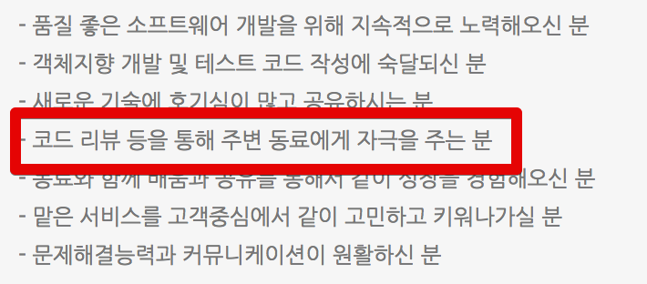

# 휴학기간

한달전쯤에 메일 한통을 받았습니다.  

메일 답장으로는 성의가 없어보여 블로그를 통해서 정리해서 공유드리겠다는 답변을 드렸습니다만,  
막상 쓸려니 **실력에 비해 너무 건방떠는 내용이 될것 같아서** 계속 미루게 되었습니다.  
흔히 말하는 "개뿔 뭐 없는데 오바는.." 가 될것 같았습니다.  
그러다가 최근에 진행된 [OKKY 세미나](http://jojoldu.tistory.com/274)가 끝나고 돌아가는 길에 또 다른 한분이 비슷한 내용을 여쭤보시고, 며칠 뒤 다른 분께서 페이스북 메신저로 비슷한 질문을 하셨습니다.  
  
"아! 이게 생각보다 많은 분들이 궁금해 하시는구나."  
"나 혼자서 [쉐도우 복싱](https://namu.wiki/w/%EC%89%90%EB%8F%84%EC%9A%B0%20%EB%B3%B5%EC%8B%B1#toc) 안해도 되겠구나" 싶었습니다.  
  
저는 이제 **4년 1개월 된 개발자**입니다.  
SI에서 1년, 포털 서비스에서 2년, 현재는 O2O 스타트업에서 1년째 개발중입니다.  
이미 2번의 한 해 회고 ([2016년 회고](https://brunch.co.kr/@jojoldu/2), [2017년 회고](https://brunch.co.kr/@jojoldu/19))를 썼기 때문에 이번 글은 **3번째 직장에 오기까지 취업/이직 준비를 어떻게 했었는지**에 대해서만 다룰까 합니다.  
  

'쟤' 가 딱 제 자리인것 같아서 부담없이 보시면 될 것 같습니다.

## 1. 국비교육

대학 생활중 SW전공 수업을 몇번 듣게 되었습니다.  
전자회로, 통신공학 같은 과목보다 해당 전공들의 과목이 좀더 재밌어서 SW개발쪽으로 취업을 해야겠다고 막연하게 생각하고 있었습니다.  
4학년 1학기가 끝날때쯤 기숙사 침대에 누워서 생각해보니 제 상황이 정말 안좋다는걸 깨달았습니다.  
**비전공(전기과), 3.3의 낮은 학점, 지방대, SW 관련 활동 전무** 등 당시 상황을 보면 전혀 개발자 쪽으로 취업할수 있을것 같지 않았습니다.  
이대로 졸업하면 큰일나겠다 싶은것도 있었고, **SW 개발만 집중적으로 공부해보고 싶은 마음**도 있어서 4학년 2학기부터 1년간 휴학을 했습니다.  
  
휴학 후, 어떻게 공부해야할까 고민했습니다.  
4학년 1학기에 다시 대학교를 가기엔 너무 늦었다는 생각에 국비교육센터를 고려하게 됐습니다.  
(정석루트로 가기엔 너무 늦었으니 다른 방법으로 가야겠다는 생각이였는데, 돌이켜 생각해보면 좋은 결정 같습니다.)  
당시 제가 살던 대구/구미에는 마땅히 SW 교육센터가 없어 인터넷 커뮤니티에서 찾아보니 비X교육센터를 추천해주시는 분들이 많아 생애 처음으로 서울 땅을 밟게 됩니다.  
  
지금도 그런지는 모르겠지만, 그때는 **국비 교육비 지원이 재학생에겐 해당사항이 없어 350만원이라는 교육비용을 자비로 지불**했습니다.  
(취업 안되면 영어 공부라도 해야겠다는 생각에 모아둔 돈이 있어 그걸로 해결했지만.. 돈이 너무 아까워서 진짜 열심히 들었습니다.)  
  
비X교육센터의 여러 과정 중에 제가 들었던 **4.5개월 과정을 들으려면 일종의 자바 시험을 통과**해야했습니다.  
시험 통과가 안되면 자바 기초 수업을 다시 듣고 시험을 쳐야한다고 하길래 부랴부랴 남궁성님의 [자바의 정석](http://www.kyobobook.co.kr/product/detailViewKor.laf?ejkGb=KOR&barcode=9788994492032)을 사서 8장 Exception까지 읽었습니다.  
  
아직도 기억나는게, 당시에 **클래스와 인스턴스 차이가 이해가 안되는데 시험일자는 다가와서 설명을 외워서** 시험치러 갔습니다.  
(남들은 한번에 이해했다고 하는데 그런걸 보면 제가 그렇게 재능있는 편은 아니였던것 같습니다.)  

어찌됐든 시험을 통과하고 본격적으로 국비교육을 시작하게 되었습니다.  
지금도 비슷할것 같은데 **2개월은 교육을 하고, 나머지 2.5개월은 팀 프로젝트를 진행**했습니다.  
  
교육기간동안 다음과 같은 내용을 배웠습니다.  

* Java: 2주
* Servlet / JSP: 2주
* Spring / Tomcat: 2주
* HTML: 2일
* 데이터베이스: 3일
* 안드로이드: 1주

(다시 생각해봐도 안드로이드는 당췌 왜 넣었는지 모르겠네요.)  
  
과목과 일정을 보시면 아시겠지만, **시간이 너무 촉박**했습니다.  
수업시간 내내 진도 빼기에 
Java 교육기간 이후부터는 전체 20명중 2~3명을 제외하고는 전부 강사님의 화면을 따라치기만 했습니다.  

지금 돌이켜 생각해보면 진짜 제대로된 웹 프로젝트가 되려면 커리큘럼에 아래 내용들이 무조건 포함되있어야 한다고 생각합니다.

* Javascript
* Git
* 단위 테스트
* Linux

### 1-1. 국비교육 들을까 말까?

주변 동생들한테 항상 하는 얘기인데, 국비교육보다는 **알바로 돈을 모아서라도 [코드스쿼드](http://codesquad.kr/) 교육**을 받으라고 얘기합니다.  
(코드스쿼드와 관계가 있는게 아니라 진심으로..)  
재작년/작년 2번의 교육을 받으면서 **이 교육을 처음에 받았으면 훨씬 더 수월하게 커리어를 쌓을수 있었겠다**는 생각을 계속 했습니다.  
(**쓴 돈만큼 얻어가는건 불변의 진리**인것 같습니다.)  
  
비전공자분들은 이쪽 계통의 선배나 동료가 없습니다.  
그렇다보니

* 좋은 멘토
* 좋은 동료
* 올바른 학습방법

이 3가지가 무엇보다 중요합니다만, **국비교육에서 이를 얻기는 하늘의 별따기**입니다.  
  
단순하게 생각해봐도, **공짜로 교육과 교통비를 주기 때문에 이 길에 뜻이 있어 오시는 분들은 극소수**입니다.  
어차피 교육센터는 인원만 유치하면 국가에서 돈을 주기 때문에 수강 인원이 채워지면 이후 관리에는 굉장히 소홀합니다.  
(저 혼자의 경험이 아니라 주변의 친한 동생들도 대부분 교육센터를 수료했지만, 그 친구들의 경우 **팀프로젝트를 혼자서 다 진행**했습니다.)  

(최근에 [남궁성님](http://cafe.naver.com/javachobostudy/150080)이 진행하시는 교육은 기존 국비교육과 달리 학생분들이 모두 열정있다고 들었습니다. 참고하세요!)  

## 2. 국비교육 수업 후

(돈이 다 떨어져 3주간 라면으로만 먹은 적이 있었는데, 이때 갑자기 팔에 검은색 반점 같은게 생겨서 당황했던 기억이 나네요.)

### 2-1. 첫직장으로 완전 초기 스타트업은 어떨까?

사람마다 다를 수 있다는 점을 먼저 말씀드리며,  
개인적으로는 **반대**합니다.  
저는 좋은 첫 직장의 첫 번째 조건으로 **코드 리뷰 문화**를 꼽습니다.  
두번째 조건으로 **트래픽**을 꼽습니다.  
이 2개를 만족한다면, **회사의 명성/복지/연봉/기술스택은 전혀 신경안쓰셔도 됩니다**.  

완전 **초기 스타트업은 이 2개를 만족하지 못합니다**.  
초기 스타트업은 **시니어 개발자분들이 본인의 역량을 뽐내는 곳**이지, **신입이 배우러 가는 곳이 아닙니다**.  
물론 예외적으로 초기 스타트업에 **엄청난 고수 시니어분이 계시고 그분 옆에서 지속적으로 가르침을 받을 수 있다면** 얘기가 다르지만, 그럴 확률이 굉장히 낮습니다.  
  
그리고 첫 직장에서 평생 있지 않습니다.  
결국 몇년 뒤에 내가 원하는 회사로 이직하고 활약할 수 있는 기술적 기반이 마련되있어야 합니다.  
  

예를 들어 카카오스토리의 경우 [좋은 코드리뷰 문화](http://tech.kakao.com/2016/02/04/code-review/)로 유명합니다.  
  
여기서 주의하실 점은, **코드리뷰는 팀마다 다를수 있다**는 것입니다.  
"A회사는 코드리뷰를 한다" 가 사실은 "A회사의 a팀은 코드리뷰를 한다" 일 수도 있습니다.  
무조건 A 회사에 지원했다가 **코드리뷰를 하지 않는 팀에 입사**하게 될 수도 있습니다.  
요즘은 많은 회사가 팀 단위로 채용을 하고 있기 때문에, 팀의 채용 공고에 코드리뷰가 포함되어 있는지 꼭꼭 확인해보시길 추천드립니다.

(요렇게 채용 공고에 포함되어있는지 꼭꼭! 확인해보세요.)  
  

