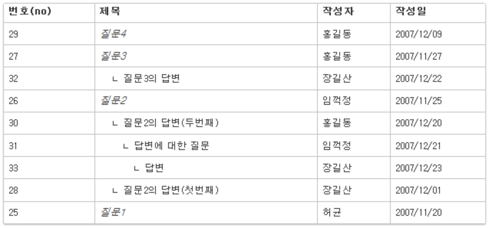

# 4. 두번째 직장 #1

생애 처음으로 **서비스 기업에서 개발**을 시작하게 됐습니다.  


(오예!)  
  

두근두근한 마음을 안고 첫 출근을 했습니다.  
이번 공채로 입사한 개발자 동기는 저 포함해서 3명이였습니다.  
서로 어색한 인사를 나누면서 대기하다가, 각 팀의 팀장님들이 오셔서 각자 데려가셨습니다.  
1~2주의 개발 교육이 있을거라 예상했는데, **개발 교육 없이 바로 팀에 합류**하게 됐습니다.

> 회사의 규모에 따라 서비스 기업이라도 신입 사원 개발 교육이 있을수도/없을수도 있다는 것을 알게 됐습니다.

제 자리에는 모니터 3대와 데스크탑 2대가 **포장이 된채로** 있었습니다.  
예상과 달리, **PC설치부터 OS설치까지 모두 직접** 해야한다는 것입니다.  
'음..?' 라는 생각이 잠깐 스쳤지만, 마음을 가다듬고 포장을 뜯기 시작했습니다.
데스크탑 2대중 1대는 윈도우를, 1대는 우분투를 설치하고 각각의 드라이버를 다 잡은뒤 개발 환경을 세팅했습니다.  
개발 환경도 특별히 가이드가 있진 않았습니다.  
다만 Java & Spring에서 개발한다고 하셔서 이전 회사에서 했던것처럼 Java, STS, Maven을 설치했습니다.  
일은 언제부터 시작하는거지? 라는 생각과 함께 첫 날이 마무리됩니다.  

## 4-1. 파일럿 프로젝트

출근 이틀째에 팀장님과 과제에 대해 이야기를 했습니다.  

> 팀장님: 회사에서 책만 보니 심심하지 않나요?
저: 네
팀장님: 책보는것 보다, 개발하시는게 더 편하시죠?
저: 네 ㅎㅎ 개발하는게 훨씬 좋죠 ㅎㅎ

라는 대화가 끝나고 바로 과제를 받게 되었습니다.  
**스프링 부트**를 이용해서 게시판을 2주 안에 만드는 것이였습니다.  
수요일에 시작해서, 차차주 수요일에 과제 발표를 하기로 결정하고 본격적인 과제 스펙을 전달 받았습니다.  



구현 기능

* 계층형 댓글 게시판
  * 99 Depth까지 가능하도록
  * 댓글이 많아도 속도 저하를 최소화 할 수 있는 방법
* 기본적인 스크립트 공격 방어
* 이미지 등록
* 로그인/회원가입 등 기본적인 회원 기능

필수 기술

* Java 8
* SpringBoot
* Git & Gitlab
* Gradle
* MySQL
* Javascript

선택 기술

* Hibernate
* Grunt/Gulp 등 JS 빌드툴
* Spring의 다양한 어노테이션 / 모듈
* Freemarker 등 템플릿 엔진

(자세히 다 기억이 안나서 확실히 기억나는 부분만 작성했습니다.)  
  
여기서 **필수 기술은 무조건 사용**해야하는 기술이며, 선택은 사용하면 좋고 아니면 어쩔수없는 기술이란 설명을 들었습니다.  
그리고 발표때는 **기능과 코드**를 다 같이 리뷰하는 시간이란 이야기도 함께 들었습니다.  

> 여러분도 한번 해보세요.  
진짜 도움 많이 됩니다.  
오라클에선 계층형 쿼리(```start with 조건 connect by```)를 이용하면 되지만, MySQL은  지원이 안되서 직접 구현해야하는데 이걸 고민하는게 생각보다 도움이 많이 됩니다.  
(참고: [managing-hierarchical-data-in-mysql](http://mikehillyer.com/articles/managing-hierarchical-data-in-mysql/))

처음 스펙을 들었을때 헉? 이란 생각이 먼저 들었습니다.  
게시판이 다 거기서 거기지 라는 생각으로 쉽게 생각했는데, 막상 과제 스펙을 보고 조금만 더 공부하고 할걸 이란 생각을 엄청 많이 했습니다 ㅠㅠ  
Git, SpringBoot, Gradle 모두가 처음인 상황이라 

재수가 없게도 진행하면서 사고가 한번 났었습니다.

> 팀장님: 어??? 하이버네이트 안쓰세요?
저: 네? MyBatis 썼는데요...?
팀장님: 헉.. 여태 신입분들이 다 하이버네이트 쓰셔서 말씀 안드렸는데, 저희 회사 프로젝트 중에 **Mybatis 쓰는 프로젝트 없어요**;;; 하이버네이트로 진행하셔야 해요 ㅠㅠ
저: ......(그런말 없으셨잖아요...)

이 대화가 끝나고 미치겠다란 생각을 하면서 부랴부랴 **Mybatis로 구현된 부분을 다 걷어내고, 하이버네이트로 전환**을 시작했습니다.  
안그래도 허덕대고 있었는데, 이것까지 겹치니 발등에 불이 떨어졌습니다.  

제 동기들은 Spring은 커녕 **Eclise를 처음 쓰는데도 2주만에 만들어낸걸** 보고 깜짝놀랬습니다.  
(국비교육도 안받고, 학교에서 C/C++/PHP만 하다가 바로 입사했던 동기들입니다.)  
  
저는 국비교육을 받았고, 약 1년간 SI회사에서 Java & Spring을 했었지만 SpringBoot, Hibernate, Gradle 등에 막혀서 고생했었습니다.  
헌데 이 친구들은 정말 모든게 다 처음인 상황에서 어떻게 2주만에 만든건지, 코드의 퀄리티를 떠나서 정말 놀랬습니다.  
제가 저 상황이였으면 도저히 그 시간안에 못했을거란 생각에 동기들을 다시 보게 됐습니다.  

## 4-2. 첫 업무 시작

갓 입사했기 때문에 당장 사용자 서비스 개발에는 투입되지 않고, 관리자 페이지를 담당하게 됐습니다.  
개발팀의 규칙은 모든 develop merge는 MR(Merge Request)을 통한 코드리뷰로만 진행되었습니다.  

> Github에선 PR이라고 하는데, Gitlab에선 MR (Merge Request) 라고 합니다.

당시에 저희는 모든 서비스가 IE7까지 지원하는 상태였고,  
각 서비스의 관리자 페이지들은 Angular 1, Bower, Grunt, Underscore로 구현되었고,  
작업의 대부분은 JS위주였으며,


네이버카페인 하드코딩하는사람들, 코드초보스터디에서 다음과 같은 강의형 스터디를 주최했습니다.  

* Javascript

1:1 리뷰든, 단체 리뷰를 하든 "**어? 이거 모르세요?**" 라는 말을 계속 들었습니다.  
파일럿 프로젝트는 

## 4-3. 사수의 팀 이동

조직개편으로 4명이였던 개발팀 인원은 2:2로 나눠지게 되었습니다.  
저는 팀장님과 한팀에서 근무를 계속 하게 되었습니다.  

팀 유일의

정말 좌절했습니다.  
당장 팀이 맡고 있는 서비스는 메인/회원/고객센터/Mail/SMS/이벤트/광고 등등 엄청 많이 있는데 이걸 저 혼자 어떻게 다 하지?
리눅스에서 Log 내용의 Grep조차 제대로 못하는 상황에서 앞으로 장애나면 어떻게 해결해야하나 앞이 깜깜했습니다.  
Nginx도, 리눅스도, 쉘/파이썬등 스크립트도, 비지니스 도메인도 다 제대로 못하는데 어떡하라는거지 등등 별별 생각이 다들었습니다.  
이날부터 저녁에 잠이 잘 안왔습니다.  
매일 자정에 동네 거리를 돌아다녔습니다.  

> 아니 왜 사수를 미리 안뽑아주는거지?  
이 서비스들을 진짜 나혼자 해야하는거라고???  
퇴사해야하나?  
입사한지 1년도 안됐는데 퇴사하면 어떡하지?

중간중간 지원할만한 회사를 찾아보기도 했습니다.  

결정적으로 첫 회사에서 이미 10개월만에 퇴사했는데, 두번째 회사에서도 7개월만에 퇴사하게 되면 커리어가 너무 망가질것 같다는 생각이 들었습니다.  
못해도 2년은 버티자, 서비스 장애나도 내탓이 아니다, 이렇게 몰아세운 회사탓이다 란 생각으로  

서비스 기업에서의 2번째 시즌이 시작 됩니다.  
다음편에선 팀내 최고참 개발자가 된 이야기를 전해드리겠습니다.  
긴 글 끝까지 읽어주셔서 감사합니다^^  
  
아래는 서비스 기업에서 개발하면서 도움되었던 팁들입니다.

## 서비스 기업 입사후 팁


### 도움이 되는 책들

자체 서비스를 운영하는 회사에선 어플리케이션 코드 작성만으로는 문제해결을 할수가 없습니다.  
웹 서비스의 전반적인 지식이 필요합니다.  
SI에서 **Java/Spring 코드만 작성했었던** 제 입장에서 가장 부족했던 지식이였습니다.  
이런 내용들은 오프라인 스터디에서도 다루는 주제가 아니기 때문에 좋은 사수를 만나지 않는 이상은 얻기 쉽지 않습니다.  
그래서 이 지식들을 채워줄 좋은 책들을 소개 드립니다.

* [웹 사이트 최적화 기법](http://book.naver.com/bookdb/book_detail.nhn?bid=4587095)
* [대규모 서비스를 지탱하는 기술](http://book.naver.com/bookdb/book_detail.nhn?bid=6468636)
* [서버/인프라를 지탱하는 기술](http://book.naver.com/bookdb/book_detail.nhn?bid=6010115)

서비스 기업을 노리시거나, 운영해야하는 입장이시라면 위 3권은 꼭 읽어보시길 추천드립니다.  
다른것보다 최소한 시니어 개발자분들의 대화가 어떤 의미인지 이해라도 할 수 있어야하는데, 이 책들은 그런 면에서 큰 도움을 줍니다.
