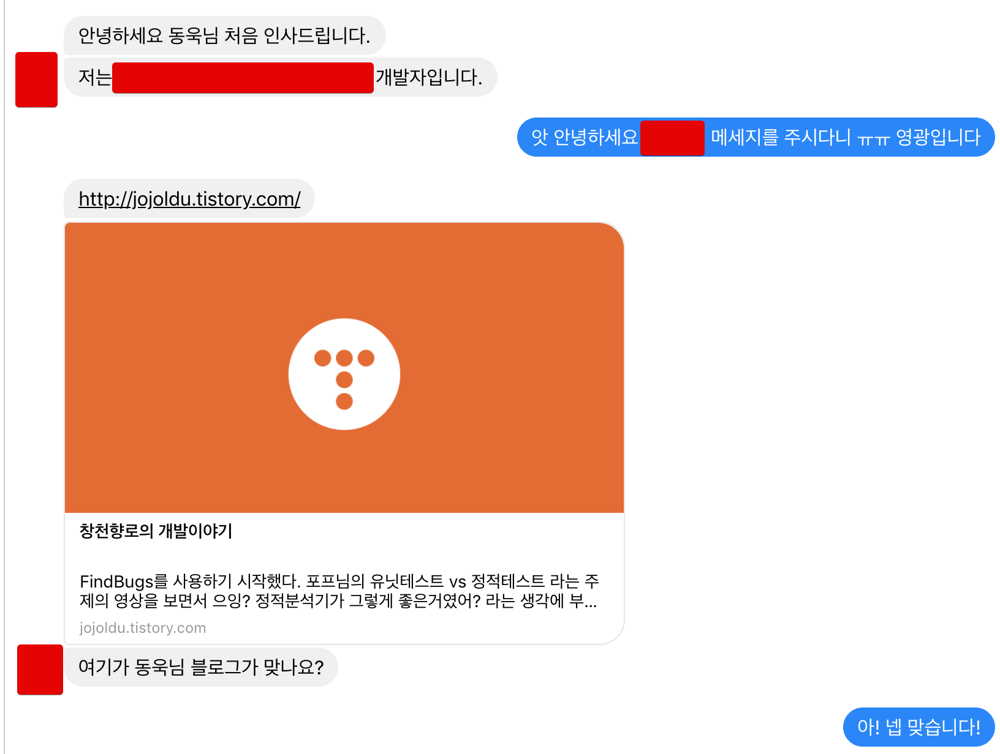
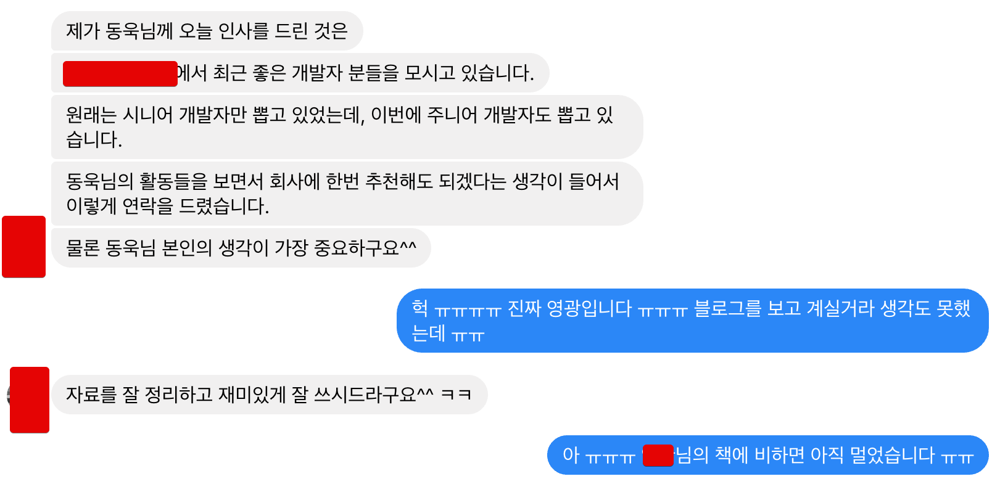

# 6. 세 번째 직장

5명의 개발자로 이루어진 팀이 되었습니다!  

다행히 사수로 오신 2명의 차석/선임 개발자분들은 팀내에서 가장 오래(?) 근무했던 저를 존중해주셔서 회사 생활 하는데 크게 어려움은 없었습니다.  
  
## 테스트 코드와의 만남

당시에 운영 중인 프로젝트를 보면 정말 배울게 많았습니다.  

* 대규모 트래픽 처리
* API서버, DB등 다른 모든 서버가 다 죽어도 운영되는 캐시 처리
* 페이지 로딩 속도 최적화 및 분석
* 회원의 인증/보안 처리
* 광고 플랫폼을 위한 정적 파일 처리

등등 **웹 서비스 전반의 내용**들을 심도 있게 다뤄볼 수 있었습니다.  
비중이 백엔드 보다는 프론트엔드 (JS, 브라우저 등)에 좀 더 초점이 맞춰져있긴 했지만, 그래도 좋았습니다.  
**어떤 문제를 해결하기 위해선 꼭 한가지 방법만 있는게 아니라는걸** 배울 수 있었습니다.  
  
다만 아쉬운게 있다면, **테스트 코드가 전혀 없었습니다**.  
입사 초기에는 잘 몰랐습니다.  
첫 회사, 두번째 회사 모두 테스트 코드에 대한 이야기가 전혀 없었기 때문입니다.  
  
여러 커뮤니티에 참여하면서 **테스트 코드, TDD**에 대한 이야기를 조금씩 듣게 되었습니다.  
온라인/오프라인 커뮤니티에서 계속 "테스트 코드를 작성해야 한다", "TDD를 시작해야 한다" 는 이야기 들리자 환상이 생겼습니다.  
  
인터넷과 책에서 나온 내용을 보고 좋은건 알겠는데, 이걸 도대체 어떻게 시작해야할지 감이 전혀 잡히지 않았습니다.  
책에서 나오는 예제들은 전부 간단한 프로그램을 예제로 두는데, **실제 웹 어플리케이션에선 어떻게 작성해야 하는지** 누가 속시원하게 알려줬으면 좋겠다는 생각이 들었습니다.  

간단한 유틸성 메소드에만 테스트 코드를 작성하기 시작했지만 갈증은 계속 남아 있었습니다.  
**TDD와 단위 테스트 코드 작성의 차이**도 모르던 때라 지금 하고 있는게 잘 하고 있는지 조차 몰랐습니다.  
그러던 중, 페이스북에서 하나의 광고를 보게 됩니다.

자바지기 박재성님께서 **TDD, 테스트 코드, DI 프레임워크 만들기, HTTP 웹서버 만들기** 등 제가 그동안 궁금했던 모든 내용을 알려주는 강의를 시작하신 것입니다!  
  
> [강좌 후기](http://jojoldu.tistory.com/301)를 기록했습니다.  
궁금하신 분들은 참고 해보세요!

당시 강의료는 160만원 이였던걸로 기억합니다.  
**회사에서 교육비 지원이 없어 사비**로 내야 했지만, 시간을 산다라는 개념으로 봤을때 전혀 아까운 돈이 아니여서 돈으로 고민이 되진 않았습니다.   
하지만, **매주 화/목 저녁에 강의**를 들으러 갈 수 있을지가 고민이였습니다.  
  
야근이 잦아 시간을 낼 수 있을까 싶었습니다.  
하지만, 2기때 혹은 그 다음 기수때는 야근이 적을까? 라고 물어보면 또 그건 아니였습니다.  
**평일 강의를 듣기 좋은 날은 없다는걸** 깨닫고 바로 결제 했습니다.  

강의 신청을 하고, 팀 분들께 수강을 시작했다고 공유했습니다.  
유난떤다고 생각하실수도 있지만, **매주 화/목은 강의로 야근이나 회식을 못한다**는 것을 사전에 공유해야한다고 생각했기 때문입니다.  
  
강의 내용은 정말 마음에 들었습니다.  
그 동안 잘못 알고 있었던, 몰랐던 내용들을 전반적으로 다 배울 수 있었습니다.  
이 강의를 기준으로 운영하는 프로젝트에 하나씩 테스트 코드를 추가하기 시작했습니다.  
그리고 팀 분들께도 프로젝트에 적용한 테스트 코드를 하나씩 소개드리면서 점진적으로 테스트 코드 작성을 팀에 전파하게 되었습니다.

> 1기가 끝나고 2기가 시작할때 후임분들께 강력 추천하여 2분이 2기를 수강하셨고, 2분다 이 강의로 한단계 레벨업 하실 수 있게 되었습니다.  

## 탈진

강의를 듣는 기간과 브라질 리우 올림픽 준비 기간이 겹쳤습니다.  
어떻게든 강의를 빠질수는 없다고 결심했기 때문에 **월/수/금 야근과 주말 출근**을 하며 일을 처리 했습니다.  
그렇게 리우 올림픽 준비와 강의 수강을 같이 하던 하던 중, **아무것도 하기 싫은 때**가 왔습니다.  
  
탈진이라고 할까요?  
더이상 일도 하고 싶지 않고, 강의도 들으러 가고 싶지 않았습니다.  
그 날은 퇴근 하고 바로 집으로 갔습니다.  
교통이 막히지 않는 지하철을 항상 타고 갔었는데 그날만큼은 버스를 타고 싶었습니다.  

이유는 잘 모르겠습니다.  
그냥 버스 창문 밖을 보면서 가고 싶었습니다.  
버스에 앉아서 창가에 머리를 기대고 가는데 **이 생활을 언제까지 해야하나** 란 생각이 들었습니다.  

회사의 일이 많아서 지친건 아니였습니다.  
**성장 없이 소모만** 되는 일을 언제까지 해야하는 건가에 대한 회의감 때문이였습니다.  
  
저는 회사의 일에 2가지 타입이 있다고 생각합니다.  
하나는 제 자신을 채우는 일이고, 하나는 소모만 하는 일입니다.  
소모되는 것인지, 채우는 일인지 기준은 제가 성장하는 느낌을 받았냐 아니냐로 구분합니다.  
  
서비스 특성때문인지, 회사 특성 때문인지 모르겠지만, **드라마틱하게 트래픽이 증가할 일이 없었습니다**.  
올림픽, 월드컵, 선거 등 국내의 큰 이벤트가 있더라도 증가할 트래픽은 허용 범위 내에서만 발생하고, 조회성 요청이 대부분이라 캐시로 다 처리되고 있었습니다.  
  
그러다보니 성능 테스트나 아키텍처를 변경할 일이 없었고, **기술적 도전 보다는 UI를 변경하는 것이 대부분**이였습니다.  

누군가는 저런 큰 이벤트를 치뤘으니 "이력서에 쓸게 많겠다", "실력 많이 늘었겠다" 라고 생각할 수 있지만 실상은 전혀 그렇지 않았습니다.  
**단발성 이벤트를 위해서 백엔드 구조가 변경될 일은 없기 때문**입니다.  

잦은 국내 이벤트로 인해 이벤트 페이지 만들 일만 엄청 많은 반면, 서버쪽 코드를 작성할 일이 전혀 없었습니다.  
하는 일이라곤 **마크업 개발자분이 건네주신 화면에 뷰 템플릿엔진과 JS를 조합하는 일** 뿐이였습니다.  
물론 외부 언론사/방송사 API, 검색팀의 API 에 맞춰 서버 코드도 짜긴 했습니다.  
하지만 JSON 스펙이나 캐시 스펙만 변경되는 것이지 거의 대부분이 비슷한 일들이였습니다.  
  
느낌이 쎄했습니다.  
첫 직장에서 **100억 프로젝트에 참가했을때와 비슷한 느낌**이였습니다.  
규모는 크지만, 실력 향상에 크게 도움이 안되는 일을 하는것 같은 느낌이라고 할까요?  
그 느낌이 계속 제 머릿속을 지배했습니다.  
  
더 큰일은 더이상 **제 코드를 리뷰해줄 분이 없다**는 것이였습니다.  
팀에서 맡고 있는 서비스가 많다보니, 개인별로 담당하는 프로젝트가 2 ~ 3개였습니다.  
그러다보니 도메인, 프레임워크 등이 모두 달라 각자의 코드를 봐줄 수 있는 상황이 아니였습니다.  
  
열심히 달려왔더니 혼자 외딴 섬에 있는 듯한 느낌이였습니다.  
  
다시 밤 산책을 하는 날이 많아졌습니다.

## 두번째 이직 준비

어떻게든 리우 올림픽을 마무리 짓고 연차로 집에서 쉬던 중, 페이스북으로 하나의 메세지를 받게 됩니다.

메세지를 보내주신 분의 이름을 보고 깜짝 놀랬습니다.  
그동안 책이나 Naver Deview, Spring Camp 와 같은 세미나 발표를 통해 멀리서나마 뵙던 연예인 개발자분이 연락을 주시다니!  
특히 같이 일하던 후임분들께 꼭 읽어봐야한다고 책을 추천하고 있었던터라 더더욱 놀랬습니다.  
  
신기한 마음으로 대화를 계속 이어나갔습니다.

메세지 그대로 정말 영광이였습니다.  
제 공부와 만족을 위해서 시작한 블로그가 이렇게 큰 
나비효과가 정말 어마어마하다는걸 다시 한번 깨달았습니다.  

코딩 시험에 대해서는 크게 부담이 없었습니다.  
Codility로 치뤄지는데, **Codility는 6개월 마다 시험을 치면서 익숙한 상태**였기 때문입니다.  
  
Java 코드 작성하는 문제 3개와 SQL 쿼리 작성하는 문제가 1개가 나온다는걸 인터넷에서 발견하여 SQL을 공부하게 되었습니다.  
ORM과 Ehcache로 모든 요청을 처리하다보니 DB 쿼리 작성할 일이 한 달에 1번 될까 말까했기 때문입니다.  
[하루 30분 36강으로 배우는 SQL 첫걸음](http://jojoldu.tistory.com/50)을 읽으면서 준비 했습니다.  
  
코딩 테스트 합격 연락을 받고, 1차 면접 일정이 잡혔습니다.  
괜히 면접 다니는 티를 내고 싶진 않아서 연차 내고 면접 보고 싶진 않았습니다.  
어떻게 할까 하다가, 마침! Naver Deview 2016 일정이 면접일인 것을 발견했습니다.  
  
팀원들과 같이 세미나 참석을 할 예정이라 각자 원하는 세션들만 듣기로 했습니다.  

## 두번째 퇴사

[프로그래머의 길, 멘토에게 묻다](http://book.naver.com/bookdb/book_detail.nhn?bid=6332442)를 보면 **가장 뒤떨어진 이가 되라** 라는 이야기가 나옵니다.  
**제 코드를 봐줄 사람이 없는**였.  

당시 회사에서는 좋은 평가를 받고 있었습니다.  
본부 추천의 특진이나 상여금 등을 받기도 했습니다.  
  
이직에 대한 걱정이 없었던 것은 아니었습니다.  

* 텃세가 있을 수도 있습니다.
* 회사가 자율적이지 않을 수도 있습니다.  
* 팀장님이 군대식 문화를 가지신 분일수도 있습니다.  
* 회식/행사가 많을 수도 있습니다.  
* 일이 많아 매일 야근할 수도 있습니다.

제일 두려웠던건 

  
**전혀 모르는 새로운 회사, 새로운 팀으로 이직 한다는건 그런 것**입니다.  
그래서 더더욱 고민 되었습니다.

> 저: 팀장님 저.. 커피한잔 하실까요?  
팀장님: 아? 네네  
저: 아.. 별건 아닌데요..... 저 퇴사하려구요.
팀장님: 네? 별거 아닌게 아닌데요????

> 전 사수: 얘기 들었어요! 축하해요.  
 

마지막 퇴사일에 한명씩 돌아가면서 인사를 나누다가 잠깐 첫 번째 후임의 모니터를 보게 됐습니다.  
그 친구는 **메신저로 나눈 저와의 대화를 모두 텍스트 파일로 다운** 받고 있었습니다.  
퇴사를 하게 되면 사내 메신저에서 대화 기록이 삭제가 되니 이걸 다 저장하던 것이였습니다.  
  
이때, 저 친구는 뭘 해도 되겠구나 싶었습니다.  
  
저와 그 친구의 메신저 대화 속에서 크게 도움 될만한 내용은 없었다고 생각합니다.  
그 친구의 실력이 제 도움이 필요하지도 않았었구요.  
(문제해결능력을 보면 저보다 훨씬 더 뛰어났었습니다.)  
  
그럼에도 저렇게 겸손한 자세였던 것이 저한테는 꽤나 충격이였습니다.  
뭔가 이상적인 사내 후임이 있다면 저런 모습인가 싶었습니다.  

