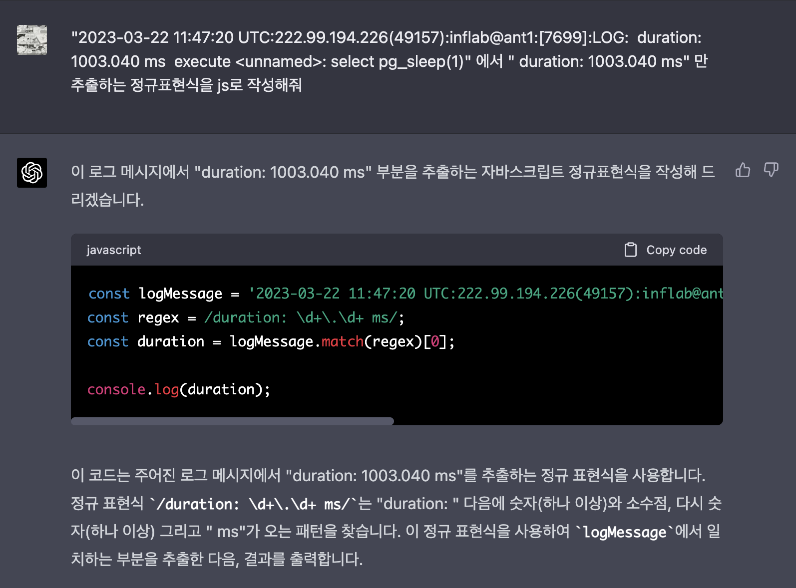
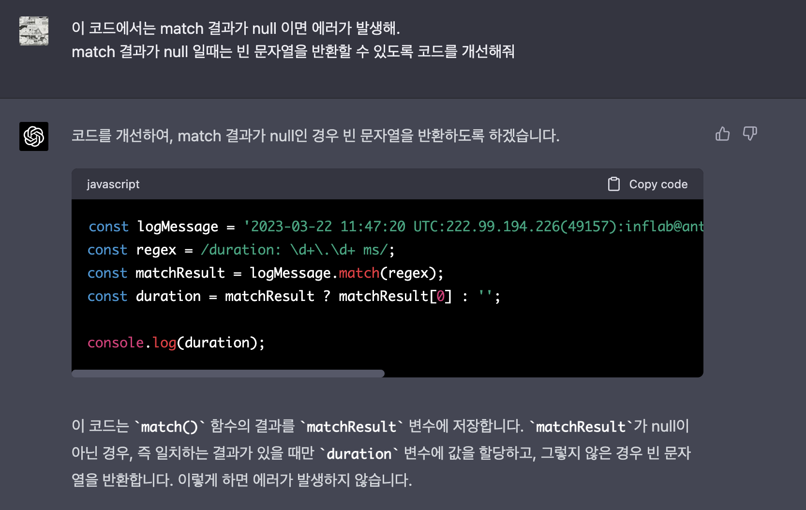
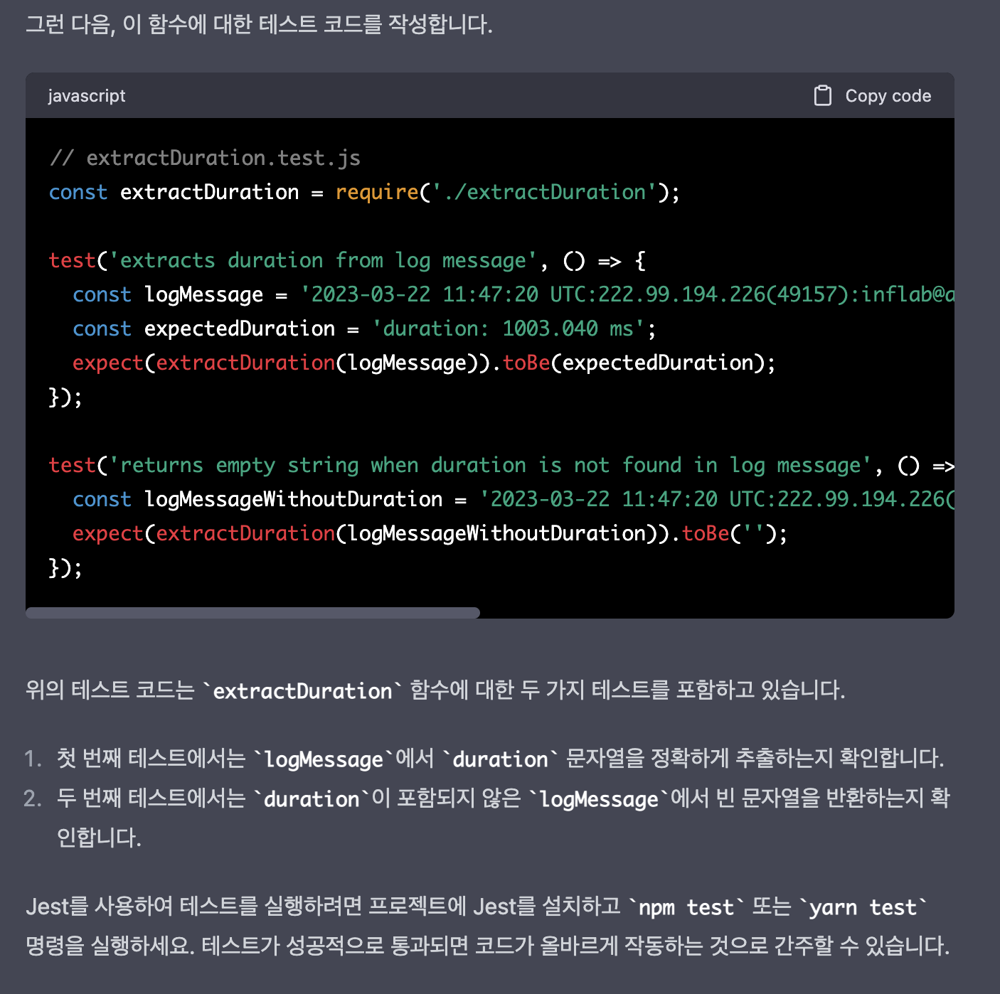

# ChatGPT와 함께 춤을

최근 여러 개발 리더분들을 뵐 기회가 있어서 이런 저런 이야기를 나눈다.  
그러다보면 공통적으로 하는 이야기가 **ChatGPT 로 인한 개발자의 자리**에 대한 것이다.  
  
어떤 분들은 그간 시니어들이 설계를 하고 구현은 주니어들이 하던 방식에서 ChatGPT를 활용해서 별도의 구현 코드 작성에 필요한 주니어들의 자리가 대체될 것 같다고 한다.  

또 다른 의견으로는 이제 주니어들이 굳이 시니어에게 코드 리뷰나 더 좋은 코드에 대한 의견을 물어보기 보다는 ChatGPT에게 물어보면 될 것이고, 서버리스 환경까지 적극적으로 도입되다보면 시니어들의 자리가 굳이 필요할것인가 하는 것도 있었다.  
대부분의 대중화된 프레임워크로 튜닝은 ChatGPT에게 물어보면 되고, 인프라나 미들웨어 등은 클라우드의 매니지드 서비스를 사용하면 된다는 것이다.     
대형 서비스 기업들 정도가 아니면 대부분의 서비스에서는 이정도의 설정으로 충분히 트래픽 대응이 가능하지 않겠냐라는 보충설명과 함께 말이다.  

  
주니어 자리가 줄어들 것이냐, 시니어의 자리가 줄어들것이냐 등은 의견이 분분하지만, 일관된 결론은 **개발팀의 규모는 이전보다는 확실히 줄어든다**라는 것이다.  

극단적으로는 ChatGPT 유료 결제를 개발팀 전체에게 제공해서 **개발팀의 생산성이 2배로 올랐다**는 이야기를 해주기도 했다.  
(물론 그 생산성을 어떻게 측정했는지는 잘 모르겠지만 말이다.)
  
이런 이야기를 듣다가, 실제 나 조차도 업무에서 ChatGPT 에게 의존한 구현을 몇번 하다보면 이게 그 동안 내가 알던 그 프로그래밍이라는 작업이 맞는것인가 하는 생각이 든다.  
  
예를 들어 최근에 나는 Lambda로 Logs Parser를 만들었다.  
Lambda 에서 조금 깔끔하게 작성하기 위해 정규표현식을 작성했는데, ChatGPT에게 한번 물어봤다.  



만들어준 코드에 대한 예외처리도 추가적으로 질문해봤다.



이 코드에 대한 테스트 코드도 작성을 요청했다.  
  
테스트할 함수를 만드는 것 부터 시작해서


정상 케이스와 예외 케이스에 대한 테스트 코드까지 작성해줬다.



전혀 문제가 없는 코드라서 그냥 이대로 코드를 적용했다.  
  
이 외에도 JS/TS에서 필요한 코드를 작성할때나 각종 IaC 도구들의 설정값이 필요할때마다 ChatGPT에게 질문하고 작성해준 코드를 활용했다.  
물론 최신 버전의 라이브러리에 대한 적용은 안되어있어서 최신화 하는 것은 내 몫이지만, **그간 검색하기 귀찮아서 자연스레 체득하고 있던 많은 설정들이나 활용법이 필요가 없어진 순간**이였다.  
  
이렇게 프로그래밍하는 것이 나에겐 좋은 것일까 하는 고민을 한 적이 있다.  
  
운이 좋게도 **이런 고민은 이번이 처음이 아니였다**.  

2010년이였나?  
처음 프로그래밍 수업에서 Edit Plus로 자바 코드를 작성하는 방법을 배웠다.    
그러면서 **하나하나 직접 모든 코드를 작성하는 것**이 프로그래밍 방법이고 훈련인 줄 알았다.  
(이클립스, 넷빈즈, 인텔리제이 등의 IDE가 존재하고 있음에도 말이다.)
  
이후에 국비학원에서 이클립스를 처음 배울때도 **의도적으로 IDE의 자동완성을 사용하지 않았다**.  
**IDE가 자동완성해서 코드를 작성해주면 개발자로 성장하지 못한다**는 생각을 했기 때문이다.  
도구가 다 작성하면 나는 성장하지 못한다와 같은 생각은 꽤나 오래갔는데, 이 생각이 깨진 것이 무려 2015년에 다른 회사로 이직을 하고 나서였다.  
  
내가 고민해야하는 것은 비즈니스 로직을 적절하게 추상화 하는 것, 아키텍처 설계, 데이터 설계 등이였는데 엄한 곳에서 **성장이라는 가짜 탈**에 속아서 시간을 소모하고 있었던 것이다.  
정작 중요한 곳에서 시간을 쓰지 않고 말이다.  

선언형 프로그래밍이라는 프로그래밍 방식이 있다.  
결과를 얻기 위한 과정을 기술하는 것보다 **결과를 기술하는 것에 중점**을 둔 방식이다.  

> 우리가 주로 사용하는 HTML, SQL등이 이에 속한다.  

예를 들어, "배열에서 짝수를 찾아 새로운 배열로 만들어야한다" 라는 결과가 필요하다고 해보자.  
이때 기존의 프로그래밍 방식에서는 다음과 같이 코드를 작성한다.

```js
const numbers = [1, 2, 3, 4, 5, 6, 7, 8, 9];
let evenNumbers = [];

for (let i = 0; i < numbers.length; i++) { // 1) 기존 배열을 하나씩 순회하면서
  if (numbers[i] % 2 === 0) { // 2) 짝수이면
    evenNumbers.push(numbers[i]); // 3) 새 배열에 담아줘
  }
}

console.log(evenNumbers);
```

반대로 선언형 프로그래밍 방식에서는 다음과 같이 작성한다.

```js
const numbers = [1, 2, 3, 4, 5, 6, 7, 8, 9];
const evenNumbers = numbers.filter(number => number % 2 === 0); 
// 기존 배열에서 짝수만 필터링 해서 반환해줘

console.log(evenNumbers);
```

위 코드에서 `filter` 가 어떻게 내부적으로 작동하는지 등을 우리가 신경쓰진 않는다.  
우리에게 필요한건 결과이지, **결과까지 가기 위해 어떻게 작동해야하는지까지 신경쓰진 않는다**.
  
아마도 ChatGPT에게 내리는 질문이 곧 프로그래밍이 되는 선언형 프로그래밍의 극단적인 형태가 곧 오지 않을까?    
  
코틀린, 타입스크립트 등을 사용하면서 이들이 자바나 자바스크립트로 어떻게 변환될 것인지를 항상 고려하진 않는다.  
어떻게 하면 좀 더 목적과 결과에 집중할 수 있는 환경으로 발전할 것인가가 프로그래밍의 고민이지 않을까?

우리에겐 좀 더 발전된 선언형 프로그래밍 언어가 생긴 것 같다.
  
세상이 어떻게 바뀔지는 나는 예측할 수 없다.  
애플이 아이폰을 처음 출시했을때 받은 충격처럼 
요즘 미친듯한 횡보를 보여주는 MS가 이번엔 또 어떤 매직을 보여줄까라는 생각을 한다.  

나도, 우리팀도 아이폰이 나왔을때 잘못된 선택을 했던 노키아처럼 한순간에 망하면 어떡하지 하는 걱정보다는 이 좋은 도구를 가지고 **얼마나 더 멋진 일을, 얼마나 더 생산성있게 해낼 것인가 하는 두근거리는 마음**을 가지는 것만이 내가 할 수 있는 일인것 같다.


