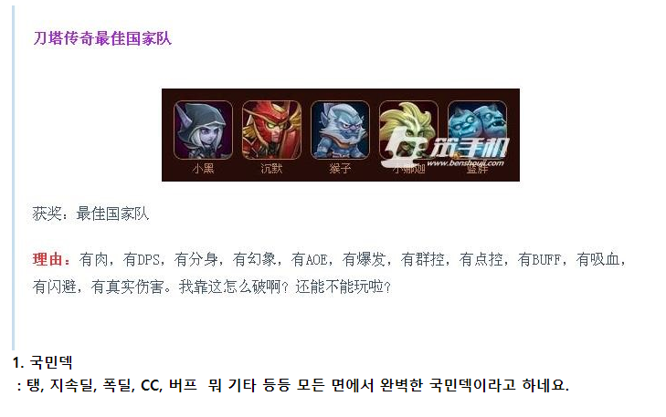

# 직장인으로서의 시작

예전에 정말 재밌게 했던 게임중에 도탑전기 라는 게임이 있다.  
(도타 저작권 문제와 별개로)

> 지금은 한국에서 더이상 서비스를 하지 않는 게임이다.  
> 요즘 나오는 [조각 모으기 모바일 게임의 시초](https://game.donga.com/89876/) 인 게임이다.

여러 신화에 나올 법한 영웅들을 5명 조합하여 전투를 하는 게임이다.  
100명이 넘는 영웅들로 나만의 5명을 조합한다는 재미가 솔솔했다.  
  
그 게임에는 "국민덱" 이라고 하는게 있었다.  
(덱이란 영웅들의 조합을 지칭한다.)

([출처 - 도탑전기 공식 카페](https://cafe.naver.com/dotopstory/39101))

유료 아이템을 산 사람이 아니라, **무료로 게임을 즐기는 사람도 쉽게 따라할 수 있는** 보편적인 조합이다.  
즉, 웬만하면 따라만 하면 실패하지 않는 **고효율의 조합**이라는 것이다.  
  
국민덱은 너무 많은 사람들이 하고 있고, 나만의 영웅 조합이 아니다보니 아무래도 본인이 하고 싶은 영웅들로 채운 덱보다 재미가 떨어지는 편이다.  
  
"아 나는 이 영웅이 좋은데, 쓰질 못하네"  
"맨날 남들이 하던걸 해야하네"  
"재미없어"  
"이러면 무슨 재미로 게임을 해?"  
  
이와 같은 생각으로 나만의 영웅들로 나만의 조합을 만드는데, 이러면 거의 99%는 망한다.  
검증되지 못한 조합은 영웅들간의 시너지가 안난다던가, 특정 컨텐츠에서 사용할 수 없다던가, 일정레벨부터 효율이 떨어진다던가 등의 이유로 게임의 난이도를 말도 안되게 높게 만들기 때문이다.  
  
국민덱이 국민덱인데는 이유가 있다.  
"운이라는 요소 없이" 게임의 전반적인 요소를 대부분 즐길 수 있기때문이다.  
수많은 사람들이 이것저것 실험해서 나온 가장 최적화된 조합인 것이다.  
  

인생을 게임이라고 하면 경제적 자립을 할 수 있는 직업, 즉 **직장인이 국민덱**이 아닐까 싶다.  
그러니깐 내가 하고 싶다고, 좋아한다고 무작정 경제적 자립의 난이도가 높은 직업을 얻는게 정답은 아닐수도 있다는 것이다.  

> 특정 시기에만 할 수 있는 직업인 체육계는 어쩔수없지만..  
> 유튜브에 [그 많던 야구선수들은 다 어디갔을까-ebs](https://www.youtube.com/watch?v=aQ0nalBGRsY) 를 보고 생각이 많아지긴 했다.  

그 게임에서 국민덱은 **게임에 익숙하기전까지 시간을 벌어주는 역할**을 한다.  
  
마찬가지로 인생을 큰 게임이라고 본다면 이게 도대체 어떻게 돌아가는지 파악하는데 나름의 시간이 필요한데, 그때까지 시간을 벌어다주는게 직장인 이라는 직업이라는 것이다.  
  
평범한 직장인이라는 것은 국민덱으로 게임의 여러 요소를 고효율로 파악하는 중이라고 봤으면 좋겠다.  
꼭 "나만의 직업을 가져야만 한다" 가 필수는 아니라는 것이다.  
  
게임의 중반부터는 계속 국민덱으로 갈 것이냐, 나만의 덱으로 갈 것이냐 선택이 필요한 시점이 온다.

* 게임에 투자할 시간이 많지 않은 상황에서 게임의 모든 컨텐츠를 불편함 없이 즐긴다면 계속 국민덱을 유지하는 것이고
* 게임에 대부분의 시간을 투자할 수 있다면 나만의 덱을 연구하면서 남들은 겪지 않는 난이도로 남은 컨텐츠를 뚫고 간다

다만 이때는 이미 **게임에 대해 이해도가 높아진 상태**라서 후자를 선택해도 위험도가 낮다.

> 여기서 제 3의 선택지도 있다.  
> **국민덱이 본인의 취향에 맞는 것**이다.  
> 이럴 경우엔 아주 운이 좋은 케이스라서 국민덱을 계속 발전시키며 전진한다.  

재밌는 것은, 초반에 구상한 덱이 문제가 많아 초반부터 컨텐츠가 막힌 유저도 중간에 국민덱으로 전환해서 필요한 컨텐츠를 클리어하기도 한다.  
(**이후에 다시 본인이 구상한 덱으로 전환**한다.)  
  
나만의 무언가가 되기 위해서 세상이 어떻게 돌아가는지도 모른채 직업을 정해놓고 대학을 졸업하는 것은 굉장히 난이도가 높은 일이다.  
  
이유는 삶의 여러 요소를 경험하고 즐기기 위해서는 **경제적 자립**이 필수조건이기 때문이다.  
경제적으로 자립/독립하지 않고서는 삶에 어떤 요소들이 있는지 경험하고 싶어도 할 수가 없다.  
  
그래서 평범한 직장인이 된다는 건 **삶의 여러 요소를 고효율로 즐길 수 있는** 직업을 선택한다는 것이다.  
(물론 중반부에 한번 선택해야할 때가 온다.)  
  
물론 99%가 실패함에도 1%의 누군가는 게임 시작부터 본인만의 덱을 꾸리고, 말도 안되는 게임 난이도를 클리어해간다.  
그럼 우린 그들의 노하우를 잘 받아들이고 그분들을 존경하고 격려하면 된다.  
  
99%에 포함된다면 1%가 되지 못함에 너무 실망하지말고, 국민덱으로 게임을 즐기고 파악하면서 나만의 덱을 하나씩 준비하면 될 것 같다.  
  
최근에 "직장인 보다 직업인이 되어야한다" 라는 말로 20대 대학생들이 직장인이 되면 큰일날 것처럼 이야기하는데 그렇지 않다는 이야기를 꼭 하고 싶었다.  
  
직장이 나와 맞지 않고, 다른 일이 나와 맞다는 것을 알게 되었다는 것은 **직장인으로 생활을 했고, 월급으로 그 일을 경험해봤기 때문이다**.  
  

> 물론 그렇다고 맹목적으로 아무 생각 없이 직장인이 되는 것과 어떤 목적을 갖고 직장인이 되는 것은 완전히 다르긴하다.

