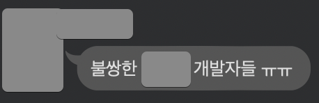
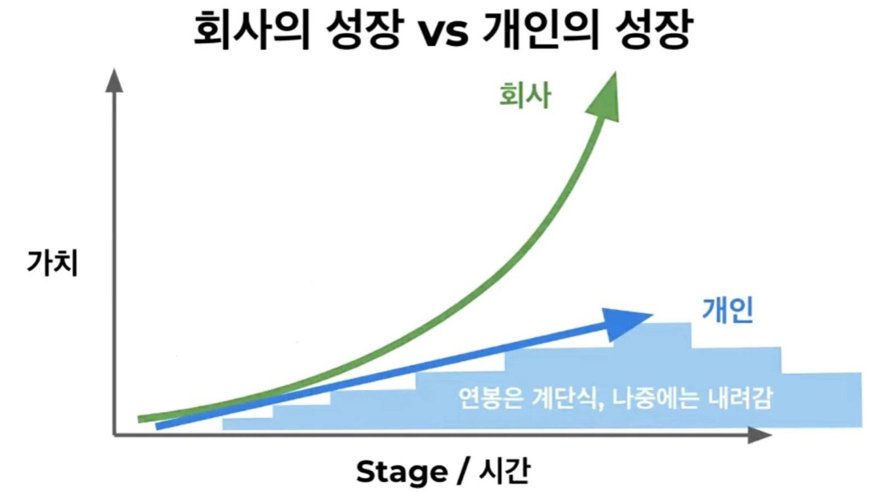
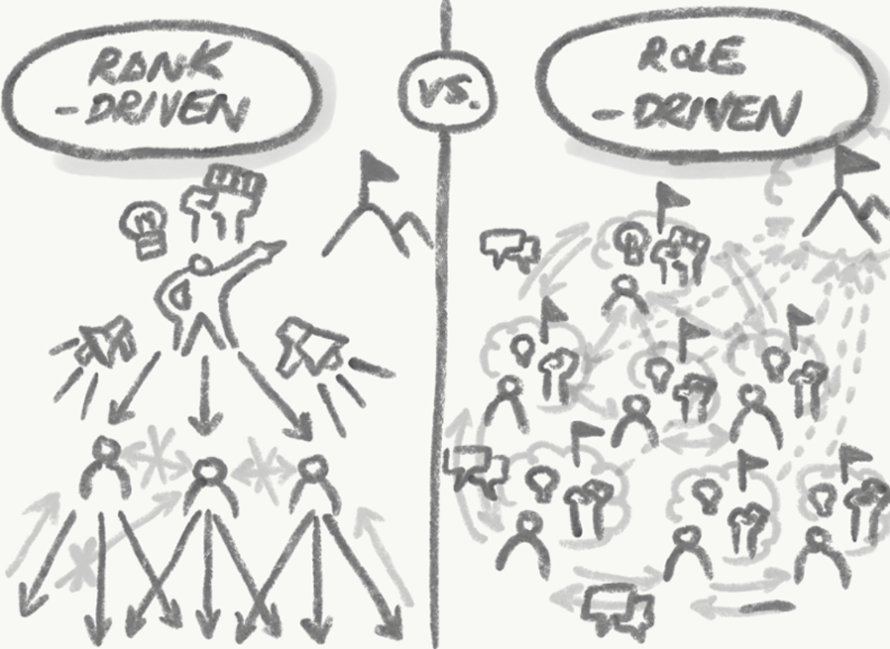
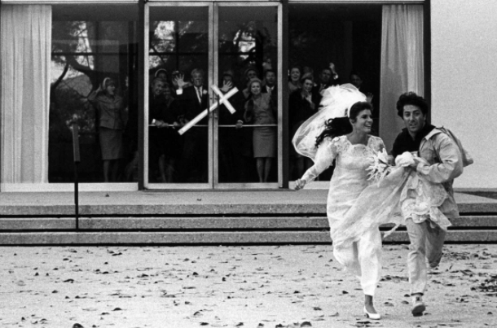

# 부검 블로그

안녕하세요 (구) [배달의민족 정산시스템팀 개발자](https://woowahan.oopy.io/60a06399-3f95-4fec-a436-000ad6baff40), (현) [유튜브 크리에이터](https://www.youtube.com/channel/UCSEOUzkGNCT_29EU_vnBYjg) 이동욱입니다.  
  
제가 2021년 4월 19일(월) 퇴사를 합니다.  
퇴사에 대한 이야기를 개인적으로 운영하는 유튜브 채널에 부검 발표를  했는데요.  

([배달의민족 개발자 퇴사썰 - 부검 발표 시작합니다.](https://www.youtube.com/watch?v=kE0qicg9Kl0))

이 영상을 보시고 **기술 블로그에 진심이신 분**의 연락을 받고, 이렇게 글로 옮기게 되었습니다.

퇴사 소식을 알리고, 많은 분들이 이제 "남은 팀원들이 얼마나 힘들까" 걱정을 많이 하셨는데요.

하지만,

([레진코믹스 레바툰](https://www.lezhin.com/ko/comic/revatoon/163))

사실 제가 젤 불쌍하니깐 괜찮습니다.  
  
이미 유튜브 영상을 보신분들은 재탕이지만, 사알짝 추가된 내용이 있으니 추가된 내용이 무엇인지 확인차 다시 읽어주시면 좋을 것 같습니다.  
  
물론 영상이 너무 길어서 다 못보신 분들 역시 텍스트로 빠르게 읽어보실겸 봐주시면 좋을것 같습니다 :)

## 0. 부검 메일?발표?블로그?

넷플릭스의 퇴사 문화로 부검 메일이라는게 있습니다.

* [넷플릭스의 퇴사 문화 ‘부검 메일’](https://1boon.kakao.com/ttimes/ttimes_2002250932)

회사를 떠나는 직원이 퇴사 당일 동료들에게 아래의 내용을 담아 보내는 메일인데요.

이 중에서 이 글에서는 아래 4가지에 대해서만 다뤄볼 예정입니다.

1. 왜 떠나는지
2. 회사에서 배운 것
3. 회사에서 아쉬운 점
4. 앞으로의 계획

> 배민의 메세지는 누군가 이 글의 댓글로 남겨주시지 않을까요?

자 그럼 영상 보다 **조금 더 내용이 추가된** 부검 블로그 시작하겠습니다.

## 1. 왜 떠나는지

저는 28살에 처음으로 개발자로 월급을 받기 시작했는데요.  
어느덧 **35살 / 7년** 경력의 개발자가 되었습니다.

많다면 많고, 적다면 적은 그런 커리어인데요.  
슬슬 **역산**해서 앞으로 얼마나 내가 왕성하게 활동 할 수 있을지를 고민했습니다.  
  
운동과 식단 관리를 한다해도 10년? 15년 정도이지 않을까 생각을 하게 되었는데요.  
물론 그 이상의 나이대에도 열심히 활동하시는 선배 개발자분들이 계시기 때문에 저 역시도 잘 관리하면 그 분들처럼 할 수 있지 않을까 예측도 해봤습니다.  
  
그렇지만 **저는 제가 특별하다고 생각 안해서요**.  
그 선배님들이 대단하신 분일 수 있기 때문에 보수적으로 생각했을때 지금 처럼 열정적으로 몰입할 수 있는 (체력이 받쳐주는) 시기는 대략 10~15년으로 잡게 되었습니다.  
  
그렇다면 남은 총알 (창업/이직/직무변경/도전 등등) 은 3발에서 5발정도로 봤는데요.  
  

**적어도 3발**의 총알이 남아있다면, **1발은 오발**나도 되지 않을까라고 생각하게 되었습니다.  
그래서 어차피 오발나도 된다면, **쏘고 싶은 과녁에 쏘자**고 결심합니다.  
  
요즘 같은 시기에는 저처럼 미드레벨 ~ 시니어레벨의 개발자들은 가만히 있어도 수많은 기회들이 옵니다.  
  
여기서의 기회란 단순히 링크드인에서 무차별적인 메세지가 아니라, 실제 타 회사의 개발팀장님들이나 그 이상의 직급을 가진분 들과의 접촉 혹은 같이 일했던 지인들의 추천 등 직접적인 기회를 이야기 합니다.  
  
물론 회사에 남아서 더 활약하고 더 높은 직책으로 가는 것을 노려보는 것도 기회가 될 수도 있습니다.  
  
이렇게 기회가 많은 상황에서 **커리어의 목표가 없는** 저는 선택의 기준마저 없다면 제 자리에서 아무것도 못하는 바보가 됩니다.  
  
그래서 항상 선택의 기준을 가지고 있었는데요.  
그 기준은 **나중에 할 수 있는 이야기가 많은 것을 선택하자** 입니다.  
  
저는 나이가 들어가면서, 커리어를 쌓아가면서 계속해서 더 많은 이야기를 쌓고 싶습니다.  
(이건 뭐 뚜렷한 목표라고 하기엔 애매하죠?)  
  
그래서 이런 간단하지만, 단단한 기준 하나만을 두고 커리어를 계속해서 쌓아왔습니다.  
  
35살인 지금, 더 많은 이야기를 쌓을 수 있는 선택은 아래 후술할 아주 작은 회사로 이직하는 것 이였습니다.  
  
그럼 왜 **떠나는게 더 많은 이야기**가 되는지 설명드리기 위해서 잠깐 과거로 돌아가보겠습니다.

### 우아한형제들 투자 라운드

아래는 현 소속사인 우아한형제들의 투자 라운드인데요.

([우아한형제들 투자 라운드 - thevc](https://thevc.kr/WoowaBrothers))  
  
많은 스타트업들이 부러워할 만큼 매년 좋은 가치의 투자를 이끌어 왔다고 개인적으로 생각합니다.  

여기서 제가 합류한 시기는 **2016년**입니다.

보시다시피 **시리즈E** 시점에 합류를 하게 됩니다.  
  
2016년 배민이라 하면, 사실 **시스템이나 프로세스 등이 굉장히 부족한 시기**인데요.  
장애대응이나 시스템설계나 시스템 운영부분들이 시리즈E 라고 보기에는 부족한게 많았습니다.  
  
그럼에도 투자 라운드가 **시리즈 E면 이미 스타트업이라 부르기에는 너무 큰 규모**입니다.  

> 요즘은 시리즈 B,C,D 만 되어도 Exit 하거나 네카라쿠배의 인력들을 흡수하는 경우를 자주 봅니다.
  
이미 기존의 네이버, 카카오, SK플래닛 등의 **대기업 개발자분들의 연봉을 맞춰줄만큼**의 현금흐름을 갖춘 라운드였기 때문에 저한테 있어서는 **스타트업을 경험했다고 보기는 어려웠습니다**.  
  
제가 진짜 스타트업을 경험해본 이야기를 하려면 **Seed ~ 시리즈D** 까지의 과정을 경험해봐야만 한다고 생각했습니다.  
그래야 우아한형제들의 경험까지 합쳐서 **스타트업 전체 Cycle을 경험**해 본 것이기 때문입니다.

아무런 **리스크를 감내하지않고** 누군가에게 도전이란 단어를 이야기하거나, 나도 도전해봐서 안다 라고 충고하는 것은 기만이라고 생각합니다.  
  
라떼를 이야기하는 꼰대가 되고싶진 않지만, 그럼에도 **들려줄 이야기가 많은 어른**이 되고싶기에 저는 좀 더 초기 라운드의 스타트업 경험은 필수라고 계속 생각해왔습니다.  
  
여기서 주변분들은 아래와 같은 질문을 하시는데요.

### Q. 그럼 왜 Exit (2019년)에 떠나지 않았는지?

2019년의 정산시스템 상황을 돌이켜보면 다음과 같은 **기술 부채들**이 남아 있었습니다.

* 핀테크 도메인(정산) 으로 인한 망분리 환경
* IDC 인프라 (DB / 서버를 팀에서 직접 관리)
* 각종 핀테크 관련 회계/보안감사
* 초기 개편으로 인한 레거시 프레임워크
* 빠른 릴리즈를 위해 묵혀둔 성능 이슈들
* 외부에서 매력적으로 느끼지 않는 도메인

어느 서비스 개발자라 하더라도 개발 하고 싶은 환경은 아니였습니다.  
특히나 **망분리 환경에서 정산 개발을 해보고 싶어요**라고 지원하는 사람들은 주변에서 1명도 못봤기 때문에 **기술부채와 개발팀 브랜딩**은 저한테 있어서는 숙제와 같이 남아있었는데요.  
  
이 상황에서 이직을 한다는 것은 **도망친다는 느낌이 강했습니다**.

"그것 보라고 너도 도망치는거 아니냐고"  
"너도 환경이 싫은데 어디서 약을 파냐고"  
"정산 개발자들은 고인물들만 하는거라고"  
  
등등의 이야기들을 주변에서 듣는 것도 싫었고, **저 스스로도 그런 생각을 하게 되는건 싫었기 때문**입니다.  
  
그래서 그 어느 팀보다 **개발과 일을 하기 좋은 환경을 만들고** 회사와 팀을 졸업하고 싶었습니다.

그래서 2020년 동안은 **졸업 조건을 채우는 시간**이였습니다.

* AWS 클라우드 100% 이전 완료
  * 펌뱅킹을 통해 **직접 정산**하는 정산시스템이 100% AWS 클라우드로 인프라 환경이 이전되었습니다.
* 수동 운영 자동화
  * 100% 다 전환은 못했지만, 많은 부분을 어드민에서 직접 조회/다운로드 하도록 개선
* 모던 프레임워크 전환
  * 정산시스템은 회사에서 3번째로 PHP에서 Spring + JPA로 전환된 프로젝트이다보니, 이때 **사내 프레임워크**를 적용했습니다.
  * 당시에 [개밥먹기](https://zetawiki.com/wiki/%EA%B0%9C%EB%B0%A5_%EB%A8%B9%EA%B8%B0) 해야한다는 판단으로 선택했는데, 어느새 사내에서는 해당 프레임워크를 매니지하지 않고 있어서 신규 입사자가 올 때마다 큰 허들이였습니다.
  * 올해 5월이면 이 부분 역시 모던 프레임워크로 전환이 됩니다.  
* 쿼리/배치 성능 개선
  * 쿼리 배치 성능 개선은 이후에 [우아콘](https://www.youtube.com/watch?v=zMAX7g6rO_Y)에서 사례를 공유하기도 했습니다
* 개발팀 채용 브랜딩 개선
  * [노션](https://woowahan.oopy.io/60a06399-3f95-4fec-a436-000ad6baff40)
  * [유튜브-캐치TV](https://www.youtube.com/watch?v=PWi5_5RG51s)
  * [유튜브-EO](https://www.youtube.com/watch?v=V9AGvwPmnZU)
  * 이 외에도 아래의 활동 등을 진행했습니다.
    * 팀원 전체에게 1년에 1회 이상 기술블로그 작성 요구
    * 우아한테크코스을 위한 팀 홍보용 PPT 준비

개인적으로는 99층까지의 던전을 끝까지 클리어 하진 못했지만, **80층까지는 클리어**했다고 생각해서 이제는 졸업해도 되겠다고 판단하게 되었습니다.

## 2. 회사에서 배운 것

당연한 이야기겠지만, 하루 주문 10만건에서 300만건까지 폭발적으로 성장하는 것을 경험했기 때문에 기술적인 성장을 많이 할 수 있었습니다.  
  
그리고 그에 맞춰 [제 이력서](https://jojoldu.github.io/)에도 쓸 수 있는 것들이 참 많았고요.  
  
다만 이건 꼭 우아한형제들에서만 배울 수 있는 것은 아니기 때문에 제가 지난 4년의 시간동안 우아한형제들에서 배운 것들을 이야기 하고 싶습니다.  
  
총 5가지인데요.  

1. 그 시절엔 그게 맞았다.
2. 회사와 개인의 성장속도는 비례하지 않는다.
3. 근속 연수는 직급을 보장하지 않는다.
4. 잘못된 사람을 뽑으면 잘하는 사람들이 퇴사한다.
5. 조직 구조에 따라 역량이 차이날 수도 있다.

이 5가지에 대해서 좀 더 자세히 이야기해보겠습니다.

### 2-1. 그 시절엔 그게 맞았다

제가 합류한 2016년의 우아한형제들의 시스템 구조는 객관적으로 봐도 **확장 가능한 구조**로 보기에는 어려웠습니다.  
어찌보면 당연하겠지만, 스타트업의 빠른 속도를 따라가기 위해서는 개발자들은 빠른 출시에만 초점을 맞추기 때문입니다.  
출시를 위해 기술적인 부채들과 확장성 없는 코드들의 개선은 **출시 이후**로 미루게 되는데요.  
이렇게 한번 미룬 부채들은, **결국은 끝까지 부채로 남아 있었습니다**.  
  
출시하고 나면 부채를 해소할 시간이라는게 스타트업에 있을리가 없겠죠?  
  
특히 투자를 받기 시작하면, 이제 본인이 원하지 않더라도 **폭발적 성장을 요구 받기 때문에** 시리즈 A ~ C 사이에는 서비스의 성장에만 초점을 맞추게 됩니다.  
  
서비스만 성장한 것이지 시스템이 성장하진 못한 상태였기 때문에 제가 합류한 시점에는 이미 엄청나게 기술적 부채가 쌓여 있었고, **도저히 확장이 불가능한 형태의 도메인과 아키텍처로 가득**한 시기였습니다.  
  
당시의 저는 이 구조를 보고 불평/불만을 엄청 쏟아냈었는데요.  
  

([개발자경수님의 인스타툰](https://www.instagram.com/p/CLvTT8eHC0-/))  
  
막상 제가 정산시스템을 개편하고 3년정도 지나고나니 당시에는 최선이였던 선택들이 이제는 잘못 되었음을 깨닫게 됩니다.  
  
그리고 그 사이에 **서비스의 정책이 수십번 변하는 것**을 보면서 어쩔수 없다는 것 역시 알게 됩니다.  
  
그래서 그 당시의 기술적 부채들 역시도 같은 상황이였지 않을까 수긍할 수 있었습니다.  
  
그리고 결국은 저를 비롯한 많은 개발자들이 이직해올때 연봉을 맞춰줄 수 있었던 것은 **이 시스템으로 돈을 벌었기 때문**입니다.  
그래서 지금은 그런 레거시 시스템을 좀 더 애정있게 바라봅니다.  
(물론 가끔은 끓어오르는 화를 삭히기도 합니다.)
  
### 2-2. 회사와 개인의 성장속도는 비례하지 않는다

이 부분이 우아한형제들에서 가장 크게 배운 점인데요.  
  
"회사의 성장에 비례하는 건 회사의 가치이지, 개인의 성장은 아니다."  
  
보통 많은 스타트업 종사자분들이 회사가 폭발적으로 성장하는 만큼 본인 역시 폭발적으로 성장한다고 **오해**하시는데요.  
  
저는 절대로 그렇지 않다는 것을 배웠습니다.  
회사가 10배, 100배 성장했다고 해서 **개인이 같은 시간 동안 그만큼 성장하는 경우는 거의 없었습니다**.  

([존잡생각](https://www.youtube.com/watch?v=drBdnrlsq9o))  
  
이렇게 폭발적으로 성장하는 스타트업에서는 개인이 깊은 고민을 하기 보다는 **가장 익숙한 방법으로 빠르게 출시**하는 것이 중요하기 때문입니다.  
  
가장 익숙한 방법으로 빠른 출시만 몇 년을 하다보면 **규모가 커진 서비스에서의 장애/운영 역량**은 갖춰지지 않은 경우가 빈번합니다.  

> 물론 원래부터 그런 경험과 역량을 갖추고 초기 스타트업에 합류한 경우는 다릅니다.  
  
2~3년 전에 했던 방법으로는 더이상 이 규모의 서비스에서는 통하지 않는데, 그것 외에는 해본 경험이 없기 때문에 **이제는 본인의 자리가 없음**을 느끼게 되는데요.  
  
사실 이 이야기는 대부분의 초기 스타트업 근무자분들이 경험하는 부분입니다.  
  
아래는 한동안 SNS에서 크게 공유가 된 글인데요.  
위에서 언급한 문제를 적나라하게 이야기합니다.

* [스타트업 성장의 법칙과 초기 멤버들의 심리적 부상, 그리고 성장통](https://kimchihill.com/2020/03/26/kr-growing-pains-the-law-of-startup-physics-and-psychological-injury/)

> 당신의 야구팀이 하위권을 전전하다, 새로운 구단주를 영입하고, 재무적인 서포트와 함께 선수를 보강하여 플레이오프 진출을 눈앞에 두고 있다고 가정하자.  
> 이전에 클린업 히터 (4번타자)를 맡던 당신은 애석하게도 부상을 당한 상황이며, **새롭게 보강된 선수로 인해 더 이상 원래의 포지션에서 뛸 수 없는** 상황이다.  
...
속이 곪는 당신을 뒤로 하고 새롭게 결성된 팀은 빠르게 결속하고 메이저리그 우승이라는 목표를 향해 앞만 보고 전진하는 상황이다.  
당신은 은퇴하거나 다른 팀으로 이적하겠는가?  
혹은 **하위 타선에 서게 되더라도 우승 반지를 이 팀에서** 기여코 끼고야 말겠는가?

위 내용보다 좀 더 잔인한 점은 **별도의 부상이 없더라도 역량의 문제로 주전에서 후보로 빠질 수도 있다**는 것입니다.  
  
그래서 회사의 성장과 무관하게 **본인 스스로 성장을 챙기지 않으면** 이후에 본인의 자리는 더이상 없을 수 있다는 점을 알게 됐습니다.  
  
흔히 스타트업에 합류 하는 것을 **로켓에 올라타는 것**으로 비유하는데요.  
로켓이 보인다면 **자리가 어디가 됐든 올라타라**라는 말은 스타트업에서 굉장히 유명한 문구입니다.  
하지만 **회사가 성장하는만큼 본인이 성장하지 못한다면** 본인이 앉은 자리는 로켓의 연료통일 수도 있습니다.

저는 회사가 성장하는 만큼의 속도를 따라잡기 위해 노력하는 것을 좋아하는데요.  
그 부분이 잘맞아서 오랫동안 회사의 일이 즐거울 수 있었지만, 그렇지 않은 분들에게는 작은 스타트업의 합류에 대해서 한번쯤은 고민해볼 필요는 있다고 생각합니다.

### 2-3. 근속 연수는 직급을 보장하지 않는다

수천명이 일하는 조직에서는 개개인의 역량이 크게 드러나지 않지만, 전체 개발자 (인프라/백엔드/프론트/앱/DBA/보안/QA 등)가 100명도 안되는 시점에 합류를 하면 개개인의 실력은 적나라할 정도로 드러나게 됩니다.  
  
그래서 누가 잘하는 사람인지 아닌지 알게되는데요.  
결론적으로는 **연차, 출신회사는 실력과 크게 상관이 없었습니다**.  
  

([전자오락수호대](https://comic.naver.com/webtoon/list.nhn?titleId=637931))  
  
낮은 연차임에도 본인만의 학습 방법을 갖추고 있어 무슨 문제든 해결할 수 있는 믿음을 주는 주니어 분이 있는 반면, 10년전 코드와 방법으로 복붙만 하다가 결국에는 다른 사람이 코드를 다 개선하게 만드는 시니어 분도 있었습니다.  
(물론 연차에 맞게 역량을 발휘하는 분들도 많았습니다.)  
  
수많은 유형의 개발자들과 TF도 하고, 협업도 하면서 연차와 출신 회사에 대해서는 예전보다는 훨씬 덜 보게 되었습니다.  

> 물론 그렇다고해서 그간 쌓아오신 커리어를 완전히 무시할수는 없습니다.

또 한가지 배운게 있다면, 회사의 인재상을 파악하는 방법입니다.  
과거에는 회사의 진급을 공개해주어 모두가 축하하는 문화가 있었는데요.  
이들을 보면 회사가 생각하는 인재상을 볼 수 있었습니다.  
그래서 이들이 잘하는 사람이라는 것을 쉽게 알 수 있어 **같이 일하지 않더라도 이들의 장점을 배울 수 있었습니다**.  
  
"왜 회사에서는 저 분들을 승진시켰을까?"  
"내가 모르는 저 분들의 장점은 무엇일까?"  
"저 분들은 어떻게 일을 하고 학습할까?"  
"내가 저 분들보다 부족한 것은 뭘까?"  
  
등등을 고민해보는 것이죠.  
  
어차피 회사에서 일을 하는 시간은 한정되어있기 때문에 **최대한 효율적인 성장**을 위해서는 사내의 내노라하는 좋은 분들을 타게팅해서 집중적으로 흡수하는게 좋다는 생각이였습니다.  
이렇게 회사에서 밀어주는 분들 역시 연차/나이/출신회사와 크게 상관이 없었습니다.

### 2-4. 잘못된 사람을 뽑으면 잘하는 사람들이 퇴사한다

제가 우아한 형제들에서 배운 것 중 2번째로 중요 포인트입니다.  
  
개발을 잘하고, 일을 되게 하는 분들에게서는 **참을 수 없는 마지노선**이라는게 있었는데요.  
이 선을 넘는 분들이 입사하게 되면 여지없이 좋은 분들이 퇴사하였습니다.  

그 선을 넘는 행위라는 것들은 대표적으로 다음과 같습니다.

* 모든 일에 냉소적이거나
* 코드리뷰나 토론시 절대 남의 의견에 동의하지 않는다거나
* 절대 손해를 보려고 하지 않는다거나
* 기술적으로 발전하려는 노력을 더이상 하지 않는다거나
* 누가 시키지 않으면 절대 일을 찾아서 하지 않거나
* 일을 되게 하는 사람들을 뒤에서 오지랖이라고 뒷담화를 한다거나
* 문제를 해결하려고 하기 보다는 원인 제공자를 찾으려고 한다거나

> 아 물론 현재 팀에 이런분들이 계셔서 퇴사하는건 아닙니다.  
> 서두에서 언급한 제 개인의 고민과 기준때문입니다. :)

물론 여러 테스트와 면접을 통해서 이런 분들이 입사할 확률은 거의 없어졌지만, 행여나 이런 분들이 들어왔을때 팀 전체가 영향을 받기도 했습니다.  
  
그래서 **애매하면 뽑지말아야하고**, 확신이 들때만 뽑아야 한다는 것은 제가 면접관으로 활동하는 내내 1순위 기준이 되었습니다.

### 2-5. 조직 구조에 따라 역량이 차이날 수도 있다

성과라는 것은 개인의 퍼포먼스가 중요합니다.  
다만 그 성과 안에는 오로지 개인의 퍼포먼스만으로 결정되진 않았는데요.  
여러 요소가 있지만, 그 중에서 제가 몰랐던 것은 **조직의 구조**였습니다.  
  
어떤 형태의 팀인지, 어떤 형태의 TF 조직인지에 따라서도 **동일한 구성원들인데도 역량의 차이가 발생**했습니다.  
개발팀/기획팀과 같이 **직군별**로 팀을 나눌수도 있고, 주문팀/결제팀과 같이 **도메인별**로 팀을 만들어 여러 직군이 한 팀에 있도록 할 수도 있습니다.  
  
개개인마다 더 잘 적응하는 구조가 달랐고, **성장하기 좋은 구성도 달랐습니다**.  

초기에는 잦은 조직 개편에 대해서 부정적인 생각을 많이 했었는데요.  
그렇게 조직 개편을 할때마다 활동범위나 일의 범위 등이 달라지는걸 경험하면서 **회사에서도 최적의 조직구조를 찾는 중**이라는 걸 어렴풋이 느낄 수 있었습니다.  
(아닐수도 있습니다. 온전히 저 개인의 생각이라서요.)  
  
개인의 성과와 성장에 대해서 조직의 형태가 생각보다 큰 영향을 줄 수 있다는 것은 색다른 깨달음이였습니다.

> 이 5가지는 제가 어느 회사/어느 규모의 집단을 합류하든 항상 곱씹어볼 최대의 소득이 아닐까 싶습니다.

## 3. 회사에 아쉬운 점

회사에 아쉬운 점은 많습니다.  
다만, "**그 아쉬운 점을 회사에서 채워주면 퇴사하지 않았을 것이냐**" 라고 한다면 그건 아닙니다.  
  
회사에 대한 불만으로 떠나는게 아니라서 회사에서 해줄 수 있는 것은 없습니다.  
  
저는 개인적으로 생각해도, 주변의 의견을 봐도 회사에서 굉장히 좋은 대우를 받고 있었습니다.  
특히 이직을 준비하면서 제가 받고 있는 대우를 타사와 비교를 하게 되면 더 체감할 수 있었습니다.  
그래서 후련한 마음 보다는 죄송한 마음이 더 큰 것도 사실입니다.  

그래서 "우아한형제들이 이렇게 했으면 떠나지 않았을 것이다" 하는 아쉬운 점은 없습니다.  

## 4. 앞으로의 계획

아마 여기까지 보신 분들은 "그래서 어디로 이직해?" 가 궁금하실텐데요.  
이 글은 어디까지나 **우아한형제들의 개발자로서** 작성하는 글이기 때문에 제 향후 일정은 **새 회사의 개발자로서** 작성할 예정입니다.  
  
그래서 이 부분은 [개인 블로그](https://jojoldu.tistory.com/)와 [유튜브](https://www.youtube.com/channel/UCSEOUzkGNCT_29EU_vnBYjg)를 통해서 언급할 예정입니다.  
(구독과 알림 설정 아시죠?)

### Q. 지금 기분이 어떠신가요?

누군가는 이제 좋아하는 일을 할 생각에 신나지 않냐고 기대에 찬 질문을 하시기도 했는데요.  
  
사실 저는 결정을 내렸을때, 마녀사냥의 허지웅님이 언급하신 영화 [졸업](https://ko.wikipedia.org/wiki/%EC%A1%B8%EC%97%85_(1967%EB%85%84_%EC%98%81%ED%99%94))이 떠올랐습니다.  
  
더스틴 호프먼과 캐서린 로스의 청춘 영화 졸업 엔딩을 보면 **모두가 반대하는 상황속에서** 주인공 둘은 결혼식에서 도망치고 본인들이 원하는 삶 (여기서는 버스)으로 가는데요.  
  

이렇게 뛰어가서 탄 **버스안에서의 짧은 시간**이 이 영화의 실제 엔딩이라는 해석이 저는 참 와닿았습니다.

퇴사전까지는 기대감을 안고 있겠지만, 막상 현실은 또 어떤 어려움이 있을지 점점 걱정이 되기도 합니다.  
  
그렇지만 성공하든 실패하든 모든 과정들이 저에게 있어서는 이야기거리라서 손해보진 않을것 같다는 생각을 합니다.  
  
그래서 4/19일에 퇴사 후, 익일인 4/20일에 바로 새 회사로 출근을 합니다.  

> 어서 가서 시스템을 뜯어보고싶네요!

## 5. 마무리

시간이 흘러 결국엔 제 도전이 잘 안되서 다시 롤백할 수도 있습니다.  
(물론 회사에 무릎 꿇고 싹싹 빌어야겠죠?)  
  
롤백을 하면 가장 먼저 쓸 기술 블로그의 짤 역시 벌써 준비해 두었습니다.

([하용호님의 Slideshare](https://www.slideshare.net/yongho))  
  
제가 이런 선택을 했다고 해서, 주변에 이를 종용하진 않습니다.  
그렇지만 (부모님 보시면 혈압으로 쓰러지시겠지만) **효자중에 성공한 사람은 없다**고 항상 생각합니다.  
  
올 설 연휴때 이 이야기를 했을때 가족들의 반대가 좀 있었는데요.  
어른들(?)이 반대하는데는 그만큼의 이유가 있겠죠?  
그렇지만 너무 하고 싶을때는 어쩔 수 없는것 같습니다.

([소라의 날개](http://www.yes24.com/Product/Goods/1415779))

지난 4년간 많이 배울 수 있었습니다.  
많은 기회와 권한을 주셔서 정말 감사했습니다.  
  
아직 배민에는 좋은 개발자분들이 많으신데요.  
그 분들 못지 않게 더 성장하겠습니다.

