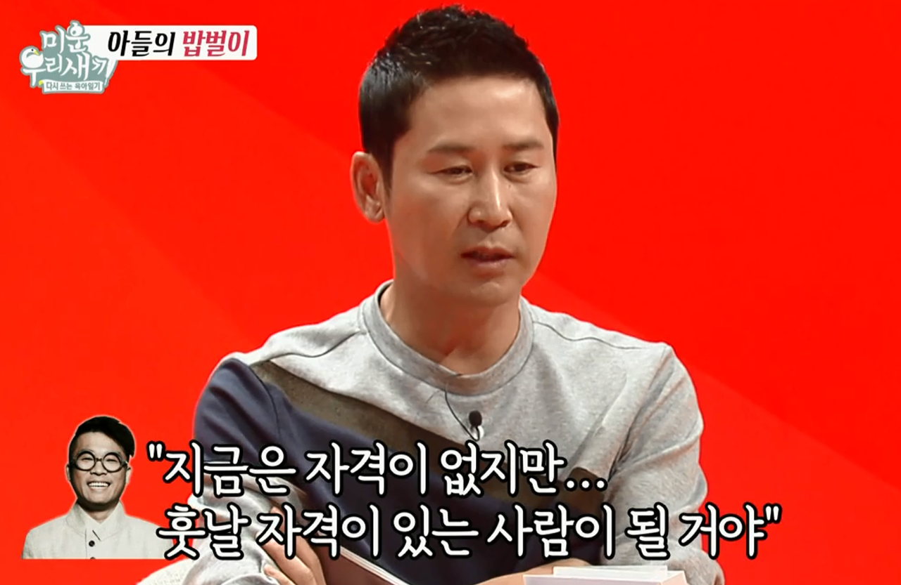

# 밑천이 드러나는 것

우연하게 SBS의 미운우리새끼 라는 예능 프로그램을 보게 되었다.  
  
혼자 사는 아들들의 모습을 MC들과 어머님들이 보시면서 이야기를 나누는 프로그램이라 넋놓고 보다가 크게 한방 먹어(?) 작성하게 되었다.  

어떤 이야기로 시작되었는지는 기억이 안나지만, MC들과 어머님들이 이야기를 나누다 신동엽씨가 본인의 신인 시절 이야기를 해주었다.  
  
데뷔한지 얼마 되지 않은 시절에 김건모씨와 함께 프로그램 MC를 진행하면서 어마어마한 인기를 얻었다고 한다.  
  
외출을 못할정도로 많은 사람들이 알아보고, 수많은 팬들이 방송국 앞에서 대기하고 선물과 편지를 건내려고 할 정도로 인기가 있었다고 한다.  
  
그런 생활을 하다 문득, 

> 과연 내가 이만큼 사랑을 받을 자격이 있나 

라는 생각과 함께 두려움이 생겼다고 한다.  

이 생각이 계속 떠나질 않으니 하루하루 방송하는게 점점 부담스러워졌다고 한다.  
  
불안하고 답답한 마음에 같이 MC를 보던 김건모에게 자신의 마음을 털어놓기 시작했다.  
  
"내 실력이 이만큼 사랑을 받을 만큼이 아닌데 왜 받는지 모르겠다"  
"나는 곧 내 실력과 재능이 들통날것 같다"  
"형은 무섭지 않냐고"  

신동엽씨의 이 이야기에 김건모씨는 담담하게 대답했다.  
  
본인도 그렇게 불안하다고,  
  
하지만,  
  
**"지금은 그런 사랑을 받을 자격이 없지만, 훗날 자격이 있는 사람이 될거야"**

  

이 대답 때문에 이 글을 쓰게 되었다.

전 회사에서 근무할때 항상 부담감을 가지고 근무했었다.  
  
매번 내가 가지고 있는 것보다 부풀려서 평가 받는데, 그럴때마다 정말 부담스러웠다.  

내가 갖고 있는게 얼마만큼 되는지는 내가 잘 아는데  
나는 절대 그 정도가 아니었기 때문이다.  
  
그래서 항상 불안했었다.  
  
"곧 내 실력이 들통나지 않을까"  
"알고 있는건 하나도 없으면서 아는척 했다고 욕하지나 않을까"  
"여태 말빨로 해온게 아니냐고 의심하지 않을까"  
"혹시나 누군가 물어보면 내가 모르는 내용이지 않을까"  

등등 걱정에 매일 노심초사하는데 진짜 고역이였다.  
  
이걸 해결해보고자 레거시 코드들을 다시 보고 적용된 기술들을 튜토리얼 식으로 정리를 했었지만, 하면 할 수록 해야할게 더 발견되니 끝날 기미가 보이지 않았다.  
  
그 불안감은 해결해본적이 없기에, 최근에도 계속 갖고 있었다.  
  
하지만 이젠 김건모씨의 그 대답 덕분에 가벼워졌다.  
  
현재 근무하는 회사에서도 혹은 다음 회사에서도 또 분에 넘치는 평가를 받는다면, 조금은 더 편하게 마음을 가져야겠다.  
  
"지금은 아니지만 꼭 그럴 자격있는 사람이 될거야" 
