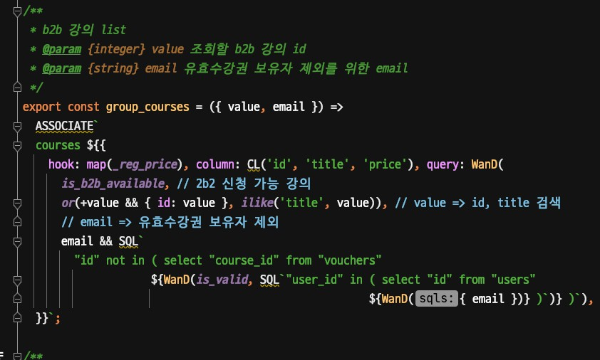
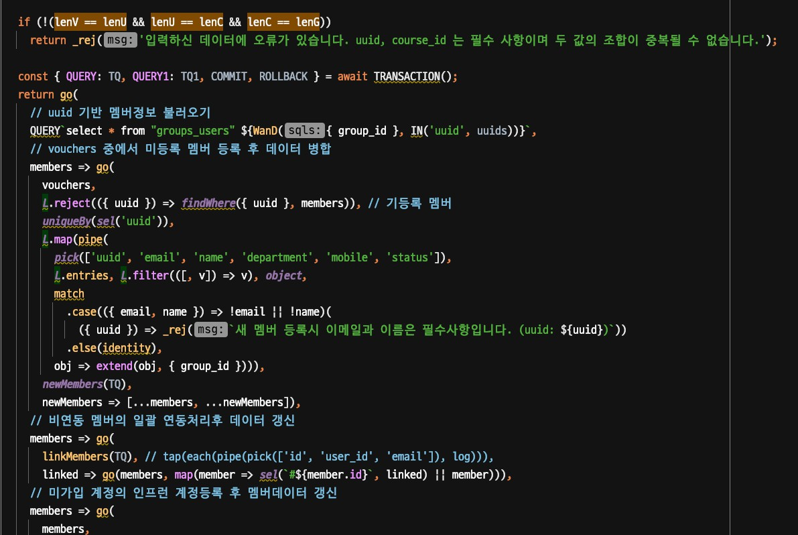

# 2021년 4월

## 2021.04.21

프로젝트의 코드가 생각보다 너무 절망적이였다.  

그리고 호돌맨의 놀림

RDS, EC2 인스턴스 설정등 성능 튜닝 요소들이 많다.  
무엇부터 해야할까?

* 모니터링부터 도입하자.
  * 현재는 뉴렐릭 APM만 도입된 상태라서 서비스 가시성이 떨어진다.
  * 모니터링부터 도입해서 서비스 가시성을 높이고, 개선에 대한 지표로 설명하자

## 2021.04.22

신뢰를 얻으려면 무엇을 가장 먼저 해야할까?  
어디서부터 접근을 시도하면 좋을까?

* RDS를 Aurora로 전환부터하자
* 모니터링을 Sentry로 전환하자

## 2021.04.23

* 결제 페이지에서 다음 페이지로 넘어가지 않는 이슈가 발생했는데, 원인 파악을 제대로 못함
* 웹 프론트엔드의 코드라곤 하지만, **로그가 없어서** 정확히 어디 코드가 이슈인지 제대로 인지를 못하고 있음

* 로그를 DB에 적재하고, 파일로 남기지 않는 것을 발견
  * `cat`, `grep` 등의 커맨드에 익숙하지 않아서, 필요한 데이터 추출을 쉽게 뽑기 위해 쿼리로 가능한 테이블에 적재중
  
## 2021.04.25

너무 어렵게만 생각하지말자.  
차근차근 진행해보자

## 2021.04.26

* CS 대응 숙지

제안 실패

* 스케줄링 도구: 젠킨스 제안 => 실패 ㅠ
  * CDK로 AWS가 매니지드 되는 서비스들을 쓰는것을 선호하고
  * EC2에 직접 구성하는것은 싫어하는 성향
* 코드 처음으로 설명들음
  * ManyToMany에서 limit 쿼리는 어떻게 해결했는지 정확히 설명을 못해서 추가 확인 요청
  * Gui에서 타임존 설정이 안되어서 UTC 데이터 조회 위해 CAST 하는것을 발견함
  * 

## 