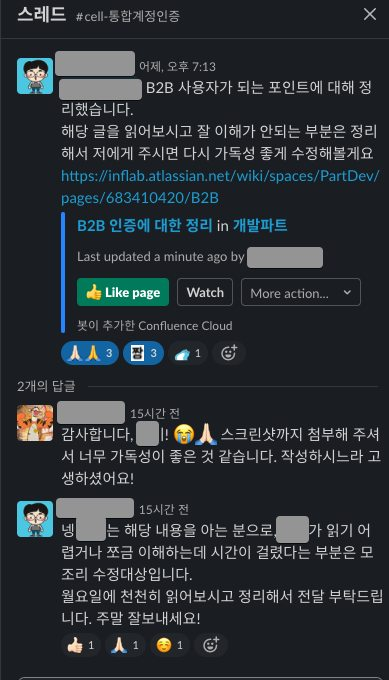

# 엔지니어의 세심함

제일 싫어하는 개발자의 유형 중 하나가,  
개발자가 일을 잘하기 위해서 하나부터 열까지 기획자가 다 챙겨야 한다고 생각하는 분들이다.  

* "A ~ Z까지 엣지케이스, 예외 상황 하나도 빠짐없이 다 기획서에 넣어주세요"  
* "아 그건 기획서에 없었으니깐 당연히 안했죠"  
* "그거 자주 잊어먹으니깐 A, B, C에 문서화 해주세요"  
  
등등 엄청 많다.  
  
이걸 병적으로 싫어한다.  
**엔지니어외 다른 직무는 엔지니어의 서포트 조직이 아니다**.  
  
그래서 팀에 합류하고나서 공들였던 작업중 하나가 엔지니어들의 문서화/커뮤니케이션 문화 개선이였다.  
  
초기 스타트업의 엔지니어분들은 커뮤니케이션/문서화의 세심함이 정말 부족하다.  
  
엔지니어들의 리소스가 절대적으로 부족한 시기이다보니,  
최대한 엔지니어분들의 리소스를 아끼기 위해 엔지니어가 아닌 분들이 정말 많은 서포트를 하게 된다.  
  
* 개발 용어가 남발한 이야기를 하면 그걸 어떻게든 이해하려고 개인적으로 공부를 하거나  
* 엔지니어가 아닌 분들께 혹시 이것 아는지 물어보거나  
* 엔지니어가 하지 않는 문서화를 대신 하거나  
* 엔지니어가 무지성(?) 개발 할 수 있도록 A-Z까지 예외상황, 엣지케이스 전부를 찾아서 기획문서로 만드는 등등.  
  
엔지니어가 개발/구현에만 집중할 수 있도록 하는 동안,  
엔지니어들의 성의 없는 문서화, 커뮤니케이션의 정리는 주변 동료들의 몫이 된다.  
그리고 엔지니어들의 협업을 위한 세심함도 점점 잃게 된다.  
  
엔지니어가 아닌 분들을 위한 문서화와 커뮤니케이션에 신경을 써야하는 이유는 "**우리가 일을 잘하기 위해서**" 다.  
  
기획/PO/PM 혹은 그 외 엔지니어가 아닌 직무분들이 개발 용어를 열심히 공부하는 것을 썩 좋아하진 않는다.  
**엔지니어가 조금만 더 배려하면 회사 전체의 생산성이 올라간다**.  
엔지니어의 생산성만이 가장 중요한 자원은 아니다.  
  
입사한지 1주년이 되었다.  
어제 슬랙에 나온 대화를 보다가 벌써 이만큼 왔다는 생각을 했다.  
  

좋은 코드, 좋은 개발문화 등등 전문성에 대한 개선을 하는 만큼,  
**문서화/커뮤니케이션 문화도 점점 정착되는 것** 같아서 너무 기분 좋은 주말이다.