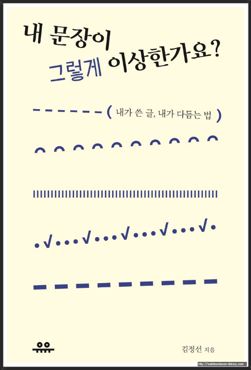

# 오늘의 질문 2020.08.16

## Q.1

Q. 매번 동욱님 글을 볼때마다 "인텔리제이에 이런 기능이 있었어!?",  "스프링 / JPA에 이러한 이슈가 있다니.." 라고 놀랍니다.  
개인적으로 공부하는것에 있어서 정보를 어디서 얻는지 궁금합니다!

A. 음, 일단 저는 철저하게 회사 중심의 개발자라서요.  
포스팅의 대부분은 (거의 80%이상?) **회사에서 개발하면서 만난 문제**들 입니다.  
(저 혹은 제 주변의 개발자분들이 만난 문제들)  
  
이를 해결하기 위해 공부하고 정리한게 블로그에 올라온다고 생각하시면 되는데요.  
  
이를테면, 인텔리제이와 같은 개발환경에 관한 것들은 업무를 진행하면서 "아 불편한데 이런 기능은 없나?" 라는 마음에 찾아보게 되고, 발견하게 되면 정리합니다.  
  
스프링/JPA 등과 같은 기술에 관해서는 철저하게 **지금 팀의 문제를 해결하기 위한 것**들을 찾아보고 팀에 적용하기 전에 테스트 용도로 정리합니다.  
  
계속해서 더 좋은 프로젝트 / 더 좋은 개발팀이 되기 위해서만 고민하고 있기 때문에 **핫한 기술의 튜토리얼**에 관해서는 그렇게 끌리지는 않습니다.  
  
예전에도 몇번 블로그에서 언급하긴했지만, **실제 업무에 적용해본 것과 아닌 것의 깊이에는 큰 차이**가 있습니다.  
  
## Q.2 

Q. 블로그 글을 쓰실때 정말 잘 정리되어 있다는 느낌을 받는데, 글을 쓸 때 기준은 어떻게 정하시고 한 글을 위해서 사용하는 시간대는 얼마인지, 또한 따로 글 쓰는법을 배우신건가요? 글쓰는 노하우가 있다면 알고 싶습니다!  
  
A. 먼저 블로그 글 좋게 봐주셔서 감사합니다 ^^;  

## Q.3

Q. 저는 사회에 발을 디딘지 1년쯤 된 신입개발자 이고, 이번이 첫 직장입니다.  
현재 프로젝트로 2가지를 진행하는데, 다른 회사에서 의뢰한 서비스를 제작하는 일을 하고 있습니다.  
의뢰한 회사측은 개발에 대한 부분은 전혀 관련되어 있지 않은 회사입니다.  
보통 개발을 진행할때 간략한 설명과 화면설계서만 주시고 그 안에서의 비즈니스 로직개발은 제가 아는대로 만드는 중입니다.  
개발 경험과 협업에 관해서 경험이 많은 사람이 사내에 없어서 협업에 관한 고민을 하게 되었습니다.  
타사 측에서 원하는 방향으로 틀을 잡고 개발을 진행하고 결과물을 보여줄때마다 수정사항이 무더기로 나오는 상황을 매번 겪게 됩니다.  
그래서 처음에는 "우리가 충분한 논의가 되어있지 않은가?"에 의문이 들어서 회의를 많이 하게되고 그 회의에서 방향을 잡고 하는데 돌아보면 "회의가 충분히 되었고 유익했는가?" 라고 생각하면 더 좋은 프로세스나 회의 방법이나, 협업을 하는데 있어서 소통이 좋은 방법이 있다고 생각이 듭니다.  
물론 회사마다 사정에 의해서 다른점이 있겠지만, 동욱님께서 속하신 회사들 중에서는
팀안에 어떠한 직책들이 있고, 그 직책분들은 어떠한 업무를 맡으시는지, 개발자가 아닌 직군과 소통을 어떻게 하는 방법이 좋은지 알고 싶습니다.  
  
