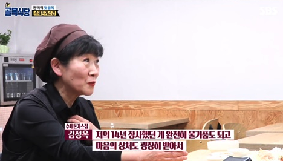

# 우리만의 Hip함

백종원의 골목식당

골목식당에서 자기혼자만 맛없는걸모르는 밥집

꼭 이 가게뿐만 아니라, 많은 가게를 컨설팅하면서 **몇년 이상 운영해온 가게라면** 거의 대부분 

남의가게 가봐서 맛을봐야 안다

우리만의 "Hip함" 이라는게 잘못되면 갈라파고스와 다를바 없다.
수많은 서비스들이 수많은 장애를 만나면서 해결하고 회고를 해놓은게 있는데,
우리만의 Hip함 이라는 이유로 이걸 보지 않고 마이웨이를 가다보면 항상 소잃고 외양간 고치기만 하는 시스템이 될 수 있다.
잃기 전에 외양간을 고치면 좋을텐데,
그게 참 쉽지 않다.
많은 서비스의 개발팀이 왜 저런 선택들을 했는지 보고 참고하지 않을 이유가 전혀 없다. (무분별하게 하는건 아니고)