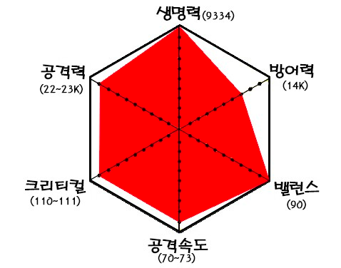

# 인프런 수습 회고

전직장에서 되게 확실하게 배운게 하나 있는데, **개발팀이 개발만 하면 망한다** 였다.  
  
좀 더 풀어나가자면,  
회사를 이루는데는 크게 2가지 축이 있다.

* 문제를 정의하고 찾아내는 축
    * CEO(를 비롯한 임원진) / 기획 / PM / 영업 / 컨텐츠 등
* 문제를 해결하는 축
    * 개발 / 마케팅 / 디자인 등

여기서 문제를 해결해야하는 개발자의 입장에서 **개발로만 어떻게든 문제를 해결하려고 한다면** 비효율적으로 문제를 해결할 수 밖에 없다.  
  
마치 "**망치질밖에 모르는 사람은 모든 것이 못으로 보이는 것**" 처럼 말이다.

* 이게 진짜 고객이 원하는 것일까?
* 이 기능이 진짜 CS 운영자들분들께 필요한 기능일까?
* 이렇게 기능 추가하는 것보다 더 많은 고객에게 가치를 부여하는 것은 무엇일까?
* 우리팀의 개발인력이 부족한것은 단순히 사람이 부족해서일까? 비효율적으로 일하고 있는것은 아닐까?
* 회사가 채용해줄때까지 기다리는게 맞을까? 급한 당사자가 우리라면 우리가 발벗고 채용에 나서야하는 것은 아닐까?
* 요청한 저 기능은 현재는 구현하기 어려운데, 진짜 이 기능이 필요해서 기획한것일까? 아니면 사실은 본질적인 문제가 있던 것은 아닐까?

등등 말이다.

이런 고민들을 하게 되면 **1줄의 코드 없이도 복잡하거나 어려운 문제를 해결하는 경험** 을 종종 얻게 된다.  
  
이런 경험을 할때마다 내가 가지고 있는 개발자로서의 역량에 대해 이것 저것 고민하게 된다.  
  
**개발 역량만 키운다고 진짜 좋은 개발자가 될 수 있을까?** 라는 고민말이다.  
  
개발자도 하나의 RPG 직업군처럼 육각형 능력치가 있다고 생각해보자.

크게 보면 다음과 같다.

- 개발역량 (설계/클린코드/튜닝등등 모든 개발 요소들)
- 기획/디자인 등을 비롯한 UX 역량
- 커뮤니케이션/소통을 비롯한 협업
- 주변 개발자들을 성장시키는 역량
- 자신을 비롯한 팀 브랜딩 (블로그/채용등)
- 기타 다시 함께 일하고 싶은 여러 역량들

일반적으로 큰 기업에서는 이중 1~2개의 역량을 얼마나 잘 활용하느냐에 따라 좋은 개발자로 평가 받게 된다.  
  
각 분야의 스페셜리스트들이 모여서 하나의 큰 집단을 이루기 때문에, **어설픈 서브 역량으로**는 제대로 회사에 기여를 하기 어렵기 때문이다.  
  
그래서 가장 핵심역량 1~2개 외에 내가 가지고 있는 역량들이 무엇이 있는지 파악하고, 제대로 활용해 보는것이 쉽지는 않다.  
  
반면에 인프런에서의 지난 3개월은 이런 육각형 능력치의 전부를 활용해 볼 수 있는 시간이였다.

개발파트의 시니어 엔지니어로서

- 신규 기능 설계
- 개발파트 코드리뷰
- 장애 대응
- 모니터링/알람 등 후속 조치 작업
- 서비스 성능 튜닝
- 차기 개발 스택 준비
- 서버/프론트 면접관
- 리팩토링2 스터디 진행
- Confluence 등 협업 도구 도입

개발자가 아닌 인프런의 구성원으로서

- 어드민 검색 기능 정리 (@비스타 Thanks)
- 제품 개발 파트 (개발자 + PO) 워크샵 진행
- 신규 채용 Notion 작성과 톤앤매너 정리
- 3번의 전사 (혹은 개발파트) 발표
    - 지난 3년간 인프런 장애 정리 및 회고
    - 성장하는 스타트업이 앞으로 겪을 일
    - 문서 가이드
- 스터디 의견 제시 및 샘플 공고 작성
- 데이터리안과의 협업
- 주간 인프런 제안 및 작성
- 컨텐츠 리뷰

개발자로서의 역량 외에 다른 역량이 진짜 개발자에게 필요할까? 에 대해서는 확실하게 답할수는 없다.  
  
다만 그동안 만난 수많은 뛰어난 개발자들 사이에서 내가 살아남을 수 있는 방법이 될 수 있겠다는 생각은 든다.

> 그렇다고 기술을 포기한다는건 아니다.  
> 그들과 같이 협업이 가능한 수준까지의 개발 역량을 쌓는건 기본값일 뿐이다.

그리고 이런 육각형 모델을 쌓는데 있어서 인프런은 아주 좋은 장소가 될 수 있을것 같다.

아마 인프런도 투자 라운드가 진행됨에 따라 수백명 ~ 수천명의 회사가 될테고, 그때는 이렇게 여러 능력치를 쌓을 기회가 없을 것이다.

그러니 지금 많은 경험치를 누적시켜야겠다는 생각이 들었다.

개인적으로 굉장히 애정하는 책 중에 하나인 [열정은 쓰레기다](http://www.yes24.com/Product/Goods/20356628)를 보면 다음과 같은 문장이 나온다.

> 나의 그림 실력은 부족하고, 업무 관련 실력은 평범하고, 글쓰기 재능은 그럭저럭 쓸 만하지만 뛰어나지는 않았다. 유머 감각 또한 괜찮지만 훌륭하다고는 할 수 없다. 여기에 인터넷을 남들보다 일찍 알았다. 아는 양은 많지만 평범한 수프 같다. 내가 익힌 기술들 중 그 무엇도 세계적인 수준에 도달하지 못했다. 하지만 나의 평범한 기술들이 하나로 합쳐지자 나는 강력한 시장성을 갖게 됐다.

지금 내가 가져야할 스탠스인것 같다.