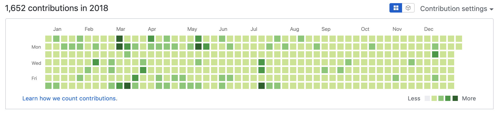
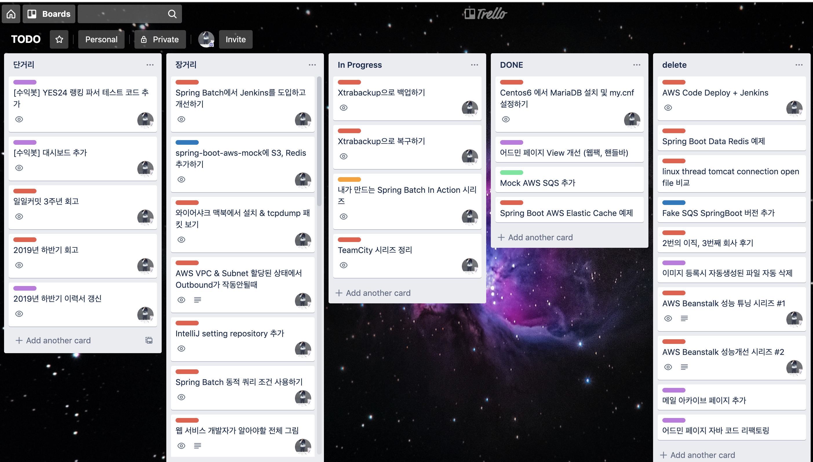

# 일일커밋 3주년 회고

> 왜 일일커밋을 시작하게 된건지에 대해서는 [기존에 작성한 글](https://jojoldu.tistory.com/402)이 있으니 참고하면 좋을것 같다.

일일커밋 시작은 2016년 8월부터 시작했으나, 중간 중간 쉬거나 끊긴적이 있었다.  
**한번도 끊김 없이 이어진건** 2016년 11월부터라, **2016년 11월부터 현재까지**의 기록을 남겨본다.  
  
## 기록

그간의 기록은 다음과 같다.  
  
> 참고로 내 경력의 시작은 2014년 2월부터다
> 즉, 경력이 시작되고 2년 6개월부터 일일커밋을 시작했다고 보면 된다.


**2016.11.13 ~ 2016.12.31**


**2017.01.01 ~ 2017.12.31**


**2018.01.01 ~ 2018.12.31**



**2019.01.01 ~ ing**


원래 3주년 회고는 2019년 11월 13일에 써야 딱인데, [태용님 인터뷰](https://www.youtube.com/watch?v=V9AGvwPmnZU&t=2s)에 [출판](https://jojoldu.tistory.com/463)이 겹쳐서 12월이 되어서야 쓰게 되었다.  


## 어떻게

위에서도 얘기했지만 3년차에서 일일커밋을 시작했다보니 초기에는 별 문제가 없었다.  
헌데, 한 1년이 지나다보니 **커밋을 위한 공부**를 하는 일이 잦아졌다.  


(출처 - [권남님 블로그](http://kwon37xi.egloos.com/7281853))  
  
하루에 한번의 커밋이라도 할려면 **짧은 호흡의 코딩**이 될 수 밖에 없는 것이다.  
특히 회사일이 바쁘기라도 하면 **커밋할 시간이 30분도 안되는 경우**도 있다.  
이렇게 되니 자꾸 무의미한 커밋이 발생하고,  
무의미한 커밋들이 쌓이니 **일일커밋에 대해 회의감**이 생기게 되었다.  
  
그래서 이 문제를 어떻게 해결할까 고민하던 중에 **코드의 경중을 나누기로** 결정했다.  
경중이라 하면 이런 것이다.  

* 30분 이내로 코드 작업이 가능한 개인 과제
  * **단거리**
* 30분 이상 고민이 필요한 개인 과제
  * **장거리**

로 나누는 것이다.  
  
예를 들어 

* 사이드 프로젝트에 누락된 테스트 코드를 추가하거나
* 블로그 오타를 반영하거나
* 라이브러리 버전을 올리는
 
등의 일이다.  
  
이미 API가 구현된 상태에서 대시보드 항목만 추가하는 등도 단거리에 해당된다.  
  
이런 작업 목록들은 [트렐로](https://trello.com/) 에 정리해서 매일 아침 작업 전에 확인후 진행 한다.



만약 주말 오전과 같이 시간이 많이 남는 경우엔 **단거리 작업은 하지 않는다**.  
장거리 작업만 진행한다.  
단거리는 평일 오전에도 충분히 처리 가능하기 때문이다.  
물론 장거리 작업 중에도 단거리로 뺄만한 일들이 생기면 바로바로 단거리로 추가 등록해서 진행한다.  
  
일일커밋을 하면서 계속 유지할 수 있었던 것은 

* 단거리로 인해서 꾸준히 지표는 유지하고
* 장거리로 부족한 점을 계속해서 채우고 있기 때문이다.

두 작업이 어느정도 밸런스를 유지하고 있어서 계속 해올 수 있었다고 본다.  
내년에도 잘 유지해볼 생각이다.

### 인프라에 관한 공부시에는?

코드 작업이 없는 날이 있을수도 있다.  
예를 들어 AWS 서비스를 공부해서 블로그에 정리하는 경우이다.  

> Nginx, MariaDB, Redis, Jenkins, Pinpoint 등 모든 인프라 공부가 다 해당될것 같다.

AWS나 혹은 완전히 처음 접하는 인프라 기술에 관한 내용들을 공부한다는 것은

* 코드 작업이 일체 없고
* 어찌 어찌 실습이 성공했지만, 블로그에 정리하기에는 제대로 정리가 안되는 경우가 많다.

위와 같은 단점들이 있다.  
그렇다고 이런 단점들이 있다고 공부를 안할수는 없다.  
결국 **좋은 백엔드 개발자가 되기 위해서는 이런 인프라에 관한 지식들은 피할 수 있는게 아니기 때문**이다.  

그래서 

* 커밋도 할 수 있고
* 블로그에 소개할 수 있을만큼 깔끔한 방식으로 정리도 할 수 있는

방법을 고민하다가 한가지 묘수를 생각하게 되었다.  
그건 바로,  
**같은 내용의 실습을 두번 진행**하는 것이다.  
규칙은 간단하다.

* 처음 실습은 일단은 아무렇게나 해본다.
  * 아무렇게나의 기준은 최대한 모아놓은 베스트 프렉티스 자료들을 취합해서 진행한다는 의미이다.
  * 당연히 제대로 안될수도 있고, 설정 하나 삐끗해서 이상하게 될 수도 있다.
  * 이때 **최대한 많은 삽질을 한다**
* 이 과정에서 **모든 내용을 캡쳐**한다.
  * ```yum install``` 부터 시작해서 **하나의 설정을 추가하는 것**까지 뭐라도 하면 무조건 캡쳐한다.
  * 그리고 이 **캡쳐한 내용을 커밋**한다.
* 1차 실습 과정이 성공적으로 끝나면, **새로운 환경을 다시 만든다**
  * 즉, 깡통 서버를 새로 만들거나 AWS 서비스를 다시 만드는 등
* 새 환경에서 **다시 차례로 진행**한다.
  * 이때는 **블로그에 쓸 것을 염두해** 1차 실습때 캡쳐했던 것을 참고해 **베스트 프렉티스**를 만들어 본다.
  * 이때도 중간 중간 소제목들이 끝날때마다 커밋을 한다.

이렇게 하게 되니 **블로그에는 최대한 정리된 자료**만 올라가게 되고, 일일커밋도 분야 관계없이 꾸준히 유지할 수 있게 되었다.  
  
만약 나처럼 처음 써보는 인프라를 익혀야할때, 처음 써보는 라이브러리 (Spring Batch, Spring Security 등) 의 코드를 까서 분석해야하는 경우에 **두번 실습**은 꽤 유용하다.  

한번 해보시길 추천한다.

## 위기

일일커밋을 하면서 몇번 끊길뻔한적이 있었다.  
제일 대표적인 사례가 병원 입원인 경우이다.  
  
2017년 11월에 건강검진을 받고 갑상선암 판정을 받았다.  
그리고 2018년 3월에 한달간 회사를 쉬었다.  

> 쉬는 동안에 대한 이야기는 [마음껏 틀릴 수 있는 시간](https://jojoldu.tistory.com/435)에 기록해두었다.

이떄가 막 일일커밋 1년을 넘었던때라, **또 일일커밋이 초기화되는게 너무 싫었다**.  
병원엔 대략 일주일 정도 쉬었어야 했는데, 그동안 커밋을 전혀 못하는게 너무 싫었다.  
"어떻게 이어온 일일커밋인데 여기서 끊길순 없지!!" 란 생각이 가득했다.  
  
수술후에 며칠간은 노트북을 열지 못할것 같아 어떻게 할까 고민했다.

* 집 데스크탑에서 날짜별로 디렉토리를 생성한다.
  * 집 데스크탑이 윈도우라 Docker를 사용했다.
* 날짜별 디렉토리에 단거리 작업들이 남은 프로젝트를 ```git clone``` 받아놓는다.
* 디렉토리별로 단거리 작업들을 모두 반영하고 **커밋은 하지 않는다**
* ```crontab```에 스크립트를 등록해 **날짜별로 해당 디렉토리에서** commit & push 가 발생하도록 한다.

커밋이 된건지 아닌지는 Github Bot으로 알람을 받으면서 모니터링을 했다.


이걸 통해서 결과적으로는 입원중에도 계속해서 일일커밋을 이어갈 수 있었다.  
다만 이걸 하면서 느낀건

* 웬만하면 입원 안하는게 최고다
* 그럼에도 아프면 병원에서 커밋하는게 낫겠다.

스크립트 작동이 정상적으로 안되면 어쩌나 하는 걱정이 더 커서 추천하는 방법은 아니다.

## 요즘 고민은?

요즘은 **하나라도 커밋을 하면 만족**해버리는 것 같아서 고민이다.  
헬스로 치면, 중량을 더 늘리지 않고 그 **무게 그대로 횟수를 채우는 일이 계속 된다**고 해야하나?  
  
하루에 해야할 공부의 마지노선 허들이 낮다는 생각을 계속 하게 된다.  
그래서 이 부분을 어떻게 **지표로 측정할 수 있을까** 고민하고 있다.  
지표로 측정하지 못하면 재미가 없고, 꾸준히 하기 힘드니 어떻게 할까 방법을 찾아보는 중이다.  
  
그전까진 어쩔수 없이 의도적으로 허들을 높이는 수 밖에 없을것 같다.

## 마무리

한창 취업 실패가 이어지던 시절 읽은 소설 중에 "프리즌 호텔" 이 있다.  


프리즌 호텔 1권의 후기를 보면 주인공 "기도 고노스케" 에 대한 작가의 이야기가 있다.  
  
주인공으로 나오는 기도 고노스케는 사실은 작가인 아사다 지로가 **20년간 사용했지만 한번도 채택되지 않은 소설을 쓴 필명**이였던 것이다.  
  
즉, 그는 **20년 동안 소설을 써오며 한번도 출판사에 채택되지 않았음에도 포기하지 않고 계속 써왔던 것**이다.  
  
뒤이어 적힌 "인생을 살아가는데 운이나 노력도 중요하지만, 집념이 꽤 중요하다는 것도 사실인것 같다" 라는 말은 당시에 나에게 큰 울림을 줬다.  
  
고작 3년한것 가지고 뭐 할 얘기가 많을까 싶다.  
정말로 정말로 나도 20년간 이 과정을 유지하게 된다면 인터뷰때 저말을 한번 해봐야지 라는 다짐을 해본다.
