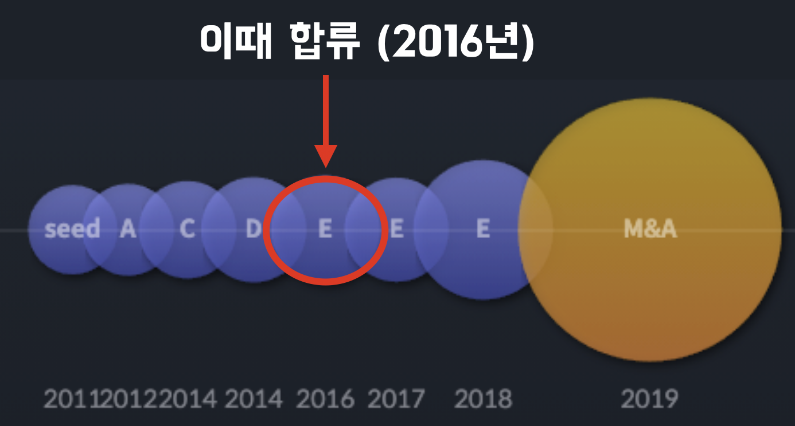

# 제어할 수 없는 것에 의존하지 않기

소프트웨어의 원칙에 대해 이야기하라고 하면 저에게는 상당히 어려운 주제인것 같습니다.  
그래서 우선은 가벼운 이야기들을 시작으로해서 진행해보도록 하겠습니다.  
그편이 더 구체적이고 비교적 이야기가 술술 풀려나가지 않을까 생각합니다.  
  
저는 약 9년간 직업으로서의 개발자로 활동해왔습니다.  
경력에 비해서 이렇게 저자의 기회도 있는걸 보면 꽤나 운이 좋았던것 같습니다.    
SI, 인터넷 포털, O2O 스타트업, 에듀테크 등 여러 분야의 소프트웨어 기업들을 근무하고 팀원, 리드 등의 역할을 하다보니 고민 상담의 기회도 꽤나 많았습니다.  
  
취준생이 아닌 현직에서 일을 하시는 분들이 저에게 요청한 고민 중에서 자주 등장하는 질문이 있습니다.  

"일정을 지키고자 버그가 많은 소프트웨어를 출시하는 것이 마음에 들지 않습니다.  
어떻게 하면 일정을 연기해서 안정된 소프트웨어를 내는 것이 더 중요하다고 리더들을 설득할 수 있을까요?"  
와 같은 것입니다.  
  
이런 고민에 대해 저는 항상 윈도우 95의 개발자이신 "나카지마 사토시" 님의 이야기를 전달합니다.  
(아래 문장은 나카지마 사토시님의 저서인 "오늘, 또 일을 미루고 말았다" 에 나옵니다.)

"프로그래머에게 요구되는 것은 100점이 아닌 80~90점짜리 프로그램을 기한 내에 완성하는 일이다."

이렇게만 답변을 마무리 한다면, "퀄리티 보다 일정이 더 중요한것인가" 라고 생각이 될 수도 있습니다.  
그래서 항상 덧붙여 이야기하기를, "일정과 퀄리티가 시소 관계라서 어느 한쪽을 포기해야한다가 아니라, **어떻게 하면 아무리 급해도 항상 80~90점의 소프트웨어를 개발할 수 있는지**가 중요하다." 라고 전달합니다.  
  
(저는 나카지마 사토시님을 실제로 뵙진 못했지만, 아마도 저와 같은 의도로 저 이야기를 하신게 아닐까하고 혼자 생각했습니다. 하하)  
  
이 답변을 받은 분들은 다음으로 어떤 질문을 했을까요?  
당연하게도, "그럼 어떻게 하면 항상 80~90점의 소프트웨어를 개발할 수 있나요?" 입니다.  
  
제 주변을 보면 아무리 급한 일정으로 일이 주어져도 항상 80~90점의 소프트웨어를 출시하는 개발자분들이 있었습니다.  
옆에서 쭉 지켜보면 그 분들은 대부분 공통점이 있었습니다.  
  
(이제부터 제가 이 책에서 이야기하고자 하는 내용이 등장할 때인것 같습니다.)   
  
그건 바로 경험과 학습으로 체득된 본인만의 소프트웨어 원칙들이 있었던 것입니다.  
  
예를 들어 누군가는 A 코드가 더 나을지, B 코드가 더 나을지 고민하면서 시간을 보낸다면,    
그 분들은 A 코드와 B 코드 중 현재 상황에 더 적합한 코드를 판별하는 선택 기준과 원칙들이 있어 고민 없이 바로 선택을 할 수 있었던 것이죠.  
그리고 정말 중요한 설계와 선택이 필요할때 더 깊게 시간을 쓸 수 있어, 항상 일정과 퀄리티 양쪽을 잡을 수 있었던것 같습니다.  
  
이런 분들과 함께 일하다보면 자연스레 저의 소프트웨어 원칙들도 되돌아보게 됩니다.  
나는 좋은 원칙들을 알고 있는가?, 그 원칙들이 무의식적으로도 발현될 수 있도록 내재화되어있는가? 등등 말이죠.  

아마 대중적으로 가장 알려진 원칙들이라 하면 DRY, YAGNI, KISS 일것 같습니다.

* DRY
  * Do not Repeat Yourself
  * 똑같은 기능, 코드를 반복하지말라.
* YAGNI 
  * You Ain't Gonna Need It
  * 그 기능이 필요하기전까지는 미리 만들지 말라.
* KISS 
  * Keep It Simple Stupid
  * 최대한 단순함을 유지해라.

이 원칙들이 저에게 가장 중요한 원칙들일까요?  
이 책의 제안을 받고나서 저 스스로도 한번 생각해보게 되었습니다. 

"나는 평소에 어떤 원칙을 가지고 소프트웨어를 개발하는가?
수많은 원칙들 중에서 내가 가장 좋아하는 원칙은 무엇인가?"

이 질문에 대답을 하자니 어떻게 대답해야할지, 상당히 망설여집니다.  
왜냐하면 소프트웨어를 만드는데 하나의 원칙만 가지고 진행하지는 않기 때문입니다.  
그간 듣고, 배운 다양한 원칙과 기준들 중에서 어느 것 하나가 최우선이 되어서 개발을 한 적이 제게는 애초에 없었고, 지금도 딱히 그러지는 않습니다.  
  
위에서 언급한 DRY, YAGNI, KISS 원칙들 역시 계속해서 적용되고 당연하게 사용하지만, 제가 가장 애정하는 원칙이라 하면 그렇지는 않습니다.  
물론 '원칙' 이라 하는 것이 대체로 시각화도, 언어화도 안되는 종류의 것이기 때문에 구체적으로 원칙들간 순위를 메길수는 없겠죠.
그래도 가장 자주 적용되는 원칙은 있지 않을까 한다면 그건 맞습니다.  

인프랩이라는 조직에 합류하고 Node.js를 처음으로 프로덕션 레벨에서 사용할때를 생각해보면, 당시의 저는 Node.js에 대한 숙련도가 낮을때임에도 불구하고 당연하게 적용하던 원칙들이 있었습니다.  
아마도 "언어, 프레임워크가 다르더라도 A 원칙과 B 원칙 등등은 동일하게 적용되지 않겠냐" 하는 저만의 확신이 있었던 것 같습니다.  
  
그러니깐, 저 역시 제가 관찰했던 다른 분들과 마찬가지로 코드와 시스템 설계에 대해 깊게 고민을 할 때 종종 떠올리는 원칙이 있는가 하면, 깊은 고민 없이 무의식적인 상태에서도 당연하게 적용되는 원칙들이 있다는 것입니다.  
  
무의식적으로 쓰는 (혹은 애정하는) 원칙들은 여러가지가 있지만, 그 중에서도 제가 가장 애정하는 원칙은 "제어할 수 없는 것에 의존하지 않기" 입니다.  
  
저는 이 원칙을 "실용주의 프로그래머" (인사이트) 를 통해 처음 알게 되었습니다.  
실용주의 프로그래머 2장에서는 "현실 세계의 변화와 설계 사이의 결합도를 줄여야 한다. 전화번호를 식별자로 사용하고 있는가? 자신의 힘으로 제어할 수 없는 속성에 의존하지 말라." 라는 이야기가 나옵니다.  
  
자신이 제어할 수 없는 현실 세계의 속성을 사용하는 경우는 어떤 때일까요?  
대표적인 사례로 '주민등록 번호'를 데이터베이스 테이블의 PK (Primary Key)로 사용하는 경우입니다.  
주민등록 번호는 국가에서 발행한 유일값이므로 신뢰할 수 있지 않겠냐 라고 할 수 있겠지만, 실제로 주민등록번호에는 크게 2번의 변화가 있었습니다.

* 1975년 주민등록번호 체계가 변경 되었습니다.
* 2014년 주민등록번호 무분별한 수집이 금지 되었습니다. 


(2014년 안행부 가이드)  
  
절대 변하지 않을것이라 믿고, 의존했던 외부의 유일키였지만 언제든 변할 수 있었습니다.  
그리고, 그 변화에 영향을 받을 수 밖에 없습니다.    
  
만약 해당 PK 설정을 우리가 직접 만든 키 (Key)로 설정했다면, 아마도 이런 정부 지침의 변화에 쉽게 대응할 수 있었을 것입니다.  
  
즉, 제어할 수 없는 것에 의존할수록 변화에 대응하기 어렵고 의도한대로 일을 진행하기가 어렵습니다.  
  
테이블의 컬럼과 외부의 속성의 의존관계에 대해 간단하게 이야기해보았는데요.  
이 외에 이 원칙을 적용할 수 있는 사례들은 무엇이 있는지 조금 더 살펴보겠습니다.

## 코드 설계

요즘의 소프트웨어 개발에서는 테스트 코드 작성을 중요하게 여기고 있습니다.  
하지만 개인이 가지고 있는 테스트 역량과 무관하게 테스트 코드 작성이 어려울때가 종종 있습니다.  
이는 개인의 테스트 역량 보다는 기존의 코드가 **테스트하기 좋은 코드냐 아니냐가 다르기 때문**입니다.  
  
예를 들어 다음과 같이 도메인 로직을 품고 있는 클래스가 있다고 해보겠습니다.

```ts
export default class Order {
    ...
    discount() {
        const now = LocalDateTime.now();
        if (now.dayOfWeek() == DayOfWeek.SUNDAY) {
            this._amount = this._amount * 0.9
        }
    }
}
```

(주문일이 일요일이면 주문 금액의 10%를 할인 하는 함수)

이 코드는 테스트 코드를 작성하기 쉬울까요?  
이 코드는 테스트 코드를 작성하기 어렵습니다.  
  
이유는 **실행할때마다 달라지는, 그 값을 저희가 제어할 수 없는 현재시간 생성 함수** (   
`LocalDateTime.now();`) 가 메소드 내부에서 사용되고 있기 때문입니다.  
  
예를 들어 이 메소드의 테스트 코드를 작성한다면 다음과 같습니다..  

```ts
it('일요일에는 주문 금액이 10% 할인된다', () => {
    const sut = Order.of(10_000, OrderStatus.APPROVAL);
    
    sut.discount();
    
    expect(sut.amount).toBe(9_000);
});
```

이 테스트는 **매주 일요일에 수행할때만 통과**할 수 있습니다.  

언제 수행하냐에 따라 테스트 대상인 `discount` 의 결과는 달라집니다.  
테스트 대상인 `discount`가 **언제나 동일한 결과를 보장하지 못하기 때문에** 테스트 코드 작성을 굉장히 어렵게 만듭니다.  
  
이 코드를 테스트 하기 위해서는 `LocalDateTime.now()` 를 Mocking 해야만 수행가능한데, 이 역시 쉽지 않습니다.
  
그렇다면 이 코드를 어떻게 개선하면 테스트하기 쉬운 코드가 될 수 있을까요?  
제어하기 어려운 코드인 현재시간 (`LocalDateTime.now()`) 을 외부에서 주입받도록 하는 것입니다.  

```ts
export default class Order {
    ...
    // 현재시간(now)를 밖에서 주입받도록 한다.
    discountWith(now: LocalDateTimw) { 
        if (now.dayOfWeek() == DayOfWeek.SUNDAY) {
            this._amount = this._amount * 0.9
        }
    }
}
```

이렇게 할 경우 다음과 같이 제어할 수 없는 시간이라는 값을 내가 원하는 값으로 지정해서 테스트를 작성할 수 있게 됩니다.

```ts
it('일요일에는 주문 금액이 10% 할인된다', () => {
  const sut = Order.of(10_000, OrderStatus.APPROVAL);
  const now = LocalDateTime.of(2022,8,14,10,15,0); // 2022-08-14 10:15:00 시로 고정
  sut.discountWith(now);

  expect(sut.amount).toBe(9_000);
});
```

제어할 수 없는 값인 `now()` 를 메소드 인자로 빼도록 변경하는 순간 `Order.discountWith()` 메소드는 **항상 일괄된 결과를 뱉어내고, 테스트 역시 항상 일관된 결과**를 출력할 수 있게 됩니다.  
  

물론 TypeScript 혹은 Kotlin의 경우 다음과 같이 함수 인자의 기본값을 선언하는 방법을 지원하기 떄문에 기존의 사용성을 유지하면서 제어할 수 없는 코드에 대한 의존성을 줄일 수 있습니다.

**TypeScript**

```ts
// TypeScript
export default class Order {
    ...
    // 인자 호출이 없을 경우 LocalDateTime.now()를 사용
    discountWith(now = LocalDateTime.now()) { 
        if (now.dayOfWeek() == DayOfWeek.SUNDAY) {
            this._amount = this._amount * 0.9
        }
    }
}
```

**Kotlin**

```kotlin
class Order {
    ...
	fun discountWith(now: LocalDateTime = LocalDateTime.now()) {
		...
	}
}
```

제어할 수 없는 값에 의존하는 코드들에 대한 의존성을 줄일수록 메소드, 함수는 부수 효과가 적은, 매번 같은 결과가 반환될 수 있는 순수 함수에 가깝게 됩니다.  
즉, 우리가 의도한대로 코드를 사용하기 쉬워집니다.

## 취업, 이직

이 원칙은 회사를 선택할때도 적용되었습니다.  

2020년 12월, 팀 시스템이 모두 클라우드로 전환이 완료되면서 저는 다음 회사로의 이직을 고민했습니다.  
이미 만 4년이 넘는 기간 동안 우아한형제들에서 근무하면서 신규 시스템 오픈, 레거시 시스템 개편, 클라우드/데이터베이스 마이그레이션 등 여러 경험들을 쌓았고 한 회사를 졸업하기에 적절한 시기라고 생각했기 때문입니다.  
아무래도 제가 우아한형제들에 합류하던때가 스타트업 중반 ~ 후반기였기 때문에 다음 회사는 그와는 다른 경험을 쌓고 싶었습니다.



(우아한형제들 투자 라운드)  

당시에 이야기되었던 회사들은 장점들이 많았습니다.

* 기업가치와 트래픽이 더 큰 회사
* 현재 보다 높은 연봉을 제시한 회사
* 스톡옵션 등 미래 가치 투자가 가능한 회사

이 중에서 스타트업의 전반기 경험이 부족했던 제 입장에서는 전반기 (시리즈 PRE A ~ A) 를 40대가 되기전에 꼭 경험을 해야겠다고 생각했습니다.  


이때 역시 이 원칙이 적용 됩니다.  

수백억을 투자 받아도 1년만에 다 쓰는 경우도 기사를 통해 듣다보니 얼마를 투자 받았냐는 제가 생각하던 생존이라는 기준에서 크게 중요하지 않았던것 같습니다.

"투자는 VC들이 결정을 하는 것이고, 나는 제어할 수 없는 것인데,  
다음 투자를 못받으면 어떻게 될까?  
가능하면 투자를 받지 못해도 생존할 수 있는 회사여야겠다."
라는 기준이 적용된 것입니다. 

물론 회사를 선택하는데 있어 딱 이 한가지 원칙만 적용하진 않습니다.  
다만, 여러 조건이 다 비슷한 경우 결정을 내리는데 큰 역할을 한 것은 사실입니다.  

근데 그럼에도 조건부가 크게 고려요소는 아니였다.  
이건 인프랩이란 회사의 특수성에 기인했기 때문이라 납득할 순 있었기 때문이다.

* 회사가 20명이 될 때까지 한번도 C레벨은 커녕 **시니어 조차 채용해본적이 없었던 상황**
* 외부에서 합류한 시니어는 어떤 역할을 하는 것인지 감도 없는 상황
* 시니어는 조직 전체에 큰 영향을 줄 수 있다는 것으로 인한 **두려움**

한번도 시니어를 뽑아본적이 없었던 조직에서 처음 뽑는 시니어가 C레벨인 것은 누구나 두려워할만하다고 생각했다.  
C레벨이라하면 결국 조직 전체를 뒤흔들 권한을 가지기 때문이다.  

그리고 이건 내가 배민이라는 회사를 다니면서 가지고 있었던 나 자신에 대한 의심을 해결할 수 있는 기회이기도 했다.  
  
내가 배민에 합류할 당시에 경력이 3년채 안되는 (2년 10개월) 주니어였다.  
근데 하필 성과내기 좋은 팀에 합류를 하게 됐고, 만난 모든 팀장님들과 실장님들이 계속해서 많은 힘을 실어주고 권한을 위임해주셨다.  
  
즉, **직속 상사의 전폭적인 지지하에** 많은 성과를 낼 수 있었던 것이다.  
  
그래서 이렇게 지지를 받지 못하는 상황에서 **온전히 내 힘으로 인정**받고 성과를 낼 수 있는 사람인지에 대한 의구심을 계속 가지고 있었다.  
  
그런 지지기반이 없는 상황에서 나라는 사람은 얼마나 유의미한 성과를 낼 수 있을까?  
이걸 시험해볼 수 있는 기회라고 생각했다.

## 매니지먼트

본격적으로 인프랩에서의 매니저 (CTO) 역할을 하게 되면서 제어할 수 있는 것과 없는 것을 구분하기 시작했습니다.

이 원칙을 적용하기전에 항상 준비해야할 것은 "제어할 수 있는 것과 제어할 수 없는 것을 구분하는것"이 선행되어야합니다.

퇴사전에 실장님이셨던 기호님이 해주신 조언이 있다.
가서 바로 무언갈 하려고 하기 보다는 1~2달은 가만히 지켜만 봐라 라는 것이다.

그래서 가자마자 약 한달간은 지켜보고 분석하는 시간을 가졌다.
실제로 코드리뷰도 한달은 거의 참여하지 않았다.
인프랩이 그동안 해온 코드 방향이 내가 생각한 방향과는 전혀 맞지 않았기 때문이다.
충분한 Context에 대한 이해도 없이 내가 가고자 하는 방향대로 함부로 얘기해서는 안된다고 생각했다.

이것들을 지금처럼 해서는 안된다는 것을 굉장히 우회해서 이야기를 하고, 하고 싶은 이야기를 제대로 하지 못하기도 했다.

이 과정이 사실 답답한 것도 조금은 있었다.
빠르게 성장해야하는 스타트업에서 설득하는 과정이 길어져서는 제대로 속도를 낼 수 없다는 생각이 있기 때문이다.
하지만, 그런 설득 과정이 없으면 기존 멤버들에게 상처를 주게 된다.

## 마무리

제어할 수 없는 것에 의존하지 않기 원칙은 여러 곳에서 활용 가능합니다.

* 데이터베이스 테이블의 주요키 (PK) 에는 주민등록번호, 여권번호 등 아무리 유일한 값이더라도 의존하지 않는다.
* 로그인 서비스는 SSO 외에 자체 로그인을 꼭 구현한다.
* 특정 팀원에게 많은 일을 위임하지 않는다.
* 한명의 영웅에게 의존하기보다는 시스템, 문화, 프로세스에 의존한다.

이 원칙은 크게 2가지를 의미합니다.

* 제어할 수 있는 것과 제어할 수 없는 것을 구분한다.
* 제어할 수 없는 것에 집중하기 보다는 제어할 수 있는 것에 집중한다.


