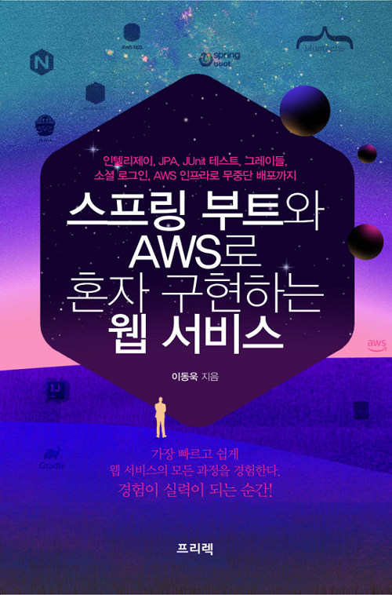
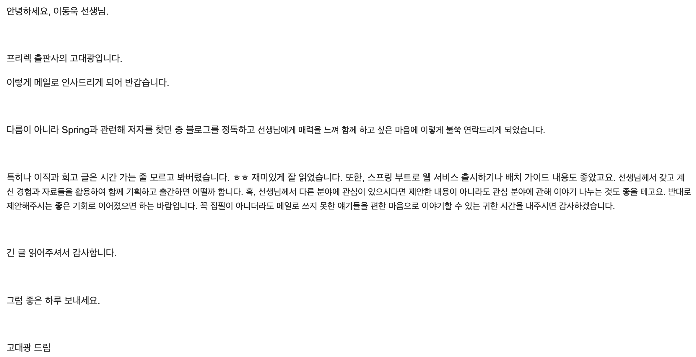
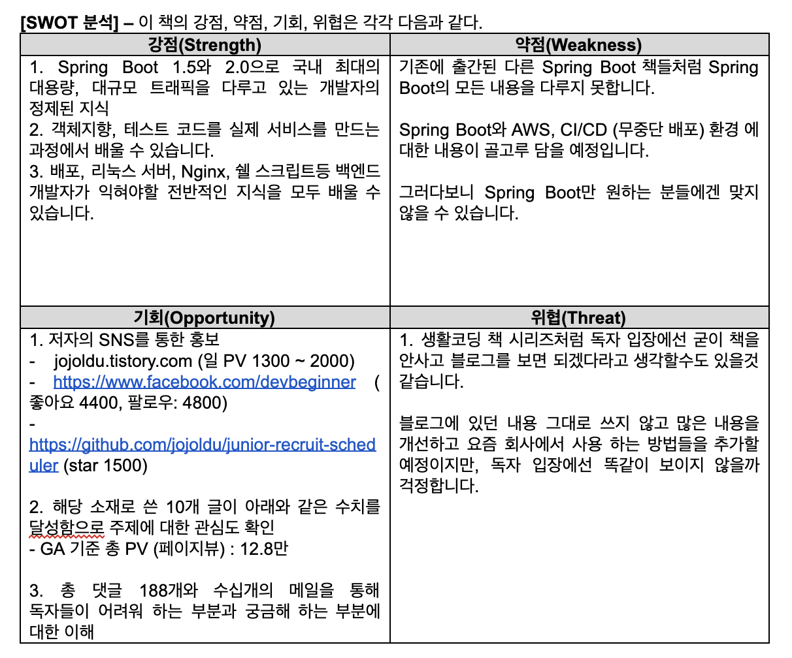
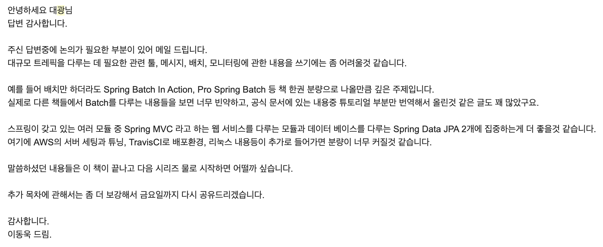
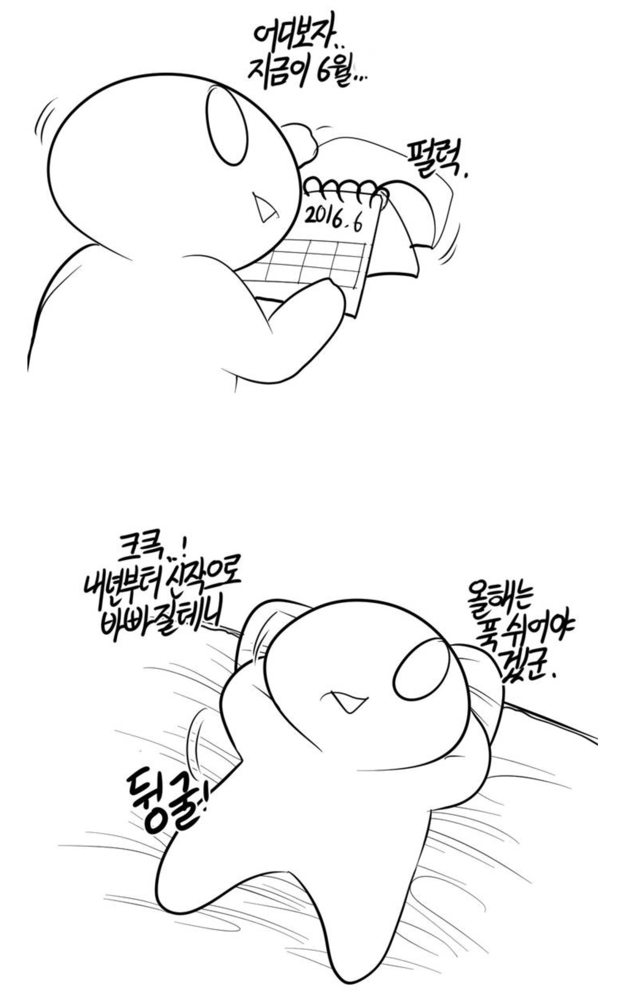
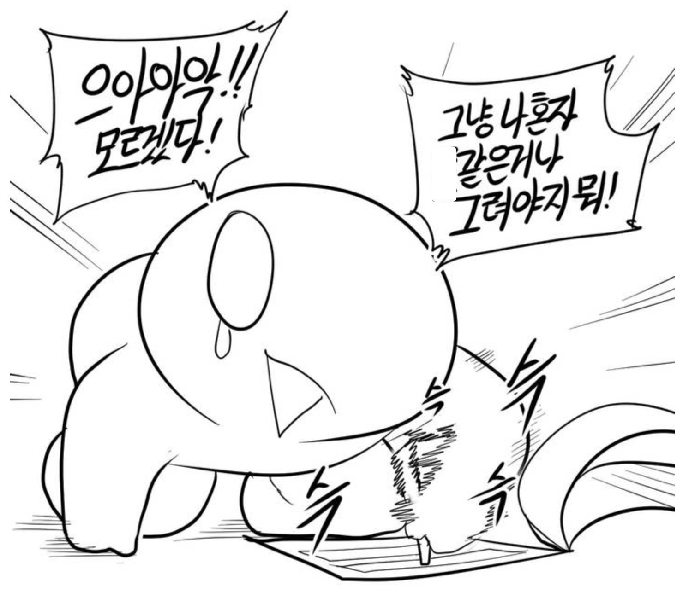
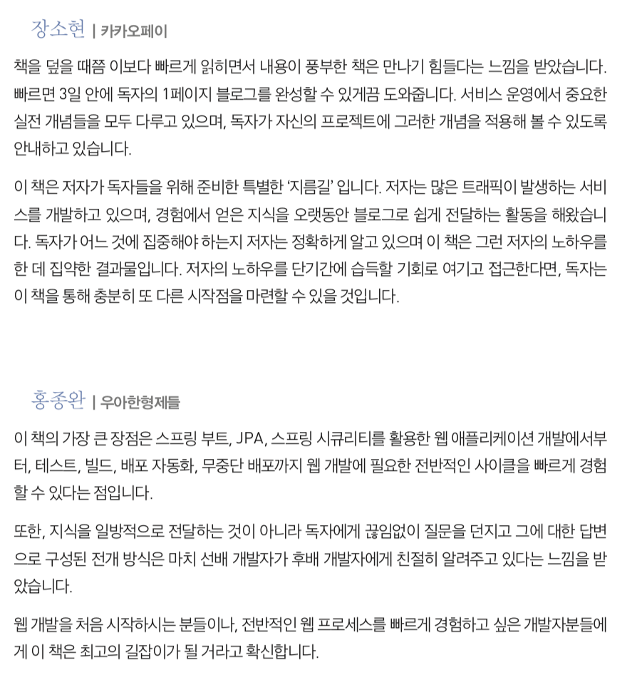

# [스프링 부트와 AWS로 혼자 구현하는 웹 서비스] 출간 후기

<div align=center>



(출판사: 프리렉, 쪽수: 416, 정가: 22,000원)

</div>

저의 첫 저서인 **스프링 부트와 AWS로 혼자 구현하는 웹 서비스**가 출간되었습니다.  
스프링 부트 책으로는 드물게 **스프링부트 파트와 AWS를 이용한 운영파트가 5:5로 구성**된 책입니다.  
즉, 스프링 부트만 사용하는 개발자가 아닌 스프링 부트를 사용하는 **서버 개발자**가 되고 싶은 분들에게 도움이 될 것 같습니다.  
  
2019년 하반기 회고로 간단하게 소개할까 생각했습니다만, 이렇게 제대로 후기를 남기는게 중요할 것 같아 작성하게 되었습니다.  
  
후기의 계기는 [장영학님의 글](https://brunch.co.kr/@younghakjang/51) 때문인데요.  
  
> 어느 출판사 분과 이야기하다가 졸작에 대한 이야기가 나왔습니다.
> 많은 작가들이 **겸손하게 보이려고** 자기 저서를 "졸작"이라 표현합니다.
> 그리고 어떤 작가는 자기 입으로 홍보하기 부끄러워서, 혹은 진짜 자기 글이 부끄러워서 책을 사달라는 홍보도 잘 하지 않습니다.
> 책을 팔아야 하는 출판사 입장에서는 정말 이해가 되지 않는 행동입니다.
> **진짜 부끄럽다면 책을 내지 말았어야죠**.
> 책을 낸다는 것은 자신의 생각을 다른 사람들이 알아줬으면 하는 행위입니다.
> 그리고 그 과정에 작가 본인과 많은 사람들의 시간과 노력이 들어갑니다.
> 그 책을 읽은 사람들이 부족한 부분을 발견하고 거기서부터 대화와 배움이 시작되는 것은 지극히 정상적인 과정이 아닐까요?
> "책을 내긴 냈는데 내가 생각해도 부족하니 읽고 싶으면 읽고 아님 마세요" 같은 자세는 무책임하다고 생각합니다.

부족한 컨텐츠를 유료로 판매한다는 것에 부끄러움이 많던 입장에서 굉장히 공감이 되었습니다.  
책을 쓰신 분들에 대한 존경심이 무럭무럭 커지기도 했구요.  
  
저자 혼자 만들어 낸 작품이 아니기 때문에 이 책을 왜 사야 하는지 소개겸, 회고겸 해서 후기를 작성하게 되었습니다.  

## 서적 링크

일단 오프라인 서점에는 **2019.12.02** (월) 부터 올라갈 예정입니다.  
강남 교보문고나 광화문 교보문고는 주말에도 올라올 순 있겠지만, 혹시 모르니 꼭 재고 확인을 하고 방문 부탁드립니다.  
  
현재 (2019.11.30) 온라인 예약 주문은 가능합니다.

* [교보문고](http://www.kyobobook.co.kr/product/detailViewKor.laf?ejkGb=KOR&mallGb=KOR&barcode=9788965402602&orderClick=LET&Kc=)
* [YES24](http://www.yes24.com/Product/Goods/83849117?scode=032&OzSrank=1)
* [인터파크](http://book.interpark.com/product/BookDisplay.do?_method=detail&sc.prdNo=321796760)
* [반디앤루니스](http://www.bandinlunis.com/front/product/detailProduct.do?prodId=4296899)
* [쿠팡](https://coupa.ng/bke6rM)

## 기존 블로그 시리즈와의 차이점?

이 책은 2017년 12월부터 시작되어 2018년 2월에 끝난 [스프링부트로 웹 서비스 출시하기](https://jojoldu.tistory.com/250) 을 토대로 합니다.  
  
해당 시리즈는 누적 조회수 20만, 200개 이상의 댓글을 달성했는데요.  
그러다보니 아직도 많은 분들이 스프링부트를 이용한 실습이 필요할 때 해당 시리즈를 많이 참고할 정도의 인기 시리즈입니다.  
  
책을 냈다고 해서 **해당 시리즈를 삭제하거나 숨김 처리하진 않습니다**.  
그럼 무료로 볼 수 있는 블로그 시리즈를 두고, 굳이 돈을 내서 책을 봐야할 이유가 무엇인지 궁금하실텐데요.  
  
다음과 같은 점들이 구매해야할 이유라고 생각됩니다.

* 기존에 스프링 부트 1.5.x 였던 내용을 모두 스프링 부트 **2.1.x**에 맞춰 개편했습니다.
  * 기존 시리즈를 보시던 분들은 스프링 부트 버전이 2로 올라오면서 많은 장애물을 만났습니다.
  * 이 부분을 문의 주신 내용들을 포함하여 모두 개편했습니다.
* 기존에 없던 **스프링 시큐리티**와 **소셜 로그인**이 추가 되었습니다.
  * 당연히 가장 최신의 설정을 사용했습니다.
  * AWS 배포 후에도 문제가 없는 소셜 로그인 설정을 가이드합니다.
* 테스트 코드에 관해 별도 챕터로 분리하여 상세하게 가이드합니다.
* **AWS 내용이 전면 개편**되었습니다.
  * 블로그 연재 당시엔 AWS가 처음이라 부족한 내용이 많았습니다.
  * 지금은 회사에서 사용한 경험을 토대로 다시 작성했습니다.
* 인텔리제이 (커뮤니티버전) 로 스프링 부트 환경에서의 개발 방법을 자세하게 추가하였습니다.
  * 단축키는 윈도우와 맥 환경 모두를 소개합니다.
  * 스프링 부트 개발에 필요한 주요 플러그인들을 소개합니다.

특히 강조하고 싶은 것은 **많은 개념과 보충 설명들이 추가 되었다는 것**입니다.  
기존 블로그 시리즈는 만드는데 집중하다보니 **설명들이 많이 빠져있습니다**.  
(일단 만들어 보자가 주 목적이였기 때문입니다.)  
  
하지만 책에서는 주요 개념들과 꼭 알아야할 내용들에 대해서 이해할수 있도록 준비했습니다.

> 전문적인 지식들은 당연히 토비의 스프링, 김영한님의 JPA 책 등을 이용하셔야합니다 :)

사내/사외의 신입 개발자분들을 대상으로 여러 리뷰를 받았습니다.


(피드백#1)


(피드백#2)  
  
같은 신입/취준생/주니어 개발자들이 재밌게 보셨으니 재미나 유익함에 대해서는 어느정도 보장되었다고 보셔도 될 것 같습니다.

## 기존 책들과의 차이점

기존에 스프링부트로 진행하는 실습형 책들이 많이 있습니다.  
레퍼런스형식의 책들 보다는 실습형 책들과 비교하는게 맞을것 같은데요.  
제 생각엔 크게 2가지 강점이 있다고 생각합니다.

### 베스트 프렉티스

최대한 **베스트 프렉티스에 맞게 작성**했습니다.  
비슷한 실습형 책들 중 **일부는 현업에서는 안티 패턴**으로 불리는 방법들을 소개하는걸 종종 봤습니다.  
  
예를 들어 다음과 같은 경우인데요.

* DB의 date/time 필드를 Java의 ```String``` 으로 받아서 처리하는 코드
* ```System.out.println```으로 이루어진 테스트 코드
* ```Setter``` 메소드로 도배된 Entity 클래스들
* ```@Autowired``` 로 도배된 Spring DI 코드

> 물론 모든 실습형 책들이 이렇다는 것은 아닙니다.  
> 제가 찾아본 책들 중 **일부가 그렇다는 것**이죠.  
  
처음 스프링부트로 웹 개발을 시작하시는 분들은 어떤 방식이 더 좋은 방식인지 구분할 수가 없습니다.  
그렇기 때문에 최대한 정석에 가깝게 소개드려야된다고 생각합니다.  
  
이 책에서는 최대한 많은 **서비스 회사들의 베스트 프렉티스**를 참고했습니다.  
그런 회사들을 목표로 하시는 분들께는 간접 체험을 해볼 수 있지 않을까 생각됩니다.
  
> 물론 이 책에 있는게 다 정답이고 나머지 책들은 다 틀렸어! 라는 이야기는 아닙니다.  
> 이 책을 통해 먼저 보시고, 다른 책들을 직접 참고해보시고 마음에 드시는 방법을 선택하시면 좋을것 같습니다.

### 운영 환경 실습

기존의 책들 역시 운영 배포 환경에 대해서 소개를 합니다.  
단, 헤로쿠나 GCP와 같은 **PaaS** 환경에서의 배포만 경험할 수 있는데요.  
이 책에서는 아래 질문에 대한 대답들을 실습으로 준비 했습니다.

* 배포된 서버와 DB의 연결은 어떻게 맺지?
* 배포 서버의 기본적인 리눅스 설정은 어떻게 하지?
* DB의 케릭터셋을 비롯한 여러 설정들은 어떻게 하지?
* 직접 CI/CD 환경을 구축하고 싶은데 어떡하지?
* 서비스 중단 없이 배포가 되려먼 어떡하지?

위에서 언급한 내용들을 비롯해

* Nginx에 대한 기본적인 설치와 설정
* AWS RDS 에서 필수로 해야할 파라미터 설정
* AWS EC2의 보안그룹, EIP 등 기본적인 설정
* Travis CI의 기본적인 사용방법

등등 다른 곳에서도 충분히 사용 가능한 내용들을 담고 있습니다.  
  
혼자서 웹 서비스를 만들고 싶으신 분들께는 스프링부트를 이용한 웹 애플리케이션 개발, AWS를 이용한 운영 환경 구성에 대한 기본적인 가이드가 될 수 있는 책이라 생각됩니다.

## 집필 후기

2018년 8월 ~ 9월 사이에 갑자기 출판 제의가 몰렸습니다.  
그 전에는 전혀 제의가 없다가 딱 그 시기에 3 ~ 4군데에서 연락이 왔는데요.  
당시엔 크게 관심이 없었습니다.  
출판에 대해서 긍정적으로 보던 입장은 아니였기 때문입니다.  
  
주변에 이미 출판 해본 경험자분들이 많아 출판 과정의 구조상 저자는 인세로 **8 ~ 10**%를 받는다는 것을 알고 있었습니다.  

> 보통 저자 10%, 출판사 40%, 서점 50%을 가집니다.  
> 좀 더 자세한 내용이 궁금하신 분들은 [링크](https://brunch.co.kr/@businessinsight/47) 를 참고해보시면 좋습니다.

즉, 20,000원의 책이 팔릴 경우 **권당 2,000원**이 저자에게 가는 셈이죠.  
1,000권이 팔릴 경우엔 **200만원**의 수익이 발생합니다.  

> 요즘 IT 도서는 1000부 팔리기도 힘들다고 합니다.

평균 집필 기간은 6개월 ~ 1년이니,  

* 6개월 ~ 1년간
* 매일 2 ~ 3시간씩 글을 쓰면
* **200만원의 수익**이 발생 한다는 것이죠.  

수익만 본다면 **인프런 하는게 훨씬 낫다**고 생각됩니다.  
  
더 큰일은 그 기간 동안 **실력 향상이 거의 안된다는 것**입니다.  
집필이라는게 **기존에 내가 잘 알고 있는 내용을 쉽게 이해할 수 있게 정제**하는 과정이라고 생각합니다.  
즉, 이미 알고 있는 내용을 다시 정리하는데 남는 시간을 모두 써야한다는 것이죠.

> 물론 잘 모르는 주제로 책을 쓰면서 공부가 되었다는 분도 계십니다.
> 전 성향상 그렇게 하고 싶진 않습니다.
> 돈을 주고 구매한 사람들에게 "**사실 나도 이 주제로 실전에서 써본적은 없어**" 라고 속이는 느낌이랄까요.

배워야 할게 산더미 같은 지금 입장에서는 집필 기간 동안 **성장이 멈추는 것**이나 마찬가지라고 생각했습니다.  
  
이 2가지 이유 때문에 **블로그와 개인 프로젝트** 외에 집필은 전혀 고려 대상이 아니였습니다.  
  
정중하게 거절 메일을 보내던 중, 프리렉 출판사의 고대광 편집자님의 메일을 보게 되었는데요.  
다음과 같이 정말 정중하게 메일이 왔습니다.



다른 집필 제안들과 다르게 정말 제 글을 마음에 들어하신다는게 느껴지는 메일이였습니다.  
그래서 집필 여부와 관계 없이 한번은 만나뵙고 싶다는 생각에 뵙게 되었습니다.  
  
뵙고 나서 여러 이야기를 나눈 결과, **내 손으로 유형의 무언가를 만들어보면 좋겠다**는 생각이 들었습니다.  
이미 컨텐츠는 준비되어 있으니 생각보다 많은 시간이 소요될것 같지도 않다는 점도 한몫 했구요.  
  
그렇게 집필을 결심하게 되었습니다.

### 계약 하기 

고대광 편집자님이 계신 프리렉과의 정식 집필 계약 전에 **저서 기획서**를 작성해야 했습니다.  
새로 쓰게 될 책에 대한 전반적인 주제와 **SWOT** 분석을 하는 것입니다.  
  
생에 처음으로 (!?) SWOT 분석을 해봤습니다 ㅠ



(1년전 기준이며 현재는 일 PV 5,000, 시리즈 누적 조회는 20만이 되었습니다.)  
  
> SWOT 분석은 [출판사 에디터가 알려주는 책쓰기 기술](http://www.yes24.com/Product/Goods/63342966)에서 많은 도움이 되었습니다.

기획서를 보내드리고 나서는 제가 생각한 책의 주제와 편집자님이 생각하신 주제들을 정리하는 시간을 가졌습니다.  
주제들을 정리하면서 책에 대해서도 다시 한번 정의를 내려보았는데요.  
  
요즘 같이 **인터넷으로 공부하는 시대**에 책의 역할이 무엇일까요?  
독자마다 다르겠지만, 초보 개발자에게 책은 **혼자서 검색할 수 있을 정도의 기초 역량을 키우는데** 역할이 있다고 생각했습니다.  
뭐라도 알아야 인터넷이나 유튜브를 통해서 검색해서 배울수 있지 않을까요?  
그래서 이 책이 다루는 영역도 **모든 스프링 모듈을 다루지 않길 원했습니다**.



당장 웹 서비스를 하는데 필요하지 않은 다른 모듈들은 모두 배제하고, 가장 필요한 내용들에만 집중하도록 주제를 정리했습니다.  
  
그렇게 기획서 작성을 마무리하고  
  
2018년 10월.  
드디어 계약서에 사인을 하고 본격적으로 집필이 시작되었습니다.

### 10개월간의 집필

솔직히 고백하자면....  
3개월이면 다 쓸 줄 알았습니다.  
하지만 결과는 집필 10개월, 탈고 및 출간준비 3개월 해서 도합 **13개월**이 걸렸습니다.


핑계야 여러개 있었겠지만, 결과적으로는 굉장히 러프한 일정으로 인해서 **마음속 우선 순위에서 집필은 계속 밀렸습니다**.



(대략 이런 느낌?)  
  
당시에 제가 세운 하루 일정은 다음과 같습니다.

* 출근 전 시간: 개인 공부
* 퇴근 후 시간: 세미나 준비 or [Next Step](https://edu.nextstep.camp/) 코드리뷰
  * 이거 하고 남거나 비어있을때 집필
* 주말
  * 데이트 시작 전: 개인공부
  * 데이트 종료 후: 집필

즉, 개인공부 / 세미나 준비 / 데이트 **다 하고 남으면 집필**하다보니 진도가 거의 나가지 않았습니다.  
결과적으로 5개월이 지나도 전체 분량의 30%도 진행되지 않은 상황이 되었습니다.  
  
이대로는 올해에 출간 못하겠다는 생각에 **출근 전 1시간을 제외한 나머지 시간은 집필에 할당했습니다**.  
물론 저녁 시간은 완전히 집필에 올인을 했구요.  
즉, **하루에 1시간만 개인 공부** 하고 나머지 모든 시간을 집필에 쏟았습니다.  



(그렇다고 이렇게 한 건 아니구요... ㅠ)  
  
다행히 그렇게 쏟아부으니 **7월 초에 1차 버전**이 완성 되었습니다.  
  
이때부터 3개월간 지옥의 탈고 시간을 거쳤습니다.  
탈고 시간은 편집자분이 원고를 리뷰해주는 시간이라고 보시면 되는데요.  
다음의 내용들은 앞으로 책 쓰실 분들도 참고하시면 좋을것 같아 제가 탈고때 받은 리뷰 내용을 남깁니다.

* 영문명은 웬만하면 한글명으로
  * Gradle (x) -> 그레이들, Spring Boot (x) -> 스프링부트
  * 이 책을 읽은 독자분들이 해당 영문명을 어떻게 읽어야할지 모르는 경우가 많다고 합니다.
* 박스 표기 등 조금이라도 편집이 들어간 이미지를 사용했다면 **원본 이미지를 꼭 별도 보관** 하셔야 합니다.
  * 책 크기에 따라 재편집 해야될 가능성이 높습니다.
* 외부 링크는 저자 블로그 / 공식 사이트 등 **이후에도 계속 살아 있을 사이트**로 합니다.
  * 개인 블로그는 언제든 블로그가 없어질 수 있으니 웬만하면 사용하지 않습니다.

이외에도 설명이 부족했던 부분들에 대해서도 많은 추가가 진행되어 결국 11월 마지막날이 되어서야 출간이 되었습니다.

### 집필 도구

집필 도구는 VS Code + Markdown + Pandoc 을 사용했습니다.  
편집하시는 분들은 원고를 보실때 **Word** 파일을 선호하다보니 PDF로 드릴수가 없는데요.  
(편집이 가능해야하니)  
  
> 물론 구글 Word를 사용해도 무방합니다.  

마크다운에서 Pandoc을 사용해서 바로 Word 파일을 생성하게 되면 PDF만큼 깔끔한 형태가 나오지가 않습니다.  
그동안 선호해오던 마크다운을 버리고 MS Word 혹은 구글 Word의 단축키와 사용법을 익혀서 집필을 해야하나 고민이 되었습니다.  
  
그래서 일단은 1장은 구글 Word로 진행해보았는데, **생산성이 너무 떨어졌습니다**.  
단축키도 제대로 익히지 않은 상태이기도 하고, **이미지나 스타일을 사용할때마다 마우스에 손이 가는 것이** 너무 생산성이 떨어지는 행위였습니다.  
  
그래서 안되겠다 싶어, 최대한 Pandoc을 이용해 집필에 맞는 스타일을 구축하고 원고를 작성했습니다.  
1장을 Pandoc으로 제작해 편집자님께 전달드렸고, 이정도 스타일이면 충분히 편집부에서 교정이 가능하다는 확인을 받았습니다.  
  
마크다운 사용을 허가받은 이후로는 아주 생산성 높게 글을 작성할 수 있었고, 2~3주에 1개 쳅터를 작성할 수 있었습니다.

> 마크다운으로 집필 하기는 [Gitbook 과 Pandoc 을 이용한 전자 출판](https://blog.appkr.dev/work-n-play/pandoc-gitbook-%EC%A0%84%EC%9E%90%EC%B6%9C%ED%8C%90/) 글을 참고해보시면 도움이 많이 됩니다.

### 추천사

추천사는 **주변의 고수 개발자 분들은 고려하지 않았습니다**.  
오히려 **블로그에 있던 시리즈 물을 보고 좋은 서비스 회사로 이직하신 주니어 개발자**분들에게 추천사를 받고자 했습니다.  
결국 이 책을 보시는 독자분들이 원하는 후기/추천사가 자신과 비슷한 개발자분들의 이야기이지 않을까 싶었습니다.




다행히 주변에 그런 경험을 갖고 계신분들이 계셔서 편하게 추천사를 받을 수 있었습니다.  
다시 한번 추천사를 써주신 소현님, 지한님, 종완님, 유성님 모두 감사드립니다.
  
> 특히 **신혼 여행 중임에도 추천사를 작성해주신 소현님 정말 감사드립니다.**

## 마무리

아마 이 글을 다 읽으신 분들은 저에게 2가지가 궁금하실텐데요.  

* 그래서 책쓰기 추천하시나요?
* 2번째 책을 쓰시나요?

일단 책쓰기는 한번은 해보시는걸 추천드립니다.  
  
꼭 저자가 목적이 아니더라도, **읽기 좋은 컨텐츠를 만드는 전반적인 팁**을 얻을 수 있는 과정입니다.  
블로그만 하시는 분이더라도, 한번쯤은 전문가분들의 교정을 받아 보실수 있는 좋은 기회이니 한번쯤은 도전해보시길 추천드립니다.  
  
2번째 책은 현재 확정적으로 진행중입니다.  
그리고 현재 네이버의 정상혁님과 함께 스프링 배치 책을 공저 중입니다.  
내년 상반기를 목표로 하고 있는데, 다시 본격적으로 집필을 시작해야겠습니다.  
  
배치 책도 끝나면 다음 계획은 없습니다.  
원래 계획하고 사는 사람이 아니라서요.  
그때그때 재밌는 기회가 있을때마다 이것저것 해보려고 합니다.  
  
여튼 너무나 긴 후기 끝까지 봐주셔서 감사합니다.  
  
책 재밌게 봐주세요!!  
고맙습니다.

