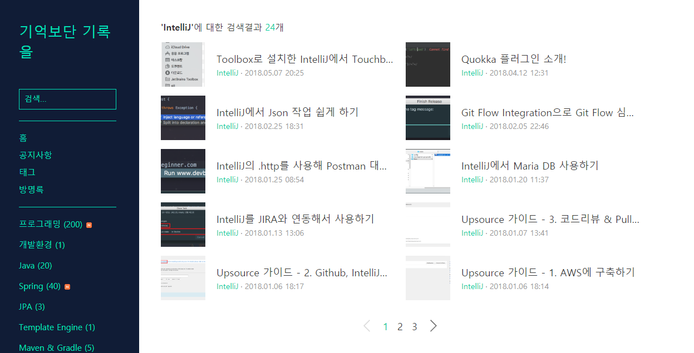

# IntelliJ & 안드로이드 스튜디오 기본 가이드 소개

아마 예전부터 블로그를 방문하신 분들은 아시겠지만 저는 IntelliJ를 굉장히 좋아합니다.

처음 IntelliJ Ultimate 라이센스를 회사에서 받았을때, 이걸 도대체 어떻게 써야하나 막막했습니다.  
"누가 차례대로 하나씩 알려줬으면 좋겠다."  
"Eclipse에서 쓰던 기능이 IntelliJ에서 어떻게 쓰는지 소개해주는 자료가 어디 없나"  
등등 생각은 많고, 행동으로 옮기지 못했습니다.  
  
특히 Eclipse에 비해 한글로 된 자료가 너무나 부족해서 **실제로 2달이 지나서야 사용하기 시작**했습니다.  
  
아마 이건 안드로이드 스튜디오 역시 마찬가지인걸로 알고 있습니다.  
여전히 Eclipse에 안드로이드 플러그인을 설치해 개발하시는 분들을 자주 봤습니다.  
메인 개발 툴을 바꾼다는건 그만큼 번거롭고 귀찮은 일이라고 생각합니다.  
  
이건 예전에도 한번 [브런치](https://brunch.co.kr/@jojoldu/3)에 소개했던 내용인데요.  
이 글의 전체 맥락과 이어지니 한번 읽어보시길 추천드립니다.

> 톰캣을 구동시키기 위해 마우스에 손을 올릴때,  
방금 전 열었던 클래스를 다시 열기 위해 마우스에 손을 올릴때,  
Refactor 기능을 사용하기 위해 우클릭을 할때마다  
코딩의 흐름이 끊기는건 아닐까 생각하게 되었다.  
즉, 
**마우스에 손을 올릴때마다 생산성이 떨어지는 느낌**이였다.  
당시에는 내가 하는 클릭들의 단축키를 찾는 것이 더 시간 아깝다란 생각 혹은 이게 낭비라는 생각도 들지 않아서 찾아보지 않았다.  
그리고 계속해서 마우스로 해결을 해왔다.  
이렇게 **비효율적이지만 익숙한 방법을 고수하는것**.  
이게 바로 기술부채가 아닐까란 생각이 문득 들었던 것이다.  
개발자는 끊임없이 자기 개발을 해야하는 직업이라고 얘기한다.  
사이드 프로젝트,  
새로운 개발언어,  
새로운 프레임워크  
등등..  
다들 여러 방법으로 학습하고 자기 개발을 한다.  
근데 이런 것들이 가장 중요할까  
물론 이런 내용들이 나쁘다는 이야기가 아니다.  
다만 트렌드만 쫓고, 본인의 생산성은 낮은 상황이라면 조금은 공부 방향에 대해 고민해봐야 하지 않을까 라는 것이다.  

메인으로 쓰고 있는 IDE가 익숙하면 익숙할수록 어떤 학습을 해도 빠르게 진행할 수 있습니다.  
클린 코드를 연습하던, 테스트 코드를 연습하던, 새로운 프레임워크, 새로운 언어 등등 어떤걸 배운다하더라도 큰 도움이 되는게 IDE 숙련도라고 생각합니다.  
하지만, 그럼에도 불구하고 **많은 분들이 메인 개발 툴에 대한 연습과 학습은 비중을 두지 않습니다.**  
이걸 제가 고친다거나 그럴수는 없을것 같습니다.  
그래서 가장 많이 필요한 기능들 위주로, 젯브레인 계열의 모든 IDE에서 공용으로 사용할 수 있는 기능들 위주로 가이드를 찍어보잔 생각을 하게 됐습니다.  
그리고 최근에야 [IntelliJ 사용법에 대한 가이드 영상](http://bit.ly/2NBjCb3)을 인프런에 올리게 되었습니다.  
  
제가 생각했을때 꼭 아셔야할 기능들 위주로만 했기 때문에 길지 않습니다.  
**전체는 3시간** 정도이고, **편당 10 ~ 20분** 사이로 출/퇴근길에 한편씩 보시기 좋게 만들었습니다.  
IntelliJ IDEA Community 버전 (무료) 를 기준으로 만들어 다른 젯브레인 IDE에서도 동일하게 사용하실 수 있습니다.  

> 안드로이드 스튜디오 역시 IntelliJ IDEA Communtiy를 기반으로 만들어진 IDE라서 동일한 UI, 단축키, 기능, 플러그인 등을 제공하고 있습니다.

전체 커리큘럼은 아래와 같습니다.

* 소개
    * 강사 및 강의 소개
    * Toolbox 소개
    * 프로젝트 생성
* 코드 Edit
    * 메인메소드 생성 및 실행
    * 라인 수정하기
    * 코드 즉시보기
* 포커스
    * 포커스 에디터
    * 포커스 특수키
* 검색
    * 검색 텍스트
    * 검색 기타
* 자동 완성
    * 코드 자동 완성 
    * Live Template
* 리팩토링
    * 리팩토링 Extract
    * 리팩토링 기타
* 디버깅
* Git & Github
    * Git 기본 기능 사용하기
    * Github 연동하기
* 플러그인

전체 파트가 다 도움이 되시겠지만, 특히 **리팩토링/디버깅** 파트는 꼭 보시길 추천드립니다.  
IntelliJ 기반의 IDE가 이렇게 좋구나 라는걸 새삼 깨닫게 되는 계기가 될 수 있다고 생각합니다.  
  
아래는 무료로 볼 수 있는 영상중 하나 입니다.  
한번 보시고 괜찮으시다면 수강해보시길 추천드립니다.

* [강의 링크](http://bit.ly/2NBjCb3)

> ps. 2018.07.24 까지 50% 할인중입니다 :)