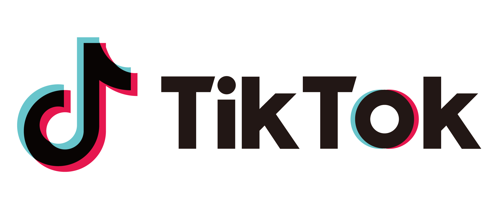

# 공급자 지향 플랫폼

요즘 재밌게 보고 있는 웹툰 & 웹소설 중에 네이버 시리즈에 있는 [화산귀환](https://series.naver.com/novel/detail.series?productNo=4130558)이 있다.  

웹 소설로 시작해서 그 인기에 힘입어 [웹툰](https://comic.naver.com/webtoon/list?titleId=769209)으로 나오게 된 작품이다.  
  
> 웹 소설의 경우 **누적 조회수가 2.6억**이다.  
> 네이버 시리즈 최고 히트작 중 하나이다.  
   
처음엔 이 작품을 웹툰으로 시작했다.  
웹툰으로 쭉 보다가 웹 소설로 전향한 경우이다.  
이유는 **아무리 돈이 있어도 회차가 더 나오지 않아 그 이상 볼 수가 없었기 때문**이다.

**웹툰에서는 56화밖에 없는 이야기가 웹소설에서는 1183화까지 나와있다**. 
그러다보니 다음 이야기가 너무 궁금해서 웹소설로 넘어가서 보고 있다.  

그래서 요즘 웹툰은 그냥 작가님을 위한 응원의 마음으로 결제하고, 시간이 될 때마다 웹소설만 본다.  
  
요즘은 굳이 웹툰을 결제해야하나 생각중이다.  
어차피 웹 소설로 다 본 내용이기 때문이다.  
  
이건 참 신기한 일이다.  
웹툰은 컨텐츠를 소비하는 입장으로 장점이 많다.

* 훨씬 **보는 재미**가 있다.  
* 훨씬 **보기에 편하다**.
  * 굳이 글을 다 읽을 필요가 없다

**컨텐츠 소비자로서 이만큼 장점이 있음에도** 웹소설을 보는게 요즘의 내 모습이라는 것이다.  
  
왜 그럴까 생각해보면 결국 **연재주기 때문**이라고 생각했다.  
  
**웹툰은 1주일에 1회도 어렵다**. 

(작가님들을 위한 정기휴재는 이제 웹툰에서는 거의 필수로 적용된다)  
  
반면 **웹소설은 1주일에 5~7회를 연재**한다.  
웬만해서는 휴재도 잘 나지 않는다.  
(내가 보던) 대부분의 작품이 정해진 시간에 매일 회차가 올라온다.  
웹소설로 본다고 해서 웹툰보다 크게 재미가 떨어지지도 않는다.  
**중요한건 내용이고**, 내용이 너무나 재밌기 때문에 그게 **만화냐 글이냐는 크게 중요하지 않다**.  
  
보기가 편한 웹툰이라 하더라도 보고 싶은 내용을 못볼바에는,  
상대적으로 보기 불편해도 웹소설로라도 **보고싶은 내용을 다 보는게 낫다**는 것이다.  
  
이걸 보면서 **최근의 고객 지향 서비스**들을 생각하게 된다.  
유튜브, 쿠팡, 아마존을 보면 `고객 === 소비자` 이다.  
그러다보니 소비하는 사람이 최대한 편하게 하는 것에 최선을 다한다.  
  
근데 **소비자 맞춤형 서비스란 공급자의 시간과 정신을 갈아넣어서 만드는 경우**가 많다.  
  
일례로 [개발바닥 유튜브 채널](https://www.youtube.com/channel/UCSEOUzkGNCT_29EU_vnBYjg) 을 운영하면서 호돌맨이 영상 편집하는데 들어가는 시간은 **매주 8시간에서 10시간**이였다.  
2시간짜리를 촬영해서 20분으로 줄이고, 자막과 짤 정도만 추가하는데도 그정도가 필요한 것이다.  
이걸 매주 한다고 생각해보자.  
1년 내내 주말이 없는 삶이 된다.  
그래서 우린 **12월부터 2월까지 쉴 수 밖에 없었다**.  

소비자를 편하게 하기 위해 **제대로된 공급을 못하는 방식이 진짜 좋은 것일까**?  
소비자에게도 좋은 것일까?  
  
컨텐츠 공급자가 이만큼의 시간을 쓴 것에 비해 과연 소비자가 느끼는 체감이 "**영상(혹은 웹툰)과 텍스트 사이에서 그렇게 큰 간격이 있을까**??" 하는 것이다.  
  
소비자가 조금 불편하더라도 공급자가 편한만큼 **다양하고 많은 양의 컨텐츠가 끊임없이 생산되도록 하는 것**이 더 좋지 않을까?    
  
나는 틱톡도 **컨텐츠를 쉽게 생성하고 올리는 것에 집중**했기 때문에 잘되었다고 생각한다.  

짧은 컨텐츠라 소모하기 편했다는 장점도 있겠지만,  
그것보다는 **공급자 입장에서 허들이 낮았기 때문**이 더 큰 이유라고 생각한다는 것이다.  
컨텐츠를 편하게 생성하도록 지원해서 **많은 사람들이 컨텐츠 생성에 허들을 적게 느끼기 때문에** 잘된게 아닐까 싶은거다.  
  
본의 아니게 교육업계에 있다보면 **더이상 글로 공부하는 사람은 없다**는 이야기를 참 많이 듣는다.  
다음과 같은 이야기다.

* 무조건 영상으로 교육을 만들어야 한다.  
* 참여형으로 교육을 만들어야한다.
* 교육하는 시스템을 고쳐야 한다, 개선해야한다 등

**최대한 학생 (소비자)가 편하게** (흔히 말하는 떠먹여주는) 형태의 교육만을 강조한다.  
  
그리고 그렇게 맞춰진 초점은 점점 **컨텐츠 제공자들의 참여 허들을 높인다**.  
  
정말 좋은 책을 몇 권이나 쓰신 대단한 개발자분도 유료 영상은 1개 혹은 2개만 만들고 더이상 만들지 않는걸 자주 목격한다.  
영상 촬영, 편집을 다 해주는 플랫폼이 나옴에도 쉽사리 영상을 추가 제작하지는 못하신다.  
영상 촬영과 편집을 다 해준다해도, 마음에 안들어서 재촬영이라도 할려면 **영상팀을 다시 다 불러서 해야하기 때문**이다.  
그렇다고 직접 하기에는 너무나 허들이 높다.  
  
영상 컨텐츠를 만든다는 것은 다음의 명백한 허들이 있다.

* 기본 편집의 공수가 들어간다.
  * 기침소리, 키보드치는 소리 등을 제거해야한다
  * 음질, 화질 등을 기본적으로 설정을 해서 보는 사람이 편하도록 해줘야한다.
* 장소에 영향을 많이 받는다.
  * 이동중에 컨텐츠 제작을 할 수가 없다. 
  * 키보드, 모니터, 마이크 등이 확보된 조용한 공간이 필수이다.
* 편집 도구를 익히는 시간이 필요하다
  * ScreenFlow 등 기본적인 촬영, 편집 프로그램을 익혀야 한다.
* 짬짬이 10분, 20분 시간이 남을때 제작을 할 수가 없다.
* 잘못 녹화된 부분을 수정/편집하기가 너무 어렵다.

예를 들어, 나는 20~30분 여유 시간이 있을때마다 글을 쓰고, 이걸 재료 삼아 긴 글을 완성한다.  
책을 쓸때도, 잡지 원고를 쓸때도, 블로그를 쓸때도 항상 그랬다.  
돼지 저금통에 100원, 500원을 모아 큰 돈을 만들듯이 남는 시간을 조금씩 아껴 긴 글을, 좋은 글을 완성해갔다.  
그렇게해서 굉장히 많은 컨텐츠를 계속해서 뽑아낼 수 있었다.  
  
근데 영상에서는 그게 안된다.  
무조건 **집중할 수 있는 1시간 이상의 여유시간과 마이크가 세팅된 조용한 공간**이 꼭 확보되어야만 한다.  
"회식 하고 30분만 딱 하고 자야지" 자체가 안된다.  
그러다보니 영상 1개의 완성율은 0 혹은 100만 있다.  
촬영 시작하면 영상 1개가 무조건 나와야한다.  
  
근데 텍스트는 그렇지 않다.  
중간에 작성하다가, 30%에서 멈추고 다음날 아침에 다시 45%까지 추가 완성해도 된다.  
  
이건 나 뿐만 아니라 주변을 봐도 비슷하다.  
**블로그에 글을 계속 쓰는 사람이 출판은 해도, 영상은 잘 촬영하지 않는다**.  
  
물론 책 쓰는게 쉽다는건 아니다.  
다만, **정산율이 8~10%밖에 안되는** IT 출판시장에서 매해 발행되는 책의 수와 유료 영상 컨텐츠 수가 큰 차이가 나지 않는다는 것을 생각해보자는 것이다.  
    
10,000원 책이 팔리면 저자에게 800원에서 1,000원을 주는 출판 시장과 4,000원에서 9,000원을 주는 영상 시장의 컨텐츠 발행수가 비슷하다는 것이다.  
  
즉, 5배 ~ 20배까지 차이나는 정산율임에도 불구하고 컨텐츠 공급의 차이가 없다는 것은 그만큼 **컨텐츠 제작 허들이 높은게 문제**가 된다는 것이다.  
  
계속 학습하는 내 입장에서는 **영상이 되었든 텍스트가 되었든 좋은 컨텐츠가 끊임없이 배출**되는것이 가장 좋다.  
영상이라서 공부하기 쉽고, 텍스트라서 공부하기 쉬운건 부차적인 문제이다.  
공부하고 싶은 분야의 컨텐츠가 뭐가됐든 간에 존재하느냐가 중요하다.  
  
그러다보니 일정 수준 이상의 개발자분들은 여전히 책으로 학습하는 비율이 높다.      
영상 컨텐츠 중에서 초급 과정 외에 중급 이상의 과정은 너무나 소수인 반면, 텍스트 컨텐츠 (미디엄, 사파리북스온라인, 책) 는 양질의 중급이상의 과정들이 넘치기 때문이다.
  
> 아 물론 영상으로 배우는게 더 최적화된 주제들도 있다.  
> 영상으로 학습 하는것 자체가 문제라는 것은 아니다.

이런 생각을 하다보면 점점 동영상이 아닌 **텍스트로 이루어진 IT 교육 컨텐츠 커머스**를 만들고 싶다.  
이미 이 모델을 하고 있는 서비스들이 있다.
  
* 국내에는 [포스타입](https://www.postype.com/)
  * 포스타입은 IT 컨텐츠는 아니지만, 텍스트 기반의 유료 컨텐츠 서비스를 제작할 수 있게 지원한다는 점에서 비슷하다
* 해외에는 [Educative.io](https://www.educative.io/)
  * 작년 5월에 시리즈 A로 1200만 달러 (약 150억) 를 투자 받았다.  

가장 닮은 모델은 [Educative.io](https://www.educative.io/) 이다.  
Educative.io를 통해 학습하시는 분들의 후기를 보면 **텍스트 컨텐츠가 학습에 영향을 끼친다고 생각되지 않는다**.  
  
얼마나 좋은 내용을 담고 있느냐가 중요한 것 같다.  
  
* 하루에 20분, 30분씩 작업해서도 완성할 수 있고
* 좋은 에디터가 지원되어 어디서든 웹으로 편하게 제작할 수 있고
* 서점, 유통과정이 없어 일반 온라인 컨텐츠처럼 높은 정산율이 가능하고 
* PDF 형태가 아닌, 진짜 텍스트 컨텐츠라서 검색이나 메모 등 다양하게 사용가능한 형태

**컨텐츠 공급자에게 최상의 제작 경험을 줄 수 있는** 그런 플랫폼을 만들고 싶은 것이다.  
아무래도 그럴려면 텍스트가 가장 좋은 방식이라고 생각한다.  
  
그래서 요즘은 컨텐츠 커머스 플랫폼을 만들고 싶다는 생각을 참 많이 한다.    
아마 Next Step을 고려할때 정말 이 부분을 고민할 것 같다.
  
> 아! 물론 인프런에서 이거하면 되지 않냐고 할 수 있는데,  
> 나는 **공급자에게 최상의 제작 경험을 주는게 제 1목표인 서비스**를 만들고 싶은 것이다.  
> 인프런이 하고 있는 **여러 서비스, 기능 중 하나로 이걸 하고 싶은게 아니다**.    
> 이것밖에 없고 이것에 모든 힘을 다하고 싶다.

