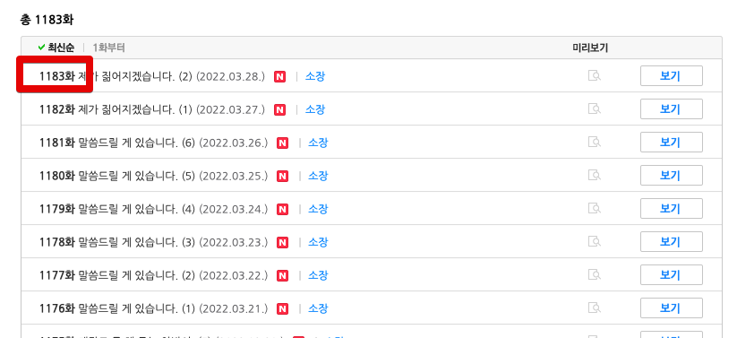

# 공급자 지향 플랫폼

요즘 재밌게 보고 있는 웹툰 & 웹소설 중에 네이버 시리즈에 있는 [화산귀환](https://series.naver.com/novel/detail.series?productNo=4130558)이 있다.  

웹 소설로 시작해서 그 인기에 힘입어 [웹툰](https://comic.naver.com/webtoon/list?titleId=769209)으로 나오게 된 작품이다.  
  
웹 소설의 경우 **누적 조회수가 2.6억**이다.  
네이버 시리즈에서 최고 히트작 중 하나인데, 정말 재밌다.  
   
처음엔 이 작품을 웹툰으로 시작했다.  
웹툰으로 쭉 보다가, 웹 소설로 전향한 경우인데, 이유는 아무리 돈이 있어도 **회차가 더 나오지 않아 그 이상 볼 수가 없었기 때문**이다.

그러다보니 다음 이야기가 너무 궁금해서 웹소설로 넘어가서 보고 있다.  

**웹툰에서는 56화밖에 없는 이야기가 웹소설에서는 1183화까지 나와있다**.  
그러다보니 웹툰은 그냥 작가님을 위한 응원의 마음으로 결제한다.  
시간이 될때마다 웹소설만 계속 보고 있다.  
  
그러면서 요즘은 굳이 웹툰을 결제해야하나 생각중이다.  
어차피 웹 소설로 다 본 내용이기 때문이다.  
  
웹툰은 

* 훨씬 **보는 재미**가 있다.  
* 훨씬 **보기에 편하다**.
  * 굳이 글을 다 읽을 필요가 없다

**컨텐츠 소비자로서 이만큼 장점이 있음에도** 웹소설을 보는게 요즘의 내 모습이라는 것이다.  
  
왜 그럴까 생각해보면 결국 **연재주기 때문**이라고 생각했다.  
  
웹툰은 1주일에 1회도 어렵다. 

(작가님들을 위한 정기휴재는 이제 웹툰에서는 거의 필수로 적용된다)  
  
반면 웹소설은 1주일에 5~7회를 연재한다.  
  

그러다보니 웹툰을 보다가 답답해서 웹소설로 뒷편을 모조리 다 보는 경우가 요즘의 내 컨텐츠 소비 습관이 되었다.  
  
웹툰은 공급자에게 큰 부담을 주는 포맷이다.  

  
반면 웹소설은 주당 5회씩 연재된다.  
특히 내가 좋아하는 화산귀환의 경우 

요즘들어 이 생각을 왜 많이 하게 되냐하면,  
**고객을 외칠때마다 공급자는 고객으로 보지 않는게 아닐까**하는 점 때문이다.  

나는 20~30분 여유 시간이 있을때마다 글을 쓰고, 이걸 재료 삼아 긴 글을 완성한다.  
  
책을 쓸때도, 잡지 원고를 쓸때도, 블로그를 쓸때도 항상 그랬다.  
돼지저금통에 100원, 500원을 모아 큰 돈을 만들듯이 남는 시간을 조금씩 아껴 긴 글을, 좋은 글을 완성해갔다.  
  
근데 영상에서는 그게 안된다.  
아무리 예전보다 제작이 편해졌어도, **영상 제작은 

아마존, 쿠팡등의 빅테크 회사에서 고객 First를 계속 외친다.  
난 여기서 이들이 이야기하는 고객은 **소비자**에만 초점을 맞춘 것이 항상 아쉬웠다.  
왜 공급자는 그 회사들의 고객이 아닐까?  

영상도 마찬가지다.  
영상이 아무리 제작하기가 예전보다 편해졌다한들,  
텍스트보다 더 편할 수가 없다.  

텍스트는 공급자에게 더할나위 없는 포맷이다.

* 술먹고 들어와서 30분만 쓰고 자야지와 같이 

근데 이건 오로지 공급자의 관점이다.  

그래서 요즘 들어서 **텍스트 컨텐츠 서비스**를 하고 싶다는 생각이 강하게 든다.  
비슷한 포맷이 있다면 

* 국내에는 [포스타입](https://www.postype.com/)
* 해외에는 [educative](https://www.educative.io/)
  * 작년 5월에 시리즈 A로 1200만 달러 (약 150억) 를 투자 받았다  

