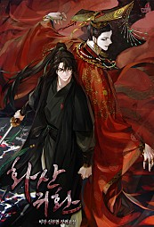

# 텍스트 컨텐츠 서비스

요즘 재밌게 보고 있는 웹툰 & 웹소설 중에 네이버 시리즈에 있는 [화산귀환](https://series.naver.com/novel/detail.series?productNo=4130558)이 있다.  

웹소설로 시작해서 그 인기에 힘입어 웹툰으로 나오게 된 작품이다.  

아마존, 쿠팡등의 빅테크 회사에서 고객 First를 계속 외친다.  
난 여기서 이들이 이야기하는 고객은 **소비자**에만 초점을 맞춘 것이 항상 아쉬웠다.  
왜 공급자는 그 회사들의 고객이 아닐까?  

영상도 마찬가지다.  
영상이 아무리 제작하기가 예전보다 편해졌다한들,  
텍스트보다 더 편할 수가 없다.  

텍스트는 공급자에게 더할나위 없는 포맷이다.

* 술먹고 들어와서 30분만 쓰고 자야지와 같이 

근데 이건 오로지 공급자의 관점이다.  

요즘 들어 텍스트 컨텐츠 서비스를 하고 싶다는 생각을 강하게 한다.  
