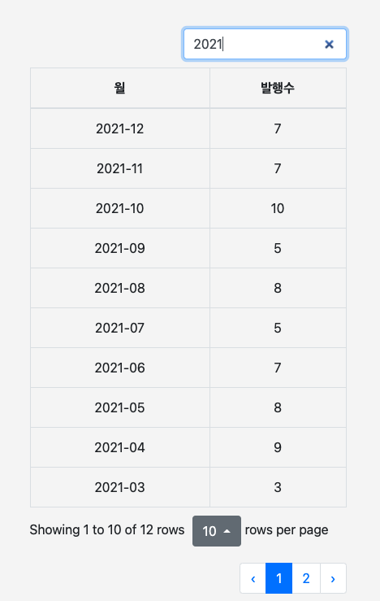

# 2021년 회고

## 1. 회사

1 ~ 4월까지는 우형(배민)에서, 4 ~ 12월까지는 인프랩(인프런)에서 생활했다. 

### 안녕 우형 (배민)

1) [우아한형제들 부검 - 왜 떠나는지](https://jojoldu.tistory.com/562)
2) [우아한형제들 부검 - 어디로 가는지](https://jojoldu.tistory.com/564)

> 유튜브에도 [1편](https://www.youtube.com/watch?v=kE0qicg9Kl0), [2편](https://www.youtube.com/watch?v=TK6gJkaeaWw) 으로 정리되어 있다.  

배민에서의 지난 4년 6개월은 별도로 정리할 것 같다.  

> [4번째 직장에 오기까지](https://jojoldu.tistory.com/277)가 나올때다.

내 커리어에 있어서 정말 빼놓을 수 없는 이야기들이 많다보니 배민의 이야기로만 몇편이 나올것 같다.  
주니어로서, 미드레벨로서, 시니어로서 다양한 스펙트럼의 경험을 쌓을 수 있었다.  
(3년차에 들어가서, 나올때는 8년차였으니 말이다.)  

퇴사전에 면담을 해주셨던 모든 분들께 정말 많은 배움을 얻을 수 있었다.  
(특히 범준님이 해주신 **둘 다 좋은 기회일때는 어떤걸 기준으로 해야하는지**에 대해서는 두고두고 써먹을 수 있는 기준이 되겠다 생각을 했다.)

### 안녕 인프랩 (인프런)

[사내 개인 회고](https://doc.clickup.com/d/3gfz7-5843/log/3gfz7-85685/%ED%96%A5%EB%A1%9C)

### CTO

[이미 CTO 회고를 했기 때문에](https://jojoldu.tistory.com/626) 여기서는 개인의 관점에서만 이야기해보려고 한다.  
  
CTO를 하면서 읽은 글 중에서 가장 와닿은 글이라고 한다면 아래 뉴욕 타임즈 CTO 회고이다.

* [뉴욕타임즈 CTO의 4년 회고](https://news.hada.io/topic?id=2016)

결국은 개발조직은 비지니스 성과로 평가 받는 것을 피할수 없다.  
그걸 무시하고, 기술적 성취만 취해서는 안된다.  
개발조직의 투자가 회사의 비지니스 성과로 갈 수 있다는 것을 얼마나 보여줄 수 있느냐가 중요하기 때문에 내가 잘해야한다.  

### 7시간 대형 장애

인프랩 역대 두번째 장애가 발생했다.  
([역대 최고 장애는 2022년 1월에 발생](https://tech.inflab.com/202201-event-postmortem/)했다.)

* [7시간 장애와 수영장](https://jojoldu.tistory.com/578)

## 2. 블로그

(GA에서 잠재고객 -> 개요로 가면 항목을 볼 수 있다.)

* 전체 사용자수: 46.6만
  * 2020년: 48만 (-1.4만)
* 최대 MAU: 6.4만
  * 2020년: 6.3만 (+1만)
* 최대 월 PV: 34만
  * 2020년: 18.4만 (+15.6만)
* 전체 페이지뷰: 258만
  * 2020년: 196만 (+62만)
* 세션당 페이지수: 2.43
  * 2020년: 1.76 (+0.67)

### 2-1. 80개의 글 발행

총 80개의 글을 발행했다.  
  
대략 월 평균 6.6개의 글을 발행했다.

* 1월: 8
* 2월: 3
* 3월: 3
* 4월: 9
* 5월: 8
* 6월: 7
* 7월: 5
* 8월: 8
* 9월: 5
* 10월: 10
* 11월: 7
* 12월: 7

## 2-2. 600만 PV 달성

## 3. 외부활동

올 한해가 생각보다 외부 발표를 많이 했다.  
회사 적응하기에도 바빴지만, **인프랩이라는 회사를, 인프런이라는 서비스를 좀 더 많이 이름을 알려야할 필요**가 있어서 조금 무리하긴 했다.

### EO 커리어콘

* [EO 커리어콘 발표](https://jojoldu.tistory.com/notice/554)

### SAFFY 발표

### 몰입캠프 발표

장병규 의장님과 류석영 교수님이 운영하시는 카이스트 [몰입 캠프](https://madcamp.io/) 에서 **스타트업 개발자로 생존하기** 주제로 발표를 했다. 

형주님 (대표님) 을 통해 먼저 발표 요쳥이 왔다는 이야기를 듣고, 전태연 파트너님을 통해서 상세하게 이야기를 들었다.  
지금도 바쁘지만, 당시에도 대형 
사족이지만, [인프랩 Seed 투자사인 본엔젤스](https://www.hyungjoo.me/%ec%9d%b8%ed%94%84%eb%9e%a9-%ec%9e%ac%eb%ac%b4%ec%a0%81-log-2/) 가 후원하는 캠프라서 다른 발표보다 훨씬 더 감사한 마음으로 준비했다.  

그리고 이때의 인연으로 몰입캠프 학생분들과 온라인 화상 토크를 하는 시간도 가졌다.

* [[주간 인프런 #34] 랜선에서 만나요! 인프런 개발 파트 Q&A (1)](https://www.inflearn.com/pages/weekly-inflearn-34-20211019)
* [[주간 인프런 #35] 랜선에서 만나요! 인프런 개발 파트 Q&A (2)](https://www.inflearn.com/pages/weekly-inflearn-35-20211026)

### 워키도키

* [워키도키 1편](https://www.youtube.com/watch?v=wfInwxT0UUA)

### 이코노미스트 인터뷰

* [인터뷰 본문](https://n.news.naver.com/article/243/0000019746)

## 4. 개발바닥

1월부터 [호돌맨](https://hodolman.tistory.com) 과 함께 유튜브를 시작했다.  

* [유튜브 채널](https://www.youtube.com/channel/UCSEOUzkGNCT_29EU_vnBYjg)

## 5. 교육

## 6. 건강

### 6-1. 식단

현미밥을 본격적으로 먹기 시작했다.

5월 ~ 11월까지의 식단은 다음과 같았다

* 아침: 스타벅스 브렉퍼스트 잉글리시 머핀
* 점심: 백반 (찌개/반찬)
* 저녁: 백반 (찌개/반찬)

혈당 스파크가 점점 심해졌다.  

이렇게 의지력으로 이겨내는 것 자체가 리소스 낭비라고 생각했다.
애초에 여기에 쓸 의지력을 다른데 써야하지않나? 라는 생각하에
12월부터는 혈당 스파크를 줄이기 위해 식단 변경을 했다.

* 아침: 고구마 & 사과
* 점심: 백반
* 저녁: 샐러드

출근하는 경우엔 자주가는 식당 (a.k.a 유스페이스 집밥)이 있어서 거기서 매일 변경되는 백반을 먹는중이다.  
  
재택 혹은 주말의 경우엔 배달을 시키더라도 밥 메뉴는 제외하고 시켜서 현미 햅반을 돌려서 먹는다.  

### 6-2. 운동

일주일에 1번이라도 운동을 가려고 노력중이다.  
평일은 거의 매일 10시가 넘어 퇴근하다보니 매주 토요일 오전을 좀 활용중이다.

## 7. 정리

### 잘한점

### 못한점

* 여유시간이 있을때마다 개인의 발전보다 회사일을 하려는 모습이 점점 보인다.
  * 꼭 여유시간에 끝내야할 일이 있는게 아니라면 도끼날을 가는 시간이 필요한데, 자꾸 도끼질만 하게 된다.
  * 아무래도 기존과는 다른 위치라서 그렇게 되는 것 같다.
  * 하지만, 회사의 성장속도를 쫓아가야하는건 CTO인 나도 마찬가지다.
  * 내가 그 누구보다 성장해야한다.
  * 그걸 2021년도에는 놓쳤던것 같다.
* 이직 이후 몸무게가 8kg가 늘었다.
  * 생각보다 살 찌는게 티가 나는 스타일이 아님에도 볼살이 장난아니게 늘었더라.
  * 
 

