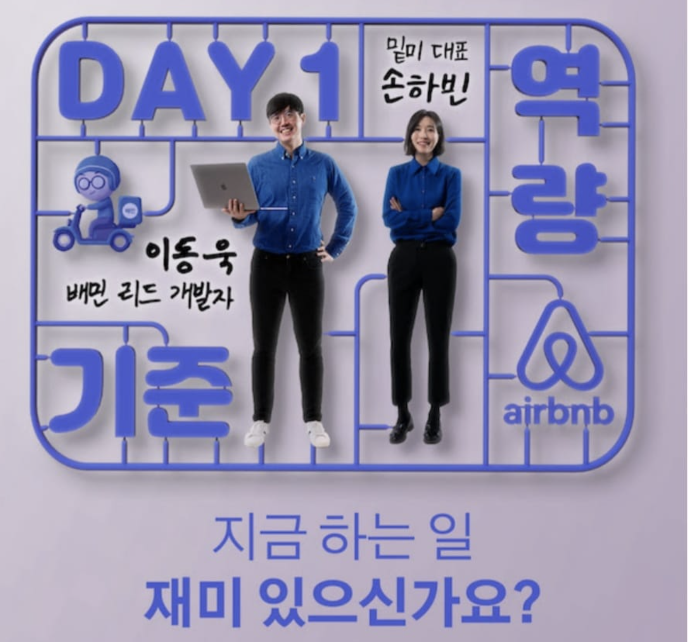
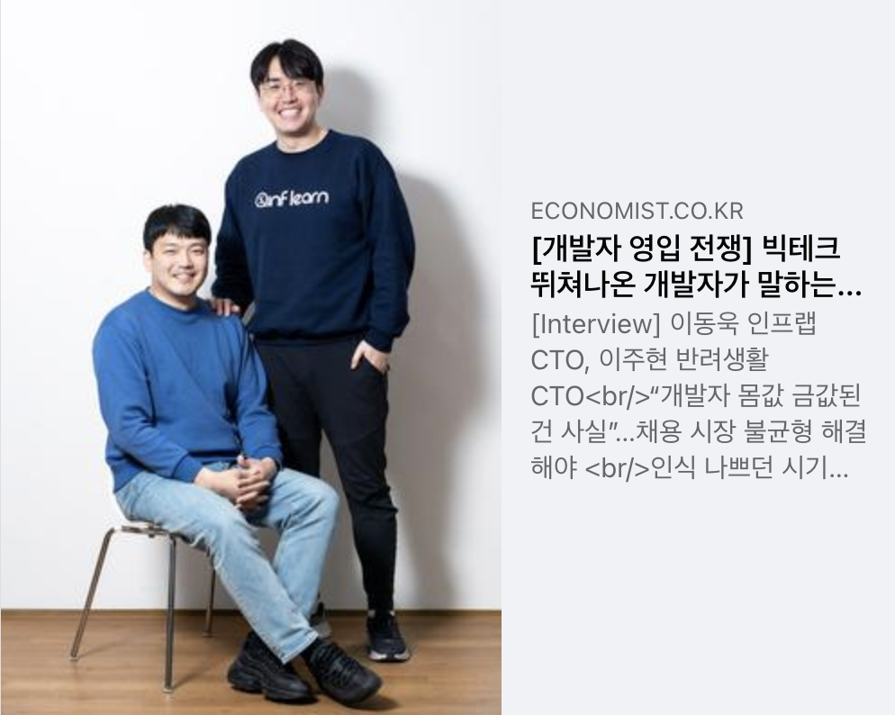
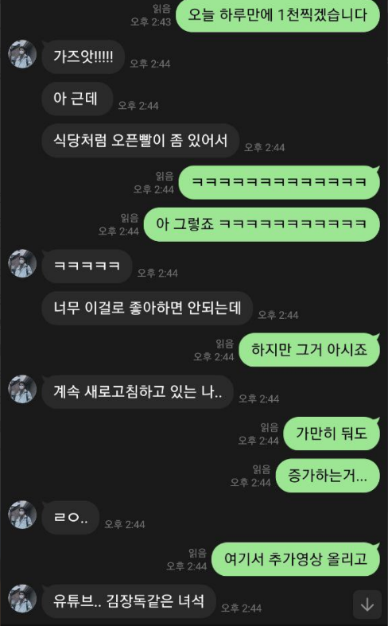

# 2021년 회고

## 1. 회사

1 ~ 4월까지는 우형(배민)에서, 4 ~ 12월까지는 인프랩(인프런)에서 생활했다. 

### 안녕 우형 (배민)

1) [우아한형제들 부검 - 왜 떠나는지](https://jojoldu.tistory.com/562)
2) [우아한형제들 부검 - 어디로 가는지](https://jojoldu.tistory.com/564)

> 유튜브에도 [1편](https://www.youtube.com/watch?v=kE0qicg9Kl0), [2편](https://www.youtube.com/watch?v=TK6gJkaeaWw) 으로 정리되어 있다.  

### 안녕 인프랩 (인프런)

[사내 개인 회고](https://doc.clickup.com/d/3gfz7-5843/log/3gfz7-85685/%ED%96%A5%EB%A1%9C)

### CTO 

* [뉴욕타임즈 CTO의 4년 회고](https://news.hada.io/topic?id=2016)

결국은 개발조직은 비지니스 성과로 평가 받을 수 밖에 없다.  
그걸 무시하고, 기술적 성취만 취해서는 안된다.  
개발 뿐만아니라 디자인도, 마케팅도 모든 사내의 조직은 예술 그룹이 아니다.

### 7시간 대형 장애

인프랩 최고 장애가 발생했다.  
(내 개발 커리어에서도 역대급이였다)

* [7시간 장애와 수영장](https://jojoldu.tistory.com/578)

## 2. 블로그

## 3. 외부활동

올 한해가 생각보다 외부 발표를 많이 했다.  
회사 적응하기에도 바빴지만, **인프랩이라는 회사를, 인프런이라는 서비스를 좀 더 많이 이름을 알려야할 필요**가 있어서 무리한 것도 없지 않다.

### EO 커리어콘

* [EO 커리어콘 발표](https://jojoldu.tistory.com/notice/554)

### SAFFY 발표

### 몰입캠프 발표

장병규 의장님과 류석영 교수님이 운영하시는 카이스트 [몰입 캠프](https://madcamp.io/) 에서 **스타트업 개발자로 생존하기** 주제로 발표를 했다. 

형주님 (대표님) 을 통해 먼저 발표 요쳥이 왔다는 이야기를 듣고, 전태연 파트너님을 통해서 상세하게 이야기를 들었다.  
지금도 바쁘지만, 당시에도 대형 
사족이지만, [인프랩 Seed 투자사인 본엔젤스](https://www.hyungjoo.me/%ec%9d%b8%ed%94%84%eb%9e%a9-%ec%9e%ac%eb%ac%b4%ec%a0%81-log-2/) 가 후원하는 캠프라서 다른 발표보다 훨씬 더 감사한 마음으로 준비했다.  

그리고 이때의 인연으로 몰입캠프 학생분들과 온라인 화상 토크를 하는 시간도 가졌다.

* [[주간 인프런 #34] 랜선에서 만나요! 인프런 개발 파트 Q&A (1)](https://www.inflearn.com/pages/weekly-inflearn-34-20211019)
* [[주간 인프런 #35] 랜선에서 만나요! 인프런 개발 파트 Q&A (2)](https://www.inflearn.com/pages/weekly-inflearn-35-20211026)

### 워키도키

* [워키도키 1편](https://www.youtube.com/watch?v=wfInwxT0UUA)

### 이코노미스트 인터뷰

* [인터뷰 본문](https://n.news.naver.com/article/243/0000019746)

## 4. 개발바닥

1월부터 [호돌맨](https://hodolman.tistory.com) 과 함께 유튜브를 시작했다.  

* [유튜브 채널](https://www.youtube.com/channel/UCSEOUzkGNCT_29EU_vnBYjg)

## 5. 교육

## 6. 건강

현미밥을 본격적으로 먹기 시작했다.

5월 ~ 10월까지의 식단은 다음과 같았다

* 아침: 스타벅스 브렉퍼스트 잉글리시 머핀
* 점심: 백반 (찌개/반찬)
* 저녁: 백반 (찌개/반찬)

다이어트를 한다기 보다는 혈당관리 하는것에 좀 더 가까웠다.

혈당 스파크가 점점 심해졌다.
이렇게 의지력으로 이겨내는 것 자체가 리소스 낭비라고 생각했다.
애초에 여기에 쓸 의지력을 다른데 써야하지않나? 라는 생각하에
11월부터는 혈당 스파크를 줄이기 위해 식단 변경을 했다.

최근 2주 동안은 

## 7. 내년 계획

주변의 좋은 개발자분들 혹은 PO(기획자) 분들의 노하우나 지식을 전사적으로 전파할 수 있는 시간을 정기적으로 가질려고 한다.  

