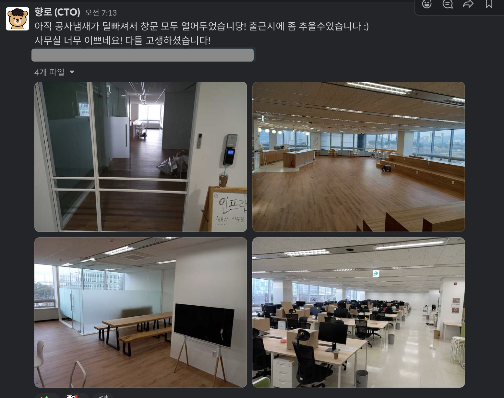
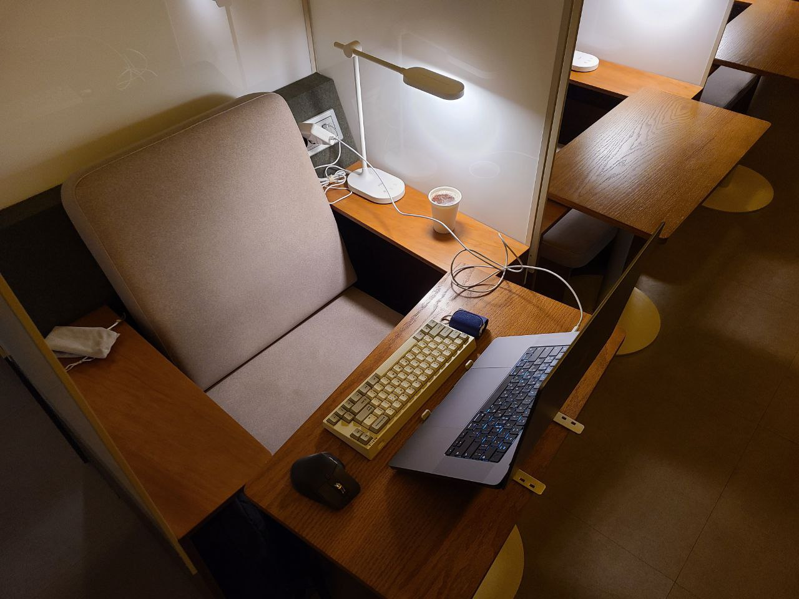
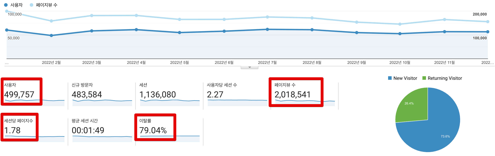
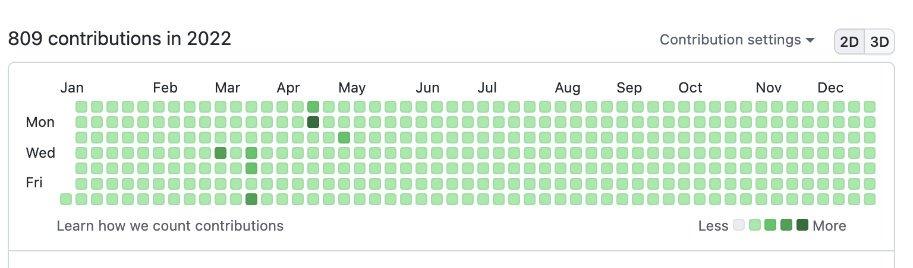
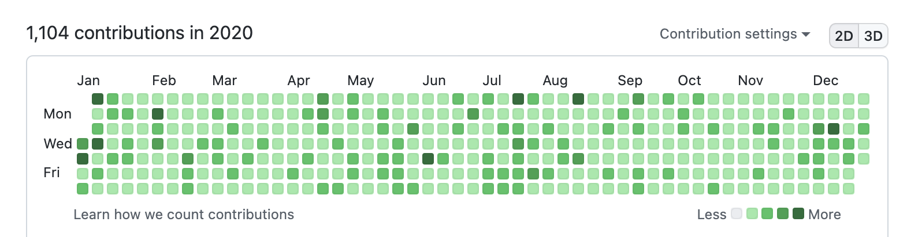
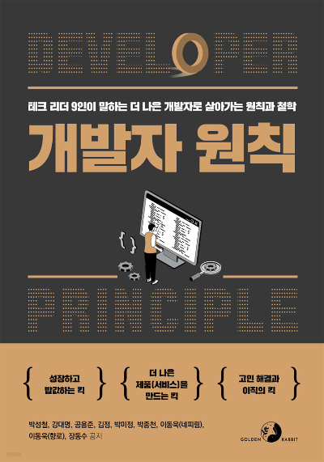

# 2022 회고

2021년엔 개인 회고를 작성하지 않았다.  
일기장에 있는 내용들을 모아서 2021년부터 작성할까 하다가, 그럼 또 2022년 개인 회고를 미루게 될 것 같았다.  
  
새 회사에 대한 적응이 마무리 되어감과 동시에 개인 생활을 점검해본 한해였다.  

## 생활

07~08 시에 출근해서 22~23시에 퇴근하는 생활을 한동안 계속 했다.  
아침 일찍 아무도 없는 회사에 와서 책을 보거나 개인 일정을 진행하면 참 기분이 좋았다.  
특히 유스페이스 스타벅스점은 **아침 7시부터 오픈**을 해서, 커피사서 회사 타운홀 창가에 앉아서 책을 보거나 코드를 작성하면 오늘 하루가 참 잘될것 같다는 생각을 했다.  

올해 사무실을 이사한 날, 처음으로 출근했을때 뭔가 포장지를 내가 뜯는듯한 느낌이 들어서 유별나게 사내 채팅방에 첫 사진을 공유하기도 했다.

나쁘지 않은 생활이였지만, 어느덧 그 오전시간이 온전히 내 시간은 아니게 되었다.  
당연하지만, 개발팀, PO 등을 비롯해서 많은 분들이 그 시간에도 여러 질문들을 한다.  
그 외에도 간간히 일찍 오는 팀원이 있으면 같이 수다를 떨기도 하다보니깐 온전히 나홀로 즐기던 아침 시간이 온데간데 사라졌다.  
  
회사에 있으니 당연한 일이긴한데, 문제는 하루의 업무를 시작하기 전 충전을 하는 시간이 사라지니 문제가 되었다.  
  
원래 하려던 일들을 오전에 달성 못하면, 많이(?) 힘들어하는 편이라서 이 부분을 어떻게 좀 해결하고 싶었다.  
그래서 한동안은 집 근처 메가커피에서 개인적인 용무를 다 보고 에너지 충전을 한 뒤에 출근을 하는 걸로 변경했다.  
  
어떻게 집 근처 카페에서 개인적으로 하고 싶었던 일들을 하면서 보내다가 하나둘씩 여러 문제가 두드러졌다.

- 집근처 카페들은 모두 아침 8시부터 오픈인데, 회사 출근시간을 고려하면 9시에는 카페를 나와야해서 정작 집중 시간을 매일 1시간밖에 가져가지 못했다. 
- 11월이 되니 아침 까페 오픈 시간에 맞춰 가면 너무 손이 시렸다.

손을 벌벌떨면서 키보드를 치는데 이래서는 오래 못할것 같았다.
그래서 찾아보던 중에 집에서 500m도 안되는 거리에 [집무실](https://www.jibmusil.com/)이 있는 것을 발견했다.

### 집무실

로켓펀치가 운영하는 집무실은 월정액제나 혹은 시간제로 **24시간** 출입이 가능한 무인 공유 오피스이다.  

  

기본적으로 커피머신과 원두, 간단한 다과, 얼음 정수기, 공기청정기, 창가뷰의 책상, 적정온도, 깔끔한 화장실 등 공유 오피스의 기본적인 옵션들을 다 제공한다.  
특히 예전 배민이 생각나게 하는 재즈 음악이나 적당한 조명, 적정 온도 등을 24시간 제공한다는게 너무 좋았다.  
  
그래서 현재까지는 만족도가 너무 높다.
어느정도로 만족하냐면..
아침에 "내일 집무실 가야지" 하는 생각에 일찍 일어날 수준이다.  
  
가능하면 저녁에 회사일이 필요할때도 사무실에서 일하지 않고, 집무실로 바로 달려가서할까도 고민하고 있다.

> 하지만 그럴일이 1월 현재에도 없다...
> 운동하고, 야근하다보니 저녁에는 얄짤없이 사무실행이다.

## 블로그

2022년은 블로그 성적표가 많이 아쉽다.
조회수나 이런것 보다는 내가 발행한 글 자체가 적다는게 **나를 위한 시간을 올 한해는 많이 만들지 못했다**는 것을 표현하는 것 같았다.  
  
블로그에 글쓰기가 나를 지켜주는 여러 자존감의 기둥들중 하나인데, 이게 2022년에는 단단하지 못했다는 생각이 들었다.  
물론 다른 여타 기둥들이 있어서 큰 문제는 없었지만 말이다.

(GA에서 잠재고객 -> 개요로 가면 항목을 볼 수 있다.)

* 전체 사용자수: 49.9만
  * 2021년: 46.6만 (+3.3만)
* 최대 MAU: 6.1만
  * 2021년: 6.4만 (-0.3만)
* 최대 월 PV: 20만
  * 2021년: 34만 (-14만)
* 전체 페이지뷰: 202만
  * 2021년: 258만 (-56만)
* 세션당 페이지수: 1.78
  * 2021년: 2.43 (-0.65)
* 이탈율: 79.04%
  * 2021년: 55.78% 

신규사용자를 비롯해 전체 사용자가 소폭 증가한것에 비해 **모든 수치가 떨어졌다**.  
6,7,8월에 글을 거의 발행하지 못했다. 

(티스토리 월별 글 발행수는 [여기서](https://tistory-ppm.netlify.app/) 확인해볼 수 있다)  

- 6월엔 2개
- 7월엔 1개
- 8월엔 0개

이때 너무 바빠서 블로그 글을 거의 쓰지 못해서 전체적으로 구글에서 블로그 랭크를 낮춘게 아닐까 싶긴하다.  
특히 **이탈율이 55.78% -> 79.04%** 가 된게 뼈아프다.  
한번 보고나서 그다음에 볼만한게 없다는것처럼 느껴진다.  

대략 6개월에 100만정도 조회수가 증가해서 작년 12월에 누적 조회가 800만이 되었다.

**700만**

 
 

**800만**

(아쉽게 800만 딱 되었을때를 찍지 못했다.)  
  

2022년 가장 조회수가 많았던 Top5 는 다음과 같다.

1. [2021년 CTO 회고](https://jojoldu.tistory.com//626)
2. [[mysql] 인덱스 정리 및 팁](https://jojoldu.tistory.com//243)
3. [(2021) 1. 비전공자로 자바 백엔드 개발자 시작하기](https://jojoldu.tistory.com//505)
4. [Swagger로 API 문서 자동화하기](https://jojoldu.tistory.com//31)
5. [IntelliJ 디버깅 해보기](https://jojoldu.tistory.com//149)

[2021년 CTO 회고](https://jojoldu.tistory.com//626)가 이렇게 많이 조회될줄은 몰랐다.  
기존에도 계속 회고는 작성했는데, 2021년 CTO회고만 왜이렇게 조회수가 높을까? 싶었다.  
딱히 글빨(?)이 더 좋아진것도 아닌데 말이다.  
  
정말 컨텐츠는 어디서 터질지 모르니, 꾸준히 작성하는게 왕도라는게 새삼 느껴졌다.  

## 일일커밋

올해 개인 프로젝트에 대한 커밋은 809개 밖에 하지 못했다.

나는 일단 회사 계정과 개인 계정을 분리해서 사용한다.  
그래서 회사의 커밋과 개인 프로젝트/학습에 대한 커밋은 구분이 되어서 이렇게 회고할때 도움이 많이 된다.  
  
올 한해 내가 얼마나 개인 공부에 시간을 쓰지 않았는지를 직관적으로 보여주는것 같다.  
2021년, 2020년과 비교해보면 2022년에 내가 얼마나 개인 학습에 소홀히 했는지 느껴진다.

**2021**

**2020**

블로그도 그렇고, 커밋도 그렇고 **회사일을 한다는 핑계로 개인 학습에 도망친건 아닐까** 하는 생각을 했다.  

## 개발바닥

## 외부활동

### 디지털 청년 고민해결단 온라인 멘토링

매번 작게는 2명 많게는 7분정도가 참여했다.  

### 집필

공저인 [개발자 원칙](https://jojoldu.tistory.com/686)을 출간했다.  

## 아버지

> 이걸 블로그에 쓸까말까 고민을 많이 했었는데, 그래도 올해의 가장 큰 일이였기 때문에 남겨둔다.

2022년 5월, 아버지가 돌아가셨다.  
아버지는 내가 3~4세? 기억도 안나던 시절에 회사에서 일을 하시다 뇌졸증으로 한번 쓰러지셨다.  
다행히 회복하셔서 거동하시는데는 큰 문제가 없었지만, 1급 판정을 받아서 정상적으로 일을 할 수는 없는 상태셨다.  
그래서 어머니께서 실질적 가장 역할을 30년 넘게 해오셨다.  
유치원에 가기전부터 주변의 가정과는 조금 다른 환경에 있었던것 같다고 생각을 했는데, 막상 보면 모든 가정에는 그 나름의 걱정과 어려움이 있었던것 같다.  
그래서 우리가 특별하다는 생각을 하지는 않았던것 같다.  
다만, "돈"에 대해서 자주 생각을 했다.  
가능하면 학비가 저렴한 국립대를, 직업은 꼭 경제적 자립이 가능한 것을 등등 어떤 선택을 할 때 가능하면 돈에 대한 기준을 꼭 세웠다.  
(물론 공부안하고 게임을 많이 하는 학생 시절도 길었다.)  
  
그러다 2019년 설 연휴에 집에서 쉬고 있다가 갑자기 쿵 하는 소리가 방에서 들렸다.  
가보니 아버지가 쓰러져 계셨고, 2번째 뇌졸증이였다.  
의사 선생님은 아버지가 다시는 예전으로 돌아가지는 못할것이다 라는 이야기를 해주셨고, 아버지는 쭉 병원에 눈만 뜬 상태로 누워만 계셨다.  

인프랩의 합류 제안을 2019년 가을에 받았지만, 거절했다.  
거절한 여러 이유중 하나에 아버지의 병원비가 있었다.  
우아한 형제들에서는 양가 부모님의 실손 보험을 지원했기 때문에 병원비 지원을 많이 받을 수 있었기 때문이다.  
물론 이것만이 100% 이유는 아니다.  
다만 여러 큰 이유중 하나였다.  

이 시기가 정신적인 스트레스가 심했다.  
회사내에서는 티를 안내려고 노력한것과 별개로 앞으로 어떡해야하나를 정말 고민 많이 했다.  
개인사에 대해 누군가 배려를 해주는 것을 별로 좋아하지 않는다.  
코로나까지 터져서 병원 방문도 안되고 하니 더 일에 몰두만 했던 것 같다.  
  
2022년 5월초부터 병원에서 자주 호출을 했다.  
갑자기 휴가를 쓰고 대구를 내려가는 일이 잦았다.  
그러면서 마음의 준비를 계속 하다가, 어느날 어머니가 뭔가 기분이 이상하다고 하셔서 내려갔고, 그날 저녁에 아버지가 돌아가셨다.  
장례식과 발인은 어떻게 지나갔는지 잘 모르겠다.  
대구까지 멀리 와준 친구들, 동료들이 고마웠다.  

최근에 사주를 봤더니 "어머니를 더 사랑하지만, 아버지에게 인생의 영향을 많이 받았다." 라는 이야기를 해주었다.  
  
"불효자가 성공한다" 와 같은 생각을 하고 있지만, 인생 전체의 결정들을 보면 그 결정들을 내리는 기반이 되어준 가치관들은 대부분 부모님의 영향을 받았던것 같다.  
그래서 사주의 결과를 보고 되게 신기해 했던 기억이 난다.

더 많은 이야기는 일기장에나 해야겠다.

## 산만함 관리하기 

하반기에 들어서면서 집중력이 너무 떨어져있던 것을 발견했다.  
출근하면 30분에 1번씩 Context 전환과 의사결정이 필요한 날들을 1년 넘게 보냈다.  
그러다보니 어떤일을 하는데 있어서 온전히 많은 시간이 주어져도 **긴 시간을 집중하지 못하게 되었다**.  
2~3시간의 자유시간이 있는데, 예전처럼 그 시간에 집중하기 보다는 자꾸 산만해지고, 하나에 집중하지 못한다는 느낌을 계속 받았다.

* 집무실
* 모니터 1대 쓰기
* 리디 페이퍼 사용하기

### 리디 페이퍼

가능하면 휴대폰을 사용하지 않으려고 예전에 쓰던 [리디 페이퍼 PRO](https://namu.wiki/w/%EB%A6%AC%EB%94%94%EB%B6%81%EC%8A%A4%20%ED%8E%98%EC%9D%B4%ED%8D%BC%20%ED%94%84%EB%A1%9C) (2017년형)를 다시 꺼냈다.  

식사시간, 이동시간등 짜투리 시간에 트위터, 링크드인, 페이스북, 아웃스탠딩, 미디엄 등 텍스트 컨텐츠를 읽는 것을 좋아한다.  

위험하다 느낀 점은 **더이상 새 글이 없는데도 다시 저 앱들을 실행하고 있던 나를 보았을 때**였다.  
  
요즘은 유튜브 Shorts를 비롯해서 20~30초의 짧은 영상들을 
그러다보니 정말 아무 생각없이 30초마다 서로 다른 주제의 영상들을 계속 넘기면서 있더라.  

그래서 Context가 계속 바뀌는 것을 경계하려면 휴대폰을 멀리 둬야겠다는 생각을 했다.  
(물론 장애 대응을 위해 항상 지참해야하는 것은 필수이다.)  
  
그렇지만, 짜투리 시간에 텍스트를 보는 것을 멈추고 싶진 않았다.  
그래서 Context의 잦은 교체가 안되도록 **텍스트 컨텐츠 앱이 하나밖에 없으면서 휴대가 가능한 도구**가 필요했.    
  
그래서 떠올린게 **EBOOK을 보는 것외에는 아무 기능이 없는** 리디 페이퍼를 꺼내는 것이였다.  
  
아이패드 프로가 있지만 리디 페이퍼 프로가 좋았다.  
SNS나 유튜브 같은 소셜 앱도 없을 뿐더러, 리디북스 앱 말고는 다른 어떤 것도 없다는 것이 특히 좋았다.

> 물론 루팅 같은것을 통해 다른 앱을 설치할 수 있겠지만, 애초에 그러면 내 원래 목적에서 벗어나기 때문에 루팅을 할 생각은 전혀 없다.  
> 루팅이 합법이 아니라고 생각하기도 하고.

## 마무리

노력을 하면 할수록 편견의 벽이 두터워지는건 아닌가하고 의심한다.  
