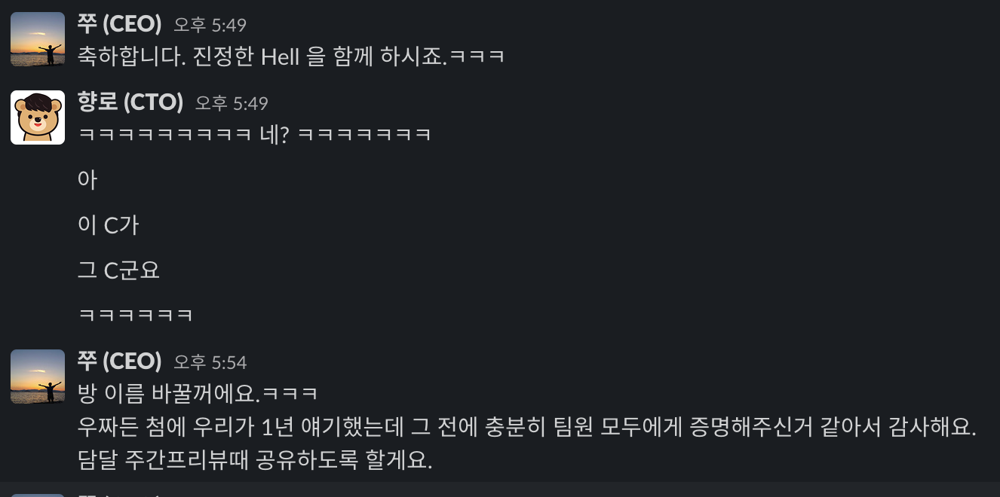
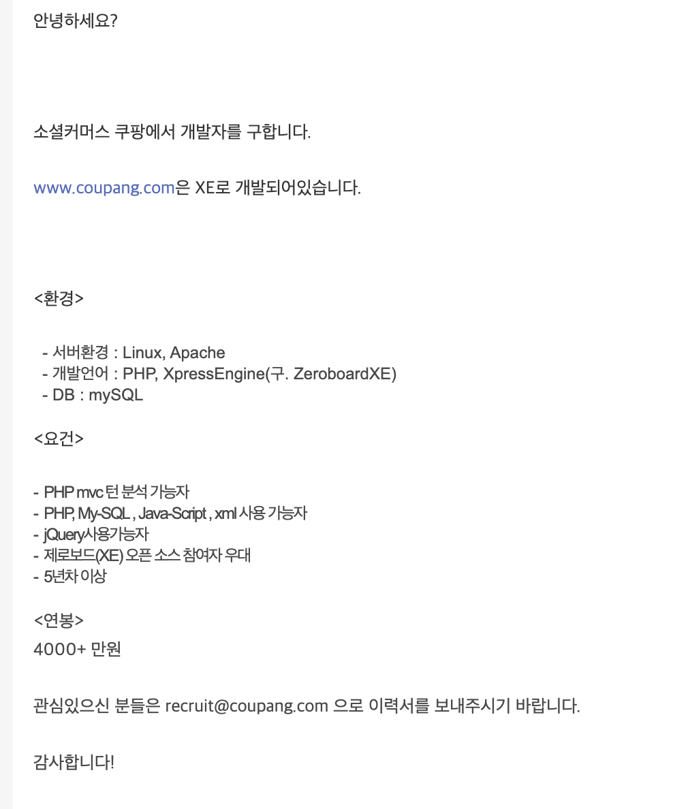
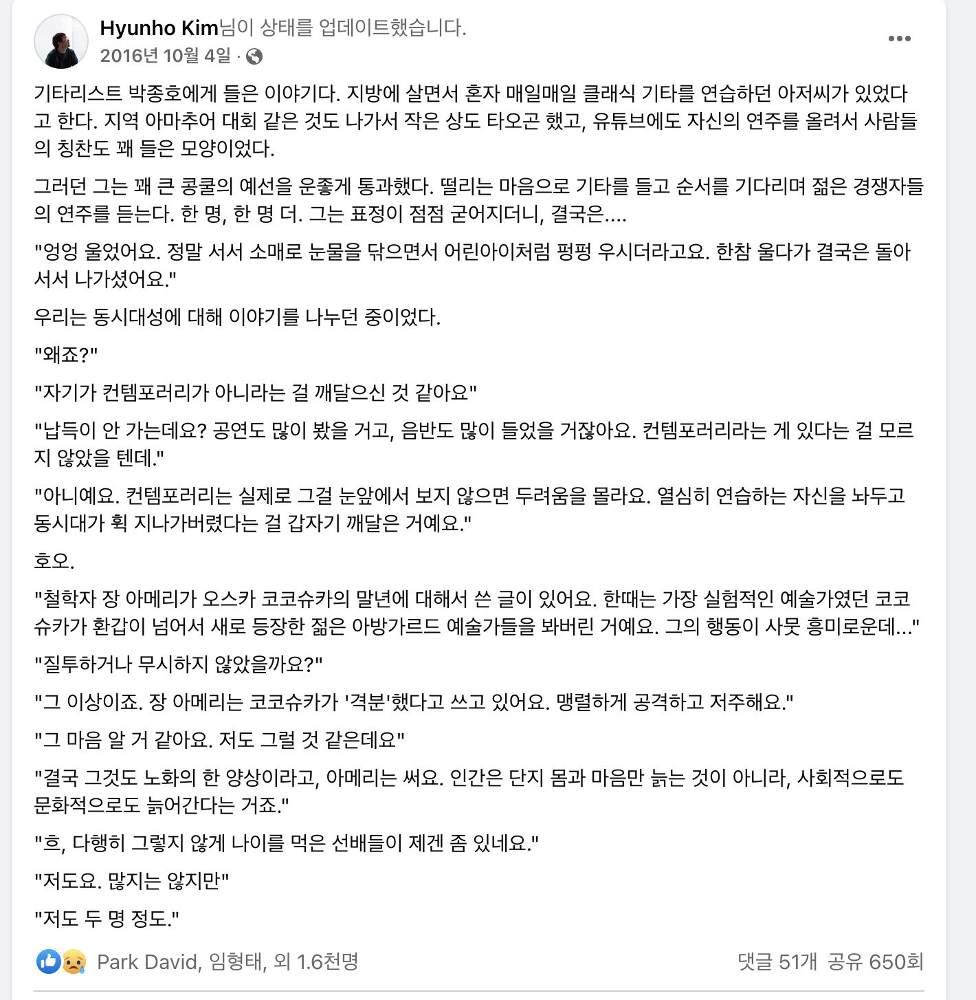

# 2021 CTO 회고

> 개인 회고는 개인회고대로 쓸 예정이다.

퇴사전에 실장님이셨던 기호님이 해주신 조언이 있다.  
**가서 바로 무언갈 하려고 하기 보다는 1~2달은 가만히 지켜만 봐라** 라는 것이다.  
그래서 가자마자 약 1달간은 지켜보고 분석하는 시간을 가졌다.

## 합류 전 ~ 합류 초

합류전 대표인 형주님과 나눈 조건 중에 하나는 **CTO로 바로 가기 보다는 시니어로 입사 후 구성원들의 인정을 받으면 CTO로 올라가는 것**이였다.  
그러니깐 **조건부 CTO**였던 것이다.  

**권한은 없는데 증명하고 책임은 져야하는 자리**가 바로 이 자리구나 싶었다.

7월 23일부로 CTO로 진급했다.

(그래서 나는 사원증이 2개다)

## 서비스 상황 분석

모니터링/로깅이 없다는 것은 당장의 문제 해결 그 이상의 의미가 있나? 라고 물어본다면 분명하게 있다.  

과거로부터 배우지 못한다는 것을 의미한다

* 어느 시점 / 어느 리소스에서부터 문제가 시작 된 것일까?
* 사전에 그 징후를 알 수 있는 방법은 없었을까?
* 우리 시스템의 임계점은 어느지점일까?
* 

그리고 이를 토대로 대표인 쭈와 개발파트를 모아서 공유를 했다.

서비스가 불안정하다보니 **시스템 아키텍처도 그에 따라 일반적이지않은 구조**를 사용중이였다.  
(자주 죽었다 살았다해서)

  

## 기술

* 약 10년의 경력을 가진 개발자분이 있었고
* 데브옵스/프론트엔드/백엔드가 나름 분리가 되어있었고
* 다들 겸손하고, 알려드리면 되게 좋아해주셨다.

먼저 말하자면,  
이 과정은 사실 **어느 스타트업이나 겪는 과정**이긴하다.

그래서 "와 진짜 제대로 찐 스타트업 경험하겠다" 생각을 했다.  
물론 부정적인 생각이 아예 없었던건 아니다.  
(설득하는 과정이 너무 우회해야하고 많은 대화를 해야할때면)  
  

* 기존 프로젝트를 기존과는 다른 방식으로 개선/개편해야한다

이게 초기 스타트업 개발팀에는 **역린**이다.  
왜냐하면 기존까지 해오던 방식을 부정당하는 것과 다를바 없기 때문이다.

실제로 올해 연말 회고때도 이 이야기가 언급되기도 했다.

나는 일반 **사용자 서비스를 하면서** 자바스크립트 혹은 자바와 같이 **언어만 주구장창 파고드는 개발자를 선호하지 않는다**.
특히나 **추상화를 무시**하고, 구현 코드만 나열한 방식은 현대의 사용자 서비스 개발에서는 어울리지 않는다고 생각한다.  

괜히 **거인의 어깨위에 올라타라**라는 말이 있는게 아니다.

아래 글은 내가 2018년도에 본 글인데, 몇 년이 지난 지금도 기억할정도로 강하게 뇌리에 남아있다.  
(내용 전체가 좋기 때문에 꼭 다 읽어보길 추천한다)

[원 글](https://www.facebook.com/hyunho.kim.9465/posts/1184925318240273)

내가 속한 조직의 개발자분들이 **동시대를 살아가는 개발자가 아니게 될까봐** 정말 많은 걱정이 되었다.  
윗 글에서도 나왔지만, "**열심히 연습하는 자신을 놔두고 동시대가 휙 지나가버렸다는걸**" 뒤늦게 깨닫게 될때의 절망감은 말로 표현하기 어렵다.  
그리고 그렇게 사랑스러웠던 회사와 서비스도 더이상은 사랑할 수 없게 된다.

내가 리드했던 조직의 구성원이, 내가 오기전부터 헌신했던 조직원이 떠날때 원망/후회가 있어서는 안된다고 생각했다.

그래서 나한테는 이게 정말 큰 위기감으로 다가왔다.

서비스가 성장하면 개인도 같이 성장하는거 아니냐고?  
아니다.
서비스가 성장하는데도 개인이 성장하지 못한 케이스는 너무나 많다.
서비스가 성장하면 개인도 같이 성장한다면
**그 많은 빅테크 스타트업의 개발자들이 특정 라운드가 되면 대대적으로 인력 교체**가 일어날까.  

**동접 800 ~  1000명만 와도 터지는 서비스를 만들고선 우리가 직접 문제를 다 해결하겠다는 것은 굉장히 오만한 생각**이라는 것도 이야기했다.  
상처가 될 수는 있겠지만, 현실직시는 할 필요가 있었다.

채용공고의 내용은 **앞으로 우리가 갈 길을 사내 구성원에게 명시**하는 것과 다를바 없다.

([인프런 채용 공고](https://inflab.notion.site/NodeJS-4a7668d2564a4180a0721a2135f97840))

### 스터디

처음엔 스터디를 하다가 2시간동안 1페이지만 진행되기도 했다.  
1페이지에 안좋은 코드와 좋은 코드에 대한 이야기가 나올때면, 서로 그동안 가지고 있던 불만들을 책의 내용은 인용해서 표출했기 때문이다.  
그럼 또 그 반대편 의견을 가진 분들이 거기에 다시 또 반발을 하고 하다보니 

레이어드 아키텍처 / 도메인 모델 / OOP / Public 인터페이스 / 회귀테스트 등을 스터디 하는 동안 계속 중간중간 설명을 드렸다.

## 1 on 1 

1 on 1을 정말 자주 했다.  

 

## 채용

이 부분을 대표님과 또 한바탕 했다.  

* 기존의 인프런 채용 공고가 있는데, 굳이 다시 쓸 필요가 있는지 
* 채용 공고를 굳이 Notion을 써야할 이유가 있는지
  * 새로 작성하더라도, 기존 채용공고 페이지에다가 쓰지 않고 **또 관리대상 서비스를 늘려야하는지**
* 

### 마이스터고

합류 시점에 사내에는 마이스터고를 졸업하고 바로 입사해서 일을 하시는 분들이 2분 계셨다.  

