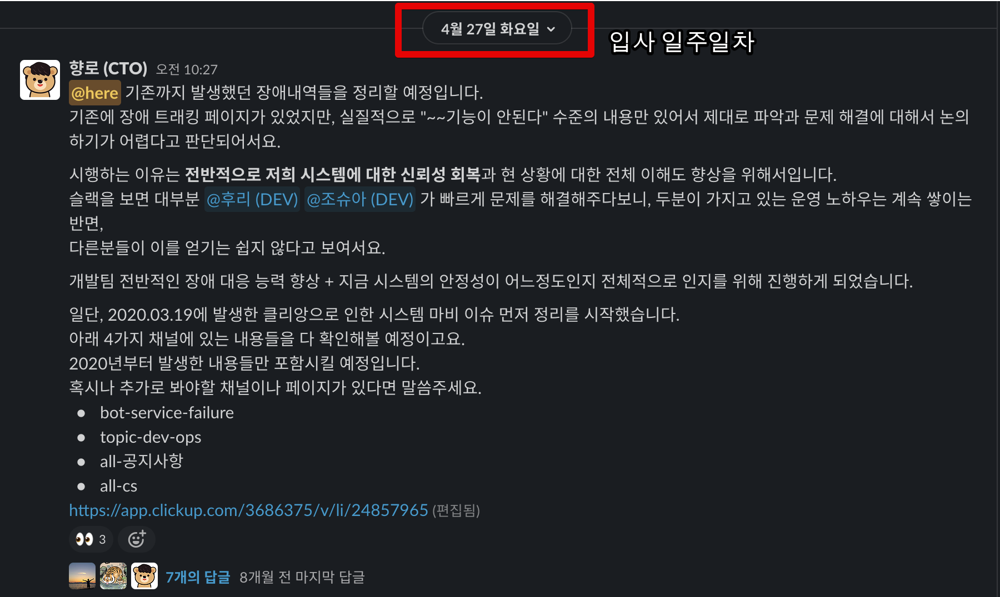
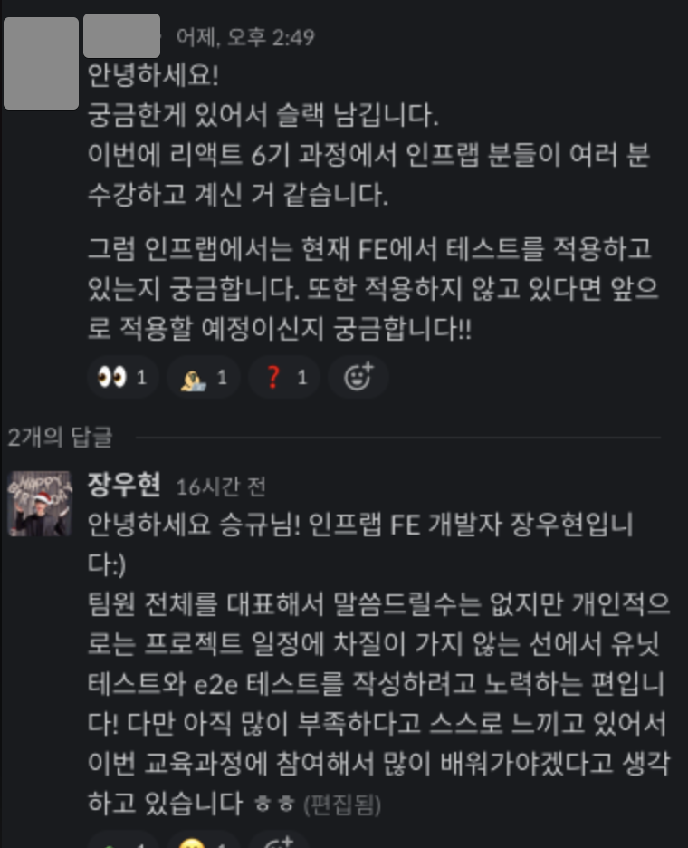

# 2021 CTO 회고

개인 회고와 별개로 CTO로서 구체적으로 기록을 남기고 싶어서 CTO회고는 별도로 빼서 작성하게 되었다.  

> 개인회고에 같이 담으니깐 너무 양이 많았다.  
> 개인 회고는 별도로 쓸 예정이다.
  
나와 비슷한 상황 혹은 CTO로 합류 하는걸 고민하시는 등 그 분들에게 조금이나마 도움이 되지 않을까 싶었다.

> 나중에 내가 다시 시드 ~ 시리즈 A 회사의 CTO로 혹은 기술 리더로 합류할때 도움이 될 것 같기도 하고

퇴사전에 실장님이셨던 기호님이 해주신 조언이 있다.  
**가서 바로 무언갈 하려고 하기 보다는 1~2달은 가만히 지켜만 봐라** 라는 것이다.  
  
그래서 가자마자 약 **한달간은 지켜보고 분석**하는 시간을 가졌다.

## 합류 전

합류 전 대표인 형주님과 나눈 조건 중에 하나는 **CTO로 바로 가기 보다는 시니어로 입사 후 구성원들의 인정을 받으면 CTO로 올라가는 것**이였다.  
그러니깐 **조건부 CTO**였던 것이다.  
  
이 조건을 들었을 당시에 주변에서는 (솔직하게) 어이없어하긴 했다.  

* 왜 니가 거기가서 다시 증명을 해야하는거냐?
* 여기 남든, 다른 회사 가든 그런식의 조건을 달고 이야기를 하는 곳이 있냐?
* 거기가서 CTO가 안되면 그냥 단순 시니어가 되는건데 그럼 굳이 거기 왜 가냐? 
* 여기서도/다른회사에서도 더 좋은 대우로 / 더 넓은 권한으로 하는게 더 낫지않냐?

등등 진짜 친한 지인들 몇명에게만 이야기했다보니 눈치안보고 이야기를 해주긴했다.  

다만, 이건 인프랩이란 회사의 특수성에 기인했기 때문이라 나는 납득할 순 있었다.

* 회사가 20명이 될 때까지 한번도 C레벨은 커녕 **시니어 조차 한번도 채용해본적이 없었던 상황**
* 외부에서 합류한 시니어는 어떤 역할을 하는 것인지 감도 안잡히는 상황
* 시니어는 조직 전체에 큰 영향을 줄 수 있다는 것으로 인한 두려움
  
그리고 이건 내가 배민이라는 회사를 다니면서 가지고 있었던 나 자신에 대한 의심때문이기도 하다.
내가 배민에 합류할 당시에 경력이 3년채 안되는 (2년 10개월) 주니어였다.  
근데 합류해보니 계속해서 성과내기 좋은 팀에 있게되고, 팀장님들/실장님들이 많은 힘을 실어줬다.

즉, 직속상사의 전폭적인 지지하에 많은 성과를 낸것이다.

그래서 이렇게 지지를 받지 못하는 상황에서 온전히 내 힘으로 인정받고 성과를 낼 수 있는 사람인지에 대한 의구심을 계속 가지고 있었다.

**권한은 없는데 증명과 책임을 져야하는 자리**가 바로 이 자리구나 싶었다.

7월 23일부로 CTO로 진급했다.

그래서 나는 사원증이 2개다

## 서비스 상황 분석

모니터링/로깅이 없다는 것은 당장의 문제 해결 그 이상의 의미가 있나? 라고 물어본다면 분명하게 있다.

과거로부터 배우지 못한다는 것을 의미한다

* 어느 시점 / 어느 리소스에서부터 문제가 시작 된 것일까?
* 사전에 그 징후를 알 수 있는 방법은 없었을까?
* 우리 시스템의 임계점은 어느지점일까?
*

Slack의 대화 내용들, CloudWatch 지표&로그, 개개인의 머릿속에만 있던 기억 등등을 다 물어보고 조사해서 최대한 **과거의 장애 내역들을 정리**했다.  
(물론 그것도 애플리케이션 로그가 없어서 시스템 모니터링만 보고 뇌피셜 추측한거긴 하다.)

그리고 이를 토대로 대표인 쭈와 개발파트를 모아서 공유를 했다.

서비스가 불안정하다보니 **시스템 아키텍처도 그에 따라 일반적이지않은 구조**를 사용중이였다.  
(자주 죽었다 살았다해서)

## 기술

* 인프런 서비스 초창기부터 지금까지 쭉 함께하신 (거의 5년?) 개발자분이 있었고
* 데브옵스/프론트엔드/백엔드가 나름 분리가 되어있었고
* 다들 겸손하고, 알려드리면 되게 좋아해주셨다.

먼저 말하자면,  
이 과정은 사실 **어느 스타트업이나 겪는 과정**이긴하다.

(이제는 전설처럼 떠도는 초창기 쿠팡의 제로보드 개발자 구인 공고)  
  

그래서 "와 진짜 제대로 찐 스타트업 경험하겠다" 생각을 했다.  
물론 부정적인 생각이 아예 없었던건 아니다.  
(설득하는 과정에서 최대한 상처를 안주기 위해 돌려 얘기하고, 풀어서 이야기하고, 결국엔 하고싶은말을 참아야할때면 말이다.)

하지만 아무리 그렇게 돌려얘기해도 그 본질이 변하진 않는다.

**기존 프로젝트를 다른 방식으로 개선/개편**해야한다는것 말이다.

이게 초기 스타트업 개발팀에는 **역린**이다.  

왜냐하면 **지금까지 해오던 방식을 부정**당하는 것과 다를바 없기 때문이다.

실제로 올해 연말 회고때도 이 이야기가 언급되기도 했다.

나는 일반 **사용자 서비스를 하면서** 자바스크립트 혹은 자바와 같이 **언어만 주구장창 파고드는 개발자를 선호하지 않는다**.
특히나 **추상화를 무시**하고, 구현 코드만 나열한 방식은 현대의 사용자 서비스 개발에서는 어울리지 않는다고 생각한다.

괜히 **거인의 어깨위에 올라타라**라는 말이 있는게 아니다.

아래 글은 내가 2018년도에 본 글인데, 몇 년이 지난 지금도 기억할정도로 강하게 뇌리에 남아있다.  
(내용 전체가 좋기 때문에 꼭 다 읽어보길 추천한다)

[원 글](https://www.facebook.com/hyunho.kim.9465/posts/1184925318240273)

내가 속한 조직의 개발자분들이 **동시대를 살아가는 개발자가 아니게 될까봐** 정말 많은 걱정이 되었다.  
윗 글에서도 나왔지만, "**열심히 연습하는 자신을 놔두고 동시대가 휙 지나가버렸다는걸**" 뒤늦게 깨닫게 될때의 절망감은 말로 표현하기 어렵다.  
그리고 그렇게 사랑스러웠던 회사와 서비스도 더이상은 사랑할 수 없게 된다.

내가 리드했던 조직의 구성원이, 내가 오기전부터 헌신했던 조직원이 떠날때 원망/후회가 있어서는 안된다고 생각했다.

그래서 나한테는 이게 정말 큰 위기감으로 다가왔다.

서비스가 성장하면 개인도 같이 성장하는거 아니냐고?  
아니다.
서비스가 성장하는데도 개인이 성장하지 못한 케이스는 너무나 많다.
서비스가 성장하면 개인도 같이 성장한다면
**그 많은 빅테크 스타트업의 개발자들이 특정 라운드가 되면 대대적으로 인력 교체**가 일어날까.

**동접 800 ~  1000명만 와도 터지는 서비스를 만들고선 우리가 직접 문제를 다 해결하겠다는 것은 굉장히 오만한 생각**이라는 것도 이야기했다.  
상처가 될 수는 있겠지만, 현실직시는 할 필요가 있었다.

채용공고의 내용은 **앞으로 우리가 갈 길을 사내 구성원에게 명시**하는 것과 다를바 없다.

([인프런 채용 공고](https://inflab.notion.site/NodeJS-4a7668d2564a4180a0721a2135f97840))

* RDS PostgreSQL -> Aurora PostgreSQL 로 마이그레이션
  * RDS PostgreSQL을 쓰고 있어서 데브옵스 엔지니어가 직접 매니지드 하는게 많았고, **모니터링/성능을 효율적으로 쓰고 있지 못했다**
  * Aurora의 상대적 강점은 다음과 같다
    * 3배 뛰어난 성능
    * 프로비저닝, 패치, 백업, 복원, 장애 감지, 복구 등 **장애에 대한 향상된 지원**
    * 향상된 모니터링 등
* Redis Cache 데이터 다이어트
  * 불필요하게 Redis Cache로 쓰고 

### 스터디
  

좋은 코드에 대한 기준이 바깥의 방향과는 많이 달랐다.
FP냐 OOP냐 혹은 JS냐 Java냐의 문제가 아니였다.

(마틴파울러가 리팩토링2를 JS로 안내주셨으면 어쩔뻔했나싶다.)

처음엔 스터디를 하다가 2시간동안 1페이지만 진행되기도 했다.  
1페이지에 안좋은 코드와 좋은 코드에 대한 이야기가 나올때면, 서로 그동안 가지고 있던 불만들을 책의 내용은 인용해서 표출했기 때문이다.  
그럼 또 그 반대편 의견을 가진 분들이 거기에 다시 또 반발을 하는 일의 연속이였다.

레이어드 아키텍처 / 도메인 모델 / OOP / Public 인터페이스 / 회귀테스트 등을 스터디 하는 동안 계속 중간중간 설명을 드렸다.

## 1 on 1

1 on 1을 정말 자주 했다.  

기존의 대표님에게는 말 못했던 개인의 고민/우려들에 대해 많이 이야기를 끌어내려고 노력했다.
이 점에 있어서 오히려 CTO로 합류하지 않고, 같은 팀원으로서 합류한게 도움이 많이 되었다.
초기부터 C레벨이였으면, 대표님 면담과 마찬가지로 다들 자신의 속마음을 터놓고 이야기하기는 어려웠을 것이다.  

어떤 일을 하는데 있어서 **그게 설령 맞는 말이라도 누가 했느냐에 따라 사람들은 반대를 하기도 한다**

그래서 일을 하는데 있어서 얼마나 상호 유대감을 쌓아놓느냐가 집단으로 일을 할때 정말 중요하다는 것을 알고 있다.

레몬베이스 라는 리뷰 전문 서비스를 HR에서 도입해주었다.
그래서 6개월마다 하는 셀프 평가의 질문지를 변경했다.

팀으로서/개인으로서 성장을 위해 필요한 질문들을 만들어서 개발파트에만 시범적으로 도입했다.

## 문서화

인프런은 내부적으로
몇달간 써보면서 느낀 클릭업의 장점은 다음과 같다

* 자동화
* 카드 기반의 관리
* 티켓 관리와 문서 관리가 한 곳에서 가능

다만 이걸 앞으로 본격적으로 사용할 문서화의 도구로 쓰는 것에는 거부감이 컸다.

* 빈약한 에디터
  * 표(테이블) 병합이나 스타일 변경 등 표에 대한 기능이 없다.
  * 에디터 단축키가 없어서 일일이 마우스 클릭을 해야만 한다
* 가독성
  * 에디터가 부실하다보니 가독성이 빈약하다
* 마크다운 문법을 지원하지 않는다.
* 부실한 검색 기능
  * 검색의 필터나 디테일한 검색 기능이 빈약하다
* 커뮤니티 부재
  * 우리나라에서 인프랩이 클릭업 제일 잘쓸 것이다. (다른 회사는 안쓰니깐)
* 성능 이슈
  * 작성된 문서의 내용이 길면 페이지 로드 속도가 기하급수적으로 늘어난다
* Draw.io와 같이 전문화된 도구의 미지원
  * 다이어그램, 마인드맵, 아키텍처 설계등을 전혀 그릴 수 있는 도구를 지원하지 않는다.
  * 그래서 이런 경우 구글 Docs에서 만들어 이를 링크걸어서 사용한다.
* 동시 문서 편집 버그
  * 동시에 여러 사람이 한 문서를 편집해야하는 경우 제대로 입력이 안된다.
* 한글 입력 오류
  * 다음과 같이 **입력 버그**가 발생할때가 종종 있다. 
  * 이때 작성자에게 급격한 스트레스를 준다

특히나 큰 문제는 **클릭업의 기능이 부족해서 구글 Docs와 함께 문서화가 되고 있다는 것**이다.  

* 내용이 제법 길 경우 
* 표 (테이블) 등 단순 텍스트 그 이상의 내용 작성이 필요한 경우
* 동시에 여러 사람이 문서를 작성해야하는 경우

문서화가 계속 파편화 되는 것도 큰 이슈이고, **링크를 포함시킨다 해도 결국 구글 Docs에 포함된 내용으로는 검색이 불가능**하다.  
그러다보니 신규 입사자가 들어와서 업무를 하는데 기존 문서를 찾아서 일하기보다는 기존 멤버들의 기억에 의존해서 하는일이 잦게 된다.  
  
그럼 그냥 옮기면되지않냐라고 할 순 있는데, 그러기엔 몇가지 문제가 있다.

* 인프랩 초창기에 Jira / Confluence를 썼을때 안좋은 경험을 했었음
* 이미 기존의 **많은 자동화가 클릭업과 연동**되어있다.
* Confluence에 익숙한 구성원이 별로 없다
  * 경력직이 거의 없고, 전체 구성원의 대부분이 여기가 첫 직장이다보니 다른 문서도구를 써본 경험이 거의 없다
  * Confluence 와 Jira를 배워야한다는 부담감을 다들 조금씩 갖고 있다.

## 채용

### 채용 공고 리뉴얼

백엔드 / 프론트엔드 개발자 채용 공고를 완전히 다시 작성했다.  
(Notion으로)

* [백엔드 개발자](https://inflab.notion.site/NodeJS-4a7668d2564a4180a0721a2135f97840)
* [프론트엔드 개발자](https://inflab.notion.site/React-VanillaJS-297e778f28334a50b5e68b8a898de569)

이 부분을 대표님과 또 한바탕 했다.

* 기존의 인프런 채용 공고가 있는데, 굳이 다시 쓸 필요가 있는지
* 채용 공고를 굳이 Notion을 써야할 이유가 있는지
    * 새로 작성하더라도, 기존 채용공고 페이지에다가 쓰지 않고 또 새로운 관리 도구를 추가해야하는지
* Notion으로 한번 사내 문서화를 시도했다가 크게 실망한 과거의 경험

채용을 하는데 있어서 채용 공고가 정말 중요하다는 것을 알고 있기 때문에 절대 양보할 수는 없었다.  
내가 원하는 수준의 채용 공고 양식과 내용을 작성하기 위해서는 **좋은 도구를 써야만 한다**.  
  
그래서 다음과 같이 대표님을 설득했다.

* 현재 인프런 서비스로는 에디터/Viewer의 한계로 충분히 매력적인 공고를 쓰기 어렵다
  * 채용 공고의 퀄리티와 지원자의 퀄리티는 비례한다는 점을 함께 말씀드렸다. 
* 이미 수많은 스타트업들이 채용공고를 Notion으로 사용하고 있다.
  * 최고의 도구는 아니지만 그래도 Notion이면 단순 컨텐츠 사이트로서는 충분한 역할을 한다.
  * 더군다나 사용법이 개발을 몰라도 될 정도로 쉽다. 
* Notion 은 오로지 **외부에 공개될 정적 사이트**로서의 역할만 한다
  * 그 외 현재 사내 문서 도구를 대체할 일은 전혀 없고, 딱 한정된 역할로서만 한다.
  * [oopy](https://www.oopy.io/) 를 통해서 Notion 역시 일반적인 웹 사이트처럼 커스터마이징할 여지도 굉장히 많다.

놀라웠던 점은 지원율도 높아졌지만, **지원자의 이력서/자기소개의 퀄리티도 높아졌다**는 것이다.  
  
일례로 어떤 지원자분은 **우대사항 항목 하나하나에 대해서 자기는 이 항목에서는 이런 경험이 있다**는 것을 모두다 남긴 자기소개를 보내주시기도 했다.

이 채용 공고 리뉴얼의 성과가 너무 좋아서, 전체 채용 공고를 Notion 기반으로 리뉴얼 작업을 진행했다.

* [인프랩 Notion 채용 공고](https://inflab.notion.site/inflab/d96215b0d4d44f62ba65c88120c999c5)

이렇게 개편한 채용 성과는 어떨까?

### 채용 성과

결과적으로 개발파트에 한정해서 6개월간의 채용 결과는 다음과 같다

* 백엔드
  * 4명 -> 10명 (1월 입사예정 1명)
* 프론트엔드
  * 3명 -> 8명 (1월 입사예정 1명)
* 데브옵스
  * 1명 -> 2명
* 전체
  * 8명 -> 20명

연차별로는 6년차 / 4년차 / 3년차 / 2년차 / 신입 (1년차) 으로 골고루 채용 되었다.  
완전히 **경력이 없는 신입분도 2분을 채용**했는데, 결과적으로 너무 잘한 선택이였다.  
요즘의 신입은 예전의 신입과 달리 이미 충분히 많은 교육을 받았다.  
그래서 **좋은 시니어가 피드백과 방향성만 잘 해준다면** 그 몫을 충분히 할 수 있다.  

> 오히려 고인물처럼 성장하려는 마음이 없는 시니어 채용하는 것 보다 훨씬 낫다고 생각한다.

놀랍게도 새롭게 합류하신 분들이 수습이 끝나고 하는 셀프 리뷰에서 만족도를 굉장히 높게 해주셔서 개인적으로 상당히 뿌듯했다.

* 코드리뷰/테스트코드를 한다는 채용공고에 맞게 실제로 그렇게 일이 진행되고 있다
* 코드에 대한 의문이 있을 때 동료들과 같이 코드를 보는 과정이 즐겁다
* 레거시를 개편하는 경험를 꼭 해보고 싶다
* 피드백을 받을때마다 조금씩 성장하는게 느껴져서 뿌듯하다

등등의 내용은 현재의 방식에 확신을 많이 심어주었다. 

> 아 물론 100% 다 좋은건 아니도, 남기지 못한 단점도 있을 것을 감안하고 있다.  
> 다만, 위에서 언급한 장점외에 단점도 다들 이야기해주셔서 어느정도는 진짜 장점으로 봐도 되겠다고 느꼈다. (단점도 적나라하게 얘기해주셔서 ㅠ)

### 채용 후기

채용공고만 리뉴얼 했다고 이렇게 개선된건 아니다.  
결국은 [유튜브(개발바닥)](https://www.youtube.com/channel/UCSEOUzkGNCT_29EU_vnBYjg)과 [개인 블로그](https://jojoldu.tistory.com/) 의 덕이 굉장히 컸다.  
(이력서/면접 대화를 통해서 위 2개를 통해 지원하신분들을 보면 5할 이상이였다.)  

아래는 [조엘 온 소프트웨어 시즌2 - 똑똑하고 100배 일 잘하는 개발자 모시기](http://www.kyobobook.co.kr/product/detailViewKor.laf?ejkGb=KOR&mallGb=KOR&barcode=9788995856482&orderClick=LAG&Kc=) 의 챕터2 - 최고수준의 소프트웨어 개발 인재 발굴 편에서 나온 이야기이다.

> 독자적인 공동체를 형성하라  
> 우리가 포그 크릭에서 근무하고 있는 저 많은 인재들을 발굴할 수 있었던 것도 다름아닌 내 개인 웹사이트인 '조엘 온 소프트웨어'를 통해서였다.  
> 내가 이 사이트에 올리는 글을 무려 수백만 명이나 읽고 있는데, 대다수가 최소한 어느정도 이상의 실력을 갖고 있는 소프트웨어 고급 개발자들이다.  
> 필요할 때마다 골라서 쓸 수 있는 이런 대규모의 인재 풀을 갖고 있으므로, 내가 홈페이지에 어떤 자질을 갖춘 직원을 찾는다는 글을 올리기만 하면 언제나 최상위급 인재들의 이력서를 무더기로 받아볼 수 있다.

이미 수십개에 달하는 채용 서비스들이 있는 상황에서 **우리 회사의 채용공고를 어디에 올릴 것인지는 중요하지 않다**는 생각이다.  
마치 수많은 쇼핑몰이 있지만 무신사에 사람들이 몰리는것처럼 말이다.  
  
결국 **우리 회사가 원하는 개발자들이 모이는 커뮤니티를 만드는 것**이 중요하다는 것이다.  
  
그런면에서 [유튜브(개발바닥)](https://www.youtube.com/channel/UCSEOUzkGNCT_29EU_vnBYjg)과 [개인 블로그](https://jojoldu.tistory.com/)는 강력한 채용 마케팅 도구였다.

다만, 이 강력한 도구들은 신입 ~ 7년차까지의 개발자분들에게 효과가 있었지만 그 이상의 경력을 가진 시니어분들에게는 그렇게 효과적이지는 못했다.  
(물론 이건 **Node 스택**이라서 그런걸 수도 있다.)  

시니어분들의 채용은 이제 한분씩 찾아뵙고 이야기를 하는 방식으로 할 예정이다.  
개발만 할거야! 이런분은 인프랩이 원하는 시니어상이 아니다.  
주니어를 어떻게 성장시킬것인지, 전체 방향성은 어떻게 할 것인지, 팀으로서의 성장을 어떻게 할 것인지 등등 기술적 리더십을 발휘할 수 있는 분들을 원한다.

### 프론트엔드

내가 직접적으로 전문성을 발휘할 수 없는 (기술적 리더십이 어려운) 프론트엔드 파트에게 어떻게 하면 좋은 기술적 경험을 쌓게할 것인지가 고민이였다.  
  
물론 데브옵스 파트도 전문영역은 아니다.  
다만, 전 팀의 특성상 결제/정산 인프라를 2년정도 팀에서 직접 관리하다보니 실제 상용 서비스의 인프라 환경을 운영해본게 있다보니 상대적으로 이야기는 가능하다.  
  
반면에 프론트엔드의 경우 2015~2016년에 줌인터넷 포탈 서비스의 JS를 다루던 것 이후로는 사용자가 많은 서비스의 프론트엔드를 다뤄본적이 없다.  
항상 **어드민 영역의 프론트엔드만** 다루었기 때문이다.  
(백엔드 개발자로서 전문성을 쌓는 시기이기도 했다.)  
  
그런 수준으로 프론트엔드파트를 기술적으로 리드한다는건 너무 웃긴일이였다.  
(그리고 마크업을 다룰수 없으면 이미 FE를 잘한다고 하기에도 어렵다.)  

이렇게 같이 수강하는 코스분들에게도 인프랩이라는 회사의 기술적 브랜딩이 가능하다는 것도 좋았다.
  

### 마이스터고

합류 시점에 사내에는 마이스터고를 졸업하고 바로 입사해서 일을 하시는 분들이 2분 계셨다.  
(백엔드 / 프론트엔드 1분씩)  
  
그리고 현재는 데브옵스 (만 3년), 프론트엔드 (신입) 을 추가로 채용해서 현재 마이스터고 졸업생만 4분이 계신다.  

지금은 전국에 마이스터고가 많이 신설되어 입학 경쟁율이 1: 1.1 ~ 1.2 정도를 유지한다. 
그래서 예전만큼(경쟁율 1:4, 1:5) 은 경쟁력이 없을 수도 있다는 이야기도 들었다.  
  
그럴 수도 있지만, 결국 전체 다수의 평균 값이 중요하기 보다는 우리 회사에 지원하는 개개인의 실력이 중요하다.  
우린 이미 4명의 마이스터고 분들을 뽑았고, 그 분들을 기준 삼아서 채용하면 되기 때문에 기수별 전체 평균에 대해서는 크게 신경쓰지 않는다.

### 퇴사 면담

18명으로 구성된 개발파트에서는 1명의 퇴사자도 올해 발생하진 않았다.  
다만, 다른 파트에 속하신 분이 퇴사를 하게 되었고 그에 따른 티타임을 가졌다.

* 혼자만 속해 있는 파트는 

## 비전 공유

## 총평

### 잘했던 점

* 첫 한달동안 뭔가 보여줄려고 나대지 않았던 점
  * 초장부터 이 코드는 이렇게 작성하면 안된다, 아키텍처가 이래선 안된다 라고 했으면 구성원들의 신뢰를 못얻었을것이다.
* 개발파트 전체 인원의 1 on 1을 2~3회 진행했던 점
* 기술 부채 개편에 대한 전략을 자주 공유했던 점
  * "이 기술 부채에서 빠져나갈 수 없을 것이다" 라는 생각이 들어서 퇴사하는 스타트업 개발자들을 많이 봤다.
  * 이 기술 부채들은 해결가능하고, 어떻게 해결할 것인지 구체적으로 로드맵을 자주 공유했다.
  * 솔직히 배민 기술 부채에 비하면 이건 기술 부채도 아니다.
    * (배민의 시니어들이 여기 없다는 것이 함정이지만)

### 잘못한 점

* 프로덕트 파트 (개발/PO/디자인/데이터) 전체를 챙기지 못하고 개발 파트에만 치우쳐져 있었던 점
  * 차라리 다 힘들면 모를까, 시니어가 없는 파트는 상대적 박탈감을 더 느끼게 됐다.
* 프로젝트 구성원의 건강 체크를 소홀했던 점
  * 프로젝트 진행 중에 한분이 병원에 입원하게 되었다.
  * 개인이 느낀 부담감과 스트레스가 이유라고 듣긴 했지만, 안색을 살피거나 잡담을 자주 하면서 상태 체크를 자주 했었어야 했다.
  * 지금은 완전히 회복하셨다.
* 나의 건강 관리를 잠깐 소홀했던 점
  * 신규 프로젝트의 막바지 (12월)쯤 되어서 멀미와 두통으로 1.5일을 그냥 날렸다.
  * 몰아치고 망가지는 것 보다는 평소에 꾸준한게 더 좋은 방식인걸 알고 있음에도 막상 프로젝트 일정이 뒤로갈수록 더 빡빡하게되서 놓쳐버렸다. 
* 재택 보다 오프라인 출근이 더 성장하기 좋다는 분위기를 만들어 버린 점
  * 출근하면 직접 모니터링을 보면서 내가 어떻게 IDE를 사용하는지부터 좀 더 디테일한 설명까지 포함해서 코드리뷰가 진행되었다.
  * 반면에 온라인 코드리뷰는 그만큼의 Context가 없었고 코드에 대해서만 다루다보니 전체적으로 출근하는 것이 더 성장하기 좋다는 뉘앙스가 은연중에 팀에 정착되어버렸다.