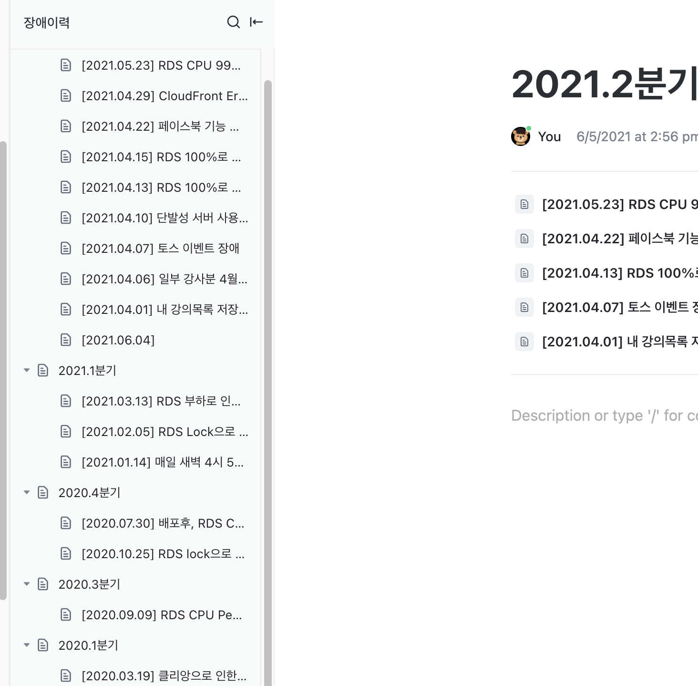
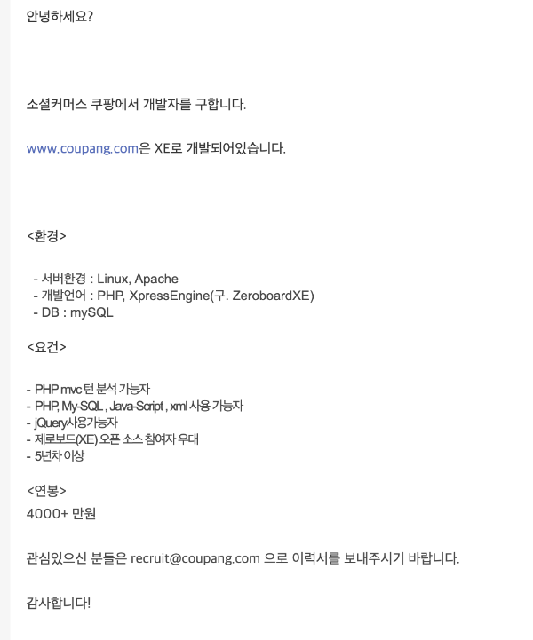
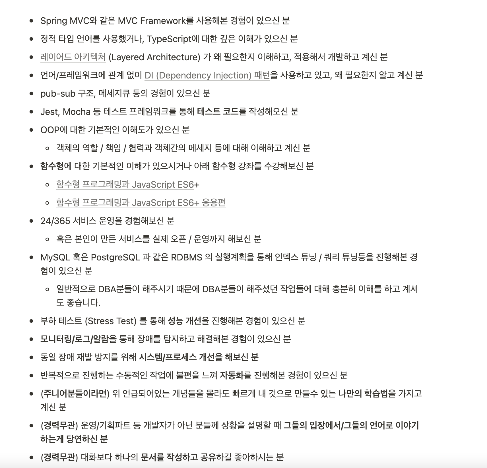

# 2021 CTO 회고

개인 회고와 별개로 CTO로서 구체적으로 기록을 남기고 싶어서 CTO회고는 별도로 빼서 작성하게 되었다.  

> 개인회고에 같이 담으니깐 너무 양이 많기도 했다.  
> 개인 회고는 개인회고대로 쓸 예정이다.
  
나와 비슷한 상황 혹은 CTO로 합류 하는걸 고민하시는 등 그 분들에게 조금이나마 도움이 되지 않을까 싶었다.

> 나중에 내가 다시 시드 ~ 시리즈 A 회사의 CTO로 혹은 기술 리더로 합류할때 도움이 될 것 같기도 하고

퇴사전에 실장님이셨던 기호님이 해주신 조언이 있다.  
**가서 바로 무언갈 하려고 하기 보다는 1~2달은 가만히 지켜만 봐라** 라는 것이다.  
  
그래서 가자마자 약 **한달간은 지켜보고 분석**하는 시간을 가졌다.

## 합류 전 ~ 합류 초

합류 전 대표인 형주님과 나눈 조건 중에 하나는 **CTO로 바로 가기 보다는 시니어로 입사 후 구성원들의 인정을 받으면 CTO로 올라가는 것**이였다.  
그러니깐 **조건부 CTO**였던 것이다.  
  
이 조건을 들었을 당시에 주변에서는 (솔직하게) 어이없어하긴 했다.  

* 왜 니가 거기가서 다시 증명을 해야하는거냐?
* 여기 남든, 다른 회사 가든 그런식의 조건을 달고 이야기를 하는 곳이 있냐?
* 거기가서 CTO가 안되면 그냥 단순 시니어가 되는건데 그럼 굳이 거기 왜 가냐? 
* 여기서도/다른회사에서도 더 좋은 대우로 / 더 넓은 권한으로 하는게 더 낫지않냐?

등등 진짜 친한 지인들 몇명에게만 이야기했다보니 눈치안보고 이야기를 해주긴했다.  

다만, 이건 인프랩이란 회사의 특수성에 기인했기 때문이라 나는 납득할 순 있었다.

* 회사가 20명이 될 때까지 한번도 C레벨은 커녕 **시니어 조차 한번도 채용해본적이 없었던 상황**
* 외부에서 합류한 시니어는 어떤 역할을 하는 것인지 감도 안잡히는 상황
* 시니어는 조직 전체에 큰 영향을 줄 수 있다는 것으로 인한 두려움
  
그리고 이건 내가 배민이라는 회사를 다니면서 가지고 있었던 나 자신에 대한 의심때문이기도 하다.
내가 배민에 합류할 당시에 경력이 3년채 안되는 (2년 10개월) 주니어였다.  
근데 합류해보니 계속해서 성과내기 좋은 팀에 있게되고, 팀장님들/실장님들이 많은 힘을 실어줬다.

즉, 직속상사의 전폭적인 지지하에 많은 성과를 낸것이다.

그래서 이렇게 지지를 받지 못하는 상황에서 온전히 내 힘으로 인정받고 성과를 낼 수 있는 사람인지에 대한 의구심을 계속 가지고 있었다.

**권한은 없는데 증명과 책임을 져야하는 자리**가 바로 이 자리구나 싶었다.

7월 23일부로 CTO로 진급했다.

그래서 나는 사원증이 2개다

## 서비스 상황 분석

모니터링/로깅이 없다는 것은 당장의 문제 해결 그 이상의 의미가 있나? 라고 물어본다면 분명하게 있다.

과거로부터 배우지 못한다는 것을 의미한다

* 어느 시점 / 어느 리소스에서부터 문제가 시작 된 것일까?
* 사전에 그 징후를 알 수 있는 방법은 없었을까?
* 우리 시스템의 임계점은 어느지점일까?
*

Slack의 대화 내용들, CloudWatch 지표&로그, 개개인의 머릿속에만 있던 기억 등등을 다 물어보고 조사해서 최대한 **과거의 장애 내역들을 정리**했다.  
(물론 그것도 애플리케이션 로그가 없어서 시스템 모니터링만 보고 뇌피셜 추측한거긴 하다.)

그리고 이를 토대로 대표인 쭈와 개발파트를 모아서 공유를 했다.

서비스가 불안정하다보니 **시스템 아키텍처도 그에 따라 일반적이지않은 구조**를 사용중이였다.  
(자주 죽었다 살았다해서)

## 기술

* 인프런 서비스 초창기부터 지금까지 쭉 함께하신 (거의 5년?) 개발자분이 있었고
* 데브옵스/프론트엔드/백엔드가 나름 분리가 되어있었고
* 다들 겸손하고, 알려드리면 되게 좋아해주셨다.

먼저 말하자면,  
이 과정은 사실 **어느 스타트업이나 겪는 과정**이긴하다.

(이제는 전설처럼 떠도는 초창기 쿠팡의 제로보드 개발자 구인 공고)  
  

그래서 "와 진짜 제대로 찐 스타트업 경험하겠다" 생각을 했다.  
물론 부정적인 생각이 아예 없었던건 아니다.  
(설득하는 과정에서 최대한 상처를 안주기 위해 돌려 얘기하고, 풀어서 이야기하고, 결국엔 하고싶은말을 참아야할때면 말이다.)

하지만 아무리 그렇게 돌려얘기해도 그 본질이 변하진 않는다.

**기존 프로젝트를 다른 방식으로 개선/개편**해야한다는것 말이다.

이게 초기 스타트업 개발팀에는 **역린**이다.  

왜냐하면 **지금까지 해오던 방식을 부정**당하는 것과 다를바 없기 때문이다.

실제로 올해 연말 회고때도 이 이야기가 언급되기도 했다.

나는 일반 **사용자 서비스를 하면서** 자바스크립트 혹은 자바와 같이 **언어만 주구장창 파고드는 개발자를 선호하지 않는다**.
특히나 **추상화를 무시**하고, 구현 코드만 나열한 방식은 현대의 사용자 서비스 개발에서는 어울리지 않는다고 생각한다.

괜히 **거인의 어깨위에 올라타라**라는 말이 있는게 아니다.

아래 글은 내가 2018년도에 본 글인데, 몇 년이 지난 지금도 기억할정도로 강하게 뇌리에 남아있다.  
(내용 전체가 좋기 때문에 꼭 다 읽어보길 추천한다)

[원 글](https://www.facebook.com/hyunho.kim.9465/posts/1184925318240273)

내가 속한 조직의 개발자분들이 **동시대를 살아가는 개발자가 아니게 될까봐** 정말 많은 걱정이 되었다.  
윗 글에서도 나왔지만, "**열심히 연습하는 자신을 놔두고 동시대가 휙 지나가버렸다는걸**" 뒤늦게 깨닫게 될때의 절망감은 말로 표현하기 어렵다.  
그리고 그렇게 사랑스러웠던 회사와 서비스도 더이상은 사랑할 수 없게 된다.

내가 리드했던 조직의 구성원이, 내가 오기전부터 헌신했던 조직원이 떠날때 원망/후회가 있어서는 안된다고 생각했다.

그래서 나한테는 이게 정말 큰 위기감으로 다가왔다.

서비스가 성장하면 개인도 같이 성장하는거 아니냐고?  
아니다.
서비스가 성장하는데도 개인이 성장하지 못한 케이스는 너무나 많다.
서비스가 성장하면 개인도 같이 성장한다면
**그 많은 빅테크 스타트업의 개발자들이 특정 라운드가 되면 대대적으로 인력 교체**가 일어날까.

**동접 800 ~  1000명만 와도 터지는 서비스를 만들고선 우리가 직접 문제를 다 해결하겠다는 것은 굉장히 오만한 생각**이라는 것도 이야기했다.  
상처가 될 수는 있겠지만, 현실직시는 할 필요가 있었다.

채용공고의 내용은 **앞으로 우리가 갈 길을 사내 구성원에게 명시**하는 것과 다를바 없다.

([인프런 채용 공고](https://inflab.notion.site/NodeJS-4a7668d2564a4180a0721a2135f97840))

* RDS PostgreSQL -> Aurora PostgreSQL 로 마이그레이션
  * RDS PostgreSQL을 쓰고 있어서 데브옵스 엔지니어가 직접 매니지드 하는게 많았고, **모니터링/성능을 효율적으로 쓰고 있지 못했다**
  * Aurora의 상대적 강점은 다음과 같다
    * 3배 뛰어난 성능
    * 프로비저닝, 패치, 백업, 복원, 장애 감지, 복구 등 **장애에 대한 향상된 지원**
    * 향상된 모니터링 등
* Redis Cache 데이터 다이어트
  * 불필요하게 Redis Cache로 쓰고 

### 스터디
  

좋은 코드에 대한 기준이 바깥의 방향과는 많이 달랐다.
FP냐 OOP냐 혹은 JS냐 Java냐의 문제가 아니였다.

(마틴파울러가 리팩토링2를 JS로 안내주셨으면 어쩔뻔했나싶다.)

처음엔 스터디를 하다가 2시간동안 1페이지만 진행되기도 했다.  
1페이지에 안좋은 코드와 좋은 코드에 대한 이야기가 나올때면, 서로 그동안 가지고 있던 불만들을 책의 내용은 인용해서 표출했기 때문이다.  
그럼 또 그 반대편 의견을 가진 분들이 거기에 다시 또 반발을 하는 일의 연속이였다.

레이어드 아키텍처 / 도메인 모델 / OOP / Public 인터페이스 / 회귀테스트 등을 스터디 하는 동안 계속 중간중간 설명을 드렸다.

## 1 on 1

1 on 1을 정말 자주 했다.

어떤 일을 하는데 있어서 **그게 설령 맞는 말이라도 누가 했느냐에 따라 사람들은 반대를 하기도 한다**

그래서 일을 하는데 있어서 얼마나 상호 유대감을 쌓아놓느냐가 집단으로 일을 할때 정말 중요하다는 것을 알고 있다.

레몬베이스 라는 리뷰 전문 서비스를 HR에서 도입해주었다.
그래서 

## 문서화

인프런은 내부적으로
몇달간 써보면서 느낀 클릭업의 장점은 다음과 같다

다만 이걸 앞으로 본격적으로 사용할 문서화의 도구로 쓰는 것에는 거부감이 컸다.

특히나 한글 입력의 경우 다음과 같이 **입력 버그**가 발생할때가 종종 있는데, 이때 작성자에게 급격한 스트레스를 준다

## 채용

### 채용 공고 리뉴얼

이 부분을 대표님과 또 한바탕 했다.

* 기존의 인프런 채용 공고가 있는데, 굳이 다시 쓸 필요가 있는지
* 채용 공고를 굳이 Notion을 써야할 이유가 있는지
    * 새로 작성하더라도, 기존 채용공고 페이지에다가 쓰지 않고 또 새로운 관리 도구를 추가해야하는지
* Notion으로 한번 사내 문서화를 시도했다가 크게 실망한 과거의 경험

채용을 하는데 있어서 채용 공고가 정말 중요하다는 것을 알고 있기 때문에 절대 양보할 수는 없었다.  
내가 원하는 수준의 채용 공고 양식과 내용을 작성하기 위해서는 **좋은 도구를 써야만 한다**.  
  
그래서 다음과 같이 대표님을 설득했다.

* 현재 인프런 서비스로는 에디터/Viewer의 한계로 충분히 매력적인 공고를 쓰기 어렵다
  * 채용 공고의 퀄리티와 지원자의 퀄리티는 비례한다는 점을 함께 말씀드렸다. 
* 이미 수많은 스타트업들이 채용공고를 Notion으로 사용하고 있다.
  * 최고의 도구는 아니지만 그래도 Notion이면 단순 컨텐츠 사이트로서는 충분한 역할을 한다.
  * 더군다나 사용법이 개발을 몰라도 될 정도로 쉽다. 
* Notion 은 오로지 **외부에 공개될 정적 사이트**로서의 역할만 한다
  * 그 외 현재 사내 문서 도구를 대체할 일은 전혀 없고, 딱 한정된 역할로서만 한다.
  * [oopy](https://www.oopy.io/) 를 통해서 Notion 역시 일반적인 웹 사이트처럼 커스터마이징할 여지도 굉장히 많다.

놀라웠던 점은 지원율도 높아졌지만, **지원자의 이력서/자기소개의 퀄리티도 높아졌다**는 것이다.  
  
일례로 어떤 지원자분은 **우대사항 항목 하나하나에 대해서 자기는 이 항목에서는 이런 경험이 있다**는 것을 모두다 남긴 자기소개를 보내주시기도 했다.

### 마이스터고

합류 시점에 사내에는 마이스터고를 졸업하고 바로 입사해서 일을 하시는 분들이 2분 계셨다.  
(백엔드 / 프론트엔드 1분씩)  
  
그리고 현재는 데브옵스 (만 3년), 프론트엔드 (신입) 을 추가로 채용해서 현재 마이스터고 졸업생만 4분이 계신다.  

지금은 전국에 마이스터고가 많이 신설되어 입학 경쟁율이 1: 1.1 ~ 1.2 정도를 유지한다. 
그래서 예전만큼(경쟁율 1:4, 1:5) 은 경쟁력이 없을 수도 있다는 이야기도 들었다.  
  
그럴 수도 있지만, 결국 전체 다수의 평균 값이 중요하기 보다는 우리 회사에 지원하는 개개인의 실력이 중요하다.  
우린 이미 4명의 마이스터고 분들을 뽑았고, 그 분들을 기준 삼아서 채용하면 되기 때문에 기수별 전체 평균에 대해서는 크게 신경쓰지 않는다.

## 비전 공유

