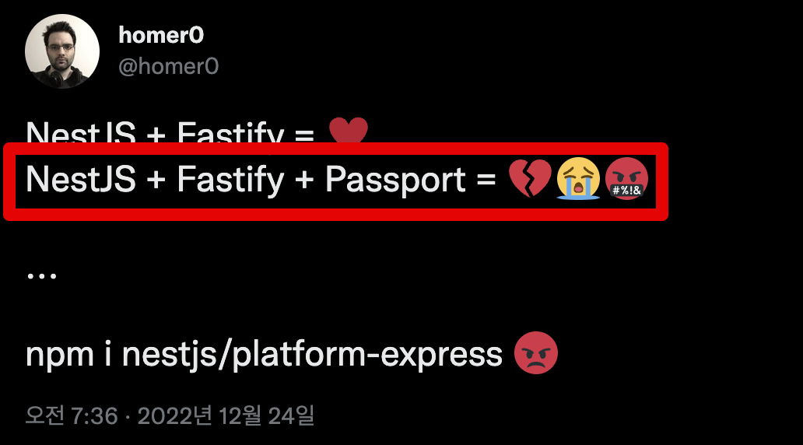
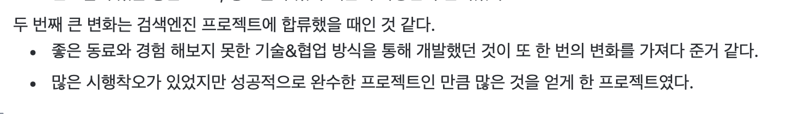
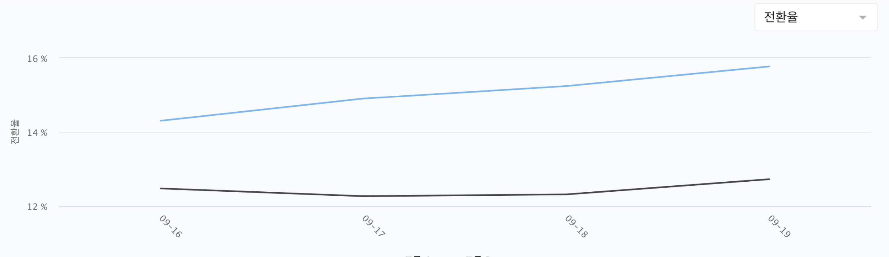
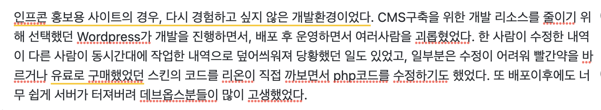

# 2022 CTO 회고

[지난 회고](https://jojoldu.tistory.com/626)에 이어 올해도 CTO 회고를 쓴다.

> 개인 회고를 2021년에도 못써서, 2021 + 2022년 개인 회고를 한꺼번에 하려고 한다.

작년에 다짐했던 기술, 조직 관점에서 많은 시도들과 시행착오들이 있었던 해였다.  
개발자를 하면서 **가장 많은 조언들을 구하러 다녔던 시간**이였던것 같다.  

조직관리에 대해 많은 고민을 했다.  
조직이 완전히 찢어지지지 않는 범위내에서 계속 조직을 키워나가는게 리더의 역량이라고 하는데, "내가 먼저 찢어지는건 아닌가?" 하고 자주 생각했던것 같다.  
  
찢어지지 않는 선에서 나와 조직 모두가 커지는 경험을 많이 했다.

## 서비스

### 1월의 악몽

1월에 진행된 100% 강의 할인 이벤트로 1월 3일 ~ 17일 사이에 총 6번의 서비스 전체 장애가 발생했다.

* [2022년 1월 100% 할인 이벤트 장애 부검](https://tech.inflab.com/202201-event-postmortem/)

서비스 전체가 작동이 안되는 경우가 정말 오랫만이였다.  
예전 2017년 여름에 배민 앱이 주말마다 전체 먹통이 되는 현상을 겪은 뒤로 근 5년만에 경험한 서비스 전체 장애였다.  
  
서비스 전체가 안되다보니, 채널톡 같은 CS 창구를 비롯해서 **개인 블로그에도 엄청나게 많은 문의**가 들어왔다.

(장애가 발생한 당일 개인블로그에 올라온 댓글.. ㅠ)  
  
그동안 넘겨두었던 부채 작업들을 빠르게 진행했다.  

* AWS Aurora PostgreSQL v10 -> v13 Upgrade 
  * 당시에 11도 아니고, 10 버전을 쓰고 있었다.. ㅠㅠ
  * 이 당시에 아직 Aurora가 PostgreSQL 14를 미지원했다. 
* 인덱스 및 쿼리 점검
* ConnectionPool, Query Timeout 등 PG Driver 설정

### 레거시 개편 시작

아래에서 후술할 랠릿이라는 신규 프로젝트부터 새 기술 스택 (TS/NestJS/React) 을 사용했다.  
지난 회고에서도 이야기 했지만, 이제는 더이상 메인 스트림을 무시해서는 **기술부채 이전에 서비스 속도가 더 안나올지경**이였다.  
예를 들어 요즘의 FE 도구들은 (디자인시스템, CSS프레임워크, Form, Table, 캘린더 등) **바닐라JS를 거의 지원하지 않는다**.  
그러다보니 기존 시스템에서는 5년전, 7년전 마지막 commit을 가지고 있는 라이브러리들을 계속 쓰고 있다.  

기술의 익숙함으로 해결할 수 있는 문제가 아니였다.  

FE와 BE 모두 **정적타입언어, 주류 프레임워크**를 사용해서 만족도가 높아졌다.  
하지만 기존 인프런 레거시에서는 그대로 JS/Express/FxDom (like jQuery) 을 사용하고 있어서, 차근차근 분리 작업을 진행하고 있다.  

당연하게도 시리즈 A 단계인 인프랩에서는 

**팀원들에게는 전체 개편 일정을 3년**으로 본다고 이야기 드렸다.  

* New FE <-> 인프런 레거시 <-> New BE, New 인증

로 해서 사실상 인프런 레거시를 Gateway 처럼 사용하려고 한다.

MSA로 갈 생각은 전혀 없고, 분산 Monolithic 으로 분리중이다.  

### 디자인 시스템

TS/React 를 신규 기술로 선택하면서 [Mantine](https://mantine.dev/)을 앞으로의 사내 디자인 시스템으로 선택했다.  

**프론트엔드 플랫폼 팀**을 구성할정도가 아니면 **모든 개발자들이 서비스 개발에 투입된 상황**에서는 직접 디자인 시스템을 다 구축하기는 어렵다고 생각한다.  

프론트엔드 개발자 커리어에 있어 디자인 시스템을 직접 구축하는게 얼마나 큰 영향을 끼치는지 잘 알고 있다.  
하지만, 그것도 회사 규모와 상황에 따라 할 수 있는 선택지라고 생각한다.  
지금의 우리 개발팀에 있어 가장 큰 과제는 **비즈니스 요구 사항을 만족시키면서 레거시 인프런을 다 개선하는 것**이다.  

### NestJS

올해 내내 NestJS와 TS를 사용했다.  
그러면서 든 생각은 "왜 지금에 와서 굳이 Spring Like 프레임워크를...?" 였다.  
  
호돌맨과의 대화에서도 비슷한 이야기를 했는데, 내가 처음 Node.js를 만난 것이 2016년이였다.  
당시에 [play.node 2016](http://playnode.io/2016/) 발표도 보면서 "와 저렇게 빠르게 API를 만들수도 있구나", "Spring과는 느낌이 완전 다르네?" 같은 느낌을 받았다.  
그리고 **스프링 프레임워크와는 다른 방향으로 얼마나 발전할까 기대를 했다**.  
  
그 이후 2021년이 되어서야 다시 Node를 보게 되었다.  
지금 가장 핫한 프레임워크라는 NestJS라는 프레임워크를 써야한다는 이야기를 듣고, 공식 문서를 열었는데... **TS로 된 Spring MVC**가 있었다.  

나온지 20년이 넘은 프레임워크 (Spring) 를 그대로 차용한 프레임워크가 현재 Node에서 가장 사랑받고 있다는 것에 꽤나 충격을 받았다.  
(물론 NestJS는 Spring을 차용한것은 아니고 Angular를 차용했다.)  
  
JVM의 스프링, C#의 닷넷 등 기존의 다른 프레임워크들이 고수하던 방식들을 그동안 Node 진영에서는 선택하지 않을때는 당연히 **이들과는 다른 방향의 좋은 해결책**을 고민하는 것이라고 믿었기 때문이다.

뭐랄까...
학창시절 되게 자기만의 멋이 있던 힙합가수/인디밴드를 10년뒤 새 앨범으로 만났는데 그게 k-pop인 느낌이라고 해야하나?  
(k-pop을 나는 좋아하는 것과 별개로)  
  
물론 Node.js는 메인스트림에 속해있는 생태계이다보니 프레임워크 역시 다른 프레임워크들을 많이 차용할 수 밖에 없다는 생각은 한다.  
단지, IoC/DI, AOP라는 개념을 10년 넘게 사용하던 입장에서는 너무나 새롭지 않는 방식이 지금에서야 거론되는게 좀 어색한 느낌이였다.  
  
그래서 처음에는 **NestJS 안쓰고 신규 스택을 구축**할까를 굉장히 고민을 많이 했다.  
NestJS가 Nodejs를 더 잘쓰는 방법이 맞나 확신이 들지 않았기 때문이다.  
그렇지만 결국은 `NestJS & TypeORM` 을 신규 스택으로 결정했다.

* 채용이 가장 큰 문제였다
  * 원티드를 비롯해 Node 채용공고를 보면 모두 **NestJS가 빠지지 않는다**.
  * 새로 합류할 분들에게 **우리팀이 만든 프레임워크를 쓰게 할것인가**, 이미 그들이 전 회사에서 경험한 프레임워크를 쓰게 할 것인가는 큰 차이가 있다.
* 우리팀 전체에 일관된 구조와 보편화된 해결책을 제시해줄 수 있었다.
  * 아무래도 사용자가 많은 프레임워크들은 구조, 사용법, 문제해결책 등에 대한 자료가 많았다.
  * 다른 회사에서 **우리와 비슷한 고민을 하고 해결책을 공유**하는 것 자체게 팀원 전체의 성장에 도움이 된다.

[NestJS 모임, 밋업](https://www.facebook.com/groups/nestjskr) 등도 생성되는것 보면 선택하길 잘했다는 생각은 든다.  
결국 **커뮤니티의 힘으로 프레임워크가 성숙해진다**.  
이번에는 우리팀도 이 커뮤니티로 성장하는 방법을 배울 수 있을것 같아서 좋았다.  

그렇게 해서 [새로운 서비스](https://www.rallit.com/)를 NestJS로 출시도 하고, 이후 레거시 개편도 NestJS 기반으로 진행하면서 1년이란 시간이 지났다.  
  
직접 사용해보면서 느낀점은... "**TS때문에 쓴다**" 였다.  
프레임워크 완성도는 만족하기 힘들었다.  

보통 NestJS가 Spring을 대체한다고 하던데, 실제로 써보면 Spring의 여러 종류 중 정확히 **Spring Web(MVC)에 대한 부분만 대체**가능 했다.  

물론 대부분의 서비스는 **웹 API로만 대부분의 기능을 구현하니** NestJS 가 Spring을 대체한다는게 일면 맞을수도 있다.  
서비스가 커지고나서 API 외 다른 방법들을 고민해도 된다고 생각한다.  
  
다만, Spring Data, Spring Security, Spring Batch, Spring Cloud 등 엔터프라이즈 애플리케이션에 필요한 여러 다른 부분은 Nest에는 마땅한 해결책이 없었다.  
그러다보니 좋은 해결책 보다는 아쉬운 해결책을 자주 선택할 수 밖에 없었다.   
  
몇번 그런 결정들이 생기다보니 NestJS가 가진 장점 보다는 **TS라는 좋은 언어를 사용할 수 있는 프레임워크** 라서 지금의 인기를 가진게 아닐까? 하는 생각이 들었다.  
  
기존의 레거시가 Express로 되어있는데, 모던 스택으로 전환을 할려고하니 대안책이 NestJS 밖에 없어서 사용하는 느낌이랄까?  
프레임워크로서는 다른 언어들의 프레임워크들을 대체할정도의 장점 보다는 단점이 좀 더 많이 체감되었다.    
  
예를 들어 NestJS에서는 **로그인/로그아웃의 기본 모듈이 없다**.  
passport라도 쓸려고 하면 **fastify를 못쓴다**.  
거의 Express가 강제화된다. 

(2021년에 확인했을때도 안됐는데, 위 트윗보면 2022년 12월에도 아직 안되나보다.)  
  
이외에도, 사용해야하는 Provider들을 일일이 Module에 다 등록해야한다는 단점도 있다.  

다른 DI 프레임워크들처럼 **자동으로 의존성들을 관리해주지 않는다**.  
(`@ComponentScan` 같은 기능이 없다.)  
    
모든 의존성들을 내가 다 선언해서 관리해야한다.  

> 마치 예전 스프링 초기 버전에서 XML로 의존성들을 다 등록시키던 것과 비슷하다.

통합 테스트 환경을 구성할때도 역시 어노테이션 (`@SpringBootTest`) 로 한번에 해소되지 않고, `TestingModule` 로 등록이 필요하다.  
  
물론 Express에서 날 것으로 웹 서비스를 구현하는 것에 비하면 2,000% 좋은 경험은 맞다.  
그렇지만 언어의 완성도에 프레임워크가 묻어가는 느낌이랄까...?
아무래도 아직은 시간이 많이 필요할 것 같다.  
  
그래도 기존 Express 환경에서 레거시 개편을 해야한다면 NestJS 가 가장 적합한 선택지인것 같다. 
Node.js 하다가 갑자기 다른 언어를 쓰는 것도 좋은 선택은 아니다.  
이후에 다른 스타트업에 합류하더라도 비슷한 상황이라면 또 NestJS를 선택할것 같다.

### 랠릿 오픈

인프랩의 채용 서비스인 [랠릿](https://www.rallit.com/)을 오픈했다.  
인프랩이 그리고 있는 큰 비전의 두번째 Step이 시작된 것이다.  
  
회사 입장에서도 큰 시도였지만, 개발팀 입장에서도 **처음으로 새 기술 스택을 전체 적용해본 프로젝트**였다.  

오픈하자마자 레거시가 된 느낌이랄까?  

작년 8월에 시작한 프로젝트가 1월 말에 오픈되었다.  
입사한지 4개월만에 20명의 인원이 참여한 프로젝트 리드를 맡게 되었다.  

그간 인프랩이 진행한 프로젝트 방식은 기획 -> 구현 -> QA -> 오픈이였다.  
2~3달을 구현하면 한달내내 QA하다가 오픈하는 방식인데 

프로젝트 회고를 하면서 자연스럽게 **스프린트마다 QA를 하면서 점진적으로 오픈해나가는 방식**을 도입할 수 있게 되었다.

그 당시 인프랩

이후 진행한 통합인증, 강의실 개편 등 모든 프로젝트들은 1~2주 단위의 스프린트와 스프린트 마지막 일에 실제 기능 QA를 하고 회고를 하는 프로세스를 다 적용해서 하고 있다. 

### 검색엔진 & 페어프로그래밍

인프랩 최초의 Kotlin & SpringBoot & MongoDB & AWS SNS/SQS 프로젝트가 오픈됐다.  
NoSQL + 메세지큐는 너무 흔한 조합이지만, 우리팀은 이제야 메세지큐와 NoSQL을 써야하는 시점이 왔다.  
(메세지큐가 특별한 기술 스택이라고 보긴 어렵지만)  
  
초기 스타트업은 **RDBMS로 모든걸 다 해결할 수 있다**.  

* 검색엔진은 Full Text Search로 대체한다.
* pub-sub 도 RDBMS를 저장소로 사용해서 대체한다
* 가능하면 API Retry로 일관성을 보장한다.

위 방법들이 임시 방편이고, 단일 쿼리에 대한 성능 개선은 결국 스케일업밖에 없기 때문에 RDBMS로만 모든 문제를 풀려고 하면 결국은 월 수천만원의 RDBMS 사용료를 지불하는 형태가 될 수 밖에 없다.  
결국 어느시점까지 최대한 RDBMS로 버티다가 넘어가느냐인데, 우리가 딱 그시점이였던것 같다.  
  
검색 기능이 사용될때마다 RDBMS의 CPU가 요동을 쳤다.  

평균 2%의 CPU가 검색어만 질의되면 19%까지 치솟았는데, 월 정산일에 맞춰 대시보드가 많이 호출되고, B2B 정산 엑셀 다운로드가 호출되는 것까지 겹치면 수십~수백개의 슬로우 쿼리 알람들이 호출된다.  
그렇다고 이 **몇몇의 기능을 위해 갑자기 DB 스펙을 2배, 4배씩 올릴수는 없었다**.  
  
그래서 어떻게 하면 최대한 공수가 적게 들면서 RDBMS가 처리하기엔 애매한것들을 가성비있게 효율적으로 처리할 수 있을까 고민을 하다가 MongoDB Atlas를 선택했다.  

* DynamoDB와 같은 NoSQL 계열이며
* 그간 Node.js 환경에 익숙한 우리 백엔드 개발자들이 모두다 사용해본 경험이 있는 솔루션이며
* Fully Managed Service 라서 관리요소가 적고
* Search, Data Pipeline 등 검색엔진을 비롯한 여러 요소들을 하나로 해결할 수 있었고
* 오랫동안 사랑 받은 서비스라 Spring Data MongoDB와 같이 대부분의 프레임워크들이 표준화된 형태로 지원하는 것도 장점이였다.

검색엔진 구축으로 Elastic Search 를 선택하면 결국 다른 문제들에 대해서는 DynamoDB와 같은 선택지를 추가해야만 한다.  
현재 우리팀에서는 각각의 문제에 대한 100점 답안 보다는 모든 문제에 80~90점의 답안을 내줄 수 있는게 필요했고 그에 적합했다.   
물론, **무료 플랜에도 3대의 레플리카 서버를 지원**해준다는 점에서도 스타트업에서는 꿀같았다.  
  
검색엔진은 MongoDB Altas Search로,
데이터 적재는 SNS/SQS를 하기로 하고,  
이들의 앞에 구현될 API 서버를 뭘로 할까 고민하다가 Node 가 아닌 **Kotlin & SpringBoot**를 선택했다.  

* 이번 프로젝트의 담당자 두분이 모두 **사이드 프로젝트로 코프링**을 사용하고 있었다.
  * 두분이 주말마다 사이드 프로젝트로 진행한 프로젝트가 있는데, 기술 스택을 Kotlin & Spring Boot를 사용하더라.
  * 해당 프로젝트를 진행 후, TS, NestJS, TypeORM vs Kotlin,SpringBoot,JPA 주제로 사내 발표도 진행했다.
  * **사이드 프로젝트 코드를 한번 보고나서**, 이정도면 업무에서 써도 되겠다는 생각이 들었다.
* AWS와 같은 Cloud를 사용할때 Spring Cloud가 지원하는 풍부하고 강력한 기능들이 있다.
  * Node.js에서는 Spring Cloud와 같은 기능이 풍부하면서도 테스트로 기능이 검증된 **추상화 된 라이브러리가 부족하다**.
  * 거의 대부분 aws-sdk를 그대로 사용하거나 [@ssut/nestjs-sqs](https://www.npmjs.com/package/@ssut/nestjs-sqs) 정도를 사용하는데, **AWS 서비스마다 개별 라이브러리를 사용해서 일관되지 않는 추상화 계층**을 쓰는게 좋은 패턴이라고 생각하진 않는다. 
  * Cloud의 대부분의 서비스를 어노테이션(데코레이터)와 Yml 기반의 일관된 추상화를 지원하는 Spring Cloud가 있는 이상 비슷한 경우에는 계속 Spring 계열을 쓸 계획이다.
* 데이터마이그레이션 등 단발성 배치 작업에 유리한 Spring Batch가 필요했다.
* BCI (`bytecode instrumentation`) 등의 지원이 없어 APM 모니터링이 아쉬웠다.
  * Datadog 을 쓰다보면 [nestjs-ddtrace](https://www.npmjs.com/package/nestjs-ddtrace) 등을 활용해 좀 더 상세하게 추적을 할 수는 있다.
  * 하지만 BCI를 지원하는 JVM에 비해서는 확실히 추적이 좀 더 구체적이지는 못했다.
  * 검색엔진쪽은 앞으로 여러 서비스들이 사용할 사내 플랫폼 성격이라 이쪽에 대해서는 훨씬더 구체적인 Trace가 있어야 한다고 생각했다. 

Kotlin, SpringBoot, MongoDB, AWS SNS/SQS 등 우리팀이 그간 사용해보지 못한 기술을 TF 멤버들이 써야만 했다.  
그래서 두분이서 **Full Pair Programming**을 진행했다.  
모든 스프린트를 Full Pair Programming 을 진행하다보니 오히려 **코드리뷰를 별도로 할 필요가 없고**, 새 기술에 대한 고민을 함께 하다보니 훨씬 **더 안정적으로 일정에 맞춰 오픈**할 수 있었다.  
  
실제로 해당 프로젝트 참가하신 두분 모두 회고에 긍정적인 피드백을 남겨주셨다.

(회고1)

(회고2)  
  
프로젝트 진행외, 프로젝트 결과 역시 **검색 결과가 개선되어 매출, 지표 등이 모두 상승할 수 있었다**.  
  
**CPU**

* RDS의 CPU **50% 개선**

**검색결과 0인비율**

* 기존대비 **18.82% 개선**

**매출전환율** (주문횟수/총 검색횟수)

* 기존 대비 **14.72% 개선**

새로운 기술, 새로운 방식을 도입했는데 진행과정과 결과물 모두가 만족스럽게 나와서 만족스러웠던 프로젝트였다.  
이 프로젝트를 계기로 개발팀 전체에 페어프로그래밍을 더 적극적으로 권장할 수 있게 되었다.

### 코드와 거리두기

올해 1월 랠릿을 오픈할때까지는 직접적인 개발에 참여했다.
백엔드의 코어 설계 쪽을 특히 많이 담당했다. 
당시에는 FE 파트에서는 신규 기술 스택, 요즘의 개발 방법론에 대해   가 전 직장에서 한번은 경험을 해보았고,  도 사이드 프로젝트로 숙련도를 쌓고 있어서 FE 에서는 랠릿을 구축하기 위한 새로운 방향성에 대해 잘 잡을 수 있을것이라 판단했다.
그래서 BE 에서 어떻게 설계하고, 어떻게 구현하고, 좋은 프로젝트가 갖춰야할 A-Z에 대해 중심을 잡고 진행했다.

랠릿이 오픈 한 뒤로는 직접적인 개발에 대해 거리를 점점 두고, 이제는 거의 안하고 있다.
예전에 꾸기가 1 on 1 때 이야기해준것인데, 
"향로가 만든 코어 모듈에 대해 물어볼게 있을때",
"향로에게 코드리뷰를 받아야할때"
그때마다 향로가 부재중이면 기다릴 수 밖에 없어서 답답했다는 것이다.

그 면담으로 팀의 인원수가 아무리 많아져도 우리팀은 "나 때문에 싱글 쓰레드로 작동하겠구나" 라는 위기감을 느낀것 같다.

원래부터 내가 직접적인 관여를 하지 않았던 FE 파트에서는 오히려 멀티 쓰레드로 작동되는 것에 점점 익숙해지는 것 같았지만, 내가 너무 깊게 관여했던 BE 파트에서는 그 부분이 오히려 독이 된 것 같았다.

생각해보면 아무래도 나의 Base는 엔지니어링이라서 그랬던것 같다.
회사에서하는 모든 행위에서 엔지니어링이 배제되는 것이 불안하고 두려워서 계속 손을 놓지못했던건 아닐까? 하는 생각도 해보았다.
그래서 회사에서 엔지니어링에 관여하는 것에 의도적으로 더 거리를 두었다.  

현재는 BE에서도 그들끼리 서로 리뷰를 하고 의견을 주고 받는것이 활발해졌다.
요즘은 설계단계에만 참여하거나 선택적 코드리뷰어로만 참여하면서
내가 병목의 중심이 되지 않게 잘 운영되고 있는것 같다.  

## 조직

### 팀원

올 한해는 10명이 입사하고, 3명이 퇴사했다.
우주, 어텀, 스틴, 제이, 요한, 제이크, 루카스, 토리, 융디, 고슈
차밍, 꾸기, 스틴

10명이나 합류 한것에 대한 감사함과 3명이 떠난 것에 대한 미안함과 아쉬움이 공존했다.

더 큰 회사로 가는 것만이 성장할 수 있는 방법이라고 생각하진 않는다.
가파르게 성장하는 서비스를 내 손으로 직접 보수공사를 하면서 계속 키우는 것이 훨씬 더 강력한 성장 방법이라고 생각한다.
실제로 나도 그렇게 성장해왔고, 그 연차에 경험할 수 없는 부분을 더 큰 범위로 경험했기 때문이다.

"지는 배민 다녀놓고서는 저런말 한다" 라고 생각할 수도 있겠지만,
내가 입사할때 배민은 지금처럼 큰 회사는 아니였다. 

(2016년에 입사했으니, -250억 적자를 내고 있던 소식만 있던 시기에 합류했던 것이다) 

퇴사해보니 갑자기 빅테크 출신 리드 개발자가 되어있었다.
그래서 나는 굳이 빅테크를 가기 보다는, 우리 회사를 빅테크로 만드는 것이 가장 좋은 성장의 재료라고 믿고 있기도 하다.
(회사가 빅테크가 되기 위해서는 개발자 개인의 성장만으로 되는 것은 아니지만 말이다.)

그래도 그들의 퇴사에 감사한 점은 (제품 파트 전체에도 공유를 하긴 했지만) 
더 큰 회사로 이직하게된 그들로 인해서 
"우리 개발 조직, 제품 조직이 일하는 방식과 기술력이 빅테크에서도 인정을 해준 것" 으로 해석할 수 있다.

작은 스타트업에서는 개발자가 제대로 성장하기가 어렵다는 이야기가 많은데,
반대로 우리팀은 다른 팀 보다 훨씬 더 건강하고 빠르게 성장하고 있다.
 
내년에는 좀 더 문단속(?)을 잘하면서
서비스의 성장이 조직의 성장으로 이어지는 자연스러운 경험을 전달해주고 싶다.

### 경력직 채용

직접적으로 이야기했던 외부 경력직으로 2분이 최종 합류했다.  

* PO - 보니
* FE - 루카스

내가 추천했다곤 하지만, 회사 프로세스 상에서는 모든 면접을 다 진행해야만 한다.  
그럼에도 끝까지 진행해서 합류해주셔서 감사했다.  
특히 두분다 다른 회사의 오퍼도 있었는데도, 우리 회사로 최종 결정을 내려주셔서 더 감사했다.  
저 분들에게 좋은 경험을 줘야하는게 또 하나의 과제라고 생각하며 임했다.  
  
다만, 두분외 나머지 분들은 아쉽게 불발되었다.  
특히 BE에서 모셔오지 못한게 좀 큰 아쉬움이였다.  

현재 소속된 회사에서 아쉬움을 느끼고 있는 몇 분과 커피챗을 진행했고, 상반기까지 분위기가 그렇게 나쁜편은 아니였다.  
(현재 다니는 회사에 만족하시는 분들과 이야기나누는건 예의가 아니라고 생각했다.)  
  
하반기가 들어서고나서 오늘회, 왓챠, 탈잉 등으로 이어진 권고사직 여파가 강했다.  
안그래도 가정이 있는 분들의 입장에서 스타트업 합류가 쉬운 결정이 아닌데, 많은 스타트업에서 권고사직 기사가 나는 것을 보고 더이상의 이야기를 나누기는 어려웠다.  
  
올해 들어서 여러 회사의 CEO, CTO님들과 이야기를 나눌 수 있었는데, 최근에 들어서 런웨이가 8~10개월정도 남았다는 이야기를 자주 들었다.  
아마 내년 상반기엔 더 많은 힘든 소식을 들을것 같다.  
  
내 또래, 내 연차정도 되는 분들은 대부분 가정이 있다.
한 가정의 가장에게 "권고사직이 매 주마다 들리는 스타트업으로 합류하는 것" 은 너무 큰 모험이기 때문이다.

그래서 내년엔 인프랩은 다른 스타트업과는 많이 다르다는 점을 알리고 싶다.
"당신이 우려하는 많은 것들이 인프랩에서는 다를것이고,
정말 좋은 동료들과 일할 맛 나는 환경에서 일할 수 있을 것이다" 라는 점을 알리고 싶다.

회사를 위해서도 있지만,
앞으로 합류할 동료들에게 신뢰를 주기 위해서라도
많은 지표를 높이고 싶다.

### CSO

작년 하반기에 쭈가 움파와 몇 번의 미팅을 했고 합류를 제안하려고 한다는 이야기를 해주었다.
움파는 팀에 2번의 강연을 해주셔서 알게 되었다.
그 이후 쭈와의 미팅 내용도 들으면서 했던 생각은 우리의 현재 상황, 그리고 쭈와 잘 맞을까 하는 것이였다.
움파는 훌륭한 사람이지만, 서로가 필요한 단계라는게 있다고 생각했기 때문이다.
그렇지만 쭈와 계속 이야기를 나누면서 내가 너무 협소한 시각으로 보는것일수도 있겠다 싶었다.

"새로운 C레벨이 오는 것을 걱정하거나 경계하는건가?"
"우리 회사에서 매출을 그만큼 성장시켜본 경험을 가진 사람이 있는가?"
"쭈나 우리 조직에서도 리더에 대한 경험을 계속 해봐야하는거 아닌가?"
등의 여러 생각을 하게 됐다.

특히 "새로운 C레벨이 오는 것이 내 밥그릇 걱정때문에 그런건가?" 하는 나 자신을 의심을 많이 했던것 같다.
나에게도, 운영조직에도, 회사 전체에도 새로운 리더가 합류 하는 것, 그것도 사업적으로 큰 성과를 내 본 경험을 가진 분이 합류하는 것이 많은 도전거리가 될 것 같다고 생각했다.
(그 도전의 결과가 좋으면 성공이고, 안좋았다면 경험이 될것이니깐)

6개월이라는 짧은 시간만 함께 하고 헤어졌는데, 복기해볼 부분이 많았던것 같다.
아마 이 부분은 앞으로도 계속 쭈와 계속 복기하지 않을까 싶다.

물론 움파와 헤어지고나서도 3명이서 종종 밥도 같이 먹고 티타임도 가지곤 한다.
나쁘게 헤어진 것은 아니기 때문이다.
나도 그렇고, 쭈도 그렇고 많은 생각거리와 과제를 남겨준 인연이였던것 같다.

## 기타

### 발표 

EBS 먼데이스쿨, MongoDB Day Seoul, 네이버 SEF 2022 등 외부 바이럴이 될만한 큰 곳에서의 발표를 여러개 진행했다.
예전에 쭈, 움파와 함께 VC들을 만났을때 들었던 이야기가 "왜 인프런은 기사거리가 없냐" 라는 것이였다.
서비스 개발자들을 제외하고는 인프런에 대해 잘 모르고, 다른 교육업체에 비해 인지도나 네임드가 부족하다는 식의 이야기셨다.
그래서   가 열심히 보도자료를 관리할 수 있도록 조직의 변화도 생겼고,
나도 나 스스로 뭔가 조직과 서비스를 알려야겠다는 생각을 했다.

물론 나는 유튜브 채널과 개인 블로그를 가지고 있어서 개인의 마케팅 채널은 충분한 편이다.
이를 계속 활용할 수도 있겠지만, 이건 너무 나와 취향이 맞는 사람들이 이용하는 채널이다.
그래서 나와 취향이 맞든 안맞든 관계없이 소식이 전달 될만한 부분이 필요했다.
그런면에서 EBS나 MongDB, 네이버 등은 개발자로서 소식을 알리기에 좋은 매체였다.
얼마나 많은 사람들에게 전파되었냐는 정확히 측정할순 없지만 SNS 등에서 당일에 발표에 대해 이야기 나누는것을 볼때마다 하길 잘했다는 생각이 든다.

### 멘토링

현대 아산 재단에서 진행하는 스타트업 엑설레이팅 MARU (마루)의 개발분야 멘토로 참여하는 중이다.

계기는 원래 연락을 주고 받던 스타트업 대표님의 부탁으로 해당 개발팀분을 만나 내 경험을 이야기해주다가, 이후에 본인이 참여중인 엑설레이팅 프로그램의 멘토로 추천을 하게 되서 시작하게 되었다.  
  
개발팀이 7명일때 합류하고 현재까지 지내오면서 느낀것들, 배운것들이 있다.  
그러다보니 비슷하게 개발팀 규모가 2~5명인 팀인 분들이 많이 고민 상담을 요청해주셨다.  
내가 이분들께 어떤 조언을 한다던가 그럴수 있는 수준은 아니지만, 최소한 이야기를 들어주고 내 생각을 이야기하는 정도는 할 수 있을것 같았다.

초기 (팀원이 10명이하) 스타트업 분들을 만나면 **생각보다 인프런을 많이들 모르시더라**.  
멘토링 하면서 자연스레 인프런과 랠릿을 소개할 수 있었다.

배민에서 배웠던 마케팅 방법 중 하나인데, 
**1,000명한테 1,000원 포인트를 선물하는 것보다
10명에게 손편지를 쓰는게 훨씬 더 효과가 좋다**.  
  
지금 내가 하고 있는 이 멘토링도 그들에게 손편지 마케팅을 하는 것이라 생각해서 가능하면 열심히 멘토링을 참여한다.  
실제로 그 회사들 중에서 얼마나 인프런과 랠릿을 오래 기억할지는 모르겠지만, 고객이 되지는 못하더라도 주변에 한번이라도 더 언급이 된다면 남는 장사가 될것 같다.

조직이나 서비스의 브랜딩이라는게 하루 아침에 쌓이는게 아니다 보니, 사람들에게 스며들기를 바라고 있다. 

## 인프콘

[인프콘 회고](https://jojoldu.tistory.com/678)는 이미 예전에 한번 작성했기 때문에 여기서는 CTO로서의 생각만 남긴다.  

인프콘 페이지를 워드프레스로 구축했다.  
당시에는 **컨텐츠 에디터분들이 컨텐츠를 편하게 발행**해야한다는 요구사항이 있었다.  
그래서 CMS 구축까지 고려하면 그냥 간단하게 워드프레스로 구축하자 라고 생각하고 시작을 했다.  

그리고  

이후에는 인프런의 커뮤니티 기능을 활용하는게 더 낫겠다는 생각을 했다.  

## 개인 시간 확보하기

날씨가 쌀쌀해지고나서 로켓펀치가 운영하는 집무실을 매일 아침마다 이용하고 있다. 

원래는 아침에 까페에서 무언갈 하기 보다는 회사 타운홀에서 공부를 하자 쪽이였다.
다만, 의도와는 다르게 타운홀에서 계속 팀원들과 이야기를 하는 시간이 되버려서,
원래 목표로 하던 일들을 오전에 진행하기가 어려웠다.

원래 하려던 일들을 오전에 달성 못하면, 많이(?) 힘들어하는 편이라서 이 부분을 어떻게 좀 해결하고 싶었다.
그래서 한동안은 집 근처 메가커피에서 개인적인 용무를 다 보고 에너지 충전을 한 뒤에 출근을 하는 걸로 변경했다.
10월까지는 너무 만족스러웠다.
그러다 11월이 되면서 아침 까페 오픈 시간에 맞춰 가면 너무 손이 시렸다.
손을 벌벌떨면서 키보드를 치는데 이래서는 오래 못할것 같았다.
그래서 찾아보던 중에 집에서 500m도 안되는 거리에 집무실이 있는 것을 발견했다.

현재까지는 만족도가 너무 높다.
24시간 운영하면서도, 항상 일정 온도를 유지해주고, 집중하기 좋은 환경을 구성해준다.
어느정도로 만족하냐면..
아침에 "내일 집무실 가야지" 하는 생각에 6시에 일어날 수준이다.

가능하면 저녁에 회사일이 필요할때도 사무실에서 일하지 않고, 집무실로 바로 달려가서할까도 고민하고 있다.

## 정기 강연

작년 이종립님 & 최선혁님의 특강 (2021년) 이후로 총 8회의 시니어 강연을 진행했다.
김지홍님 (디자인 파트)
산타파이브 팀
로토님
태오님
임성현님
조영호님
한재엽님
배휘동님 

PO 파트에서는  가 시니어 PO인 재호님을 정기적으로 초청해서 진행해주신다.

제어할 수 없는 것에 의존하는 것을 좋아하지 않는다.
외부의 시니어를 데려오는 것은 내 노력과 별개로 제어할 수 없는 영역에 있다.
(그래서 안하겠다는건 아니고...)

어떻게 하면 외부의 시니어가 가진 경험치를 우리팀에 녹일 수 있을까?
그걸 내가 제어할 수 있는 확실한 영역으로 옮길 수 있을까? 
등을 좀 고민해보다가 강연,토크 등으로 확장하게 되었다.

2022년 한해 동안 진행했던 일 중에서 가장 호응이나 만족도가 높았던 일이였다.
제품조직 내에서 큰 성과를 본 일이라서 내년 부터는 운영 조직에도 도입할 예정이다.

운영 파트로의 도입은 혹시 모르니 한번 파일럿 프로젝트을 진행해봤다.
어제 승희님을 모시고 진행했을때 호응도가 너무 좋았다.
그래서 내년에 더 적극적으로 운영/제품 조직에 필요한 경험을 가진 시니어분들을 계속 초빙해서 경험을 공유 받아야겠다는 계획을 세웠다.

각 영역의 전문가들이 다 지인인건 아니라서 처음 연락할때 좀 민망할때도 있는데,
뭐 괜찮다.
민망해서 말 걸지 않으면 섭외율이 0%일테니깐
말이라도 걸면 1%의 섭외율이라도 생기는거라서 지인, 지인의 지인, 지인의 지인의 지인들을 다 물색해서 내년엔 더 많은 강연을 진행해야겠다.

욕망 Management
이제는 대표직에서 물러나신 범준님을 11월에 뵈었다.
이야기를 나누던 중에, 범준님이 모두에게 해준 말이 있다.

"구성원들의 기대 수준을 관리하셔야 해요"

이 얘기에 아차 싶었다.
나는 그동안 내 기대수준을 맞추는데 최선을 다했기 때문이다.
기대 수준이라는 단어는 나에게 너무 우아한(?) 표현이라서 혼자서 생각할때는 욕망이라는 단어를 자주 쓰곤 했다.
그러다 범준님의 조언으로 구성원들의 욕망도 관리해야한다는 것을 알게 됐다.
생각해보면 그간 봐왔던 많은 구성원분들이 본인의 욕망을 회사에서 더이상 채울 수 없다는 것을 느끼면 그때부터 보상에만 관심을 가졌었다.
보상에 관심을 가지는게 나쁜 것은 아니지만, 회사에서 관심있는 것이 오로지 보상이기만 해서는 건강하지는 못하다고 생각했다.
회사에 바라는 본인의 기대수준이 없다는 것을 의미하니깐.

어느정도 관리 가능한 범위내에서는 조금 더 기술적 자율권을 주려고 했다.
전 직장 배민에서도 느낀건데, 구성원들의 기술 수준이 충분히 되기 전까지는 절대로 기술 자율권을 줘서는 안된다고 생각한다.
일관되고 통일된 기술 스택으로 모두의 역량이 일관되게 성장할 수 있도록 환경을 구성하고,
그렇게 모두가 일정 수준에 도달하게 되면 그때서야 자유도를 높였었다.

기술 수준이 낮을때의 자유도는 독약이라는 생각에 변함은 없다.
다만, 지금의 우리팀 수준이라면 그래도 어느정도는 자유도를 줘도 되지 않을까 하는 생각과 개발자로서 가지고 있는 모든 욕망을 거세당하면 과연 우리 회사를 다닐 이유가 있을까? 하는 생각이 함께 들었다.

그래서 "관리가 가능한 범위 내에서는 자유도를 허락" 하기로 했다.
물론 우리팀원들이야 "그게 자유도있는거였어..?" 라고 할 수도 있는데..
나한테는 엄청 큰 결정들이였다...
(전 팀원들이 봤으면 욕할정도로 오픈마인드가 된것이다)

100% 다 자유도를 주는것은 아마 앞으로도 힘들것 같다.
그래도 최대한 우리팀원들의 욕망을 잘 관리해보고 싶다. 

 

## 마무리

회사가 성장함에 따라 구성원들이 성장해야한다고 자주 말하지만,
리더도 회사의 성장속도에 맞춰 성장해야한다.

**'Don't Be Evil'** 을 매일 출근할때마다 생각한다.
구글의 모토인 "나쁜짓을 하지 않고도 돈을 벌 수 있다는 것을 보여주자" 와는 조금은 결이 다르긴하다.
"내가 악마가 되지말자" 를 생각한다.

조직 내에서 권한이 생기고 직급이 올라가면 점점 부적절한 사람이 되는 경우를 자주 봤다.
원래 그러지 않던 사람도 권한과 역할이 생기면서 점점 안하무인이 되거나, 누군가에게 상처를 주거나, 조직의 문화나 규칙을 어기는 등등을 보인다.
처음부터 그 사람이 그랬던 것은 아니다.
그정도로 나쁜 사람은 애초에 리더가 되지 않는다.
한두번 그런 실수를 했을때 누구하나 지적하는 사람이 없기 때문에 점점 무감각해지고 종국에 그냥 그게 당연스럽게 되는 것이다.

권한이 없을때는 보통 많은 조직장들이 그런 실수에 대해 강한 피드백을 하니깐 바로 인지하고 고칠 수 있다.
근데 (유/무형의) 직급과 권한이 생기면 더이상 그렇게 강한 피드백을 해주는 사람이 점점 없어진다.
이건 내가 현재 잘하고 있어서 부정적인 피드백을 안해주는게 아니라, 권한이 생기면 자연스레 그렇게 된다.

직급이나 권한이 생긴다는 것은 그런것 같다.
내가 잘못나가고 있는데도 주변에서는 피드백을 해주지 않는 것.
그래서 점점 악마가 되기 쉬워지는 것.

그래서 나 스스로 단속할 수 밖에 없는것 같다.
직급과 권한이 생길수록 더 스스로를 단속해야만 되는데, 올 한해는 그걸 얼마나 해냈을까? 하는 생각을 해본다.
