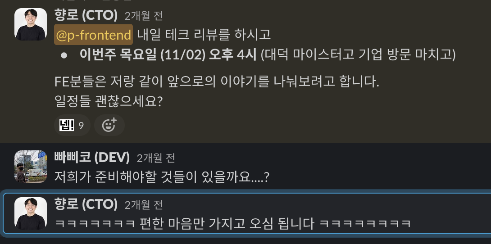
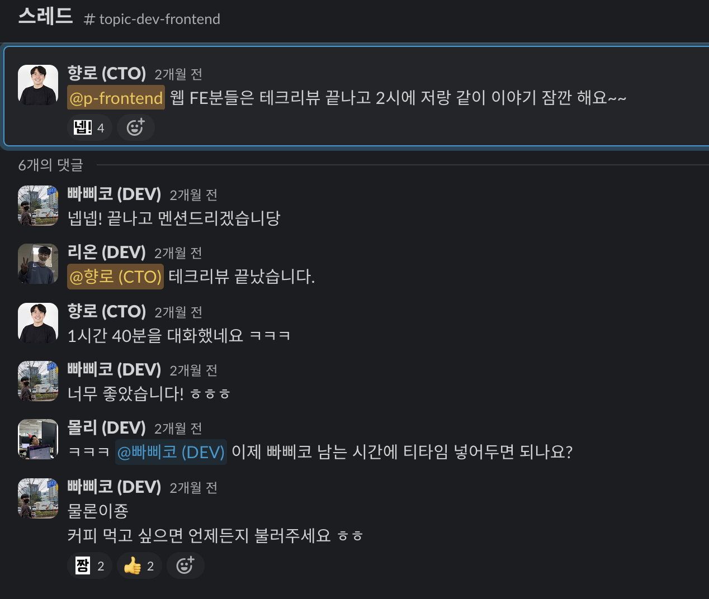
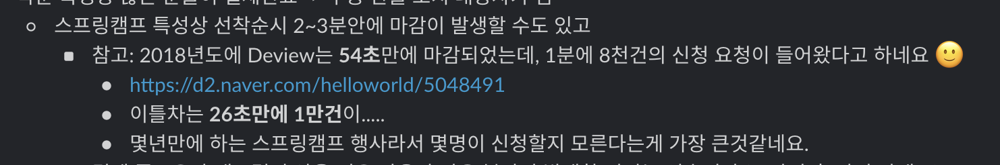
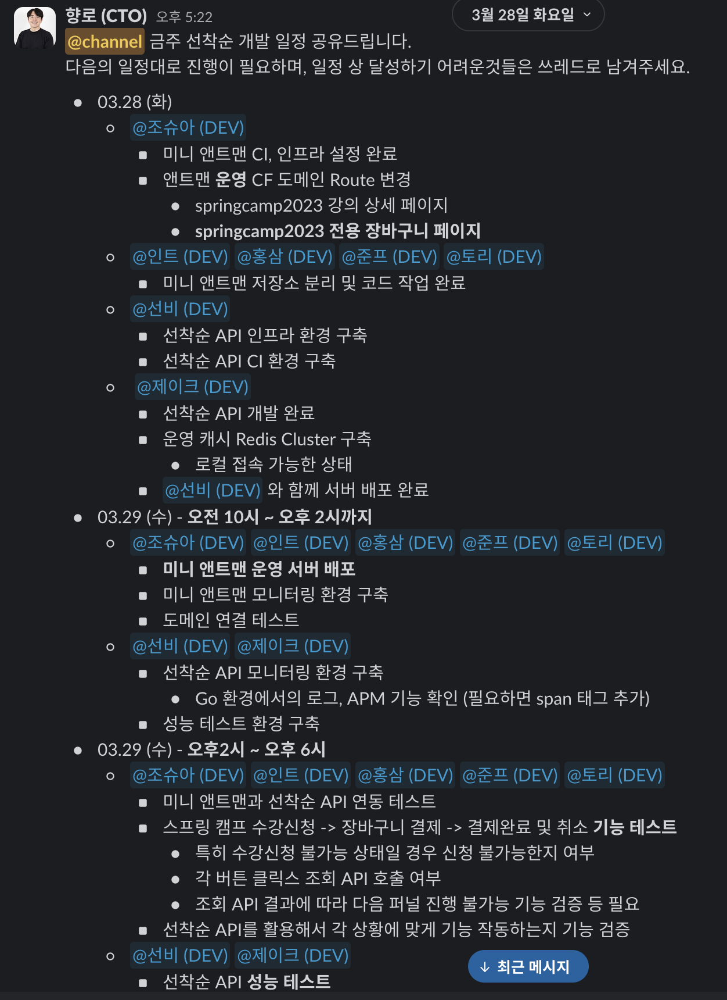
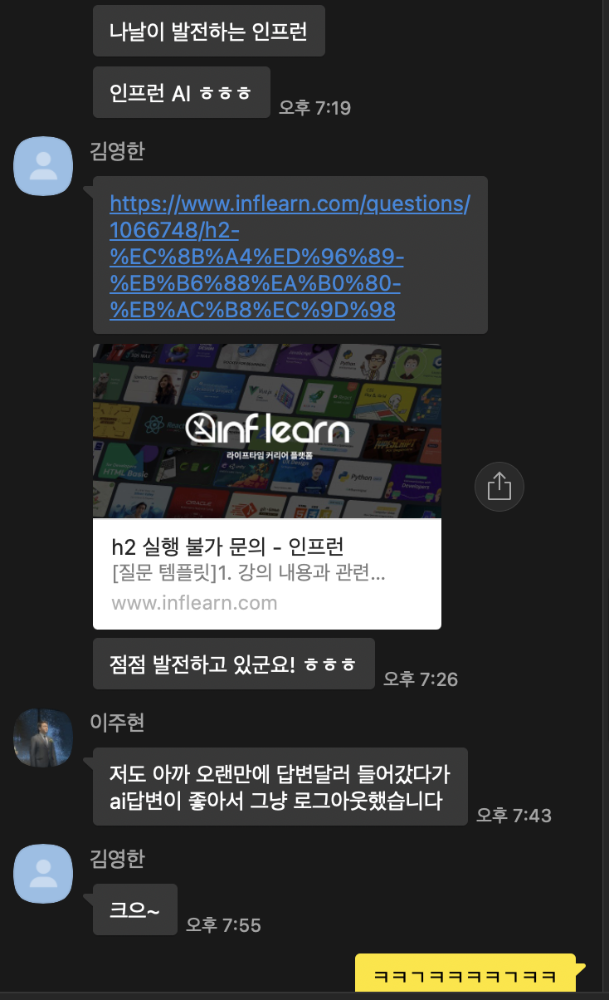

# 2023년 CTO 회고

2021년 초에 합류했다가 벌써 만 3년이 다되어간다.  
올해는 점점 내 역할을 팀원들에게 위임하는 한 해였고,  
제품의 성적표와 회사의 매출이 연결되는 것을 증명하는 해였던것 같다.

## 1. 조직

### 개발팀 미션

인프랩 개발팀의 미션과 가치을 작성해서 팀에 공유했다.

> 사내 Wiki에 먼저 기록하고 [기술 블로그에 공개적으로도 공유했다.](https://tech.inflab.com/20231117-devteam-value/)

매 주마다 진행하는 개발팀 스프린트에서 자주 하던 이야기들이 있다.

*   득점왕 보다는 팀을 우승시키는 팀원이 되자.
*   계몽보다는 전염시키자.
*   숙련도가 낮음을 기술의 문제로 돌리지말라.
*   기타 등등
  
이런 이야기들을 자주 하다보니 개발팀 전체가 어떤 사람이 우리팀에 어울리는지, 어떤 동료가 좋은 동료인지 추상화된 형태로 다들 이해는 하고 있는 상태였다.
다만, 추상화된 형태가 아닌 좀 더 구체적으로 명확하게 다들 이해하고 있을 필요가 있었다.

그래야만

*   면접관으로서 어떤 사람을 뽑아야할지
*   외부의 인재와 커피챗할때 어떤 것들을 질문해야할지
*   동료에게 피드백을 줄 때 어떤 내용으로 줘야할지
*   나 자신의 회고를 할 때 어떤 점을 회고해야할지

등등의 기준이 세워지기 때문이다.

"우리팀은 이런 사람을 원해요" 라고 하고선 실제로 채용되는 사람은 그렇지 않으면 그것은 큰 문제다.
"우리팀은 이런 팀원이, 이런 팀이 되었으면 좋겠어요" 하고선 동료 피드백은 그것과 반대로 받는다면 그것 역시 큰 문제다.

그래서 명문화(明文化)가 필요했다.

**"내/외부 고객의 신뢰를 얻기 위해 적절한 시기에 적합한 도구로 고객의 문제를 해결한다"**

이 미션을
입사하기전에도 보고,
입사한 후에도 보고,
근무중에도 보면서 자연스럽게 이런 사람을 뽑아야하고, 이런 팀원이 되야하는 것을 체화할 수 있도록 말이다.

팀 게임을 하는 팀이 되어야한다고 항상 얘기했다.
그래서 이렇게 팀의 미션과 가치에 대해 이야기할때도 **팀 게임에 필요한 행동 강령을 가장 우선시**했다.
기술적인 것에 대한 내용은 가장 후순위다.
모두 다 중요하지만, 기술적인 것들 이전에 팀 게임을 하지 않으면 기술적인 것이 아무리 뛰어나도 안되는 것을 강조한 것이다.
  

(최근에 토스의 이승건 대표님이 공유한 포스팅을 보면서도 팀 게임에 대해 다시 한번 상기될 수 있었다.)
  

개발팀 누구에게 물어봐도 이 미션을 이야기할 수 있어야 한다고 생각한다.

> 지나가는 개발팀분들에게 깜짝 게임처럼 물어봐야겠다.... 라는 생각을 해봤다.

미션이 변할리는 없지만,
그럼에도 회사가 커짐에 따라 팀원이 늘어남에 따라 여러 행동강령들에는 변화나 개선, 추가 등이 있을 수 있다.
그런 변화에도 모든 개발팀원이 항상 인지할 수 있도록 좋은 지침서를 계속 공유해야겠다.

### 팀원

올 한해는 **5명이 입사하고, 5명이 퇴사**했다.

*   입사: @홍삼 (DEV) , @우드 (DEV) , @제이스 (DEV) , @조조 (DEV) , @후니 (DEV)
*   퇴사: 주스, 우주, 요한, 루카스, 라비

새로 합류하신 분들은 신입 ~ 3년차 미만의 주니어분들이다.
**동기부여가 충분히 된 주니어**분들이 가지고 있는 성장세에 항상 놀라운 경험을 한다.
이런 분들을 보면 항상 기분이 좋다.
유시민 작가님의 말씀처럼 항상 다음 세대는 더 뛰어남을 많이 체감하고 있다.

특히 올해 초에 합류한 홍삼, 우드는 아직 1년이 안되었음에도 이제는 Backend 파트에서는 없어선 안 될 팀원이 되었다.
굉장히 잘하고 있어서 더더욱 이런 분들을 더 채용해야겠단 확신을 얻었다.
최근에 합류한 제이스, 조조, 후니도 점점 시간이 지남에 따라 가파르게 성과를 내시고 계셔서 큰 기대를 하고 있다.

모든 퇴사하신 분들이 아쉽지만, 특히 만 3년을 다닌 주스와 라비의 퇴사가 가장 아쉬웠다.  

주스는 올 상반기부터 면담도 자주하고, 고민을 많이 하던때라 충분히 마음의 준비를 할 수 있는 시간이 있었다.
반면, 라비는 갑자기 이야기가 나와서 정말 놀랬다.
특히 랠릿 Cell 에서 정신적 지주로서의 역할을 하고 있었기 때문에 더 컸다.
물론 합류할때도 경력직으로 합류를 하고, 한 회사에서 3년을 다녔기 때문에 당연히 이직할 시기가 된 것은 알고 있었다.
다만, 그걸 알고 있는 것과 막상 닥쳤을때는 전혀 느낌이 달랐다.

남아주셨으면 좋겠다는 생각도 있었지만,
억지로 잡는다고 해도 못간 길에 대한 아쉬움은 분명히 남기 때문에 아쉬운 만큼 응원을 하기로 했다.

라비가 가기로 한 곳은 이미 좋은 시니어 개발자분들이 많이 있는 곳이기 때문에 가서 좋은 경험치를 많이 쌓으시라고 조언도 드리고, 새 회사에서 큰 규모의 개발팀에서 합류하는 것에 대한 이런 저런 이야기도 드렸다.

주스와 라비, 두 분은 내가 입사하기 전부터인 2020년도 부터 회사를 다닌 사람들이다.
내가 입사할때만해도 개발팀원은 총 8명이였다.

*   후리
*   빠삐코
*   조슈아
*   준프
*   비스타
*   꾸기 (x)
*   라비 (x)
*   주스 (x)

작년 꾸기가 퇴사하고 올해 주스, 라비가 퇴사하면서 초기 멤버라고 할 수 있는 개발팀원은 후리, 비스타, 빠삐코, 준프, 조슈아 이렇게 5분만 남게 되었다.

> 애거서 크리스티의 "그리고 아무도 없었다" 소설 처럼 되어가는것 같고........  
> 주인공이 범인이던데....

아직 이 팀이 완전하지 않은 상태에 합류해서 헌신했던 동료들은 가능하면 끝까지 함께 해보는 경험을 드리고 싶었다.
물론 스타트업에서 이게 진짜 어렵다는 것을 잘 안다.
지금 **유니콘으로 불리는 10년차 스타트업 중에서 사번 20번 이내에 드는 개발팀원 중 몇명이나 끝까지 함께 했는지 확인해보면 정말 극악의 확률**임을 알 수 있다.

굉장히 어려운 일이기 때문에 달성하고 싶은 것이다.
팀, 제품의 가파른 성장을 끝까지 따라가면서 골인 지점까지 함께 들어가는 모습을 말이다.

물론 이걸 위해서 기존 구성원들만을 위한 팀을 만들겠다는 것은 아니다.
결국 팀이 우승하는 것이 목표니깐.

다만, 큰 회사에 가야지만 더 유의미한 경험과 성장을 할 수 있기 때문에 가능하면 초기 스타트업에는 합류하지 않는 것이 좋다의 여러 사례 중 하나로 남고 싶지 않음이다.

우리 같이 작은 스타트업 초기에 합류한 사람들도 회사의 성장에 맞춰 충분히 성장할 수 있음을, 좋은 사례로 남기고 싶다.

### 시니어 개발자들의 퇴사 & 힐링캠프

2명의 FE 시니어 개발자분들이 퇴사했다.  
위에서도 이야기했던 라비와 10년차 엔지니어인 루카스의 퇴사였다.

> 루카스는 본인은 FE 한지 5~6년 밖에 안되었다고 자꾸 10년차라고 하면 안된다고 하지만 프로 밥벌이 한건 10년이니깐 10년으로 하기로 했다.

둘의 퇴사 사유는 다르지만 퇴사시기는 비슷했다.
루카스는 특히 작년에 커피챗을 하면서 모셨던 시니어였기 때문에 올해는 주스와 루카스에 대한 고민을 많이 했던 시기였다.

두 시니어의 퇴사로 FE 파트에 대한 고민을 했었다.

FE 파트에 문제가 있거나 하는 것은 아니지만 2명의 시니어가 퇴사를 하고, 추가로 1명의 FE 시니어가 모바일 개발팀 (React Native) 쪽으로 이동을 하면서 **갑작스레 3명의 시니어가 부재가 되었기 때문**이다.

원래부터 없었으면 모를까, 있다가 없어졌을때의 빈자리는 더 크게 느껴진다.
그래서 이 시니어의 빈자리를 어떻게 할 것인가를 오래 고민했다.

가장 쉽게 떠올릴수 있는 해결책은 비슷한 성격의 시니어분들을 모셔오는 것이지만
(모셔오는 것의 난이도를 떠나서)

*   누군가 빈자리가 있을때마다 그 역할을 대체할 사람을 외부에서 자꾸 영입하는 것이 건강한 조직인가
*   시니어가 있어야만 성장할 수 있다고 믿는 문화가 생긴 것은 아닐까
*   어떤 문제를 만날때 시니어에게 기대는 문화가 생긴 것은 아닐까
*   FE팀의 평균 연차는 과연 낮은 편인가
*   FE팀에서 이야기하는 시니어는 어떤 모습인가
*   그 시니어가 우리팀과 색깔이 맞으려면 어떻게 해야하는가

등등의 고민을 하다보니,
**시니어를 모셔오기 전에 우리끼리 먼저 한번 이야기**해보는 시간을 가지는게 중요하다고 생각했다.
  
우리 회사는 색깔이 특이하면서 뚜렷하다.
그렇기 때문에 **개발팀의 근속년수가 타 스타트업에 비해 높고 PM 이나 디자인 직군 등 협업하는 타 직군분들이 개발팀에 느끼는 만족도가 높다**.

> 이직했던 시니어 PM분이 연락와서 인프랩 개발팀만큼 PM이 일하기 좋은 조직이 없었다는 이야기도 주셨을정도다.

이런 색깔을 유지하면서 그간 느끼고 있던 파트의 여러 고민에 대해서도 함께 이야기해보고 싶었다.
  
그래서 11월에 FE 파트와 함께 이야기하는 시간을 가졌다.

근데 앞으로의 이야기를 하기 위해 시작한 아이스 브레이킹에서 갑자기 힐링캠프(?)가 되어서 그간 서로 못했던 이야기들을 깊게 나누는 시간이 되었다.

서로간에 하지 못했던 이야기들이나 "임포스터 증후군" 류의 고민들도 나누었다.

"나만 그런줄 알았어요" 같은 말이 회의실에서 계속 나왔다.
그만큼 다들 서로에게 하지 못했던 본인들의 고민을 많이 이야기할 수 있었다.

물론 그렇게 힐링캠프로 끝난 1차 미팅으로 진짜 본론은 한번 더 일정을 잡고 진행했지만 말이다....
  

1차, 2차 미팅 이후로 정말 FE 파트의 변화가 체감되었다.
매주 수요일마다 하는 테크 리뷰 시간에서 **좀 더 적극적으로 발표를 하고 기술적 공유나 스터디 등도 더 활성화**되었다.  
**각자가 더 분발해야한다**에 대해서도 모두가 인지하고 있다보니 더더욱 노력하는 문화가 생긴것 같다.  
  
이 대화에서 나온 Action Item 중 하나가 **외부의 시니어분들의 경험과 고민을 들어볼 수 있는 사내 강연이 다시 시작되는 것**이였다.  
  
그래서 바로 [SWC의 아버지 Vercel의 강동윤](https://kdy1.github.io/)님을 모시고 자유로운 QnA 시간을 가졌다.  
  
동윤님은 SWC라는 대형 오픈소스를 만드시면서 어떤 시니어의 가르침을 받았다거나 큰 회사에 소속되면서 만든 것이 아니기 때문에 시니어가 없어도 멋진 개발자가 될 수 있음을 가장 잘 증명해주신 분이라는 생각에 부탁드렸고, 흔쾌히 참석해주셨다.

내년 1월에는 우아콘에서 가장 인상 깊게 들었던 (우리 FE파트와 비슷한 상황인) "**어느 날 시니어가 사라졌다! 주니어 5명의 일 문화 가꾸기**" 를 발표하셨던 배민 선물하기 FE 팀분들과 시니어가 없는 조직에서 어떻게 개발문화를 가꾸어나가는지 등에 대하 자유롭게 이야기하는 시간을 예약해두었다.

<iframe width="560" height="315" src="https://www.youtube.com/embed/1M2uCsfcIso?si=gPNRX87s5HD8BI3f" title="YouTube video player" frameborder="0" allow="accelerometer; autoplay; clipboard-write; encrypted-media; gyroscope; picture-in-picture; web-share" allowfullscreen></iframe>

  
우리 같은 사례는 어디서나 발생할 수 있는데, 그걸 계기 삼아 훨씬 더 멋진 조직이 된 사례는 많지 않은 것 같다.  
우리 FE 팀이 멋진 사례로 남았으면 좋겠다.
그걸 위해 내가 갖고 있는 모든 자원을 투자하는 것에는 두말할 필요가 없다.

### Cell 조직 개편

정기적인 Cell (팀) 내부 인원의 이동 제도가 시작되었다.  
10월 17일부터 각 Cell의 FE 인원 중 1명 ~ 2명이 각자 다른 Cell로 이동되었다.  
위에서 언급한 2분의 시니어분들이 퇴사하는 것과 일정을 맞춰 진행했다.  
  
처음 Cell 이라는 목적 조직을 만들때부터 Cell 내부의 인원이 정기적으로 이동하는 것을 전제했다.  
프로덕트 조직 전체에도 처음부터 공유했었다.  
다만, 예전부터 공지를 했다고 해서 당사자들이 받아들이기 쉽다는 것은 아니다.  
어찌되었든 기존에 익숙한 도메인/팀원/프로세스를 두고 익숙하지 않은 곳으로 가는 것에는 어색함과 불편함은 있을 수 밖에 없다.  
  
그럼에도 이렇게 정기적인 이동은 필요하다.

*   새로운 도메인 새로운 조직을 통해 다른 회사로 가지 않더라도 새로운 경험, 다양한 경험을 쌓을 수 있다.
*   각 조직별 장/단점을 취하면서 서로 간에 좋은 점들을 자연스럽게 흡수할 수 있다.
*   정기적인 인사이동이 있으니 특정 누군가에게 의존하는 팀이 아니라 문서화, 시스템화 위주의 팀 문화가 자연스럽게 형성된다.

가장 큰 이유는 팀 간 이동이 정기적으로 있으니 **팀 내 갈등이 있을때 당사자들의 해결책이 퇴사밖에 없는 상황을 피할 수 있다**는 것이다.

보통은 퇴사 사유가 **이 팀외에 선택지가 없을때**가 가장 많다.  
팀원간 갈등이 있을때, 다른 도메인을 경험하고 싶을때, 다른 동료들과의 경험을 쌓고 싶을 때 등등 고민이 있을때 다른 팀 이동이 자연스럽지 않으면 결국 팀 이동을 해도 "**저 사람은 저 팀이 만족스럽지 않아서 팀 이동하나보다**" 와 같은 여론이 형성되고 **그게 부담스러워서 그냥 퇴사를 선택**한다.  
  
이런 상황을 정말 자주 봤다.  
그래서 이렇게 **정기적인 팀 이동을 통해 개인의 고민을 부작용 없이 회사내에서 해결할 수 있다.**  
다행히 팀 이동하신 FE 분들은 각자가 만족도가 높아보인다.  
  
이렇게 팀원 이동과 함께 조직의 수도 줄였다.  
Cell (팀)을 5개 ➝ 4개로 줄였다.  
  
*   한 조직에 2명의 PM을 두는 것에 대한 성공 경험을 쌓아야 했고
*   목표가 충돌되는 조직을 하나로 합쳐서 좀 더 큰 관점에서 보는 경험을 쌓아야 했고
*   조직 내 개발자들을 좀 더 늘릴 필요가 있었다.
  
이 모든 과정이 결국은 앞으로 더 우리가 큰 일을 해내기 위함이다.
그래서 10월초에 전체 프로덕트 조직을 모아두고 내용을 공유하면서 다음의 장표도 함께 전달드렸다.
  

우리 같이 작은 조직이 더 큰 조직들과 경쟁하려면 그동안 해오던 방식 그대로 해서는 안된다.  
그동안 해오던 방식 그대로하면 결국더 효율적으로 더 효과적인 일을 하기 위해서는 더 많은 팀원을 구성하는 것 말고는 방법이 없다.
  
결국은 계속해서 새로운 조직 형태와 새로운 방식을 시도해보고 개선해나가야만 한다.  
  
**넘어지더라도 앞으로 넘어져야 한다.**  
  
넘어질까봐 겁나서 천천히 걷거나  
뒷걸음만 쳐서는 앞으로가지 못한다.
  
넘어질것 같더라도 앞으로 달려가야한다.  
  
물론 안넘어지는 것이 가장 좋으니 안넘어지도록 노력해야겠지만 말이다.

### DevOps

우리 개발 조직은 큰 특징이 하나 있는데, **상대적으로 높은 비율의 DevOps 조직을 구성**하고 있다는 것이다.  
  
다른 회사의 개발팀을 보면 15 ~ 20명 중 DevOps가 1~2명이다.  
반면, 우리는 **전체 23명의 개발팀 중 DevOps만 4명**이다.  
  
우리팀은 다른 스타트업 팀에 비해 약 2배 높은 비율을 유지하고 있다는 것이다.   
더군다나 **내년 1월엔 DevOps 2분이 인턴**으로 합류한다.  
즉, **내년 1월에는 (인턴 기간동안) 25명의 개발인원 중 6명이 DevOps**인 것이다.  
  
그러다보니 관련해서 내/외부로 여러 질문을 받는다.

*   의도적으로 DevOps 조직을 키우신건가요?
*   왜 Backend, Frontend 보다 상대적으로 DevOps에 더 집중하시는건가요?

항상 답변 드리는 것은 "의도적으로 DevOps 조직을 키우는 것은 아니다" 이다.  
  
우린 사내 추천으로 인한 인재 채용이 꽤 활발한 조직이다.  
근무하고 계신 분들이 우리팀에 만족을 해서, 그 뒤로 본인 주변의 좋은 분들을 추천해주고 그에 대해 과제-면접을 보면서 채용이 된 경우가 많다.  
  
충분히 좋은 분이라면 **개발조직 전체 TO 내에서 직군의 밸런스 관계 없이 일단 뽑는다**.  
직군별 TO를 채우기 위해 기준을 낮춰 뽑진 않는다.  
  
근데 그렇게 해서 뽑고보니 DevOps가 꽤 많았다.  
그러니깐 **어떤 의도를 가지고 구성한게 아니라, 결과론적으로 좋은 분들을 채용하다보니 DevOps가 많았다**.  
  
그럼 여기에 맞춰 나는 개발팀의 전략을 수정하면 된다.  
DevOps가 해야할 일의 범위를 좀 더 늘리고 (AI, 플랫폼 API, CI 등)  
다른 파트는 더 중요한 것에 집중할 수 있도록 환경을 구성하는 등이다.  
  
반대로 Backend 혹은 Frontend 채용이 더 많이 되었다면, 지금의 DevOps가 하고 있는 일의 대부분은 더 많이 채용된 파트에서 진행했을 것이다.  
  
내가 해야할 일은 **정말 괜찮은 사람이라면 채용을 하고, 채용된 인원에 따라 조직에 대한 전략을 수정**하는 것이다.  
    
우린 다른 스타트업에 비해 DevOps가 많으니 그만큼 **애플리케이션 개발자분들이 더 일하기 좋은, 더 비즈니스에 집중할 수 있도록** 전략을 수정하고 진행하는 중이다.  
내년에 이에 대해서 좀 더 드라이브를 할 수 있을 것 같다.

### 실무 (1차) 면접관

개발 팀원의 실무 (1차) 면접관을 더이상 하지 않게 되었다.  
DevOps 팀원채용까지만 실무 면접관으로 참여하고 나머지 개발팀원의 채용에는 더이상 실무 면접관으로 참여하지 않는다.  
  
우리팀은 면접관 경험이 그렇게 많지가 않다.  
그래서 한동안 어떤식으로 면접을 진행해야하는지, 어떤 질문들이 필요한지, 면접 매너 등등을 함께 하면서 동기화 하는 시간을 가졌다.  

제일 중요한 것은 **우리팀이 뽑아야하는, 절대 놓치면 안되는 인재상**에 대한 동기화를 한 것이다.  

이걸로 계속해서 좋은 분들을 채용할 수 있었다.  
다만, 어느 순간 면접 일정 등 채용 과정에서 내가 병목 지점이 되었다.  
  
매일 오후 5시까지 일정이 있다보니 면접시간을 조율하다보면 오후 5시, 6시로 면접 일정이 잡히거나 2주 뒤 일정이 잡히기도 했다.  
  
현재 면접관들의 역량이 충분히 성장되었고,  
내 일정으로 인해 지원자분들의 불편함도 계속 증가되었다.  

그래서 이제는 실무 면접관은 더이상 참가하지 않기로 했다.  

오히려 내가 빠지고 나니 실무 면접관분들도 더 꼼꼼하게 체크하는 계기가 되었다.  
  
이제는 나도 좀 더 많은 업무를 진행할 수 있게 되었고,  
지원자분들의 면접 일정도 좀 더 여유롭게 잡을 수 있게 되었다.  
진작할 걸 그랬다.  

## 2. 기술

### 스프링 캠프 선착순 티켓팅 성공

오프라인 강의 기능이 출시되면서 이제 인프런에서도 이벤터스처럼 각종 컨퍼런스나 밋업의 신청을 사용할 수 있게 되었다.  
그러다보니 여러 컨퍼런스들에서 문의가 들어왔고, [2023 스프링 캠프 신청을 이번 오프라인 강의 기능을 활용](https://www.inflearn.com/course/springcamp2023)하는 것에 대한 논의가 진행되고 있었다.  

모든 신청을 받은 뒤, 랜덤 추천이라면 상관없는데 이야기의 방향은 **선착순으로 티켓팅** 하는 것으로 진행되었다.  
선착순 기능이 없다보니 커뮤니티 파트에서 **신청** **인원이 채워지면 어드민에서 수동으로 마감시켜서라도 진행하겠다**는 의지를 갖고 논의가 된 것이였다.  
  
> 그만큼 스프링 캠프 컨퍼런스를 인프런에서 티켓팅 한다는 것은 큰 의미가 있었다.  

해당 내용을 공유 받고나서 스프링 캠프의 선착순 티켓팅의 평소 화력을 알던 입장에서는 이건 수동으로는 불가능하다고 판단했다.  

예전부터 [스프링 캠프 선착순 티켓팅 장애](https://www.facebook.com/springcampkr/posts/pfbid02FRz5bWV25fzuzxcmVDGdgDus75tucQgxW1fJGercfyddyVQCxXEg5yY5fKM7qYjal)가 발생하던 것을 많이 봤다보니  
"몇년 만에 진행하는 스프링 캠프 선착순 티켓팅을 지금의 인프런 서비스로 급하게 구현해서 처리 해야한다고??" 하는 걱정을 하게 되었다.

> 당연한 얘기지만, 코로나로 인해 한동안 스프링 캠프 티켓팅의 화력을 경험하신 분들이 거의 없고, 210명만 선착순으로 뽑다보니 운영팀에서는 얼마나 부하를 발생시키는지 미리 예측하시긴 어려웠다.

이미 캠프 운영진분들과는 이야기가 진행된 상태였고,
"**개발팀의 역량 부족으로 스프링 캠프와 같이 대형 컨퍼런스 선착순 티켓팅을 못합니다**" 같은 이야기를 하고 싶지도 않았다.  
  
개인적으로도, 개발팀으로도 스프링 캠프 같은 대형 컨퍼런스 선착순을 해보는 것은 큰 경험치가 될 것이라는 장점도 있어서 어떻게든 해보겠다고 답변 드리고 **3월 28일 ~ 4월 1일**까지 3일간의 스케줄을 정리했다.  
  
기존 **인프런 레거시 로직 수정을 최소화하면서 선착순 기능을 추가**해야되서 일자 단위가 아닌 시간 단위로 스케줄링 하면서 TF에 돌입했다.  

*   스프링 캠프 티켓팅으로 전체 서비스에 장애가 전파되는 것을 방지 하기 위해 기존 인프라를 복제해서 스프링 캠프 티켓팅 페이지만 독립적인 인프라에서 돌아가도록 구성했다.
*   고성능의 선착순 API를 위해 Go + Redis로 선착순 API를 별도로 구성했다.

일정도 급했는데, 선착순 API를 만들던 제이크가 훈련소 입소를 하게 되어 선비가 이어서 진행되는 등의 일도 있으면서 대혼돈의 시간을 보내기도 했다.  
  
오픈 1시간 전 카톡으로 사전 알람을 보냈는데, **해당 알람으로 접근한 사용자들만으로도 기존 인프런 서비스가 출렁**거리는걸 보면서 급하게 서버와 DB 숫자를 늘리기도 했다.  
  
결국 그렇게 준비한 스프링 캠프는 **43초만에 장애없이 안정적으로 티켓팅 마감**이 되었다.

특히 **급한 일정에 맞춰 열악한 QA 환경을 제공할 수 밖에 없었음에도** QA를 깔끔하게 진행해주신 옥돌, 앨리스, 시리 에게 너무나 감사했다.  
  
급하게 결정된 사항을 어떻게든 일정에 맞춰 오픈한 쫄깃한 경험이였다.  
오랫만에 이런 선착순 트래픽 경험도 하면서 엔돌핀이 쭉쭉 도는 것 같았다.  
자주 이러면 중독되니깐 얼른 안정적으로 선착순 기능을 사용할 수 있도록 준비해야겠다는 다짐도 하게 됐다.

### SpringBoot & JPA 첫 프로젝트

신규 강의 에디터 프로젝트를 진행하면서 신규 백엔드 프로젝트를 만들고, 이를 Java/Kotlin, Spring Boot, JPA로 진행했다.  
  
Nest로 구현해도 되지만, Spring Boot와 Kotlin으로 개인 시간을 활용해서 몇번의 사이드 프로젝트를 진행했던 팀원들이 이번에 Spring Boot를 사용해보고 싶다고 어필했다.  
  
기존의 프로젝트 대부분이 Node 여서 보통은 이런 결정을 하지 않는 편인데,

- **담당 팀원들이 충분히 이걸 잘할 수 있음을 증명**했고
- 이번 백엔드 프로젝트는 이후 주문/결제 기능도 추가로 이관할 예정이고
- EhCache 등 안정적인 로컬 캐시 기능이 필요한 상황이기도 했다.

**회사의 프로젝트에서 아무런 준비 없이 본인이 하고 싶은 것을 제안하면 거의 대부분 거절한다**.  
  
만드는 것은 누구나 한다.  
근데 만들고 나서 몇년은 유지보수 해야하는걸 고려하면, 만든 사람들이 떠나면 그대로 기술부채가 되는 상황이 서비스 회사에서는 부지기수이다.  
아주 당연한 설정들을 놓쳐서 크리티컬한 장애를 내는 것도 자주 있는 일이다.  
  
그래서 **회사 프로젝트에서 쓸 수 있을 정도로 당사자들이 충분히 준비가 되어있는지**를 확인한다.  
  
- [원하는 프로젝트에 참여 하고 싶을때](https://jojoldu.tistory.com/727)
  
이번 프로젝트의 당사자인 인트와 홍삼은 충분히 준비되었음을 나에게 공유해주었다.  
  
그래서 검색엔진이 아닌 일반적인 비즈니스를 구현하는 프로젝트에서 처음으로 JVM 프로젝트가 시작되었다.  
  
Kotlin을 사용하면서 JPA를 사용하는 것은 단점도 많고 **Setter를 다 열어두는 방법을 사용**해야된다.  
이게 참 싫었다.  
그 외 JPA & Querydsl을 Kotlin과 함께 사용하려면 Gradle 설정도 굉장히 복잡해지고 하다보니 고민을 많이 했다.   
  
Kotlin 의 여러 장점들이 많은 반면 JPA와는 궁합이 잘 맞지 않아서 다음과 같이 프로젝트를 구성했다.  

- JPA 모듈은 Java + Lombok 으로
- Application 모듈들은 Kotlin 으로

프로젝트가 끝나고 회고에서는 JPA 쪽 코드도 Kotlin으로 했으면 어땠을까? 하는 고민도 들었다.  
TypeScript, Koltin을 하다보니 Java + Lombok 특유의 행사코드 + 어노테이션가 너무 많다는걸 점점 더 역체감이 되었기 때문이다.  
  
Node 프로젝트들이 대부분인 상황에서

- 검색엔진
- 강의
  
2개 도메인에 한해서만 JVM을 쓰는것이 과연 옳았을까에 대해서는 계속 고민을 했었다.  
  
우린 Cell 이동을 계속 하는데 그럼 Cell 이동을 하는 팀원들마다 JVM과 Node 양쪽을 다 배워야하는 상황이 발생하니 말이다.  
  
그렇다고 **JVM 개발자를 별도로 뽑을 것이냐? 하면 그건 또 아니기 때문**이다.  
우린 어찌됐든 Node가 주력이다.  
JVM 경력이 있지만, 팀의 주력 기술 스택을 배우기 위해 노력하는 사람이라면 얘기가 다르겠지만, **JVM만 하겠다는 분을 팀에서 채용할 일은 없다**.  
  
그럼 왜 나는 이 프로젝트를 허락한 것일까?  
오로지 팀원들의 사기를 위해 한 것일까?  
  
그건 아니다.  
Node는 특유의 CPU-Intensive 에 취약한 경우가 굉장히 많다.  
ORM이 JVM에 비해 부족한 점이 많아 복잡한 도메인 + RDBMS 라는 조건에서는 단점이 크게 부각된다.  
  
그래서 팀 내에 이런 **문제점이 발생할때 안정적으로 해결할 수 있는 선택지가 하나 더 늘어난다**는 장점이 있기 때문에 선택한 것이다.  
  
오로지 팀원의 사기만을 위한게 아니라,  
회사를, 팀을 위한 선택을 한 것이다.  

팀 내에 또다른 기술적 도전이 잘 성공했다는 것 역시 만족스러웠다.  
짧은 일정과 프로젝트 외 레거시 API를 옮기는 일도 함께 하다보니 굉장히 바빴을 텐데 안정적으로 장애/버그 없이 출시해서 감사한 마음이다.

> 이 프로젝트에 대한 내용은 1~2월에 기술블로그로 공유될 예정이다.

### 대 AI의 시대

아래에서 언급할 인프톤 (해커톤) 으로 투입된 여러 기능들을 포함해서 AI 를 활용한 여러 기능들이 대폭 도입되었다.  
  
개인적으로 질문 자동 답변 Bot 은 너무 흔한 기능이고 워낙 쉽게 도입할 수 있는 기능이라 **이런 것들을 빨리 도입하는게 회사의 경쟁력**이라고 생각하지 않는다.  
그래서 AI에 대해 외부에서 많이 이야기할때 본질에 좀 더 집중하자고 생각했다.  
  
그러다 인프톤의 결과가 굉장히 만족스러웠고 AI 관련된 기능을 도입하는데는 1~2일이면 가능한 반면, 우리 회사를 둘러싼 주변에 우리도 AI에 관심을 갖고 있다는 것을 어필할 필요가 점점 발생했다.  
  
어찌됐든 스타트업 씬에서 AI 라는 워딩이 갖고 있는 흥행력은 분명히 있었으니 말이다.  
  
무슨 기능부터 해볼까 고민하다가 역시 가장 무난하고 가장 빠르게 적용 가능한 답변 Bot으로 결정했다.    
지공자분들이 강의를 만들때 가장 허들이 되는 점은 크게 2가지인데

*   텍스트가 아닌 영상으로 촬여해야하는 것에 대한 허들
*   강의 오픈 이후에도 계속 질문에 대해 답변을 해야한다는 것에 대한 허들

이 중 답변에 관한 허들을 낮추는 것을 AI로 해결하기로 했다.

> 무슨 기능이든 서비스에 도움이 되는 것이 전제되어야하니깐

DevOps인 제이크에게 이에 대해 요구를 했고, 하반기 내내 개선안을 전달드렸다.  
제이크는 DevOps 본연의 일도 하면서 개인시간을 사용하면서 더 좋은 방법, 더 좋은 개선안을 가져오면서 하반기 내내 AI 봇을 개선해줬다.  
(Vector DB나 임베딩은 당연히 포함이다.)

그런 개선 결과

*   답변에 대한 퀄리티 개선은 물론
*   이미지 속 에러 내용도 분석해서 답변을 해주게 되었고
*   여러 프레임워크의 공식 답변을 함께 첨부해서 답변을 남기게 되었고
*   지식공유자분들께서 만들어준 FAQ를 활용해서 답변을 남기게 되었고
*   1월부터는 비슷한 질문에 대해서는 과거 답변 내용을 찾아와 링크로 전달해주게 된다.

그 결과로 주변 지공자분들의 만족도가 엄청나게 높아졌다.

해당 영역의 전문가가 아니지만, **동기 부여가 되어 있는 팀원 덕분에 내가 생각한 그 이상의 제품이 계속 출시 되고, 고객의 만족도도 높아지는 경험**을 하게 되었다.  
  
내년에는 AI 봇에 더 많은 기능이 추가 될 예정이고, 그 외에도 다양한 AI 기능들이 출시될 예정이다.  
  
그럼에도 비즈니스 속도나 DevOps의 플랫폼 엔지니어링 속도도 늦추지 않을 자신이 있다.  
내년에도 많은 고객분들을 놀래켜드리고 싶다.

## 3. 기타

### 인프톤 (해커톤)

사내 첫 해커톤을 진행했다.  
**5/30 ~ 31일 이틀간 진행**하고  
6/1 에 발표와 시상식을 진행했다.  

기간이 이틀밖에 안되는 너무나 짧은 시간이라서 아주 소소한 기능들이 추가되지 않을까 생각했었다.
하지만 예상과 달리 어마어마한 스케일의 기능들의 MVP가 완성되었었다.

*   AI를 통한 이미지속 한글 검출을 통한 강의 검수 효율화 &  썸네일 이미지 웹 편집기
*   AI를 통한 강의실 자막 자동 생성
*   AI를 통한 랠릿 지원서 자동입력 & 공고 키워드 매칭 & 첨삭 코멘트
*   통합 예약 기능 &  AI를 통한 영상 볼륨 자동 조절 기능
*   선물하기

팀에 정말 필요한 기능들을 정말 잘 뽑아냈고, 그걸 실제로 돌아가는 형태로 이틀만에 완성했다는 것에 한번 더 놀랬다.
실제로 이 중 선물하기를 제외한 대부분의 기능들이 올해 도입되었다.  

인프톤의 결과가 너무 만족스러웠다.  
그래서 매년 이렇게 해커톤을 진행하기로 했다.  
  
해커톤 결과를 보면서 쭈에게 농담삼아 다음과 같은 이야기를 했다.  

"레거시가 없을때의 제품팀 개발 속도와 생산성을 볼 수 있는 시간이였던것 같다.
레거시를 정리하고나면 우린 정말 폭발적으로 속도를 낼 수 있을것 같다."  
  
쭈 역시 공감했고, 레거시 개편에 대해 좀 더 우선순위를 높이는 계기가 되었다.  
개발팀이 가진 역량을 전사에 증명해줘서 너무나 감사했다.  
  
더 개발하기 좋은 환경을 만들어드려야겠다는 다짐을 하게 되었다.

### 매니지먼트와 전문성

올해는 팀워크, 매니지먼트에 관련된 책들을 많이 읽었다.

*   [팀워크의 부활](https://product.kyobobook.co.kr/detail/S000001852223)
*   [팀장의 탄생](https://product.kyobobook.co.kr/detail/S000001834467)
*   [매니지먼트 3.0](https://product.kyobobook.co.kr/detail/S000001804753)
*   [애자일 회고](https://product.kyobobook.co.kr/detail/S000001469817)
*   [스크럼으로 소프트웨어 제품 관리하기](https://product.kyobobook.co.kr/detail/S000000935435)

이런 매니지먼트 관련된 책들을 그간에도 틈나면 보곤 했다.  
다만, 올해부터는 **아침마다 프로그래밍 시간 보다는 이런 책들을 본격적으로 읽게 된 것**이다.  
  
"벌써부터 실무를 놓기에는 너무 이른 것이 아닐까?" 하는 생각을 계속 했었다.  
(아직 40세도 안되었으니 말이다.)  
  
올해는 특히나 개발파트의 퇴사자도 많았고 기존에 이야기했던 대로 일이 진행되지 않고, 급격하게 방향을 바꾸는 일들이 잦았다.  

너무나 잦은 방향 전환, 동료들의 이탈들을 보면서 충분히 실무진들이 느끼는 멀미가 이해 되었다.  
실무진들의 심리적 요소가 크게 무너질만했다.
그래서 그들의 심리적 안정감을 찾아주는게 나의 주요한 업무였다.  

다만, 그렇게 심리적인 안정감을 찾아주는 것만 주로 하다보니 "그럼 나의 커리어는 이제 어떻게 되는 것인가?" 라는 생각을 꽤 많이 했다.  
어떤 의미에서는 여태 봐왔던 다른 **재미없는, 능력없는 관리자처럼 되는 것은 아닐까** 하는 걱정을 꽤나 하는 시기였다.  
  
매니저 역시 실무자들과 마찬가지로 항상 성장하는 것에 관심을 두고, 성장해야하는데 "나는 도대체 어떤 성장을 하는 것인가?" 에 대한 고민이였다.  

프로그래밍적인 역량은 점점 더 성장하는 것이 체감이 되지만,  
대표와 실무진들 사이의 중간 커뮤니케이터,  
팀원들의 심리적 케어맨,  
등에서 어떤 성장감을 느낄 수 있는가?  

뭔가 "**입에 발린 말만 하는 것은 아닐까 하는 생각과 팀 게임을 위해 팀원들을 가스라이팅 하는 것은 아닐까**?"  
지금 하고 있는 매니지먼트 역량이나 경험공유는 그간 배민에서, 줌에서 쌓은 경험치를 쏟아내기만 할 뿐 거기서 더 채우고 있지는 못하는게 아닐까? 등등  
나 자신에 대한 실망도 일정 기간 유지되기도 했었다.
  
그러다 [그대들 어떻게 살 것인가](https://jojoldu.tistory.com/741) 책을 다시 보게 되었다.  
학생때 재밌게 본 책인데 요즘 다시 읽어보니 또 새롭고 재밌었다.

특히나 와닿았던 문장이 있었는데,

> 자신을 불쌍하다고 말하는 사람들은 대부분 위대하다.  
> 자신을 불쌍하다고 인식하는 것은 위대해지고 싶기 때문이다.  
> 그것은 왕위를 빼앗긴 임금이 스스로를 불쌍하게 여기는 것과 같다.  
> 왕위를 잃은 임금이 아니라면 그 누가 자신이 왕위에 없다고 해서 슬퍼할 것인가

이 구절에서 뭔가 이상하게 위로가 되고 더 잘하고 싶어졌다.

**"직업인으로서 더 잘할 수 있는 재능이나 열정이 있으니깐 지금 이렇게 나에게 실망하는 것이 아닐까**?"
하고 나한테 실망할때마다 이런 생각으로 다시 전환을 해볼 수 있게 된 것이다.  

그냥 가만히 중간에서 커뮤니케이터로서, 힐링캠프만 열면서 어떠한 의도나 학습을 적용하는 시간 없이 인프랩에 오기전까지 쌓아둔 지식과 경험만으로 시간을 보내면 진짜 그렇게 된다.  
  
그래서 매니지먼트 책들을 계속 읽으면서 알게된 간접 경험을 하나라도 회사에서 좀 써볼려고 하고, 그렇게 써먹었던 것들을 기록으로 남기고, 다음엔 더 잘하기 위해서 어떤 것을 개선해볼수 있을까 고민까지 함께 정리하기 시작했다.

특히 출근 전 아침에 꼭 매니지먼트 관련된 책 읽는 시간이 있어서 좋았다.  
**24시간 중에 내 마음대로 관리되는 시간이 하나도 없을때는 정말 힘들다**.  

"**1~2시간이라도 이건 내 시간이야**" 라고 인식하고 **이때 배운 것을 실제 회사에서도 적용하고 팀원들에게도 전달하는 과정에서 훨씬 앞으로 나아가는 느낌**을 많이 받았다.
  
아침 시간에는 항상 프로그래밍 관련한 작업들과 책을 보고,실제 업무에서는 매니지먼트, 프로세스, 심리적 관리 등을 하다보니 둘 간의 불일치로 인해 그간 성장감을 못느꼈던 것 같다.  
  
나는 항상 **학습하는 것과 회사에서 적용하는 것이 연결되는 것으로 성장감**을 느낀 사람이였는데, 본격적으로 매니지먼트 위주의 작업을 하면서 학습은 프로그래밍, 설계와 관련된 것들 위주로 하고 있으니 이들간의 연결성이 떨어진 것이였다.  
  
이렇게 전환하고나서부터 예전 실무자로서 느낀 것과 비슷한 성장감을 느끼고 있다.

지금 내가 쓰고 있는 모자는 "**매니지먼트 모자**" 라는 것을 확실히 인지하고 배우고 적용하고 있다.  
여기서 더 성장하고 싶다는 마음 역시 여전하다.  

아직도 배워야 할 것들은 많다.
내년엔 팀워크나 매니지먼트 관련된 독서모임도 참여해볼까? 생각중이다.

> 쭈가 영어 공부 이제 슬슬 해야할 때라고 해서 영어공부를 먼저 해야할것 같기도 하다.

뭐가 됐든 지금의 이 충만감을 놓치지 않고 계속 할 수 있을것 같다.  

## 4. 마무리

인프랩 입사 후 나는 스타트업에 어울리지 않는 사람인가? 에 대한 고민을 한동안 많이 했다.  
그간 내가 부정적인 사람이라고는 생각안했는데,  
입사 이후 논의나 결정 과정에서 내가 굉장히 방어적이고 부정적인 사람처럼 느껴졌기 때문이다.  
  
그런 생각에 대해 나름대로의 결론을 내린채로 일을 계속 하던 중 [세컨드 펭귄](https://product.kyobobook.co.kr/detail/S000208712774)이라는 책을 보게 되었다.  

> 과도한 위험을 지는 대신 **경험과 역량**을 쌓고  
> 명확한 문제 인식과 해결 방안 도출로 **불확실성을 제거**하며  
> **여러 분야의 업무를 소화**하는 멀티 플레이어로서  
> **후배를 이끌고** 누구보다 주도적으로 일하는 기업가형 인재

라는 문장을 보면서 내 역할을 찾게 되었다.
  
미국의 작가이자 환경운동가인 길 스턴은 “**낙천주의자는 비행기를 만들고, 비관주의자는 낙하산을 만들었다**” 라는 말을 했다.  

아마도 쭈(CEO) 는 비행기를 만드는 사람일테고, **나는 낙하산을 만드는 사람**이라고 생각한다.  
  
그동안엔 나는 부정적인 사람이고, 내 성격은 스타트업의 도전적인 문화에 맞지 않는 것은 아닐까와 같이 의심을 계속 하고 있는 채로 일해왔다면,  
이제는 그런 내 성격은 오히려 **긍정적이고 도전적인 사람들의 불확실성과 위험성을 보완해주는 역할**을 하는 것이라고 인식하게 된 것이다.  

이젠 스타트업에서, 인프랩에서의 내 역할에 대해 크게 의심하지 않게 되었다.  
낙하산을 만드는 내년의 내가 더 기대가 된다.