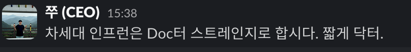

# 2024년 CTO 회고

2021년 초에 합류했다가 벌써 만 4년이 다되어간다.  
올해는 국제화 기억만 있을 정도로 하나에만 완전히 몰입했다.  
  

## 1. 조직

### 팀원

올 한해 Product 조직에는 **13명이 입사하고, 2명이 퇴사**했다.

* 입사: 올리(PD), 도니(FE), 하리(FE), 루시(FE), 럭끼(FE), 퍼즈(FE), 또우(Mobile), 감자(BE), 약풍(BE), 프레디(BE), 로켓(BE), 구피(DevOps), 포카(DevOps)
* 퇴사: 홍시(FE), 하루(BE)

첫 직장 생활을 시작하신 신입부터 6년차까지 다양한 경험을 가지신 분들이 합류해주셨다.  
  
**개발 파트만 33명, 전체 제품 조직 (PM, PD, Dev)은 43명**이 되었다.  
  
작년에 5명을 채용한 것을 생각해보면 올해는 많은 분들을 채용했다.  
요즘 같이 불황이 거의 확실시 되는 시기에 이렇게 할 수 있었던 건, 올해 **인프런의 글로벌 전환이 그만큼 중요했기 때문**이다.  
  
막상 채용할 때는 이미 글로벌 전환 프로젝트가 진행중인 상태라서 이 분들이 조직에 익숙해지실 때 쯤이면 이미 글로벌 프로젝트가 끝나지 않을까? 하는 우려도 있었지만, **그간 신규 입사자분들의 적응을 위한 많은 준비를 해왔기 때문에 금방 본인의 몫을 충분히 할 것**으로 판단했다.  
  
특히 이번 글로벌 프로젝트는 (아래에서 후술하겠지만)
- 각 Cell (팀)이 본인의 제품이 아닌 다른 조직의 제품을 개편해야하는 일이 빈번하고
- 새롭게 합류 하신 분들의 온보딩을 팀이 아닌 프로젝트 TF에 대해 진행해야하는 
 
등 여러 복잡한 상황이 겹쳤다.  
  
그럼에도 입사 후 3~4주가 지난 시점부터 빠르게 본인의 역할을 맡아 일을 진행하시는 것이 신기하고 감사했다.  
(이게 되네?)  
팀의 역량을 다시 한번 느끼게 되었다.  

물론 무작정 사람이 채용된다고해서 프로젝트가 더 빨리 끝나거나 목표를 더 빨리 달성할 수 있다고 생각하진 않는다.  
그만큼 팀이 준비가 되어있어야만 하는 것이라서 다음에도 이처럼 큰 프로젝트 진행중에 채용을 해서 똑같이 효과를 볼 수 있을것인지는 확신할 수 없다.  
  
그래도 지금처럼 계속해서 자주 팀의 전체 Align을 맞추고 여러 환경 개선 (문서 최신화, AI 문서 탐색, 오픈소스 베이스 도구 도입, 자동화 등) 을 지속적으로 진행한다면 채용의 효과가 빠르게 나타나지 않을까 싶다.  

> 개발팀원의 빠른 적응을 돕기 위한 여러 환경 개선에 대한 건은 나중에 회사 기술 블로그에 정리할 예정이다.

그리고 우리 같은 회사는 적응 기간을 최대한 단축시키는 것만이 핵심이 될 수 밖에 없다.  
대부분의 회사가 그렇겠지만, **퇴사하는 팀원을 막는 것은 대단히 어려운 일**이기 때문이다.  
  
그래서 **팀원의 근속 기간을 늘리는 것도 중요하지만, 팀원이 빠르게 적응해서 기여 기간을 늘리는 것이 훨씬 제어가능하다**.   

- 빠르게 적응할 수 있는 환경을 구축하고
- 그에 맞는 좋은 사람을 채용하고
- 서포터가 그 분을 물심양면 지원하고

이 3가지가 갖춰지면 구성원이 팀에 빠르게 적응하고, **그만큼 팀에 기여할 수 있는 기간이 대폭 늘어난다**.  
  
평균적으로 2년의 근속연수를 가진 팀이라고 가정해보면  
- 새로운 사람이 팀에 적응하는데만 6개월 ~ 1년정도 필요하면 그 사람이 팀에 기여하는 기간은 1년 ~ 1년 6개월뿐이다.  
- 반면 팀에 기여하는 기간이 1~3개월이라면 팀에 기여할 수 있는 기간이 1년 9개월에서 1년 11개월까지 늘어난다.  

똑같은 근속 기간이지만 **기여 기간이 약 20~30%의 늘어나는 셈**이다.  
그래서 이 부분에 계속해서 집중 할 수 밖에 없었다.  
내년에는 개발파트를 넘어 여러 직군들이 더 빠르게 적응할 수 있도록 더 많은 환경 개선을 진행할 예정이다.  
  
길었던 올해 채용을 마무리 했다.  
갑작스레 늘어난 개발파트는 재정비 기간을 가지기로 했다.  
매달 1명씩 합류하고, 오자마자 회사의 중요 프로젝트에 모두 투입되서 바쁘게 지내다보니 제대로 정리 안된 것이 많다.  
그래서 한동안 개발파트는 채용을 하지 않고, 충분히 혼란함이 정리가 되면 그때 다시 채용을 할 예정이다.  
  
### 2PM 체제

올해는 1 Cell (팀) - 2 PM 체제를 긴 시간 확인해볼 수 있었다.  
테디 (2023년 8월 합류) 와 보니가 하나의 Cell에서 본격적으로 활동해보는 시기였고 (작년엔 테디가 수습 기간이였으니) 제대로 된 2 PM에 대해 많은 생각들을 해볼 수 있었다.  
  
원래의 목적은 UCC Cell 내에서 병렬적으로 여러 프로젝트를 수행하는 것이 얼마나 잘 되는지를 확인해보는 것이였다.  
  
작년 하반기부터 올해 초까지 기준으로 보면 이 체제는 장점이 정말 많았다.  
  
한 명의 PM이 모든 걸 다 잘 할 수는 없다.  
장점과 단점이 공존할 수 밖에 없는데,  
2명의 PM이 하나의 Cell에서 하나의 목표를 향해 움직이다보니 서로의 단점은 보강해주고 장점은 극대화시켜줬다.  
특히나 보니와 테디는 그 장단이 서로 완전히 상반되어서 내가 생각한 것 이상으로 결과를 잘 내주셨다.  
  
두 분다 C레벨의 목표와 align이 되었을때 빠르게 실행하고 원하는 결과를 내는, 실행력이 대단히 뛰어나다는 점은 공통점이 있다.  
  
반면 서로 가진 큰 무기가 다르다.  
테디는 굉장히 목적 지향이고 프로세스 개선을 통한 목표 달성에 대단히 강점이 있다.  
특히 그로쓰 관점에서 좋은 시야를 가지고 있고, 굉장히 효율적으로 성과를 내고 일하는 것을 잘한다.  
보니 역시 목적 지향이지만 프로세스 개선 보다는 개개인이 100%, 120% 역량을 내는 것을 주도하는 편이다.  
주변의 사람들을 자연스럽게 보니의 팬클럽으로 만드는 편인데, 그러다보니 열심히 하도록 자연스러운 분위기를 형성하게 된다.  
그리고 대단히 꼼꼼해서 회사에서 절대 실수가 있어서 안되는 작업이 있을 경우 실수없이, 오차없이 완벽하게 마무리 하는 편이다.  
  
(테디한테는 잠깐 표현하긴 했지만) 테디는 전 과목을 1등급 맞을 수 있는 사람이지만, 한 과목이라도 100점은 맞기 힘든 사람이라면,  
보니는 전 과목을 1등급 맞기는 어려운 사람이지만 한 과목이라도 100점을 맞아야 한다면 해내는 사람이다.  
그래서 서로의 강점을 극대화 하는 상황을 자주 목격할 수 있었다.  
  
재밌던 점은 두 분이 평소 회의나 대화도 완전히 상반되었던 것인데,  
평소 서글서글한 테디는 회의나 업무 논의에서는 대단히 단호박이여서 회의 이야기가 길어지면 단칼에 정리하고 원래의 목적지로 이끌었다.  
(효율을 좋아하셔서 그런듯?)  
반대로 정신 무장을 좋아하는 보니는 의외로 회의나 업무 논의에서 상대의 이야기를 끝까지 들어주고 의견을 제시하는 편이였다.  
  
이렇게 얘기하면 올해의 2PM 체제의 실험이 성공한 것 같지만, 결과적으로 만족스럽진 못했다.  
  
**전략이 문제냐 아니냐는 상황을 봐야하는데**, 2PM의 전략이 맞는지 아닌지 구분 하기엔 상황이 너무 달라졌다.  
    
하나의 Cell에 2명의 PM이 있다는 것은 다른 말로는 PM 의 리소스가 상대적으로 다른 Cell 보다 여유가 있음을 의미하고 그렇기 때문에 여러 특수 목적 Cell 을 겸직할 수 있음을 의미한다.  
올해 초가 지나고부터 보니는 UCC Cell 외에 플레이어 Cell, Mobile Cell, 후반기에는 정산 TF까지 맡게 되어서 사실상 UCC Cell은 테디 단독 PM과 다를 바 없이 진행하게 되었다.  
  
그래서 2PM 체제의 효과를 제대로 보기 전에 실질적으로 1 PM 체제를 계속 운영한 한해가 되었다.  
  
상대적으로 보니의 리소스도 한계에 달하기도 해서 좋은 PM 분들을 다시금 채용하기 시작했다.  
1명의 TO만 고려했지만 좋은 분들이 너무 많아 고민 하다가 결국 2명의 PM을 채용하게 되었고, 이 분들은 내년 1월에 합류하시게 된다.  

### 홍시, 하루 퇴사

홍시(FE)와 하루(BE)가 퇴사했다.  
2021년 8월에 합류한 홍시는 2024년 3월에 퇴사했다.  
2021년 10월에 합류한 하루는 2024년 4월에 퇴사했다.  
  
두 분 모두 약 2년 6개월 정도 근무하시고 본인의 방향성에 맞는 다른 회사로 이직을 하셨다.  
    
두 분 모두 FE  

### 리드들의 퇴사

올해 3분의 리드분들이 퇴사하셨다.  
  
한 분은 예전부터 본인이 원하는 자리에 기회가 생겨 이직을 하셨고,  
한 분은 복잡한 사정으로 퇴사를 하셨고,  
한 분은 나갔다가 1월에 다시 합류하신다.  
(웰컴 비노)  
  
4명의 리드가 있었다가 현재는 디자인 리드인 엠제이만 남게 되었다.  

### JVM <-> Node 

현업에서 Node.js만 몇년간 사용해왔던 프레디와 학교 생활 내내 JVM 환경의 공부를 한 로켓이 비슷한 시기에 합류하였다.  
여러 백엔드 분들이 합류했지만 이 분들을 특별히 언급한 이유는 두 분에게 서로 다른 역할을 부여했기 때문이다.  
  
Node.js를 해왔던 프레디에게는 JVM (Kotlin/Java/Spring) 을 다루는 조직으로 배정했고, JVM만 해온 로켓에게는 Node.js를 다루는 조직으로 배정했다.  
  
우리팀은 Node.js를 100% 다루는 조직이였다가, 현재는 전체 기능에서 Node.js 80%, JVM 20% 로 구현을 담당하고 있다.  
(프로젝트의 수가 아니라 서비스 전체의 기능 기준)  
  
결제나 정산 같이 전통적으로 JVM이 많이 다루면서 RDBMS가 중요한 도메인과 GCP 검색 엔진 등 플랫폼사가 제공하는 모듈이 JVM이 메인인 경우 등에서 한정적으로 JVM을 사용하고 있다.   
  
별도의 JVM 개발자분들을 채용한 것이 아니라, 위 시스템을 직접 기존의 Node.js 개발자분들이 학습하면서 구축하였기 때문에 기존의 백엔드 개발자분들은 Node.js와 JVM을 양쪽 다 일정 수준 이상 다루고 계신다.  
  
> 실제로 이를 사례로 기술 블로그도 작성하였다.
> 
> - [JDBC setReadOnly 호출 이슈 해결기](https://tech.inflab.com/20240901-jdbc-set-readonly-issue/)
> - [Spring Boot & JPA에서 Java와 Kotlin을 함께 사용하기](https://tech.inflab.com/20240110-java-and-kotlin/)

다만, 이와 별개로 **이미 구축이 다 끝나고 합류하는 분들에게 이 2가지 스택을 어떻게 다루게 할지** 고민이 되었다.  
  
### Cell 조직 개편

정기적인 Cell (팀) 내부 인원의 이동 제도가 시작되었다.  
10월 17일부터 각 Cell의 FE 인원 중 1명 ~ 2명이 각자 다른 Cell로 이동되었다.  
위에서 언급한 2분의 시니어분들이 퇴사하는 것과 일정을 맞춰 진행했다.  
  
처음 Cell 이라는 목적 조직을 만들때부터 Cell 내부의 인원이 정기적으로 이동하는 것을 전제했다.  
프로덕트 조직 전체에도 처음부터 공유했었다.  
다만, 예전부터 공지를 했다고 해서 당사자들이 받아들이기 쉽다는 것은 아니다.  
어찌되었든 기존에 익숙한 도메인/팀원/프로세스를 두고 익숙하지 않은 곳으로 가는 것에는 어색함과 불편함은 있을 수 밖에 없다.  
  
그럼에도 이렇게 정기적인 이동은 필요하다.

*   새로운 도메인 새로운 조직을 통해 다른 회사로 가지 않더라도 새로운 경험, 다양한 경험을 쌓을 수 있다.
*   각 조직별 장/단점을 취하면서 서로 간에 좋은 점들을 자연스럽게 흡수할 수 있다.
*   정기적인 인사이동이 있으니 특정 누군가에게 의존하는 팀이 아니라 문서화, 시스템화 위주의 팀 문화가 자연스럽게 형성된다.

가장 큰 이유는 팀 간 이동이 정기적으로 있으니 **팀 내 갈등이 있을때 당사자들의 해결책이 퇴사밖에 없는 상황을 피할 수 있다**는 것이다.

보통은 퇴사 사유가 **이 팀외에 선택지가 없을때**가 가장 많다.  
팀원간 갈등이 있을때, 다른 도메인을 경험하고 싶을때, 다른 동료들과의 경험을 쌓고 싶을 때 등등 고민이 있을때 다른 팀 이동이 자연스럽지 않으면 결국 팀 이동을 해도 "**저 사람은 저 팀이 만족스럽지 않아서 팀 이동하나보다**" 와 같은 여론이 형성되고 **그게 부담스러워서 그냥 퇴사를 선택**한다.  
  
이런 상황을 정말 자주 봤다.  
그래서 이렇게 **정기적인 팀 이동을 통해 개인의 고민을 부작용 없이 회사내에서 해결할 수 있다.**  
다행히 팀 이동하신 FE 분들은 각자가 만족도가 높아보인다.  
  
이렇게 팀원 이동과 함께 조직의 수도 줄였다.  
Cell (팀)을 5개 ➝ 4개로 줄였다.  
  
*   한 조직에 2명의 PM을 두는 것에 대한 성공 경험을 쌓아야 했고
*   목표가 충돌되는 조직을 하나로 합쳐서 좀 더 큰 관점에서 보는 경험을 쌓아야 했고
*   조직 내 개발자들을 좀 더 늘릴 필요가 있었다.
  
이 모든 과정이 결국은 앞으로 더 우리가 큰 일을 해내기 위함이다.
그래서 10월초에 전체 프로덕트 조직을 모아두고 내용을 공유하면서 다음의 장표도 함께 전달드렸다.
  
우리 같이 작은 조직이 더 큰 조직들과 경쟁하려면 그동안 해오던 방식 그대로 해서는 안된다.  
그동안 해오던 방식 그대로하면 결국더 효율적으로 더 효과적인 일을 하기 위해서는 더 많은 팀원을 구성하는 것 말고는 방법이 없다.
  
결국은 계속해서 새로운 조직 형태와 새로운 방식을 시도해보고 개선해나가야만 한다.  
  

## 2. 닥터 스트레인지

3월부터 인프런 글로벌 전환 프로젝트가 진행되었다.  
일명 닥터 스트레인지.  
우리는 회사의 아주 중요한 프로젝트는 A-Z 순 & 히어로의 이름을 붙인다.

- A: AntMan
  - 기존 워드프레스로 된 인프런을 JS 풀스택으로 개편한 프로젝트
- B: Black Panther
  - React Native 기반의 인프런 재생 전용 모바일 앱 프로젝트
- C: Captain America
  - AI 기반 자동화된 강의실 자막 환경 구축 프로젝트
- **D: Doctor Strange**
  - 인프런의 글로벌 서비스로 전환 프로젝트
  - 영문화된 페이지, 해외결제, 영어/일본어/베트남어의 자막&더빙 지원

예외는 없다.  
올해 무조건 오픈해야만 했다.  

### 프로덕트 월간 모임

7번의 월간 모임을 진행했다.
특히 닥터 프로젝트 

### 품앗이 문화

## 3. 제품, 기술

### JVM <-> Node

### AI로 가속화

### 클라우드 비용 절감

## 3. 기타

내 마음에 들면 건강한 의견이고,  
내 마음에 들지 않으면 불평/불만이 많은 사람
라는 식으로 하고 있는 건 아닌가 라고 생각을 자주 하게 된다.  
  
어떤 의견을 들었을 때도 머릿속에서는 여러가지 생각이 든다.  

인프랩이 나를 더이상 필요로 하지 않는 순간까지는 아마도 계속 여기서 일을 하겠지만,  
그럼에도 불구하고 시간이 흘러흘러 언젠가는 다른 조직에서 일을 할텐데 그땐 

### 매니지먼트와 전문성

## 4. 마무리

- 낫오버 감독님
- 좋은 배우

### 글로벌 글로벌 글로벌

