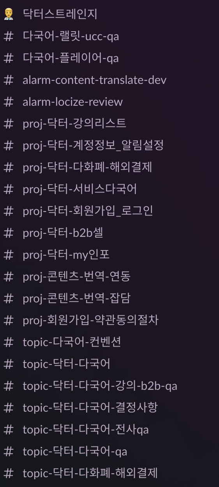
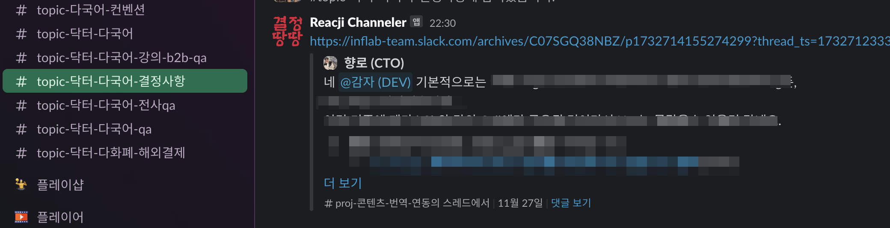
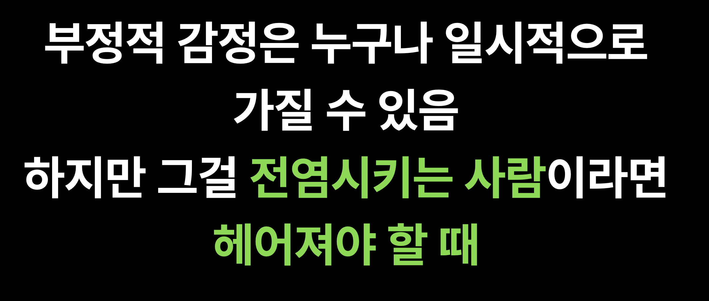
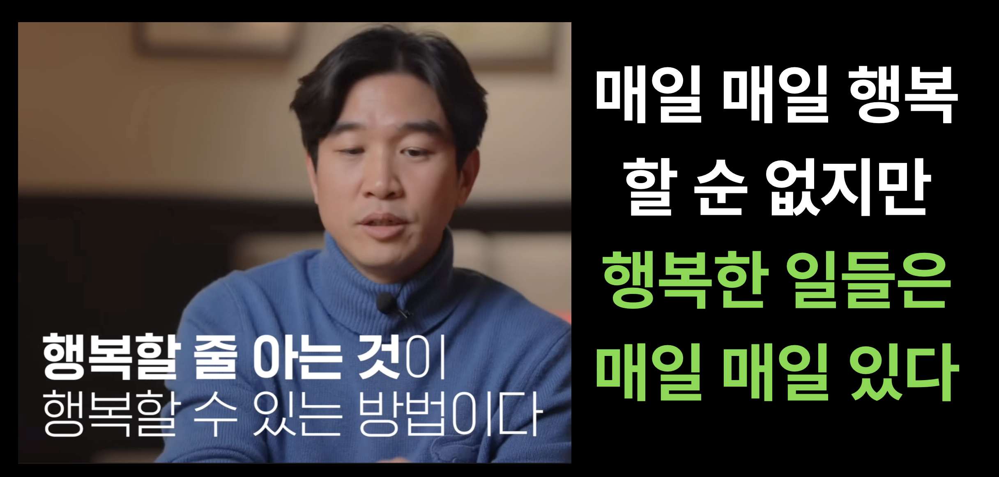
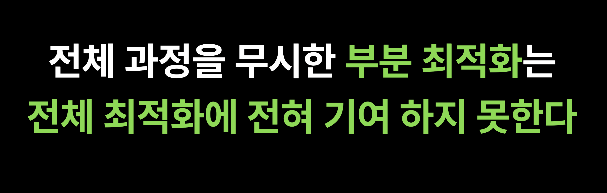
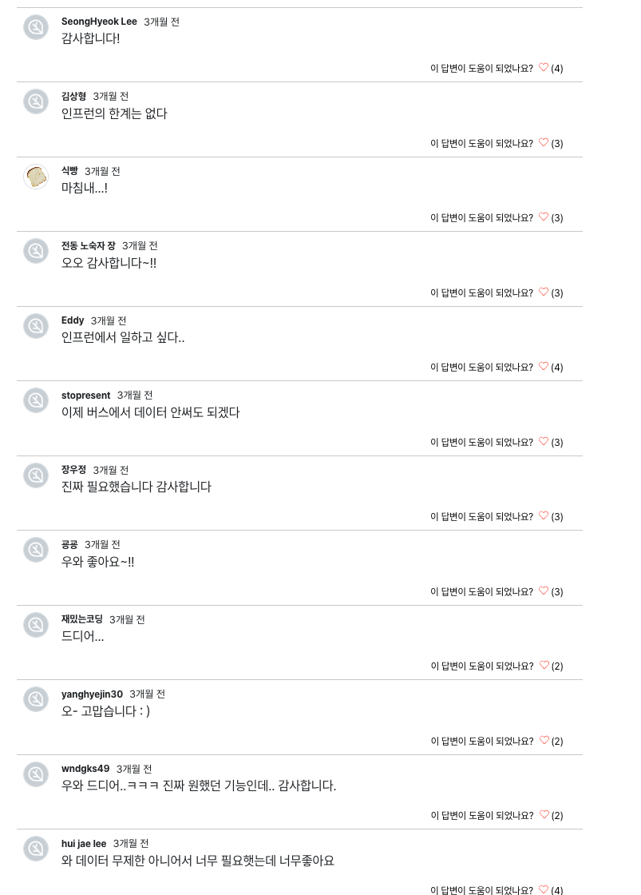

# 2024년 CTO 회고

2021년 초에 합류했다가 벌써 만 4년이 다되어간다.  
올해는 국제화 기억만 있을 정도로 하나에만 완전히 몰입했다.  
  
그런데 막상 회고를 해보려고 하니 팀원들과 조직이 더 많이 생각났다.  

  

## 1. 조직

### 팀원

올 한해 Product 조직에는 **13명이 입사하고, 2명이 퇴사**했다.

* 입사: 올리(PD), 도니(FE), 하리(FE), 루시(FE), 럭끼(FE), 퍼즈(FE), 또우(Mobile), 감자(BE), 약풍(BE), 프레디(BE), 로켓(BE), 구피(DevOps), 포카(DevOps)
* 퇴사: 홍시(FE), 하루(BE)

첫 직장 생활을 시작하신 신입부터 6년차까지 다양한 경험을 가지신 분들이 합류해주셨다.  
  
**개발 파트만 33명, 전체 제품 조직 (PM, PD, Dev)은 43명**이 되었다.  
  
특히 신입 개발자로 대덕에서 4분이나 합류해주셨다.  
고 3, 19살부터 일을 시작하시게 된 것인데, 작년에 합류하신 제이스처럼 높은 가능성을 갖고 계셔서 개인적으로는 채용을 정말 잘했다고 생각한다.  
특히 최근까지 학교 기숙사 생활을 해서 그런지 4분이 웬만하면 9시쯤 출근 하신다.  
우리 회사는 10시 30분까지 출근하면 되는데도 말이다.  
(구피는 거의 8시~8시 30분 사이에 출근하신다.)    
  

작년에 5명을 채용한 것을 생각해보면 올해는 많은 분들을 채용했다.  
요즘 같이 불황 시기에 평소보다 많은 채용을 할 수 있었던 건, 올해 **인프런의 글로벌 전환이 그만큼 중요했기 때문**이다.  
정말 올해는 국제화 프로젝트 오픈을 해야했다.  
    
막상 채용할 때는 이미 글로벌 전환 프로젝트가 진행중인 상태라서 이 분들이 조직에 익숙해지실 때 쯤이면 이미 글로벌 프로젝트가 끝나지 않을까? 하는 우려도 있었지만, **그간 신규 입사자분들의 적응을 위한 많은 준비를 해왔기 때문에 금방 본인의 몫을 충분히 할 것**으로 판단했다.  
  
특히 이번 글로벌 프로젝트는 (아래에서 후술하겠지만)
- 각 Cell (팀)이 본인의 제품이 아닌 다른 조직의 제품을 개편해야하는 일이 빈번하고
- 새롭게 합류 하신 분들의 온보딩을 Cell 프로젝트가 아닌 TF 프로젝트에 대해 진행해야하는 
 
등 여러 복잡한 상황이 겹쳤다.  
  
그럼에도 입사 후 3~4주가 지난 시점부터 빠르게 본인의 역할을 맡아 일을 진행하시는 것이 신기하고 감사했다.  
(이게 되네?)  
팀의 역량을 다시 한번 느끼게 되었다.  

물론 무작정 사람이 채용된다고해서 프로젝트가 더 빨리 끝나거나 목표를 더 빨리 달성할 수 있다고 생각하진 않는다.  
그만큼 팀이 준비가 되어있어야 하는데, 다음에도 이처럼 큰 프로젝트 진행중에 채용을 해서 똑같이 효과를 볼 수 있을것인지는 확신할 수 없다.  
  
그래도 지금처럼 계속해서 자주 팀의 전체 Align을 맞추고 여러 환경 개선 (문서 최신화, AI 문서 탐색, 오픈소스 베이스 도구 도입, 자동화 등) 을 지속적으로 진행한다면 채용의 효과가 빠르게 나타나지 않을까 싶다.  

> 개발팀원의 빠른 적응을 돕기 위한 여러 환경 개선에 대한 건은 나중에 회사 기술 블로그에 정리할 예정이다.

그리고 우리 같은 회사는 적응 기간을 최대한 단축시키는 것만이 핵심이 될 수 밖에 없다.  
대부분의 회사가 그렇겠지만, **퇴사하는 팀원을 막는 것은 대단히 어려운 일**이다.   
그래서 **팀원의 근속 기간을 늘리는 것도 중요하지만, 팀원이 빠르게 적응해서 기여 기간을 늘리는 것이 훨씬 제어가능하다**.   

- 빠르게 적응할 수 있는 환경을 구축하고
- 그에 맞는 좋은 사람을 채용하고
- 서포터가 그 분을 물심양면 지원하고

이 3가지가 갖춰지면 구성원이 팀에 빠르게 적응하고, **그만큼 팀에 기여할 수 있는 기간이 대폭 늘어난다**.  
  
평균적으로 2년의 근속연수를 가진 팀이라고 가정해보면  
- 새로운 사람이 팀에 적응하는데만 6개월 ~ 1년정도 필요하면 그 사람이 팀에 기여하는 기간은 1년 ~ 1년 6개월뿐이다.  
- 반면 팀에 기여하는 기간이 1~3개월이라면 팀에 기여할 수 있는 기간이 1년 9개월에서 1년 11개월까지 늘어난다.  

똑같은 근속 기간이지만 **기여 기간이 약 20~30% 늘어나는 셈**이다.  
그래서 이 부분에 계속해서 집중 했다.  
다행히 좋은 분들이 오셨고, 주변 서포터분들이 잘 도와주시고, 정말 좋은 분들이 합류해주시는 3박자가 다 이루어져서 새로 합류 하신 분들은 모두 빠르게 자신의 몫을 잘해주셨다.  
덕분에 올해의 목표도 잘 달성했고 말이다.  
  
길었던 올해 채용을 마무리 했다.  
팀원이 늘어나는 것에 대해서는 항상 걱정이 많다.  
팀 규모가 커지면 커질수록 적합하지 않은 사람들이 늘어나는 것을 자주 목격했다.  
그럴수록 팀의 좋은 문화는 희석된다.  

짧은 시간에 많이 늘어난 개발파트는 재정비 기간을 가지기로 했다.  
매달 1명씩 합류하고, 오자마자 회사의 중요 프로젝트에 모두 투입되서 바쁘게 지내다보니 제대로 정리 안된 것이 많다.  
그래서 한동안 개발파트는 채용을 하지 않고, 충분히 혼란함이 정리가 되면 그때 다시 채용을 할 예정이다.  
  
### 홍시, 하루 퇴사

홍시(FE)와 하루(BE)가 퇴사했다.  
2021년 8월에 합류한 홍시는 2024년 3월에 퇴사했다.  
2021년 10월에 합류한 하루는 2024년 4월에 퇴사했다.  
두 분 모두 약 2년 6개월 정도 근무하시고 본인의 방향성에 맞는 다른 회사로 이직을 하셨다.  
     
홍시와 하루는 FE, BE에서 정말 중요한 역할들을 해주셨다.  
  
신입으로 합류하셨던 홍시는 [만타인 기반의 사내 디자인 시스템 구축](https://tech.inflab.com/20240224-design-system/)에 있어 중심 역할을 해주셨다.  
직접 만타인 디스코드 채널에 들어가서 여러 문제 상황을 제보도 하고 함께 해결도 하고 고도화도 많이 진행해주셨다.  
이런 플랫폼 성격의 작업이 플랫폼 팀 없이 잘 가꾸어질 수 있었던건 이렇게 홍시처럼 팀 전체에 도움이 되는 일을 나서서 해주시는 분들이 있기 때문이다.  
  
가장 좋았던 건 **함께 일하고 싶은 동료**는 어떤 형태인지 구체적으로 보여준 것이다.  

- 팀에서 비효율적으로 작업하는 건이 있으면 개인 시간을 내서 자동화를 진행한다던가
- PM, 디자인, 개발 간 논의 내용이 정리가 안되면 이를 정리해주거나 
- 개발자가 아닌 다른 사람이 봐도 이해할만큼 상세하게 문서화를 하는 등.

같이 일할 때 주변 사람들이 일에 몰입할 수 있도록 좋은 환경으로 지속적으로 개선해주었다.  
맨 처음 홍시의 PR 메세지를 보고 놀래서 개발 파트 전체에 공유했던 기억도 난다.

기억에 남던 장면은 개발파트끼리 워크샵을 갔는데, 워크샵 운영진의 일손이 부족하니 홍시가 알아서 다른 팀원들을 장소로 인솔하고 워크샵을 준비하는 모습이였다.  
그 외에도
- 다같이 배달 음식을 먹기로 했으면 먼저 "함께 주문하기" 링크를 만들어서 슬랙으로 공유한다던가
- 개발자들끼리 급하게 회의가 필요하면 바로 회의실 예약을 해준다던가

그러니깐 **"누가 이 일을 하지?" 같은 상황에서 항상 말하지 않아도 홍시가 그 일을 하고 있었다**.   
그래서 홍시가 퇴사한다고 했을 때 개발파트 뿐만 아니라 많은 분들이 (특히 PM, 디자인) 아쉬워하셨다.  

하루는 3~4년의 경력을 가진 경력직 개발자로 합류하시고 난 뒤 백엔드 개발 문화를 개선하기 위해 많이 노력해주셨다.  
**백엔드 파트 내에서 가장 적극적으로 좋은 개발 문화나 방법론 도입에 앞장 섰다**.  
워크샵이나 주간 리뷰 시간 등에 직접 나서서 진행을 해주시기도 하셨다.  
  
랠릿 프로젝트를 오픈하기 직전에 당시 사용중이던 TypeORM 에서 기능상으로는 문제가 안되지만 실제 생성중인 SQL 로그가 이상한 것을 발견해주셔서 큰 문제를 사전에 방지해주기도 하셨다.
이때는 하루에게 감사한 마음도 있었지만, 감동하기도 했다.  
당장 눈에 보이는 것에만 집중하는게 아니라 본인이 사용하는 라이브러리 세부 내역들을 일부러 더 찾아보고 테스트 해봤어야만 알 수 있는 것이였기 때문이다.

매번 작은 노트와 펜을 들고와서 설계, 테스트, 구현에 대해서 물어보고 논의하던 하루의 모습이 생각난다.  
특히 인트와 함께 JVM + 검색엔진 프로젝트를 진행하면서 페어프로그래밍 할 때 즐거워하시던 모습이 특히 기억에 남는다.  
    
두 분 모두 팀에서 정말 중요한 역할을 해주셨어서 그만큼 퇴사가 아쉬웠다.  
다만, 아쉬운 만큼 그 분들이 다음에도 인프랩에서의 커리어가 도움이 될 수 있도록 해주는 것이 그나마 할 수 있는 보답이라고 믿고 있다.  
우리가 글로벌 서비스로, MAU 1천만 이상의 한국의 IT 시장에서 모르는 사람이 없는 회사가 될 수록 그 분들의 커리어는 글로벌 회사 출신, MAU 1천만 이상의 조직에서 중요한 역할을 했던 사람으로서 이력서가 남게 될테니 말이다.

더더욱 조직이 성장하는 것으로 감사함을 표현해야겠다.

### 리드들의 퇴사

올해 3분의 리드분들이 퇴사하셨다.  
  
한 분은 예전부터 본인이 원하는 자리에 기회가 생겨 이직을 하셨고,  
한 분은 복잡한 사정으로 퇴사를 하셨고,  
한 분은 나갔다가 1월에 다시 합류하신다.  
(웰컴 비노)  
  
**4명의 리드가 있었다가 현재는 디자인 리드인 엠제이만 남게 되었다.**  
각각의 리드분들은 퇴사할 수 밖에 없는 사유가 있었기 때문에 퇴사 자체가 큰 문제라고 생각하진 않는다.  
다만, 리드분들과 대화하는 시간이 쭈에 비해 내가 상대적으로 적었다는 생각을 많이 했다.  
그나마 엠제이와는 같은 프로덕트 조직 내에 있으니 자주 이야기할 기회가 있었지만 그 외 분들과는 자주 대화할만한 게 없었다.  
1월에 올 비노부터 시작해서 이후의 새 리드분들과는 대화를 좀 더 많이 해야겠단 생각을 했다.  
  
엠제이와는 올해 들어서 대화를 더 많이 하고 있다.  
사적인 이야기부터 시작해서 디자인 파트, 디자인 시스템에 대한 이야기까지.  
  
올해는 특히 혼란한 일도 많고, 일 적으로도 대단히 부하가 많은 상황이였는데도 긍정적으로 상황을 해석하고 주변에 안정감을 주는 엠제이가 특히 더 감사했다.  
그래서 연말에 감사하다는 말씀도 드렸다.  
  
FE 개발자분들과 이야기하다보면 종종 엠제이에 대한 이야기를 듣게 된다.  
자기 직군으로서의 전문성도 가지고 있으면서, 주변 사람들을 편안하게 만들어주고, 좋은 커뮤니케이션을 하는 등 좋은 시니어란 어떤 모습인지 많이 배운다는 이야기를 해줬다.  
**좋은 시니어란 포지션을 넘어서도 영향을 끼칠 수 있구나**란 생각을 다시금 하게 됐다.  
  
우리 회사는 리드에 대한 기준이 회사 규모에 비해 대단히 높다.  
80명 가까이 되면서 세부 조직 역시 여러개로 나눠져있지만, 조직의 수 만큼 리드를 세우진 않고 있다.  
  
C레벨도 2명뿐이고, 중간 리더들의 숫자도 적은 편이라 그만큼 각 팀원 분들의 자발적 참여와 의지가 중요한 역할을 해주고 있다.  
프로덕트 조직 내에서는 PM 분들이 적절히 맡은 Cell의 매니지먼트를 잘 해주고 계신 것도 크다.
  
모든 걸 다 잘하는 사람이 리드가 되어야 한다는 것은 아니다.  
다만, 단순히 자리가 비어서 누군가로 채우거나  
적당히 타협하거나, 적합하지 않은 사람을 세웠을 때 리스크가 얼마나 큰지 몇번 겪었기 때문에 아마도 이 기준을 낮추지는 않을 것 같다.  
  
다만, 100명이 다가오는 어느 순간에는 중간 리더들의 숫자가 일정 수준 이상 필요할 수 밖에 없어서 내년엔 이 것에 대해 좀 더 좋은 방향을 찾아볼 예정이다.

### 2PM 체제

올해는 1 Cell (팀) - 2 PM 체제를 긴 시간 확인해볼 수 있었다.  
테디 (2023년 8월 합류) 와 보니가 하나의 Cell에서 본격적으로 활동해보는 시기였고 (작년엔 테디가 수습 기간이였으니) 제대로 된 2 PM에 대해 많은 생각들을 해볼 수 있었다.  
  
원래의 목적은 하나의 Cell 내에서 병렬적으로 여러 프로젝트를 수행하는 것이 얼마나 잘 되는지를 확인해보는 것이였다.  
실제로 그 목적에 맞게 작년 하반기부터 올해 초까지 기준으로 보면 이 체제는 장점이 정말 많았다.  
  
한 명의 PM이 모든 걸 다 잘 할 수는 없다.  
장점과 단점이 공존할 수 밖에 없는데,  
2명의 PM이 하나의 Cell에서 하나의 목표를 향해 움직이다보니 **서로의 단점은 상쇄시켜주고 장점은 극대화시켜줬다**.  
특히나 보니와 테디는 그 장단이 서로 완전히 상반되어서 내가 생각한 것 이상으로 결과를 잘 내주셨다.  
  
두 분다 C레벨의 목표와 align이 되었을때 빠르게 실행하고 원하는 결과를 내는, 실행력이 대단히 뛰어나다는 점은 공통점이 있다.  
  
반면 서로 가진 큰 무기가 다르다.  
테디는 굉장히 목적 지향이고 프로세스 개선을 통한 목표 달성에 대단히 강점이 있다.  
특히 그로쓰 관점에서 좋은 시야를 가지고 있고, 굉장히 효율적으로 성과를 내고 일하는 것을 잘한다.  
보니 역시 목적 지향이지만 프로세스 개선 보다는 개개인이 100%, 120% 역량을 내는 것을 주도하는 편이다.  
주변의 사람들을 자연스럽게 보니의 팬클럽으로 만드는 편인데, 그러다보니 열심히 하도록 자연스러운 분위기를 형성하게 된다.  
그리고 대단히 꼼꼼해서 회사에서 절대 실수가 있어서 안되는 작업이 있을 경우 실수없이, 오차없이 완벽하게 마무리 하는 편이다.  
  
**테디는 전 과목을 1등급 맞을 수 있는 사람이지만, 한 과목이라도 100점은 맞기 힘든 사람**이라면,  
**보니는 전 과목을 1등급 맞기는 어려운 사람이지만 한 과목이라도 100점을 맞아야 한다면 해내는 사람**이라고 평가한 적이 있다.  
그래서 서로의 강점을 극대화 하는 상황을 자주 목격할 수 있었다.  
  
재밌던 점은 두 분이 평소 회의나 대화도 완전히 상반되었던 것인데,  
평소 서글서글한 테디는 회의나 업무 논의에서는 대단히 단호박이여서 회의 이야기가 길어지면 단칼에 정리하고 원래의 목적지로 이끌었다.  
(효율을 좋아하셔서 그런듯?)  
반대로 정신 무장을 좋아하는 보니는 의외로 회의나 업무 논의에서 상대의 이야기를 끝까지 들어주고 의견을 제시하는 편이였다.  

여튼 여러가지로 상반된 매력을 가진 2 PM은 초기에는 좋은 시너지 효과를 냈다.  
다만, 결과적으로 만족스럽진 못했다.  
  
**전략이 문제냐 아니냐는 상황을 봐야하는데**, 2PM의 전략이 맞는지 아닌지 구분 하기엔 상황이 너무 달라졌다.  
    
하나의 Cell에 2명의 PM이 있다는 것은 다른 말로는 PM 의 리소스가 상대적으로 다른 Cell 보다 여유가 있음을 의미하고 그렇기 때문에 여러 특수 목적 Cell 을 겸직할 수 있음을 의미한다.  
올해 초가 지나고부터 보**니는 UCC Cell 외에 플레이어 Cell, Mobile Cell, 후반기에는 정산 TF까지 맡게 되어서** 사실상 UCC Cell은 테디 단독 PM과 다를 바 없이 진행하게 되었다.  
  
그래서 2PM 체제의 효과를 제대로 보기 전에 실질적으로 1 PM 체제를 계속 운영한 한해가 되었다.  
2PM이 좋았냐 아니냐 평가하기에는 너무 기간이 짧았고 그럴 수 있는 상황도 아니였기에 결과에 대해서는 보류다.  
  
개발, 디자인 분들의 속도를 맞추기 위해 지금 PM 분들로는 리소스가 너무 부족하다는 판단으로 추가로 PM을 채용하기로 했다.  
1명의 TO만 고려했지만 좋은 분들이 너무 많아 고민 하다가 결국 2명의 PM을 채용하게 되었고, 이 분들은 내년 1월에 합류하시게 된다.  
  
새롭게 오실 두 분도 각자 상반된 장점을 갖고 계셔서 합류 후 일 하는 모습이 너무 기대 된다.  

### JVM <-> Node 

현업에서 Node.js만 몇년간 사용해왔던 프레디와 학교 생활 내내 JVM 환경의 공부를 한 로켓이 비슷한 시기에 합류하였다.  
여러 백엔드 분들이 합류했지만 이 분들을 특별히 언급한 이유는 두 분에게 서로 다른 역할을 부여했기 때문이다.  
  
- Node.js를 해왔던 프레디에게는 JVM (Kotlin/Java/Spring) 을 다루는 강의 Cell로, 
- JVM만 해온 로켓에게는 Node.js를 다루는 랠릿 Cell로 배정했다.  

완전히 새롭게 기술을 배워야하기 때문에 두 분 입장에서도 적응 하기가 어렵고, 회사 입장에서도 효율이 떨어진다.  
그럼에도 이 선택을 할 필요가 있었다.  
    
우리팀은 Node.js를 100% 다루는 조직이였다가, 현재는 전체 기능에서 Node.js 80%, JVM 20% 로 구현을 담당하고 있다.  
(프로젝트의 수가 아니라 서비스 전체의 기능 수 기준)  
  
JVM은 다음과 같은 경우에 사용하고 있다.
- 결제나 정산 같이 전통적으로 JVM 환경이 주류이면서 레퍼런스가 많은 경우
- 구글의 검색 엔진 등 플랫폼 사가 제공하는 모듈이 Java가 메인인 경우 
 
별도의 JVM 개발자분들을 채용하지 않고, 직접 기존의 백엔드분들이 학습하면서 구축하였기 때문에 다들 JVM에 대해 어느정도 이해도가 있다.
  
> 실제로 이를 사례로 기술 블로그도 작성하였다.
> - [JDBC setReadOnly 호출 이슈 해결기](https://tech.inflab.com/20240901-jdbc-set-readonly-issue/)
> - [Spring Boot & JPA에서 Java와 Kotlin을 함께 사용하기](https://tech.inflab.com/20240110-java-and-kotlin/)

다만, **이미 구축이 다 끝나고 합류하는 분들에게 이 2가지 스택을 어떻게 다루게 할지** 고민이 되었다.  
  
팀 내 기술 스택이 나눠지면서 백엔드 개발 파트가 완전히 남남이 되는 경우를 주변에서 종종 보았다.  
이를테면 파이선/자바 2개를 사용하는 팀에서 개발자를 채용한다고 하면, 파이썬 개발자 채용과 자바/스프링 개발자 채용 2개를 병렬로 운영한다.  
그리고 채용이 더 잘되는 쪽으로 점점 더 프로젝트가 이관이 된다.  
다른 쪽은 소외되기도 하고, 서로가 서로의 기술을 배우려는 의지가 없다보니 기술적 교류도 없다.  
**회사의 백엔드를 다루는 개발자들 간에 완전히 다른 회사 사람들처럼 되는 것**이다.  
  
우리는 당장 JVM 개발자 채용을 별도로 할 계획은 없다.  
그렇지만 좋은 개발자라면 굳이 Node.js 경험이 없더라도 채용을 하고 있다.  
그러다보니 Node.js 경험이 없이 JVM 경험만 가지고 있는 분이 여기 와서도 JVM 프로젝트를 전담하게 되면 **당장의 생산성과 효율성에는 도움이 되겠지만, 길게 봐서는 팀 적으로 완전히 남남이 될 수 있다**.  
반대로 Node.js 경험만 있는 분이 Node.js 만 하면 JVM 프로젝트에 관한 이야기에 전혀 참여할 수가 없다.  
  
JVM 이냐 Node.js냐 경험 유무에 관계 없이 기술적 대화를 할 수 있고 교류가 가능한 환경을 구성할 필요가 있었다.  
그래서 이걸 가장 최근 합류하는 로켓과 프레디에게 먼저 실험하게 되었다.  
  
두 분이 새로운 기술 스택을 빠르게 배울 수 있을까, 적응하는데 너무 힘들어하시진 않을까, 서포터가 너무 많은 시간을 할애하진 않을까 등등 수습 기간 동안 걱정이 많았다.  
다음에 실험하고 이번에는 그냥 원래 하시던거 하라고 할까 라는 생각도 중간에 몇번 했었다.  
  
결과적으로는 그 선택이 정말 잘했음을 두 분이 직접 증명해주셨다.  

경력이 있는 프레디는 국제화 기간 동안 해외 결제와 같이 복잡한 도메인, 외부 업체와의 커뮤니케이션 등 복잡한 업무를 잘 수행해주셨고,  
신입으로 합류한 로켓은 국제화 기간 동안 신입으로서 좋은 질문과 열정을 보여주셔서 주변에 많은 자극을 주셨다.  
  
내년 백엔드 개발자 채용이 시작되면 더욱 더 기술 스택에 크게 신경쓰지 않고 개발자로서의 역량 위주로 채용해도 된다는 안심을 하게 되었다.

## 2. 닥터 스트레인지

### 2-1. 시작

3월부터 인프런 글로벌 전환 프로젝트가 진행되었다.  
일명 닥터 스트레인지.  
회사의 아주 중요한 프로젝트는 A-Z 순 & 히어로의 이름을 붙인다.

- A: AntMan
  - 기존 워드프레스로 된 인프런을 JS 풀스택으로 개편한 프로젝트
- B: Black Panther
  - React Native 기반의 인프런 재생 전용 모바일 앱 프로젝트
- C: Captain America
  - AI 기반 자동화된 강의실 자막 환경 프로젝트
- **D: Doctor Strange**
  - 인프런의 글로벌 서비스 전환 프로젝트
  - 영문화된 페이지, 해외결제, 영어/일본어/베트남어의 자막&더빙 지원

Captain America 프로젝트 (AI 기반 자동 자막 생성) 가 성공적으로 런칭 되고 컨텐츠 번역, 더빙에 대한 가능성을 볼 수 있었다.  
원래는 외부 번역, 더빙 업체를 끼고 해야하나 생각을 하다가 AI 발전속도가 너무 빠르기도 하고 **100% 완벽한 번역, 더빙은 외부 업체를 써도 불가능**하다는 판단을 했다.  
우리가 보편적인 지식을 전달하는 컨텐츠라면 모를까, 전문적인 지식을 전달하는 컨텐츠이다보니 실무 지식이 많은 현재 강의는 일반적인 번역/더빙 업체로 하는 것은 AI 가 오히려 더 잘할 수 있을것 같았다.  
  
물론 AI가 오번역 하면 어떡할거냐는 질문도 많았지만,  
개발 컨텐츠 특성상
- 대부분의 주요 키워드는 이미 영어로 되어있어서 이를 그대로 사용하면 되고
- 화면상 노출되는 개발 하는 모습만으로 이미 충분히 인지가 가능하기도 하다.

우리는 문장의 맛을 제대로 살려야하는 문학 작품이나 문학 강의를 번역하는 것이 아니라 이미 전문적인 단어가 존재하는 (그리고 그 단어가 영어가 대부분인) 강의를 판매하기 때문에 다른 분야보다는 리스크가 상대적으로 적다고 판단했다.  
  
다만, 한국어 특성상 **발음이 유사해서 맥락을 파악하고 있어야만 분간 가능한 단어**들이 많아서 이를 어떻게 STT (Sound To Text) 처리를 할 수 있을까가 고민이였다.  
이를테면 `ㅔ` 와 `ㅐ` 는 지식 공유자분들의 발음이 차이가 없기 때문에 이걸 전체 문장의 맥락에 따라 구분하도록 프롬프트 고도화 하는 작업이 필수였다.  

기존의 소프트웨어 문제는 **이미 누군가 해결한 사례가 있다는 확신 하에** 어떻게 발견, 찾아내냐의 싸움이였다.  
그래서 "**정답은 존재한다, 그걸 내가 못 찾을 뿐**" 이라는 확신 하에 작업할 수 있으니 끝까지 물고 늘어질 수 있다.  
헌데 AI로 튜닝, 개선 하는 작업은 "**답이 존재하는건가? 내가 노력한다고 해서 이게 더 나아질 수 있나?**" 라는 확신 없이 시간만 보내는 일이 많다.  
불확실함 속에서 며칠, 몇주씩 시간을 보내는 것이 누구나 할 수 있는건 아니다.
자막, 번역의 담당자였던 선비가 이 부분때문에 정말 고생이 많았다.  
  
3월 7일 전사 발표를 시작으로 본격적으로 TF가 시작되었고,  
9월에 글로벌 대상 기능들을 기존 레거시 프로젝트에서 Next.js + Nest.js & Spring Boot 기반으로 이관을 완료했다.  
10월부터 각각의 페이지들을 모두 다국어 전환 작업을 진행해서 결국 12.24 정식 오픈을 했다.  
  
- 프로젝트 초반 신규 스택 이전이 생각보다 너무 느리게 진행되어 6월부터 전체 프로젝트를 All Drop 하고 모든 Cell이 전환에 참여했던 점이나
- 번역 퀄리티를 신경 쓰느라 프로젝트 전체가 병목이 일어나서 번역 퀄리티 신경쓰지 않고 먼저 다국어 환경 구축을 1순위로 돌리게 한다거나
- 플레이샵 가서도 닥터 생각나서 계속 노트북을 붙잡고 있던 점이나
- 10월 28일에 신청한 해외심사가 12월 19일에 완료 되어 해외 결제 테스트를 주말에도 계속 해야했던 점이나

여러 장면들이 스쳐지나간다.  
특히 TF 초기인 3~5월에는 Cell 별로 프로젝트 진행 속도가 너무 더뎠는데, 1차 프로젝트 이후부터는 모든 Cell이 기민하게 움직였다.  
매 스프린트마다 팀 내 생산성에 대한 점검과 회고를 진행하면서 Cell의 병목 지점이 어디인지 찾아내고 개선해나가는게 보였다.  
프로덕트 조직 전체가 하나의 Team으로 움직이는 것 같은 느낌을 받아 찌릿했다.  
  
9개월이란 긴 시간 동안 끝까지 목표를 달성하기 위해 달려와준 모든 분들에게 감사한 마음이다.

### 2-2. C레벨이 프로젝트에 깊게 관여하는 것

**중요한 프로젝트일수록 최고 의사결정권자가 깊숙히 참여해서 의사 결정 단계를 최소화**하는게 좋다고 생각한다.  
프로젝트 규모가 커지면 커질수록 개인의 퍼포먼스로 인한 지연보다는 **의사결정, 조직간 병목, 방향성 Align** 등이 제대로 되지 않아 문제가 되는 경우가 대부분이다.  
그래서 **권한이 많고 맥락, 정보를 많이 알고 있는 사람이 프로젝트에 깊게 참여**해야 이런 문제들을 빠르게 발견하고 조치할 수 있다.  
  
이미 PM이 존재하는 상황이라서 깊게 관여하는 것이 맞을까? 에 대해 고민도 했었지만 그래도 이게 프로젝트 성공 확률을 높일거라고 생각했다.

- 프로젝트 완료에 중요하지 않은 기능이라면 과감하게 대상에서 제외시키거나 축소 시키는 결정을 내려야 하고
- 각각의 Cell이 담당하는 프로젝트의 복잡도가 달라 일정 지연이 있을 경우 Cell간 일감 재분배를 빠르게 해야하고
- 기획/개발/디자인에서 서로 중복작업 하고 있는 건이 없는지 확인 후 중복 작업을 쳐내고 
- 추가 채용되는 인원을 어느 Cell로 할당하는 것이 가장 적합한지 판단해야하고
- TF 내부와 대표인 쭈 중간에서의 논의 내용을 빠르게 결정하고 전파하는 등 

PM 개개인으로서 해결하기 힘든 프로젝트 병목 지점들이 많아서 이를 해소하는데에만 집중했다.  
별거아니지만 프로젝트에 영향을 주고 번복되기 쉬운 내용들에 대해서도 의사결정에 참여했다.

- 왜 이 페이지는 국제화 대상에 포함되지 않는지,  
- 왜 이 페이지는 국제화 대상에 포함되었는지,  
- 이 부분은 자동 번역하는게 나을지, 사용자가 직접 작성하도록 열어두는게 나을지

이런 것들은 Cell 내에서만 결정하기에는 서비스 전체 톤앤매너 때문에 변경될 여지가 높은데, 이런 건에 대해서도 C레벨이 직접 회의에 참석해서 결정 하는게 프로젝트의 속도를 더 높일 수 있었다.  
  
호다닥 달려가서 "계산식 이렇게 합시다" 하고 결정 짓고 다른 회의실 가서 번역 대상에 대한 이야기를 하고, 그게 끝나면 DevOps와 FE, BE 간 시스템 구조에 관한 의사결정에 참여하곤 했다.  
그래서 이번 프로젝트에 한해서만 참여한 슬랙 채널도 수십개가 넘었다. 

  
20~30분마다 Context Switching이 발생하다보니 내가 10분전에 무슨 얘기했는지도 햇갈리기 시작했다.  
그래서 **구두로 이야기한 내용은 항상 슬랙으로 한번 더 정리해서 전체 공유로 남기고 해당 메세지를 북마크** 해두고 회의 일정이 끝나고 다시 확인하도록 했다.  
나만 그랬던건 아니였는지, **고슈가 결정사항 채널을 별도로 만들어서** 슬랙 메세지에 `:결정_땅땅` 이모지를 붙이면 해당 메세지가 지정된 채널로 자동 공유되도록 해주셨다.

덕분에 여러 채널에서 오고가는 결정 사항들을 한 채널에서 몰아서 볼 수 있게 되어 팀 전체로 결정 내용을 실시간으로 전달하기가 수월해졌다.  

(모바일 Cell을 제외한 나머지 4개 Cell 40명의 인원이 하나의 프로젝트에 9개월간 진행되다보니 다들 지금 어디까지 왔는지, 방향성이 바뀌었다면 어떻게 바뀌었는지 등등 전체 동기화가 어려웠다.  

그래서 전체 제품조직을 대상으로 매월 프로젝트 공유 자리를 만들었다.  
총 8번의 모임을 가졌는데,  
이 중 7번을 키노트로 전체 Align을 맞추는데 사용했다.  
  

PM분들과 식사 자리에서 "향로가 구성원들 설득과 Sync를 해주셔서 매니지먼트에만 집중할 수 있었다" 라고 이야기 해주셔서 결과적으로 도움이 되었던 것 같다.  
  
그리고 이번 프로젝트를 통해 [우리팀의 품앗이 문화](https://jojoldu.tistory.com/810) 에 대해서 완전히 신뢰할 수 있게 되었다.  
  
각 Cell이 본인의 제품이 아닌 곳에서도 열정적으로 참여하고, 일을 나누고 서로 협력하고, 누가 시키지 않아도 회색지대의 일을 나서서 해주는 모습에서 감동을 받았다.  
  
2021년에 진행했던 루비콘 프로젝트와 지금의 우리 팀은 완전히 다른 팀이 되었다.  
진짜 조직 전체가 성장한 것을 느낄 수 있었다.  
  
내년엔 이렇게 만들어진 글로벌 서비스를 가지고 해외 매출을 이끌어내야 한다.  
올해와는 또 완전히 다른 종류의 거대한 작업이 기다리는 셈이다.  
그래도 우리 팀이라면, 지금의 멤버들이라면 잘해내지 않을까 안심하고 기대하고 있다.

## 3. 그 외

### 3-1. 모바일

드디어 오랜 숙원이였던 인프런, 랠릿의 모바일 앱이 출시되었다.  

- [인프런 모바일 앱 출시](https://www.inflearn.com/notices/1291029)
- 랠릿 모바일 앱
  - [Google](https://play.google.com/store/apps/details?id=com.inflab.rallit)
  - [Apple](https://apps.apple.com/kr/app/%EB%9E%A0%EB%A6%BF-rallit-%EC%9D%B8%EC%9E%AC-%EC%B1%84%EC%9A%A9-%EC%9D%B4%EB%A0%A5%EC%84%9C-%ED%94%84%EB%A1%9C%ED%95%84/id6474279036)

특히 2021년에 (모바일 지식이 전무한채로 구현했던) 첫번째 모바일 앱에 대한 아쉬움을 많은 분들께 들었던 상황이라 제대로 된 모바일 앱을 출시할 수 있게 되어서 너무 기뻤다.  
  
특히 [다운로드 기능을 추가하여 이제는 출/퇴근 중에도 데이터 걱정 없이 강의를 수강](https://www.inflearn.com/notices/1372244)할 수 있게 되었을 때 많은 분들이 폭발적으로 반응해주셔서 **이게 바로 제품을 만드는 이유다** 라는 생각을 했다.
  

모바일 앱 특성상 매출 기능을 넣을 순 없다.  
(지식 공유자분께 70~80%를 정산해드리는데, 스토어 수수료 30%까지 붙으면...)  
그러면 우리 같은 서비스에서 모바일 앱은 어떤 역할을 할까?  
서비스의 리텐션을 높이는 것이 제 1 목표다.  
  
그런 면에서 리디의 앱을 많이 참고했다.  
앱 내 구매 경로를 최소화하고 이미 구매한 컨텐츠를 가장 편한 방법으로 볼 수 있도록 제공 하는 리디 앱이 인프런 앱과 컨셉이 정말 비슷하다고 생각했다.  
  
물론 이제는 E-Book을 넘어 웹툰으로 확장하고 구매 방법 역시 충전형으로 변경되기도 해서 예전과 같은 컨셉은 아니지만, 그럼에도 인프런의 모바일 앱이 가야할 방향을 많이 제시해줬다.  
  
그 외에도 커뮤니티형 커머스인 오늘의 집도 많이 보고 있다.  
오늘의 집은 딱히 뭘 구매할 것이 없어도 커뮤니티 때문에 자주 방문하게 된다.  
  
인프런의 모바일 앱 역시 
- 다른 사람과 함께 커뮤니티 활동을 하고
- 이걸 통해서 내가 원하는 무언가를 구매하고
로 이어지는 방향으로 가야한다고 본다.  
  
그런 면에서 현재의 커뮤니티 기능도 조금 더 인프런 강의를 통해 원하는 목표를 달성하신 분들의 커뮤니티가 있어야겠다는 생각도 하고 있다.  
  
무엇이 되었든 인프런 모바일 앱은 한번이라도 인프런을 사용해본 유저들이 다시 사용하는 강력한 Lock-in 장치가 되어줄 예정이다.  
  
### 3-2. 피드백

어떤 의견을 들었을 때 종종 여러가지 생각이 든다.  
이 의견이 진짜 조직의 문화, 일하는 방식을 더 개선해서 목표 달성에 도움되기 위한 건강한 피드백인지,  
아니면 개인의 욕심, 회사를 회사로 보지 않고 이야기하는 불평, 불만인지를 말이다.  

내 마음에 들면 건강한 의견이고,  
내 마음에 들지 않으면 불평/불만이 많은 사람
라는 식으로 하고 있는 건 아닌가 라고 생각을 자주 한다.  
  

  

인프랩이 나를 더이상 필요로 하지 않는 순간까지는 아마도 계속 여기서 일을 하겠지만,  
그럼에도 불구하고 시간이 흘러흘러 언젠가는 다른 조직에서 일을 할텐데 그땐 

## 4. 마무리

- 낫오버 감독님
- 좋은 배우

