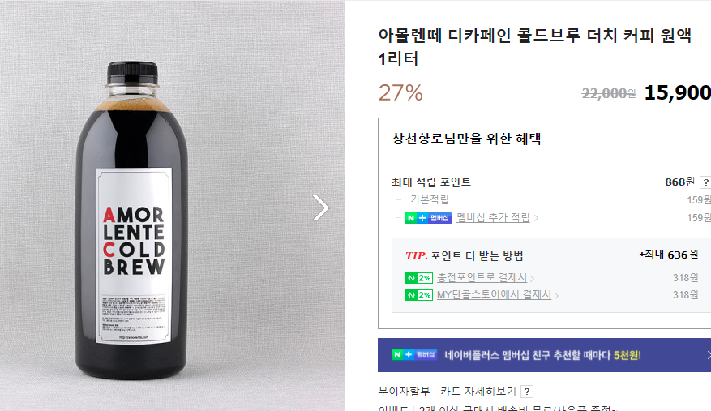

# 2020 회고

(소라의 날개 34권 중)  
  
2020년은 상반기/하반기가 아닌 1년 전체 회고를 작성하게 되었다.    
  
7월초에 상반기를 정리해야지 하다가, 회사 프로젝트가 너무 바쁘게 지나가 10월이 지나고, 사내 첫 기술 컨퍼런스도 준비하고 하다보니 어느새 2021년 5월이 되었다.  
  
너무 늦어서 쓸까말까 하다가, 2020년에 무엇을 했는지 어디에도 안남는것이 싫었고, 이번에 **이런 이유로 안쓰게 되면 앞으로도 계속 안쓰게 될 것 같다**는 생각이 들었다.  
그래서 너무 늦었지만 2020년 회고를 쓴다.  
  
## 1. 회사

올 한해는 기술적으로도 다사다난했지만, 서비스적으로도 꽤나 다사다난했던 한해였다.  
그래서 단순히 개발자가 아닌 **제품 개발자** 로서 많은 고민을 할 수 있었다.

### 1-1. 신규 시스템 오픈

매입 (acquire) 시스템을 오픈했다.  
신규 시스템을 오픈하게 된 이유는 크게 2가지였다.  

1. 주문-정산 사이의 회색 지대만 담당할 시스템 필요성
2. 정산시스템의 망분리 환경

사건(?)의 발단은 점점 다양한 형태의 업주님들의 매출정보가 필요하다보니 주문시스템과 정산시스템이 실제 집중해야할 일 보다 **데이터 뽑아주는 일**이 계속 발생했던 것이다.  
  
* 주문시스템은 고객분들의 주문이 원할하게 하는 것에 집중을 해야하고
* 정산시스템은 업주님들께 빠르고 정확하게 정산을 해줘야하는 것에 집중을 해야하는데

그 외 **나머지 일들에 자꾸 업무 리소스가 사용**되는 것이였다.  
  
다양한 형태의 매출 정보, 회계감사용 데이터 제공, 신규 오픈되는 여러 업주향 서비스들에 제공될 API등 시스템 본연의 일 보다는 외부 지원에만 리소스가 다 사용되는 것이다.  
  
그러다보니 주문시스템은 주문시스템 나름대로 매번 신규 데이터 연동 포맷 고민과 외부 지원, 정산시스템은 수기 데이터추출, 어드민 기능 추가 등의 일들이 계속 있었다.    
  
그래서 이렇게 주문건당 필요한 요청에 대해서만 집중할 수 있는 별개의 시스템이 필요하다고 판단했다.  
  
물론 이에 대한 **해결책이 꼭 신규 시스템을 만드는 것인가**? 하는 생각도 있었다.  
  
"그냥 정산시스템이 계속 제공하면 되지 않나?" 라고 하기엔 몇가지 허들이 있었다.

* 정산시스템은 일단 주문 원천 데이터를 사용하지 않고 이미 **가공된 데이터를 저장**하고 관리중이고
* 정산에 포함되지 않는 데이터는 연동 받지 않았고
  *  앱 내 결제가 아닌 만나서결제인 경우 업주님들이 직접 돈을 수령하기 때문에 정산 대상이 아니다.
* 정산시스템은 **망분리 환경**이였다.

이 망분리 환경이 정말 큰 이슈인데,  
망분리 환경의 데이터는 **접근하는 모든 행위가 관리대상에 포함**된다.  
그래서 타 팀이 정산 시스템의 어드민이라도 접근하려면 수많은 권한요청과 프로세스를 거쳐야하고, **망분리용 접근 노트북**을 사용해야만 한다.  
  
경험해본 사람들은 알겠지만, 망분리 환경은 정말 개발자들의 생산성을 저하시킨다.  
몇몇 데이터가 주문 데이터와 다를바 없음에도 정산시스템이 그 데이터를 제공해야하는 순간 그 수많은 프로세스를 거쳐야되는 것이다.  
  
그래서 **망분리 환경에서 벗어나서** 다뤄야만 된다는 판단에 신규 시스템을 구축하게 되었다.  
  
기존의 정산시스템을 운영하고 전사 프로젝트들도 진행해야되서, 가장 편한 스택으로 빠르게 오픈하고 검수 과정을 거쳤다.  
대략 3개월간 빠르게 API/어드민/배치 등을 모두 구현해서 오픈한 이후, 3개월간 데이터 검수를 계속 진행했다.  
  
한번 데이터가 꼬이면 매일 수백만건씩 발생하는 주문데이터 사이에서 그 1건을 찾는게 너무 어렵기 때문에 개발 시간 보다 검수시간에 더 많은 리소스를 투입될 수 밖에 없었다.  
  
기회가 되면 이 시스템 오픈과정도 이전 [포인트 시스템 오픈](https://woowabros.github.io/experience/2018/10/12/new_point_story_1.html)처럼 소개 하면 좋을것 같아서 별도로 정리해볼 계획이다.  

> 물론 이렇게 오픈한 신규 시스템은 **정산시스템이 AWS로 이관되면서** 살짝 애매해졌는데 그래도 망분리인건 변함이 없다. 

### 1-2. 오픈 서비스 오픈과 롤백

4월에 전사가 달려든 대형 프로젝트가 오픈하고, **한달이 안되어서 롤백** 되었다.  
  
왜 그런 큰 프로젝트를 A/B 테스트를 거치지 않았냐부터 시작해서 별별 말들을 주변에서 많이 들었는데, **단순히 UI의 변경이 아닌** 고객/업주/라이더 분들이  **받는 돈에 영향을 주기 때문에** 그냥 A/B 테스트로 하기가 어려웠다.    
  
> **배민의 웬만한 B2C 서비스들은 이미 A/B 테스트를 하고 있다**.  
> 그럼에도 이 프로젝트는 컨텐츠 노출의 문제가 아니라 고객/업주/라이더 분들의 모든 과정에서 영향을 주는 것이라 A/B 테스트를 하기엔 어려운 점이 많았다.
  
할말은 많은데(어찌됐든 퍼블릭한 공간이니깐), 그렇게 큰 프로젝트가 오픈되고 롤백 되는 과정을 경험하면서 서비스 기업의 어려움을 많이 느끼게 되었다.  
  
특히나 **O2O 서비스는 기존의 많은 이해 관계**가 묶여있다보니 순수 Online에 비해서는 모든 것에서 어려움이 있다는 것을 깨달았다.  
  
> 지금부터의 이야기는 **회사가 아닌 내 개인의 입장에서 쓴다**.  
  
우리 서비스의 고객은 총 3분이다.

* 주문을 해주시는 회원분들
* 음식을 파시는 업주분들
* 음식을 배달하시는 라이더분들

여기서 3분을 **모두 만족하는건 사실상 불가능하다**.  
왜냐면 결국은 이 중 누군가에게 좀 더 많은 혜택을 주려면 다른 분들의 헤택을 가져와야하기 때문이다.  
  
**아마** 모든 배달 커머스들은 이때문에 이 3분중 어느분의 만족을 높일지 결정해야만 한다.  
그리고 그 결정에 따라 다른 분들은 **상대적으로** 불만을 가질 수 밖에 없다.  
  
배민에서는 최대한 이 균형을 맞출려고 노력하는데, 이들을 다 만족할 수 있는 비지니스 모델이라는게 있을까?

* 고객분들은 **더 할인된 가격**에 음식을 드시고 싶고,
* 업주님들은 **더 많은 이윤**을 남겨서 음식을 팔고 싶으시고,
* 라이더분들은 **더 높은 시간당 인건비**를 얻고 싶으시다.

그래서 오로지 주문 고객분들을 위해 모든걸 한다는 것은 **업주님들과 라이더분들에 드리는 혜택에서 가져와야 함**을 의미한다.    
  
배민이 가져가는 수수료를 줄이면되지 않냐고 하는데, 전체 주문의 90%가 넘는 배달의 민족 서비스에서는 **주문 건당 발생하는 수수료가 없다**.  
(배민 라이더스는 전체 주문의 5%도 안된다)

(참고: [머니투데이 기사](https://news.mt.co.kr/mtview.php?no=2020081915381945802))  

발생한 수수료가 있어야 이를 줄여서 무언갈 할텐데, **애초에 주문건당 수수료가 없는데** 나눌게 없다.   
(사실상 **월 8만원의 광고 이용료**가 메인이다.)  
  
90%이상의 주문이 발생하는 배달의 민족에서 주문 건당 발생하는 **수수료가 없으니 쿠폰/포인트 등의 이벤트를 적극적으로 하기가 쉽지 않다**고 생각했다.  
(개인적인 생각이다. **회사 입장이 아니라**.)  
  
소상공인을 위한 **우대수수료**를 가장 먼저 적용한 것도 우리 회사이다.  
(위 표를 보면 알겠지만 결제 수수료가 유일하게 3%가 안된다)  
  
진짜 많은 부분에서 업주님들을 위한 서비스를 만들고도 네이버 카페의 댓글을 볼때면 안타까웠다.
  
어찌됐든 이 과정에서 여러가지 사업에 관한 많은 고민을 해볼 수 있었다.  
(내가 결정권자도 아니지만)

1) 어떤 비지니스 모델을 해야 서로의 수익이 의존관계에서 최대치가 나올 수 있을까? 
2) 과연 롤백이 맞았을까 아니면 여론을 무시하고서라도 진행을 하는게 맞았을까?
3) 현재의 비지니스 모델을 계속 유지해서 우리 회사는 더 커질 수 있을까? 

내가 CEO는 아니지만, 단순히 제품을 잘 만드는 것 이외에 **비지니스 모델에 대해서 더 크게 고민**해 볼 수 있었던 시간이였다.  

### 1-3. 코로나 지원

2020년 2분기부터는 코로나 지원으로 인해 많은 리소스가 투입되었다.  

우리 회사는 작년 한해 **코로나 특수를 받은 서비스임에도 적자**였다.

([ZDNet Korea 기사](https://zdnet.co.kr/view/?no=20210330111252))

저런 코로나 지원이 없었다면, **112억 적자가 아닌 700억 흑자**였을 것이다.  
  
이런 업주님들을 위한 지원들을 2020년 내내 진행했다.  
  
이를테면 2020년 한해 동안에는 포장 주문일 경우 **회사가 대신 결제 수수료를 지불했다**.  
즉, 포장 주문의 경우 (주문 수수료가 없다보니) **주문이 발생하면 손실이 발생**했다.  
  
그 외에도 1년간 약 **수백억원의 광고비 지원**을 했다.  
(정확한 수치는 공개해도 될지 몰라서 일단 3/4월 뉴스로 공개된 것만)  
  
광고비 지원이라는게 업주님들이 지불하신 광고비를 다시 돌려드리는 이벤트다보니 원래 있던 기능이 아니였다.  
그래서 담당팀을 통해 별도로 광고비 내역을 연동 받아 별도 주기로 정산하는 기능을 만드는데 시간을 제법 보내게 되었다.  
  
별거 아닌것처럼 보이지만, 기존에 잘 돌던 시스템에 녹이는게 여러 조건들이 `false`가 되어서 결국은 **광고비 정산이라는 별도 구조**를 만들어서 진행하게 되었다.  
(계좌가 없을경우, 채권이 있을 경우 등등 별도 프로세스가 너무 많이 달랐다.)  
  
한번만 하고 지원이 끝나겠거니 했는데, **1년내내 정기적으로 지원**하기로 회사는 결정했다.  
한번 하고 끝나겠거니 해서 조금은 재사용성을 포기하고 만들었는데, 막상 계속 사용하니 다시 만들어야 하는 고민을 하기도 했다.  
하지만 어차피 시간 관계상 더 고민하고 만들 수 있는 상황은 아니였다보니 그 당시 최선의 선택이였다고 생각한다.   
  
다양한 방식의 정산 프로세스가 필요하겠다는 생각을 강하게 느낀 시즌이였다.  
이후에 추석으로 인한 장기간 연휴로 **현금 흐름에 문제가 생길 업주님들을 위해** 업계에서 유일하게 선 정산을 진행하기도 했기 때문이다.  
  
아마 계속 회사에 있었다면 정산 프로세스를 전면 개편하는 일을 진행했을것 같다.  
그걸 못하고 나온 점은 조금 아쉽게 생각한다.

> 위 글들에서 계속 배민에 대해서 칭찬만 하는 걸 보고 조금 아니꼽게 보실수도 있다고 생각한다.  
> 그렇지만 잘한 것은 잘했다고 해야하는거 아닌가?  
> 업계를 선도하는 기업답게 **그만큼 많은 이익을 포기하고 외부에 공유**하는 것은 충분히 칭찬받을 일이라고 생각한다.  
> 그래서 퇴사하고 쓰는 이 회고글에도 언급하는 것이다.  

### 1-4. 정산시스템 전반적인 성능 튜닝

2020년 상반기부터 어드민과 배치에서 요청당 몇분씩 걸리는 쿼리가 하나둘씩 발생하기 시작했다.  
이미 주요 **테이블당 적재된 row가 10억건**이 넘기 시작한 상태였기 때문에 당연한 일이였다.  
  
이 과정에서 좀 대표적인 몇몇 케이스는 블로그에 정리하기도 하였다.

* [커버링 인덱스 시리즈](https://jojoldu.tistory.com/476)
* [JPA exists 쿼리 성능 개선](https://jojoldu.tistory.com/516)
* [업데이트 쿼리 서브쿼리 vs 조인](https://jojoldu.tistory.com/522)
* [페이징 성능 개선 시리즈](https://jojoldu.tistory.com/528)
* [Querydsl Group by 개선](https://jojoldu.tistory.com/477)

당연하게도 [RealMySQL](http://www.yes24.com/Product/Goods/6960931), [RealMariaDB](http://www.yes24.com/Product/Goods/12653486?OzSrank=1) 책도 도움이 많이 되었는데, 특히 이번에는 [High Performance MySQL 3판](https://www.amazon.com/High-Performance-MySQL-Optimization-Replication/dp/1449314287)이 많은 도움이 되었다.  
  
국내 번역본이 있는데 1판 기준이다보니 MySQL 버전이 너무 낮았다.  
다행히 3판은 5.5를 기준으로 해서 5.7 에도 적용될만한 내용이 많았다.  
  
3판에 대한 해외원서는 사내 복지중 하나인 **사파리북스 계정 지원**을 통해 읽었다.  
  
그동안 MySQL에 대해서는 시스템 운영 외에 쿼리 튜닝에 대해서는 제대로 보지 못했는데, 이걸 해소하게 되어서 좋았다.  
이후에 **다른 Data Store를 배울때도 어떻게 배우면 될지** 학습방법을 익히게 된 느낌이랄까?  
PostgreSQL, MongoDB 등 다른 걸 배울때도 이번 학습 방법을 토대로 하면 되겠다는 작은(?) 자신감을 얻게 되었다.

> 아래에서 좀 더 자세히 후술하겠지만 이때의 개선 사례를 [회사 기술 컨퍼런스에서 발표](https://www.youtube.com/watch?v=zMAX7g6rO_Y)를 하였다.

### 1-5. 정산시스템 AWS 100% 마이그레이션

드디어 드디어 꿈에도 그리던 정산 시스템을 AWS로 100% 마이그레이션 하였다.  
  

(정산 IDC DB의 Shutdown!!!)  
  
* [우아한형제들 AWS 올인(All-In) 클라우드 마이그레이션 - AWS 고객 사례](https://www.youtube.com/watch?v=I1JAnbb3-GE)

SRE팀/정보보안팀/DBA분들의 지원 덕분에 실제 작업기간은 3개월만에 진행할 수 있었다.  
  
작업은 팀에서 다같이 진행하고 싶었는데, **여러 비지니스 요청때문에** 결국 나를 제외한 나머지 개발자분들이 다 신규 서비스 준비를 하고, 나 혼자서 AWS 이관을 준비하게 되었다.  

그러다보니 branch 관리가 좀 문제였는데, AWS 이관용 코드와 신규 프로젝트용 코드가 서로 배포시기가 달랐기 때문이다.  
  
둘의 배포시기는 달랐지만, 결국 AWS 오픈할때는 신규 프로젝트용 코드는 다 반영된 상태여야 하고 AWS QA도 해당 기능들까지 대상이였기 때문이다.  
  
결과적으로는 맘에 들진 않지만 rebase + squash merge를 좀 적극적으로 쓰면서 QA는 클라우드 코드까지 포함한 형태로 진행하고, IDC 배포는 클라우드 코드는 제외한채로 나가도록 했다.     
  
브랜치 전략과 무관하게 어려웠던 점은 **문서 작업**이였다.  
망분리/핀테크 규제 대상인 서비스를 클라우드로 이전하기 위해서는 **수많은 문서 작업**들이 필요한데, 이를 정리하는데 시간을 꽤 보냈다.  
(SI에서 문서 작업하던 기억 나기도하고..)  
  
다행히 회사의 정보보안팀이 빵빵하게 지원해주셔서 시간은 많이 들었지만 큰 어려움 없이 수월하게 작성할 수 있었다.  
  
그 외에도 마이그레이션 전략이나 신규 아키텍처 등에 대한 것도 설계하고 리뷰를 갖는 등은 기존에 많이 했던 일들이라 큰 문제는 없었다.

* 성능 테스트
  * 순간 요청양
  * 배치와 같은 대량의 데이터 요청
* 레플리케이션 테스트
* 페일오버 테스트
* 롤백 테스트
* 각종 타임아웃 테스트

오픈 시나리오는 꽤 간단했다.  
기존 도메인 외에 새 도메인을 만들고 신규 AWS 시스템들은 다 새 도메인에 붙였다.  

(1) 오픈 전까지는 AWS의 모든 서비스들은 신 도메인을 붙여서 전체 테스트를 수행했다.

(2) 오픈 당일에는 **구 도메인을 모두 AWS에 추가로** 붙였다. 

* 즉, AWS 시스템에 구/신 도메인이 모두 붙어있는 상태 

(3) 1~2달 정도 구/신 도메인을 모두 AWS에 붙이고 있다가, 연동되는 시스템들이 다 신 도메인 호출로 코드 교체하게 되면 구 도메인을 제거

오픈 준비를 하면서 신규 시스템에 대한 여러 기술적 내용들을 위키에 작성했다.  
대표적인 예로 배포 플랫폼이 있다.  
사내 배포 플랫폼 내부적으로는 테라폼 + CodeDeploy로 구성되어 있어서 팀 분들을 위해 Code Deploy에 대한 로그 보는법이나 배포 과정에서 발생하는 기본적인 예외 케이스에 대해서는 위키로 정리했다.  
  
사내 배포 플랫폼을 쓰기 때문에 굳이 여기까지 알 필요가 있을까 싶긴했다.  
그렇지만, 배포 담당팀이 있다하더라도 기본적인 내용은 본인이 해결할 수 있어야지 뭐만 안되면 그 팀을 찾아서 **해결해줄때까지 손가락 빨고 있는건 좋은 개발자가 아니라는 점**을 이야기했다.  

### 1-6. 기술 블로그와 채용 노션

우리팀의 채용 활성화를 위해 [기술 블로그](https://woowabros.github.io/experience/2020/02/05/springbatch-querydsl.html)와 [팀 채용 노션](https://woowahan.oopy.io/60a06399-3f95-4fec-a436-000ad6baff40)를 작성했다.  
  
기술 블로그의 경우엔 내 개인 블로그에 쓰고 싶었지만, 우리 팀을 홍보하기 위해서는 사내 기술 블로그에 올리는게 맞다고 생각했다.  
  
[다른 글](https://jojoldu.tistory.com/562)에서도 언급했지만, 내가 생각하는 숙제중 하나가 **팀 기술 브랜딩**이였기 때문에 외부 홍보에 있어서는 적극적으로 나섰다.

([팀 채용 노션](https://woowahan.oopy.io/60a06399-3f95-4fec-a436-000ad6baff40))  
  
결과적으로는 이 notion 포맷을 다른팀에서도 많이 차용해주셔서 나름 성공했다고 봤다.  
  
정산이란 도메인은 개발자들이 선호하지 않는다, 발전하기 어렵다 이야기를 워낙 많이 들었다.  
그건 그냥 개인의 문제지 **도메인의 문제는 아니라는걸** 증명하고 싶었다.  
그래서 여러 기술 컨퍼런스 / 채용행사 / 컨텐츠 등에 좀 더 열중했던것 같다.  
  
다행히 그런 활동이 도움이 되었는지 2021 신입 개발자, 2021 우아한테크캠프 PRO 등의 프로그램에서 가장 많은 지원자를 받은 팀 중 하나가 되었다.  
  
이떄 팀 브랜딩 했던 경험을 다른 스타트업 다니면서도 좀 활용할 수 있을것 같아서 개인적으로는 소중한 경험이였다.

### 1-7. 역대 최고 주문수 달성

2020년을 마무리하는 12월 31일, 배달의민족 (배민라이더스와 포장주문 제외한 순수 배달의 민족으로만)의 **앱 내 결제**가 하루 최대치인 **310만 건**을 돌파했다.  
(만나서 결제를 포함하면 배달의 민족으로만 350만건이 넘는다.)  
  
코로나특수 + 연말특수가 포함되었기 때문이지만, 그럼에도 배달이라는 도메인에서 하루 주문수가 310만이 된다는 것은 백엔드 개발자로서 감회가 새롭다.  
  
일 500만건 연동과 정산하는 날도 금방 오지 않을까? 하는 생각이 들었다.  
  
500만건이 되면 정산 시스템의 아키텍처는 어떻게 변해야할까?  
이제는 내가 고민할 필요는 없지만, 그럼에도 가끔은 남아있었다면 어떻게 그 문제를 풀었을까 종종 고민해본다.

## 2. 블로그

2019년에 비해서는 블로그는 조금 성장했다.

(GA에서 잠재고객 -> 개요로 가면 항목을 볼 수 있다.)  
  
12월만 기준으로 삼으면 오히려 떨어졌다.

* MAU: 5만
  * 2019년 12월 (5.5만)과 비교해서 **-0.5만**
* 월 PV: 15.4만
  * 2019년 12월 (21.9만)과 비교해서 **-6.5만**
* 평균 세션시간: 2분 20초
  * 2019년 12월 (2분 4초) 와 비교해서 2초 증가

2019년 12월은 아무래도 [EO 영상](https://www.youtube.com/watch?v=V9AGvwPmnZU) 덕분에 말도 안되는 수치를 달성했기 때문에 정확한 비교로 보기는 어렵다.  
(2019년 11월은 MAU 4.4만, 월PV 12만 이기 때문이다.)  
  
2020년엔 어떤 컨텐츠가 노출되었느냐에 따라 매 월 차이가 심했는데, 6월의 경우엔 **MAU 6.4만**, **월PV 18.4만**이였다 (12월에 비해 훨씬 더 높다.)

2019년의 총 사용자수가 39.4만/총 PV가 161만이였던 것에 비하면 2020년 한해는 전체적으로 **21%의 성장**을 했다.

* 총 사용자수: 39.4만 -> 48만 (21% 성장)
* 총 PV: 161만 -> 196만 (21% 성장)

2021년엔 총 UV 50만, PV 230만정도를 목표로 해야겠다.

### 2-1. 68개의 글

총 68개의 글을 발행했다.  
(상반기: 30개, 하반기: 38개)  
  
대략 월 평균 5.6개의 글을 발행했다.

* 1월: 2
* 2월: 8
* 3월: 9
* 4월: 4
* 5월: 5
* 6월: 2
* 7월: 8
* 8월: 7
* 9월: 5
* 10월: 3
* 11월: 7
* 12월: 8

드문드문 글 발행수가 적었던 월을 돌이켜보면 오픈준비로 바빴던 시즌이였다.  
회사 일과 무관하게 개인공부나 블로그를 꾸준히 하려고했는데, 역시 쉽진 않았다.  
  
> 여담인데, 매번 월별 글 발행수를 뽑는게 귀찮아서 [티스토리 월별 발행수 조회](https://tistory-ppm.netlify.app/)를 만들었다.

2020년 한해 가장 인기 있었던 컨텐츠는 [1. 비전공자로 자바 백엔드 개발자 시작하기](https://jojoldu.tistory.com//505)였다.

기술블로그인데 **기술 내용이 가장 인기 있는게 아니라서** 내심 씁쓸했다.  
역시 이런 에세이류가 인기가 많구나 라는 생각을 했다.  
  
2021년에는 **에세이보다 인기 있는 기술 컨텐츠**를 만들어보는걸 목표로 삼아야겠다.

### 2-2. 400만 PV 달성

GA 기준으로는 그 전에 돌파를 했는데, 그래도 블로그 공식 지표도 400만을 넘기는게 중요할것 같아서 11월 20일을 기준으로 하게 되었다.  
  
* 2019년 3월에 100만 돌파
* 2019년 11월에 200만 돌파
* 2020년 11월에 400만 돌파
  *  300만 돌파시점은 모르겠다.

1년만에 200만 PV가 증가했다.  
거의 6개월에 100만씩 증가하는 셈인데, 솔직히 깜짝 놀라긴했다.  

PV와 애드센스의 비율은 1만PV당 $9 정도 되는 듯 하다.  
(환율따지면 PV 1당 1원인 셈이다.)

즉, 연PV 200만 IT 블로그는 **1년에 약 200만원**의 광고 수익이 발생하는것 같다.  
12개월로 나누면 **1개월에 16만원**정도 되는 셈이다.  
  
한번 포스팅 써놓은 것들이 있으니 꾸준히 방문자가 유입될 것 같지만, 유튜브와 마찬가지로 구글 검색엔진 역시 **계속해서 신규 글을 발행하지 않으면 검색 노출이 뒤로 밀린다**.  
즉, 계속해서 글을 쓰지 않으면 현재의 조회수가 금방 사라진다는 것이다.  
  
꼭 광고 수익때문에 글을 쓰는건 아니기 때문에, 꾸준히 글 쓰는데 문제 될 것은 없다. 

> 블로그 400만 회고는 별도의 글로 정리할 예정이였는데, 벌써 500만을 돌파해서 그냥 500만 회고로 한번에 준비중이다.

## 3. 오픈소스

오픈소스 활동은 1개의 라이브러리 출시를 했다.

### 3-1. Spring Batch Querydsl

기존에 팀에서 사용하던 Querydsl용 Spring Batch ItemReader를 좀 더 개량해서 [오픈소스- spring-batch-querydsl](https://github.com/jojoldu/spring-batch-querydsl)로 출시하고 사내 기술블로그에 그 과정을 올렸다. 
  
크게 2가지 기능이 있는데, 

* 기존 Paging Reader
* No Offset (더보기) Reader 

기존 Paging Reader는 영한님이 토대를 만들어 놓으셔서 기존 코드에 대한 개선만 진행하고, No Offset (더보기)는 새로 추가했다.  
  
왜 더보기 방식을 써야하는지는 [사내 기술블로그](https://woowabros.github.io/experience/2020/02/05/springbatch-querydsl.html)에 올렸다.  
  
결국 대량의 데이터 환경에서 범위 조회를 위해서는 필수이기 때문에 Spring Batch에서 충분히 쓸만하다는 판단이 있었다.  
  
팀 내에서 쓰던것을 굳이 오픈소스화 한 이유는, 우리팀의 **신규 프로젝트에서 쓸때 계속 파일 복&붙 하는게 귀찮았기** 때문이다.  
  
편하게 [jitpack](https://jitpack.io/#jojoldu/spring-batch-querydsl)으로 의존성 관리를 할 수 있기 때문에 부담은 없었다.  

팀 내에서 실제 쓰고 있기 때문에 성능 상 이슈나 개선건들은 지속적으로 발견하고 발전시킬수 있었다.  

> 역시 별도로 오픈소스 하기 보다는 팀 내 기술을 오픈소스화해서 지속적으로 사용하고 개선하는게 제일 좋다는 생각을 했다.  

## 4. 외부 활동

코로나 덕분에(?) 외부행사를 많이 하진 못했다.  
컨퍼런스 발표도 거의 최소화된 상황이여서 다른해 보다는 발표 준비는 적게 할 수 있어서 개인적인 시간을 좀 확보 할 수 있었던 해이다.

### 4-1. Yes24 올해의 IT Top8 & 리디 주간 1등

기쁘게도 2019년에 출간한 [스프링 부트와 AWS로 혼자 구현하는 웹 서비스](https://jojoldu.tistory.com/463) 책이 올해의 IT Top8 & 리디 주간 1등이 되었다.

[2020 Yes24 IT연말결산](http://www.yes24.com/campaign/01_book/yesPresent/yesPresent.aspx?EventNo=193729&CategoryNumber=001)

아무래도 책이 2019년 말에 나왔다보니, 최신의 환경에서는 제대로 작동하지 않는 이슈가 많았다.  
그래서 2020년 12월 기준으로 최신 버전에서 반영하는 방법을 별도로 정리하기도 했다.

* [(2020.12.16) 스프링 부트와 AWS로 혼자 구현하는 웹 서비스 최신 코드로 변경하기](https://jojoldu.tistory.com/539)

그럼에도 다른 도서 집필과 회사 프로젝트, 개인 사이드 프로젝트 등으로 인해서 제대로 지원을 하지 못했다.  
다른 일들이 어느정도 정리되면 **2021년 버전으로 개정판** (2022년이 될수도 있고..?) 을 준비해볼 생각이다.

### 4-2. 이노콘 - OKKY 커뮤니티 소개

[이노베이션 아카데미 컨퍼런스 (이하 이노콘)](https://youtu.be/Tp9w7TatzJQ?list=PLdaJq4f37m1p-0EEXIO7JDb3xXhlluWC4&t=25662)에서 OKKY 운영진으로 커뮤니티 소개를 하는 촬영을 가졌다.

> 이노콘 전체 세션도 재밌지만, 사내 프론트엔드 개발리더이신 김민태님이 참여한 ["선배 개발자들이 말하는 실제 취업 현장과 개발문화"](https://www.youtube.com/watch?v=Tp9w7TatzJQ&list=PLdaJq4f37m1p-0EEXIO7JDb3xXhlluWC4&index=1) 세션은 취준생이라면 꼭 보길 추천한다.  
> (06:01:30부터다)

(07:07:42부터 OKKY 커뮤니티 소개 시작이다.)  
  
[OKKY](https://okky.kr/)는 내가 SI 에서 커리어를 시작하고, 서비스 회사로 이직하면서 많은 도움을 ]받은 곳이기도 하고 세미나/에세이등을 컨텐츠로 올리기도 했던 곳이라 불러주셨을때 대단히 감사했다.  
  
OKKY가 다른 IT 커뮤니티에 비해 어떤 장점이있고, 주니어 개발자분들이 OKKY를 그대로 방문하면 얻는 것들은 어떤것들이 있는지 등에 대해서 이야기를 나눴다.  
  
앞으로는 좀 더 열심히 활동하겠다고 말 해놓고... 사실 방문을 자주 못하고 있어서 죄송한 마음이다.  
이직한 회사에서 자리가 어느정도 안정화가 되면 다시 컨텐츠를 올릴수 있지 않을까 생각한다.

### 4-3. JetBrains Productivity Day

JetBrains에서 진행하는 [온/오프라인 인플루언서와 함께하는 IntelliJ IDEA와 생산성에 대한 이야기](https://www.youtube.com/watch?v=FCa4bTUowTY) 패널로 참여했다.  
  
JetBrains의 컨퍼런스가 있으면 기회가 되면 항상 발표를 하려고 하는데, 이번엔 특별히 기술과 직접적인 관련은 없는 내용으로 이야기를 하게 되었다.  
  
처음엔 할까말까 고민을 했는데, **백기선**님이 함께 패널로 나온다는 이야기에 참여하게 되었다.  
  
기선님은 어떻게 생산성은 관리하시고 여전히 공부를 하시는지 짧은 시간이였지만 여러 팁들을 얻을 수 있는 시간이였다.  
  
생각보다 유튜브 영상이 많이 조회되진 못했는데, 50분이라는 시간동안 좋은 개발자분들의 생산성에 관한 팁을 얻을 수 있는 영상이라 개인적으로는 추천한다.

### 4-4. 우아콘

사내 첫 기술 컨퍼런스 **우아콘**에서 [수십억건에서 Querydsl 활용하기](https://www.youtube.com/watch?v=zMAX7g6rO_Y) 주제로 발표를 했다.

2020년에는 꼭 회사 이름을 걸고 기술 컨퍼런스를 하자는 이야기가 있었는데, 거의 10월이 되어서야 본격적으로 시동을 걸게되었다.  
12월에 컨퍼런스 오픈을 하려면 발표 준비를 한달만에 끝내야만 했다.  
그러다보니 어쩔수없이 하던 사람(?)이 이번에도 하게 되었다.  
사실상 새롭게 발표자를 모집하고, 주제선정하고 그럴 시간이 부족했기 때문이다.  
그래서 테크톡이나 다른 컨퍼런스 등에서 **자주 발표를 했던 사람들 위주**로 구성하게 되었다.  
  
> 올해 2021년 우아콘은 아마도 다양한 분들이 발표를 하시지 않을까 생각한다.

발표 준비할 시간이 한달채 안되기 때문에 주제 선정을 좀 빠르게 할 필요가 있었는데, 내가 생각한 주제는 크게 2가지였다.

* 정산시스템 AWS로 이관 이야기
* 수십억건에서 Querydsl 활용하기

여기서 후자를 선택한 이유는 **컨퍼런스 전체 주제들과의 조합**을 맞추기 위해서였다.  
  
우아콘을 보신분들은 아시겠지만, 모든 주제가 **코드가 없고, 아키텍처와 관련된 내용**들이였다.  
그러다보니 기술 컨퍼런스인데 **실무 코드가 전혀 없는** 상황이였다.  
코드 기반의 주제가 하나는 있어야 밸런스가 맞을것 같다고 다른 발표자분들이 의견을 주셨고 나도 그 의견에 동의해서 Querydsl로 주제를 선택하게 되었다.  
  
발표 준비야 기존에도 자주했었고, 블로그에도 여러 내용들이 정리가 된 상태라 큰 문제는 없었는데 발표 당일이 생각보다 큰 부담이였다.  
  
녹화 촬영이였지만, **원테이크**로 찍었어야 했다.  
개인당 1시간정도의 촬영 시간이 있었고, 중간에 잠깐 쉬고 이어서할 순 있지만 **촬영장에서 연습하고 찍을수는 없었다**.  
이 날 외에는 스튜디오 예약이 안되서 당일에 무조건 촬영을 끝내야 했다.  
    
원래 발표 장표에 스크립트를 써놓진 않는데(자연스럽지 못하고 **대본 읽기식이 되는걸 싫어해서**), 이 날은 녹화 + 원테이크라서 어쩔수없이 주요 포인트들은 장표 스크립트에 추가했다.  
  
확실히 중간 중간 키워드들을 보고 할 수 있어서 조금 경직되긴 했지만 안정적으로 발표를 끝낼 수 있었다.  
  
과연 우아콘이 인기 있을까 걱정도 많이 되었다.  
비슷한 시기에 다른 회사들도 기술 컨퍼런스를 해서 너무 비교될 것 같았기 때문이다.  
막상 컨퍼런스 후기나 유튜브 조회수를 보니 생각보다 너무 잘되어서 내심 뿌듯했다.  
  
이제는 우아한형제들 소속이 아니니 우아콘 발표자가 될 순 없겠지만, 외부인이 발표할 수 있는 기회가 된다면 한번 더 발표자를 해보고 싶다.

### 4-5. 코디미

호돌맨과 사이드 프로젝트로 코디미를 시작했다가 **접었다**.  

호돌맨과는 이런 사이드 프로젝트에 관한 이야기를 자주 하는데, 지금의 [인프런 멘토링](https://www.inflearn.com/mentors)과 같은 서비스가 재밌을 것 같아서 시작했다.  
(당시에는 인프런 멘토링 서비스 오픈 전이였기 때문에 서비스를 베낀건 아니다.)  
  
사연 신청을 받고 그 중 몇분을 뽑아서 고민에 대한 상담을 해드리는 서비스였다.  
  
막상 생각했던것보다 지원자분이 많아서 (한 10명 예상했는데, 30명이 넘게 신청하신걸로 기억한다.) 놀랬다.  
  
그 중 몇 분을 뽑아서 상세하게 고민에 대한 답변을 드렸다.  
받으신 분들은 다 회신을 주셨고, 특히 조금 강하게 답변드린분께서는 오히려 따끔하게 얘기해줘서 감사하다는 이야기를 해주셔서 얼떨떨했다.

이 분외에도 또 다른 분은 나중에 네이버로 이직하시기도 했다.  
(물론 코디미 덕분에 하신건 아니시겠지만)  
     
첫 시도치고는 괜찮은 결과였음에도 왜 접었을까?  
  
이 서비스가 굳이 왜 필요한가에 대해서 우리가 명확한 답이 없었기 때문이다.  
굳이 코디미를 써야할 이유는 무엇인가?  
어차피 **멘토가 누구냐가 중요하다면** 이게 플랫폼으로서 영향력이 있는건가?  
같은 고민들 말이다.  
  
그래서 꼭 우리가 해야만 하는건 아닐수도 있겠다는 생각이 들었고, 스타트업으로 간 **호돌맨이 너무 바쁘기도** 해서 흐지부지 끝나버렸다.

> 이렇게 시작한 코디미는 이후에 [개발바닥](https://www.youtube.com/channel/UCSEOUzkGNCT_29EU_vnBYjg)으로 피벗(?)을 하게 되었다.

## 5. 카페인 없이 살기

재택 근무를 하면서 내가 하루에 마시는 커피의 양이 어마하게 많다는 걸 깨닫게 됐다.  
**아침/점심을 매번 벤티 사이즈**로 마시고 있었던 것이다.  
  
돈을 떠나서 하루에 습관처럼 커피를 마시는 모습을 보고 "조금 위험한것 같은데?" 라는 생각을 했다.  
그러다 호돌맨의 글을 보고나서 카페인을 진짜 끊어야겠다고 생각했다.

**하루에 1200ml 씩** 커피를 마시던 사람이 한방에 끊을 수는 없었다.  

그래서 2단계로 나눠서 진행했다.  

1) 콜드브루 -> 디카페인 커피로 변경
2) 디카페인에서 -> 물로 변경 

디카페인은 일반 커피숍에서 팔지도 않고, 너무 자주 커피를 마시고 있어서 **비용이 너무 컸다**.  
  
그래서 [스마트 스토어](https://smartstore.naver.com/amolente/products/4857968316)에서 원액을 그대로 파는 곳을 발견해서 거기서 원액을 주문하고 작업실 출근마다 하루 먹을양을 채워서 갔다.

한동안은 이렇게 먹다가, 요즘은 디카페인 캡슐 커피를 마시고 있다.  
(개당 500원밖에 안해서 지갑이 아주 여유로워졌다.)  
    
물 마시는 비중도 꽤 늘어서, 아침/점심에 캡슐 커피 1잔씩 한 뒤 나머지는 모두 물을 마시고 있다.  
500ml 텀블러 기준으로 4~6컵을 매일 마시고 있으니 어느 정도 계획은 성공한것 같다.  

## 6. 교육

패스트캠퍼스에서 진행하는 [실무에 활용하는 데이터 파이프라인 구축 CAMP](https://fastcampus.co.kr/data_camp_pipeline)를 수강했다.  
  
데이터 엔지니어도 아닌 서비스 엔지니어인데 굳이 이 강의를 들은 이유는 **정산시스템 데이터를 좀 더 잘 활용하고 싶었기 때문**이다.  
  
어느 순간 부터는 어드민에서 매번 엑셀로 데이터를 뽑는데는 한계가 있다고 생각했다.  
수십억건이 되었는데 MongoDB와 같은 NoSQL만 정답일까?  
우리는 실시간 서비스라기 보다는 배치 (Batch) 시스템에 더 가까운데, 데이터 파이프라인을 구축하고 활용할 수 있다면 더 좋지 않을까? 등등의 생각이였다.  
    
강의 내용은 그간 내가 해보지 못했던 여러 AWS의 데이터 서비스들을 활용해보는 과정이라서 흥미롭게 들을 수 있었다.  
아무래도 강의 내용을 그대로 블로그에 옮기는건 불법이라고 판단되어서 옮기진 못했다.  
  
하지만 실습한 내용은 그대로 있기 때문에 **현 회사에서 한번 구축해보려고 한다**.  
  
강의 내용 외에도 기억에 남는 것은 교육경험이다.

원래는 퇴근하자마자 지친 몸을 이끌고 빠르게 패스트캠퍼스 교육장까지 이동하고, 저녁도 대충 먹고, 맨 앞줄 자리를 차지하기 위해 뛰어가는 등의 행위가 필요했다.  
근데 ZOOM을 통한 화상 수업으로 진행되니 이런 점들이 없고 너무 쾌적하게 수업을 들을 수 있어서 생각보다 너무 좋은 교육 경험이였다.  
  
다만, 같은 수강생들간에 interaction 이 없었던 점은 아쉽다.  
  
아마 이부분만 잘 해결하면 더 좋은 교육 경험이 되지 않을까 기대된다.

## 7. 마무리

2020년은 그간 준비해온 여러가지들을 마무리하는 해였다.  
씨앗을 뿌리고, 그 씨앗을 수확까지 하는 그런 시간 말이다.  
  
시간이 지났기 때문에 할 수 있는 이야기였지만, **2020년을 잘 마무리했기 때문에 이직할 수 있었다**.  
만약 2020년을 제대로 보내지 못했다면, 개인으로나 직장인으로나 불만이 가득한 2021년을 보내고 있었을 것이다.  

한 해를 마무리하고, 새로운 해를 시작한다고는 하지만 어떨때는 **그 전의 일들이 계속 이어져 새롭게 시작할 수 없는 해**도 있다.  
나한테는 2020년과 2021년이 그렇다.  
  
올해는 아쉬웠지만, 내년엔 다시 새롭게 잘 해보자라는 생각은 하지않으려고 한다.  
다음 해가 새롭게 시작하려면, 올해 끝 맺음을 잘 해야만 가능한 경우가 많기 때문이다.  
마치 다음날 기상시간이 전날 취침시간에 영향을 받는 것 처럼 말이다.  
  
2020년을 너무 잘 보냈고,  
2021년도 잘 보내야겠다.
