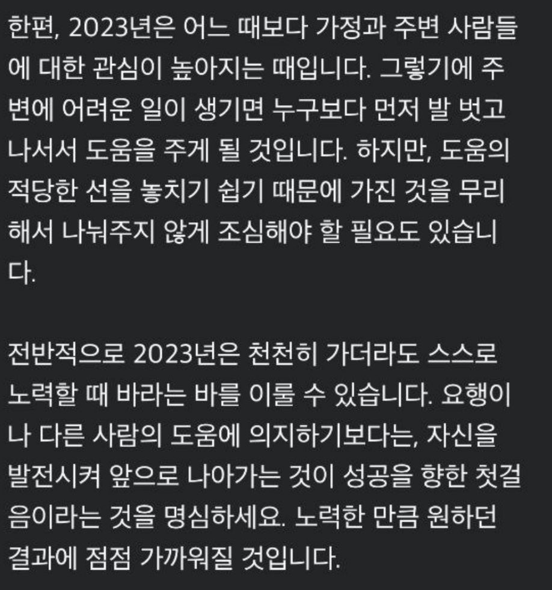
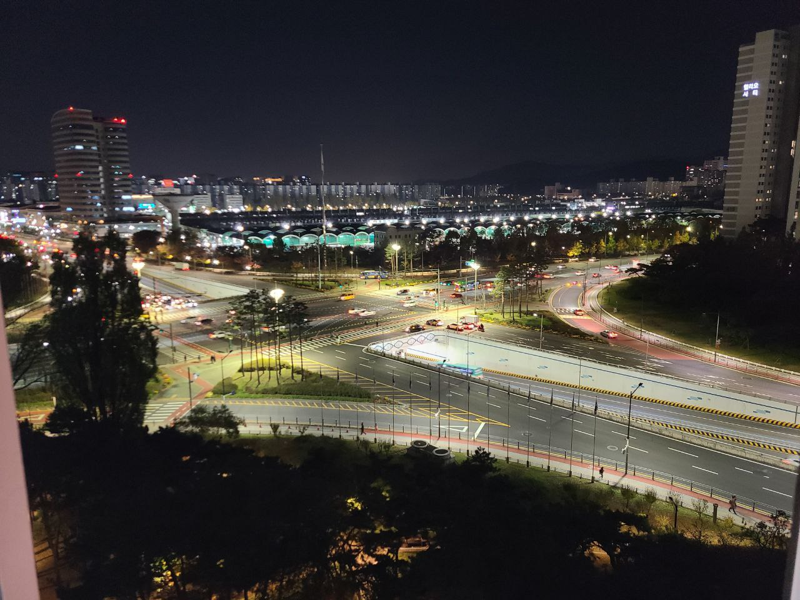

# 2023년 개인 회고

> 직업적인 회고인 [CTO 회고는 별도로 정리했다](https://jojoldu.tistory.com/766).

올 한해는 내가 해온 결정들에 대해 다시 한번 생각하는 일이 많았다.  

## 0. 고민

### 사주

올해 [점신](https://www.jeomsin.co.kr/) 앱을 유료로 구매해서 한해 운수를 봤다.  
종종 주변에서 사주를 봐주곤 했는데, "와 재밌다" 하고 듣고 한 귀로 흘리곤 했다.  
근데 올해는 뭔가 의도한대로 작동하지 않는 것들이 많아서 "왜 이러나" 하는 생각들을 참 많이 했다.  
  
지금의 이 결과는 왜 그런걸까?  
내가 그때 그러지 않았으면 어땠을까?  
등등을 참 생각을 많이 했었다.  
  
**의도와 다른 결과가 있을때마다 자책만하니 기분이 꽤 많이 다운되었다**.  
  
그래서 어딘가에라도 좀 기대보자는 생각에 앱을 통해 올해 운세를 봤다.  

> 무료로 사주를 볼 수도 있는데,  
> 그래도 이런 서비스를 사용할때는 합당한 비용을 지불해야한다고 생각되어서 유료 앱을 구매했다.  

 

 

 

- 감정이 변화무쌍해지는 시기
- 사람들과의 관계에서 안 좋은 상황에 부닥칠 수 있다.

등의 이야기들을 보면서 생각보다 도움이 되었다.  
그러니깐 "**내가 해온 선택의 문제나 내 성격이 변화된 것일수도 있지만 올해 운세가 좋지 못해서 그럴 수도 있겠다**." 정도로 결과를 바라볼 수 있게 되었다.  
좀 더 편하게 상황을 보고 "이걸 어떻게 넘기면 좋을까?" 정도로 생각할 수 있게 되었다.  
  
모든 문제를 남 탓을 해도 문제지만, 모든 문제를 자신의 탓으로 돌려도 문제다.  
  
"내가 어쩔수 없는 뭔가로 인해 그런가보다" 정도로 생각하니 많은 문제들을 편하게 볼 수 있게 되었다.  
그리고 "**내가 해결할 수 있는 부분까지 해보고 안되면 그건 팔자인가보다**" 정도로 생각하게 되었다.  

### 조언 100% 흡수하기

온라인, 오프라인 관계 없이 좋은 인사이트가 있으면 그때마다 흡수하려고 많이 노력한다.  
  
근데 업계에 있다보면, 나에게 인사이트를 주셨던 선배분들의 내부 평가를 전해듣는 경우가 종종 있다.  
예를 들면 지인의 회사 생활에 대한 고민을 들어주다가 그 고민의 원인이 외부에서 좋은 멘토로 활동하고 계시던 그 분 때문이였다던가,  
외부에서는 모두의 멘토지만, 소속된 팀원들은 그 분이 회사에서 무엇을 하는지 전혀 모르겠다는 이야기를 들을때라던가 등등이 있었다.  
  
물론 그런 평가를 들었다고 해서 그 분들이 주신 조언이나 인사이트에 대한 내 생각이 달라지진 않는다.

- 몇몇 사람의 평가가 전체의 평가를 나타내는 것은 아니며
- 서로 관계가 어떠냐에 따라 평가는 천차만별
- 악의적 소문이 보통 더 빨리 퍼지기도 한다.

실제로 팀원들의 평가는 별로지만, 상위 직급자의 평가가 대단히 뛰어난 분도 계셨고,  
팀원들의 평가는 좋지만, 상위 직급자의 평가가 낮은 분도 계셨다.  
  
나 역시도 외부에서 봤을 때는 외부활동만 열심히 하는 사람처럼 보일 수도 있기 때문에 이런 평가가 들려도 그러려니 한다.  
  
다만, 외부에서 정말 존경받는 분임에도 내부 구성원분들 여럿이 안좋은 평가를 주실때면 그 분이 영상이나 강연등으로 보내주시는 이 인사이트를 어떻게 해석해야하지에 대한 고민을 좀 했었다.  
  
모든 팀원들이 다 좋아해야하는 것은 아니지만, 외부에서 받는 존경에 비해 너무 상반된 이야기를 듣다보니 내 생각도 좀 혼란스러웠다.  
**조언의 내용이 아무리 유익하더라도 조언을 한 사람의 주변 평가에 따라 설득력이 크게 달라질 수 있음**을 깨달았다.  
  
고민 끝에 **이런 이유로 내가 성장할 기회를 잃어버리진 말자**고 생각을 정리했다.  
그 분의 강연이 결국 나에게 도움이 되었기 때문이다.  
  
내가 어떤 마음을 가진 채로 조언/강연을 대하느냐에 따라 흡수할 수 있는 양이 다르다.  
  
여러 사람들과 일하다보면 어쩔 수 없이 평가는 나뉠 수 있다.  
부정적인 평가가 나오는 것이 어쩔 수 없는 일이라면,  
조언 그 자체에만 집중하는 것이 나에겐 훨씬 더 도움이 되는 일이다.  

이렇게 생각을 정리하고나니 강연을 볼 때나 조언을 보고 들을때 훨씬 더 와닿았다.  
"이 인사이트를 어떻게 내 스타일로 녹여낼 것인가" 에만 집중할 수 있게 되었다.  
  
내년에도 좀 더 많은 인사이트를 흡수할 수 있도록 과감없이 행동으로 옮길 수 있을것 같다.

## 1. 생활

### 이사

이사했다.  
인프랩 합류가 확정되고 전세 -> 반전세로 이사한 뒤, (전 회사의 전세 대출 이자 지원제도를 사용할 수 없게 되었으니)  
2년이 지나서 이번엔 반전세 -> 월세로 이사했다.  
  
높은 보증금이 필요한 전세라는 제도 자체에 위험부담을 크게 느끼고 있는 지라 틈만 나면 월세로 이사하려고 알아보았다.  
보증금이 높은 전세는 항상 위험하다 생각했는데, 이번에 이사하면서 이 생각이 더 확실해졌다.  
집값이 계속 떨어지다 보니 기존 살던 집의 새 세입자 분은 전세로 오셨는데, **세입자 분의 전세 보증금과 기존의 내 반전세 보증금이 거의 비슷**했다.  
즉, 내가 만약 전세였다면 보증금 차이가 많이 나서 이사를 쉽게 하지 못했을 것이다.  
  
이사 당일에도 우여곡절이 많았다.  
전세로 이사한다는 것은 **앞, 뒤 세입자가 모두 제때에 돈을 줘야만 무난한 이사**가 가능하다.  

- 내가 있던 집으로 새로 오실 분이 제때 보증금을 주셔야
- 그 돈을 받은 내가 다음 집의 세입자분께 보증금을 드리고
- 새 집의 기존 세입자분은 나에게 받은 돈으로 다음 집의 보증금을 드리고
- 또 그 앞의 세입자분은 다음 집에 보증금을 드려야 한다.

가히 무한의 굴레에 가까운 보증금 돌려막기가 되다보니 **한 명이라도 보증금을 늦게 주면 이 모든 사람들이 다 대기를 해야만 한다**.  
여기다 이사센터까지 함께 대기하고 있는 상황이 발생하니 굉장히 스트레스 받는다.  
  
이번에도 마침 똑같은 일이 벌어졌다.  
기존에 살던 집으로 오실 새 세입자분이 본인이 살던 집에 새로 오실 분께 보증금을 제때 못받으셨다.  
즉, 다음과 같은 현상이 발생한 것이다.  
  
(1) 이사갈 집 세입자 분 <- (2) 나 <- (3) 내가 살던 집으로 오실 새 세입자분 <- (4) 새 세입자분이 기존에 살던 집으로 오실 새새 세입자분 (**이 분이 돈을 늦게 전달하심**) 
  
그러다보니 이사갈 집의 세입자분, 나, 내가 살던 집으로 오실 세입자분까지 **3 가구가 각자의 이사 센터와 함께 1시간 이상 대기**를 하게 되었다.  
  
다행히 월세 보증금은 수중의 돈으로 충분히 지불할 수 있기 때문에 (1) 이사갈 집의 세입자분께는 **개인 통장에 있던 돈으로 먼저 보내드리고**, 우리 이사센터분들께도 새 집에 짐을 다 옮겨달라고 말씀드렸다.  
그리고 나는 **기존 집에서 보증금을 받을때까지 새로 오실 분과 함께 대기**했다.  
2시간이 더 지나서야 입금을 받게 되어서 무사히 이사가 완료되었다.  
  
포장하고 이사하는데까지 1시간 30분만에 끝났는데, 보증금을 완전히 수령하는데 3시간이 소요된 것이다.  
  
이렇게 어렵게 이사했는 곳의 만족도는 대단히 높다.  
  
계속 낮은 층 + 빌라 밀집에서 거주하다보니 창문 열기가 어려웠다.  
1층에서 담배피시는 분들이 많아서 담배 연기도 계속 집 안으로 들어오는 느낌이였다.  
이번엔 고층 + 개방감을 다 가진 집으로 이사하게 되었다.  

월세가 높아서 매달 월세 + 관리비 나가는걸 보면 마음이 쓰리지만 그래도 집에서 쉬면서 받는 스트레스가 완전히 사라져서 마음이 풍족하다.  
  
특히 역전세로 보증금을 못받으면 어떡하지, 받는 과정이 너무 험난하면 어떡하지, 다음 세입자에게 보증금을 제 시간에 맞춰서 받을 수 있을지 등등에 대한 고민이 없어져서 이사에 대한 스트레스가 확 낮아졌다.  
  
### 집중력 개선 & 집무실 종료

이사 이후 더이상 집무실을 이용하지 않게 되었다.  
거실에 책상을 둘 수 있을 정도의 공간이 확보되었기 때문이다.  

(야호)

집무실은 너무나 좋은 학습 공간이였지만, 편한 옷을 입고, 좋아하는 노래 들으면서 하는 것만큼 편할 수는 없었다.
집무실의 집중력이 좋았던 이유도 모니터에만 집중할 수 있도록 조명과 온도를 조절해줬기 때문이라는 생각에 모든 불을 끄고, 테이블 조명만 킨 채로 [좋아하는 노래](https://www.youtube.com/watch?v=oRGDhgITetc)를 들으면서 작업을 했다.  
    
최대한 주변을 어둡게 하고, 내가 집중해야할 공간에만 집중할 수 있게 두니 집중력도 좋아짐이 느껴졌다.  
듀얼 모니터보다 단일 모니터가 더 집중이 잘 되었다면, 단일 모니터 보다 노트북 모니터만 보고 하면 훨씬 더 집중이 잘 되었다.  
점점 환경이 더 안좋아지는건 아닐까? 싶은데, 30분, 1시간 단위로 시간을 사용해보면 확실히 대형 모니터를 볼때와 노트북의 작은 모니터를 볼때 집중력이 다르다.  
  
맥미니는 이제 진짜 촬영용으로만 사용되고 있다.  
아쉽긴한데, 지금의 집중력에는 테이블 위에서 노트북만 켜두고 일하는 것이 훨씬 도움이 되니 한동안은 이렇게 계속 해야할 것 같다.

### 건강

코로나, 손가락 골절, 장염, 감기 등 하반기 건강에 문제가 많았다.  
다행히 코로나는 2번째라 그런지 첫번째만큼 힘들진 않았지만, 그럼에도 심한 날에는 오한때문에 힘들었다.  
  
정기적으로 PT를 받지만, 개인 운동은 별도로 안하고 있었다.  
이왕 돈을 쓰는데, 개인적으로도 열심히 해야 효과를 볼텐데, "최소한의 운동은 해야지" 하는 마음으로만 했다.  
개인적인 욕심이나 성취감을 가지고 있던게 아니라서 열심히 잘 하지 못했다.  
월 ~ 목 저녁 중 이틀간 하다보니 빠지는 날도 많다보니 이대로는 그냥 돈만 쓰거나 아예 그만둘 수도 있겠다 싶었다.  
  
일일커밋처럼 **꼭 하고 싶은 일이 있다면 무조건 가능한 시간대에 그 일을 배정해야만 지켜진다**고 생각했다.  
그래서 일정을 좀 수정해서 **월요일 오전, 토요일 오전** 이틀간 PT를 받고 나머지 요일은 개인 운동을 했다.  
  
일단 확실하게 가능한 시간에 PT를 받고, 나머지 요일은 점심 시간이나 퇴근 시간 이후에 시간이 되면 그때마다 종종 했더니 주 2회도 못했던 운동을 주 3~4회는 가능하게 되었다.  
  
월요일 오전, 토요일 오전이면 개인 작업과 독서에 가장 집중하기 좋은 시간대라서 이걸 운동에 쓰는게 맞나? 라는 생각을 꽤 많이 했었다.  

오전에 운동을 하면 하루 종일 컨디션이 좋을것이라서 아마도 훨씬 생산적이 될 것이라는 PT 선생님의 조언 덕에 결정을 내릴 수 있었다.  

근데 아침 운동이 정말 효과가 좋았다.  
운동을 한 월요일, 토요일은 정말 하루 종일 컨디션이 좋았고 조금 더 웃는 일이 많았다.  
아침에 충분히 땀을 흘리는 것의 효과를 봤다.  
그래서 최근엔 점심 시간 운동도 꾸준히 시작할 수 있게 되었다.  

1 on 1 등으로 점심 시간을 활용할때가 많아서 매번 갈 순 없지만, 없으면 빠르게 점심먹고 바로 헬스장으로 간다.  
그러고나면 가능한 텐션이 높은 채로 다시 일을 할 수 있다.  

12월에는 회사의 방학과 손가락 골절이 겹쳐서 거의 2주는 운동을 못하고 있다.    
건강이 회복되면 다시 열심히 운동을 다니고 싶다.

## 2. 블로그

2023년에는 총 55개의 글을 작성했다.  
한달 평균 4.6개의 글을 작성한 셈이다.  

해마다 12월 마지막 주에는 한 해 동안 쓴 글에 대해 정리하는데, 2023년도 이제 며칠 안 남아서 이 블로그의 한 해를 정리해 본다.

2032년에 난 96개의 글을 – 이 글 포함 – 올렸는데, 이는 3.8일에 한 번씩 블로깅을 한 셈이다. 매주 월요일, 그리고 목요일 포스팅을 하니까, 포스팅 수치는 거의 같다. 긴 휴가를 가거나, 월요일과 목요일이 공휴일이면, 새 글을 잘 안 쓰기 때문에 약간의 차이는 날 수 있다. 96개의 포스팅을 읽기 위해서 The Startup Bible 블로그를 방문한 분은 오늘을 기준으로 총 224,471명이다. 월평균 18,706명, 하루평균 615명이 방문한 셈이다. 
작년 대비 15% 정도 트래픽이 증가했는데, 특별한 이유는 없고, 그냥 글을 더 자주, 많이 포스팅하면 트래픽이 자연스럽게 올라가는 것 같다. 가끔 예상치 못하게 인기가 많은 글이 올라오면, 이 트래픽은 더 올라간다. 올해는 바빠서 더 자주 포스팅하고 싶다고 생각할 여유도 없어서 그냥 꾸준히 일주일에 두 번만 글을 썼다. 당분간은 이 페이스를 유지할 계획이다.

2023년도에 가장 많이 읽힌 Top 10 글은 다음과 같다:

## 3. 일일커밋

## 4. 독서

## 5. 개발바닥

## 6. 외부활동

## 마무리

