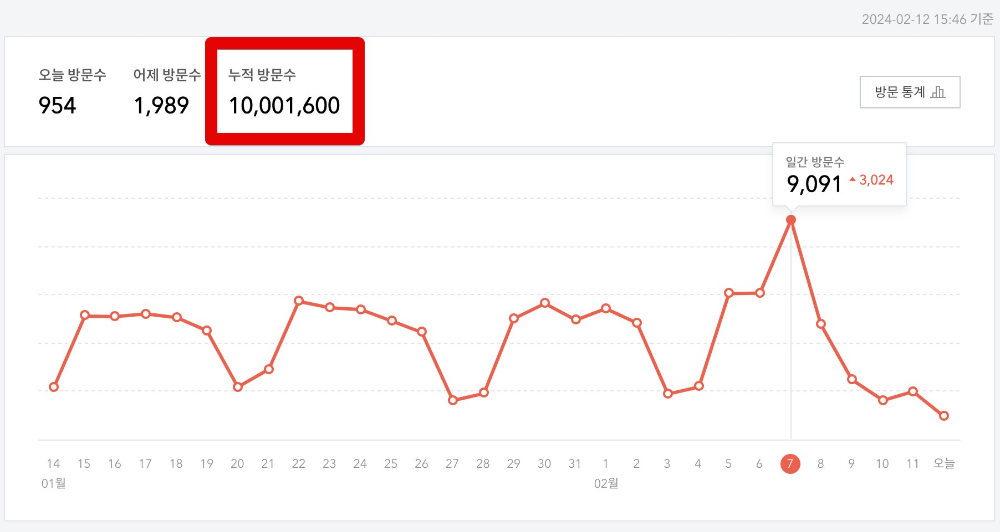

# 블로그 누적 1,000만 조회수 후기

2024.02.12에 블로그의 누적 조회수가 1,000만이 되었다.  

2021.05.21에 500만을 달성했었으니, 2년 9개월이 지나서야 1,000만이 되었다.  
  
예전에는 6개월에 100만씩 증가했다면, 요즘은 7개월에 100만씩 증가하고 있다.  
아무래도 기술 문제를 해결한 사례보다는 현재의 내 생각을 계속 정리하다보니 구글 검색을 통해 유입되는 비율이 낮아진 것 같다.  

2020년에는 내 블로그에 있는 대부분의 글이 이미지까지 포함해서 그대로 복사된 블로그를 제보로 알게 되었다.

[2015년 1월 31일](https://jojoldu.tistory.com/1) 에 첫 글을 작성했다.  
누가봐도 허접한 내용이다.

취업을 위해 블로그를 하는 것에 대해 여러 이야기들이 많다.  
분명한 건 나는 블로그를 시작해서 

다만, 나는 개발자가 아니였어도 블로그를 했을 것 같다.  
어느 직업이 되었든 간에 블로그를 통해 내가 공부한 것을 정리하고 내 생각을 정리하는 것이 나에겐 몇 안되는 스트레스 해소법이고 좋은 학습법이기 때문이다.