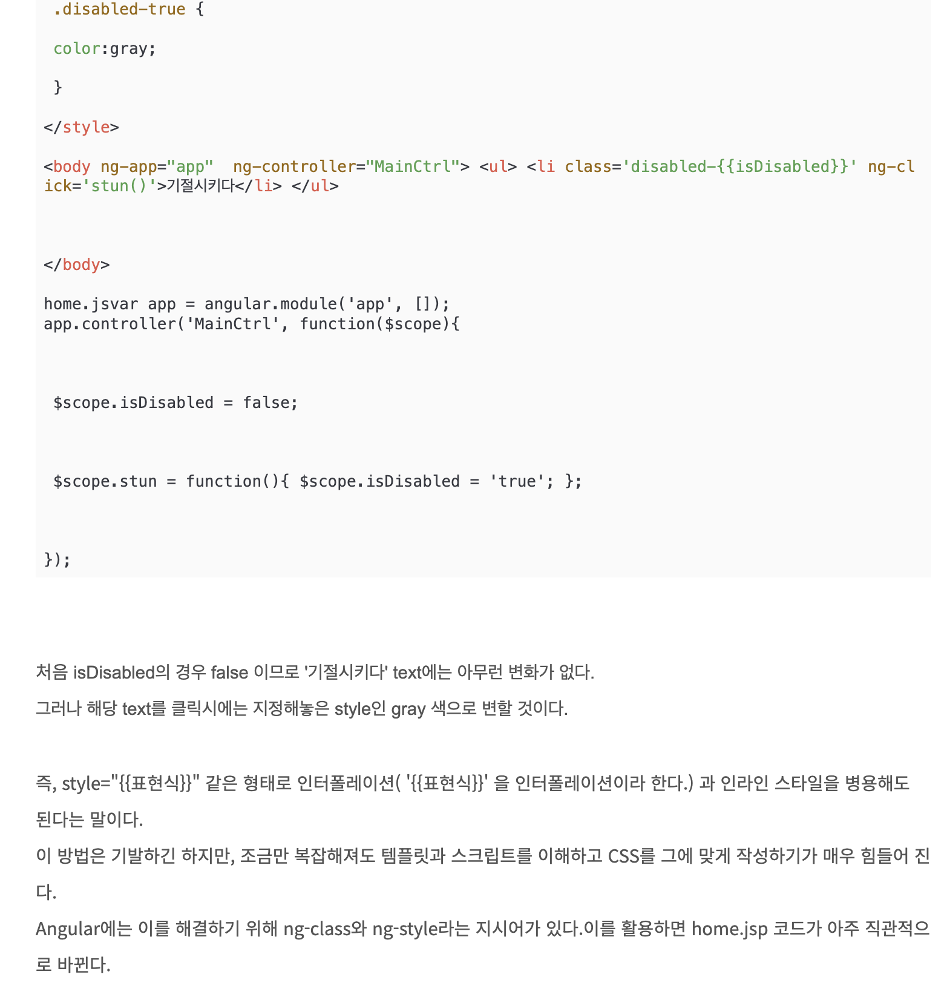
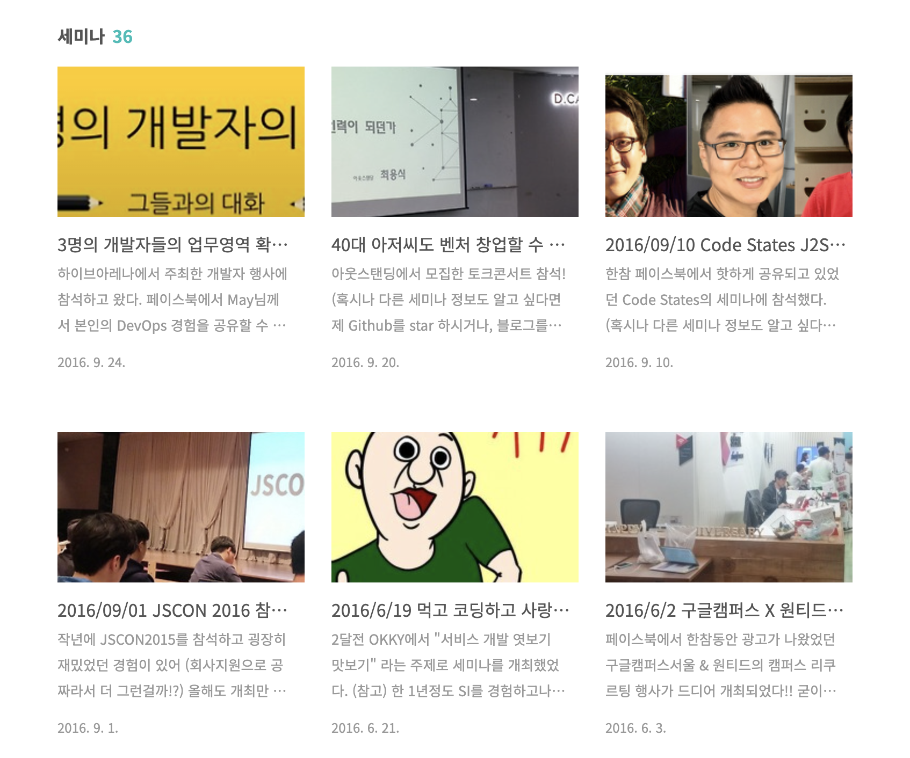
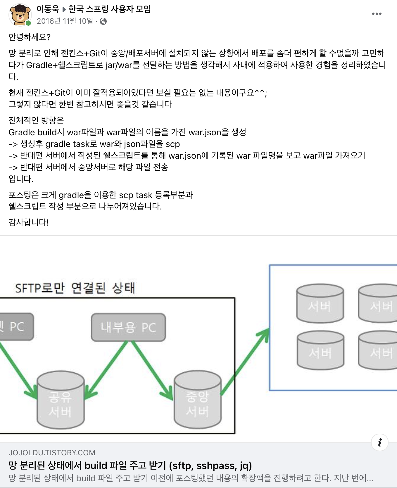
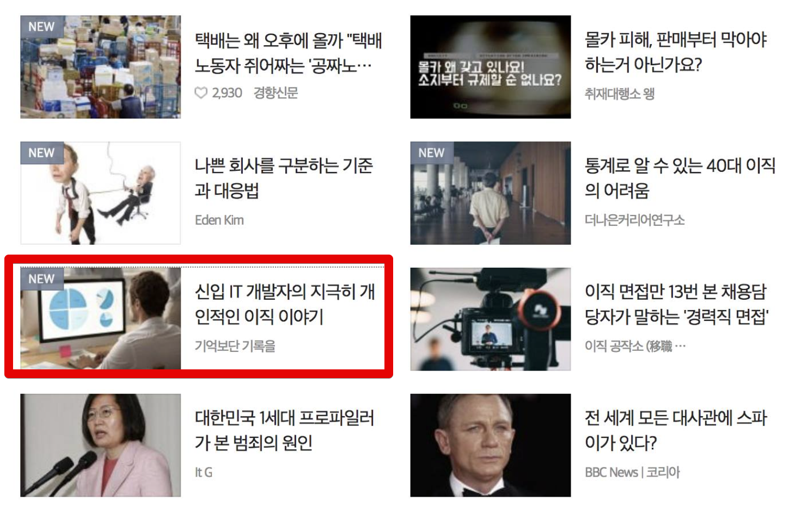
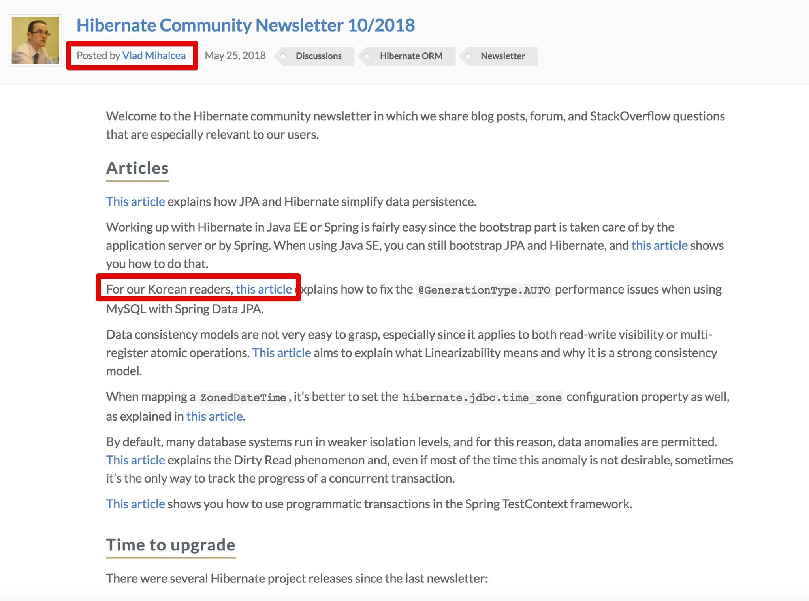
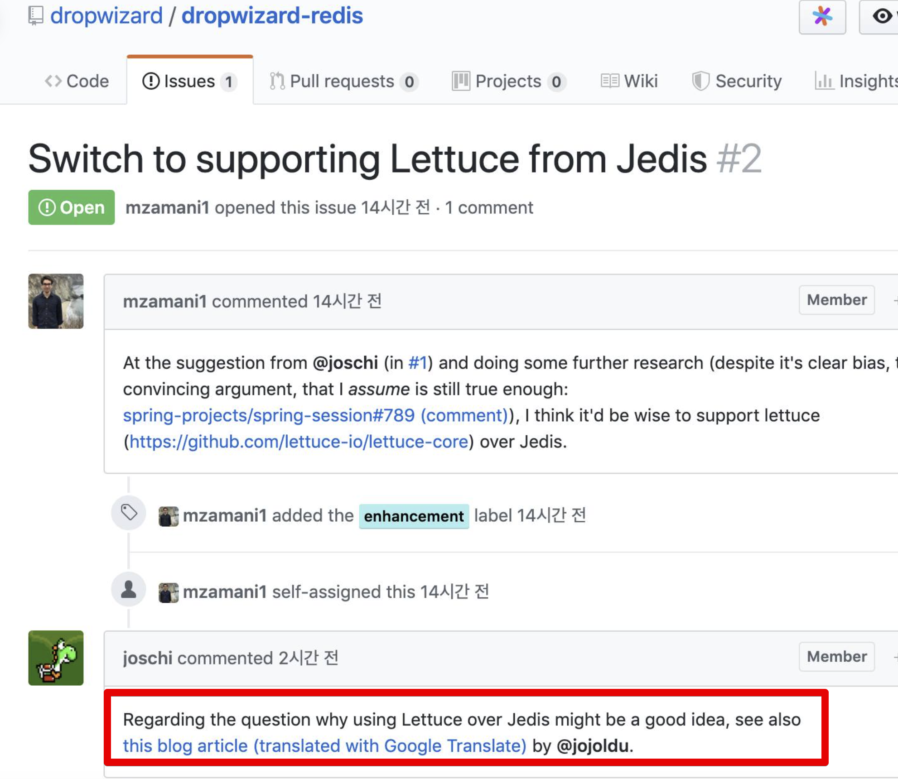

# 블로그 누적 1,000만 조회수 후기

2024.02.12에 블로그의 누적 조회수가 1,000만이 되었다.  

전체글은 585개가 되었다.

2015.1.31에 첫 글을 작성했으니, 약 **9년만에 1,000만**이 되었다.  
  
예전에는 6개월에 100만씩 증가했다면, 요즘은 7개월에 100만씩 증가하고 있다.  
아무래도 기술 문제를 해결한 사례보다는 현재의 내 생각을 계속 정리하다보니 구글 검색을 통해 유입되는 비율이 낮아진 것 같다.  
  
1,000만이 오면서까지 있었던 일들을 연도별로 정리해보았다.

## 2015년

[2015년 1월 31일](https://jojoldu.tistory.com/1)에 첫 글을 작성했다.  

누가봐도 성의없는 글이다.  

처음 시작은 [아웃사이더님](https://blog.outsider.ne.kr/),  [권남님](https://kwonnam.pe.kr/wiki/) 의 블로그/위키를 보고 나도 이렇게 되고 싶다는 마음에 시작했다.  
  
무슨 내용으로 채울까 고민하던 중에 회사에서 가장 지적을 많이 받고 있던 **JavaScript** 를 공부하면서 필요한 내용들을 작성했다.  
  
2~3월까지 글을 쓰다가 4~6월에는 글을 더 쓰지 않았다.  
글을 쓴다고 당장의 뭔가 큰 변화가 있는 것이 아니라서 동기부여도 딱히 안되고, 회사 일 하기 바빠서 잊혀졌다.  
  
회사의 기술을 빠르게 내 것으로 만들기 위해서 **강의식 스터디**를 진행했다.  
"내가 잘 모르지만 지금 꼭 익혀야할 기술들을 골라서 해당 주제를 가르쳐줄테니 들을 사람들은 와라" 의 강의식 스터디였다.  
  
AngularJS (MEAN Stack), Git/Github, Backbone.js & MVC, Bower/Grunt 등 회사에서 중요하게 사용중이던 기술들 하나하나를 타인을 가르치기위해 공부하기 시작했다.  
  
그러던 중 회사에 신입 개발자분들이 합류하면서 물어보는 질문들이 내가 스터디에서 가르치던 내용과 중복되는 부분들이 생기기 시작했다.  
강의를 위해 PPT를 매주마다 만들었는데, PPT로 되어있던 내용들은 문맥과 내용을 제대로 담고 있지 못해서 신입 팀원들에게 전달할 수 없었다.  
강의자료는 강의자료대로, 신입 팀원들에게 전달할 내용은 그것대로 2중으로 준비가 필요하기 시작했다.  
  
스터디원들 관리하는것 부터 시작해서, 스터디비용, PPT 만들기 등 여러가지로 품이 많이 들어서 강의형 스터디는 그만하고 신입 팀원들에게 전달할 내용으로 블로그에 글 쓰는 것을 새로운 학습 방법으로 선택했다.

## 2016년

아무도 보지 않는 블로그를 운영하는 것이 동기부여가 잘 안된다는 것을 느꼈다.  
  
사람들이 내 글을 보고 댓글을 남겨주고, SNS 공유도 되고 이럴때 블로그 글을 쓰는 큰 동기부여가 된다는 것을 알게 되었다.  
  
그래서 어떻게 사람들을 오게 만들까 생각하다가 **사람들이 좋아할만한 주제의 글도 같이 쓰자**로 정했다.  
그러면 그 글을 보고나서 내가 쓴 다른 글들도 보고 점점 관심을 가질테니깐.  
  
그래서 2016년부터는 [세미나 후기](https://jojoldu.tistory.com/category/%EC%84%B8%EB%AF%B8%EB%82%98?page=6)를 작성하기 시작했다.  
  

세미나 참석하지 않은 사람들도 대리만족할 수 있도록 상세하게 정리하기 시작했다.  

(이런 이야기가 나올정도로)  
  
기술 블로그를 운영하면서 세미나 후기만 가득한 블로그로 유명해서는 안된다고 생각했다.  
그리고 사수가 없던 현 직장 생활에서 온라인에서라도 사수를 구해야겠다는 생각에 페이스북에도 기술 글을 계속 공유하기 시작했다.

SNS에 블로그 글을 공유하면 틀린 내용에 대한 피드백도 자주 주기 때문에 내가 알고 있는 지식을 점검 받을 수 있는 좋은 기회였다.  
  
내가 공부한 내용과 세미나 후기를 계속 블로그에 정리하고, 이를 SNS에도 공유하면서 피드백을 받는 것을 2016년 내내 했다.  
  
갑자기 영한님의 DM을 받았다.

영한님과 처음으로 대화를 해봤고,  
기술 블로그를 계속 보시다가 배민 추천서를 작성해주셨다.  
  
코딩테스트, 1차면접, 2차면접을 마치고 배민으로 입사를 하게 되었다.

## 2017년

배민을 다니면서 자바 & 스프링 개발 주니어분들이 웹 애플리케이션 배포부터 인프라 설정까지의 과정을 모르는 분들이 많다는 것을 느꼈다.  
  
시니어가 많은 회사일수록 이런 작업들은 대부분 시니어가 하시고, 주니어들은 로컬 호스트에서 자바 & 스프링 코드만 작성하는게 대부분이라서 그렇다는 것을 알게 되었다.  
  
그래서 자바 & 스프링 코드 작성밖에 모르는 분들을 위해 한 편의 시리즈를 작성하기 시작했다.

- [스프링부트로 웹 서비스 출시하기](https://jojoldu.tistory.com/250)

위 시리즈가 **2017년부터 2018년까지 누적 조회 20만**이 넘어서 블로그 최고 히트작이 되었다.  
결국 [책으로까지 출판](https://jojoldu.tistory.com/463)되어 생각한 것 이상으로 많이 판매되었다.  

## 2018년

2018년 8월 누적 조회수 50만이 되었다.  
2015년 1월을 기준으로 **3년 7개월**이 걸린셈이다.  
  
[마소콘 2018](https://www.imaso.co.kr/masocon2018/) 에서 개발자와 블로그라는 주제로 발표를 했다.  

- [발표자료](https://speakerdeck.com/microsoftware/masokon2018-gaebaljawa-beulrogeu-idongug)

글 쓰는 개발자라는 주제로 짧게 발표하고 대담을 하는 시간을 가졌다.  
  
내가 블로그를 좀 더 편하게 다루기 위해 구축한 댓글, 스크립트, 자동화 등에 대한 이야기를 나눴다.  
  
다음 포털의 메인 Home - 직장인 탭에 내 글이 실렸다.

  
2번째 히트작 시리즈인 [3번째 직장에 오기까지](https://jojoldu.tistory.com/277) 를 포털 MD분들이 선택해주셨다는 것에 기뻤다.  
메인에 실리자마자 평균 하루 조회수가 2천이 안되는데, 1만을 넘겼다.  
  
자바 챔피언인 [Vlad Mihalcea 의 정기 뉴스레터](https://in.relation.to/2018/05/25/hibernate-community-newsletter-2018-10/)에 내 글이 언급되었다.

다른 어떤 곳에 내 글이 공유되어도 이보다 더 기쁘진 않았을것 같다.  
  
**하이버네이트, MySQL 등을 공부하다보면 매번 만나게 되는** 롤 모델인 Vlad Mihalcea 가 내 글을 좋게 봐줬다는 것이 너무 기뻐 주변의 많은 사람들에게 자랑했다.

## 2019년

2019년 3월 누적 조회수 100만,  
2019년 11월 누적 조회수 200만이 되었다.  
2015년 1월로부터 **4년 10개월**만이다.  
  
Dropwizard 에서 [Redis Client로 Jedis가 아닌 Lettuce를 써야한다는 Issue](https://github.com/dropwizard/dropwizard-redis/issues/2)가 올라왔고 이에 대한 근거 자료로 내 블로그가 언급되었다.  

  

해외에서 어떻게 이걸 검색하고 보셨는지 너무 신기했다.  

트위터, Github 등에서 조금씩 내 블로그가 언급되기 시작했다.

## 2020년

2020년 5월 누적 조회수 300만,  
2020년 11월 누적 조회수 400만이 되었다.  
2015년 1월로부터 **5년 10개월**만이다.  
  
내 블로그에 있는 대부분의 글이 이미지까지 포함해서 그대로 복사된 블로그를 제보로 알게 되었다.

## 2021년

2021년 5월 누적 조회수 500만,  
2021년 11월 누적 조회수 600만이 되었다.  
2015년 1월로부터 **6년 4개월**만이다.  
  

## 2022년

2022년 5월 누적 조회수 700만,  
2022년 12월 누적 조회수 800만이 되었다.  
2015년 1월로부터 **7년 11개월**만이다.  

## 2023년

2023년 7월 누적 조회수 900만이 되었다.  
2015년 1월로부터 **8년 6개월**만이다.  

100만을 달성하는데 걸리는 시간이 점점 더 느려지기 시작했다.  
평균 6개월 걸리던 것이 이젠 7개월정도 걸린다.

## 마무리

자바 챔피언이자 JVM 에서 항상 인사이트 있는 자료와 강의를 만들어주시는 [vlad_mihalcea의 트윗](https://twitter.com/vlad_mihalcea/status/1325372190678802432) 에서도 같은 내용이 언급된다.

매년 블로그를 시작하는 분들이 많다.  
하지만 그걸 3년, 5년 유지하는 분들은 정말 극소수이다.  

취업을 위해 블로그를 하는 것에 대해 여러 이야기들이 많다.  
분명한 건 나는 블로그를 시작해서 

다만, 나는 개발자가 아니였어도 블로그를 했을 것 같다.  
어느 직업이 되었든 간에 블로그를 통해 내가 공부한 것을 정리하고 내 생각을 정리하는 것이 나에겐 몇 안되는 스트레스 해소법이고 좋은 학습법이기 때문이다.