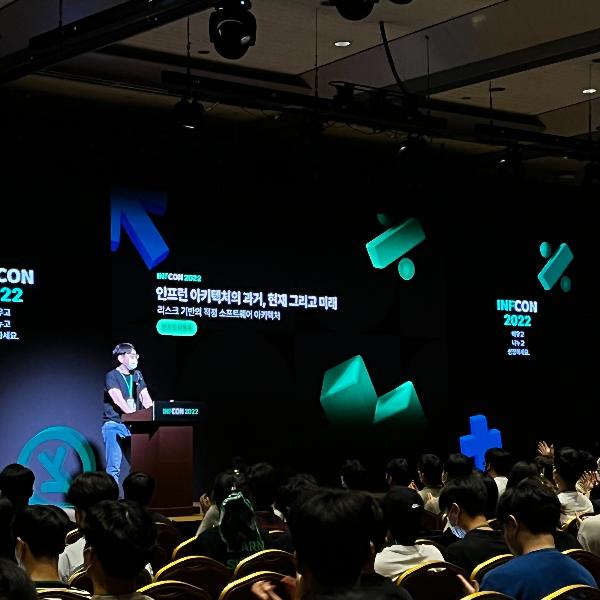
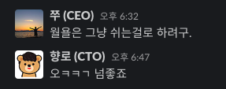

# 인프콘 2022 회고

우리 회사에서 첫 오프라인 대형 컨퍼런스인 [인프콘 2022](https://infcon.day/)을 개최했다.  
  
입사 초기에 [대표님인 쭈](https://www.hyungjoo.me/category/startup/inflearn/)와 컨퍼런스에 대한 이야기를 잠깐 나누곤 했다.  
당시 직원수가 20명+ 일때라 "아 나중에 그런거하면 너무 좋겠네요!" 하고 넘어갔다.  
시리즈 C, D쯤 되고 직원수도 100명은 넘어야 그래도 할 수 있지 않을까 생각했다.  
워낙 **회사의 타이틀을 걸고 하는 컨퍼런스는 그 규모가 컸기 때문**이다.

* [네이버의 Deview](https://deview.kr/2021)
* [카카오의 ifkakao](https://if.kakao.com/)
* [배민의 우아콘](https://woowacon.com/)
* [토스의 Slash](https://toss.im/slash-21)

그래서 "에이 이제 20명 조금 넘었는데 지금은 안되지. 몇년은 지나야 가능하겠다" 생각만 하고 넘어갔다.  
  
근데 [파이콘](https://2022.pycon.kr/about/previous-pyconkr) 등 여러 컨퍼런스의 운영진으로 일을 하고, 빅테크의 DR로도 활동을 했던 [엘리스](https://www.youtube.com/channel/UCjQkARPk6IB9CCaxFqSg1Zg)의 합류로 컨퍼런스 진행에 급 물쌀을 타게 된다.  
  
엄청난 열정과 경험을 가진 앨리스로 인해서 **4월에 8월 컨퍼런스를 결정**했다.  

일정을 아무리 잘 봐줘도 꽉찬 5개월, 일반적인 계산법으로는 4개월만 남은 상황에서 진행을 결정하게 된 것이다.  
  
[우아콘 1회](https://www.youtube.com/watch?v=zMAX7g6rO_Y) 를 3개월안에 준비할때 DR (Developer Relations) 분이 얼마나 바쁘게 보냈는지 봤었기 때문에 

* 4.5개월이란 기간 동안
* 외부의 연사자를 지원 받아서 그 중에서만 20~30명을 선정하고,
* 오프라인으로
* 1000명+를 참석시키는

컨퍼런스를 준비한다는게 입사한지 얼마 안된 앨리스에게는 너무 큰 부담으로 가지 않을까 싶었다.

> 실제로 준비 기간 동안 앨리스는 체력적으로 부담을 많이 느끼는듯했고, 휴가를 쓰기도 했다.

그래도 앨리스는 긍정적으로 해보겠다는 의지로 실행에 옮겼다.

정말 **스타트업이니깐 할 수 있는 결정과 실행력**이 무엇인지 다시 한번 체감하게 되었다.  
  
여튼 앨리스의 긍정적인 결정으로 인프런의 첫 컨퍼런스인 인프콘 2022 프로젝트 (가칭 **갈릴레오**) 가 시작되었다.

## 1. 브랜딩 영상 촬영

인프콘을 준비하면서 **인프콘의 홍보 영상** (+인프런/랠릿 브랜딩 포함) 을 촬영하게 되었다.

<iframe width="560" height="315" src="https://www.youtube.com/embed/1aaDom_K9II" title="YouTube video player" frameborder="0" allow="accelerometer; autoplay; clipboard-write; encrypted-media; gyroscope; picture-in-picture" allowfullscreen></iframe>

이 브랜딩 영상 촬영을 위해 별도로 준비한건 없었다.  
당일에 질문지 받고나서 평소 생각했던 내용들 그냥 그대로 전달만 하면 됐기에 큰 부담은 없었다.

이런 촬영 자체를 과거에도 몇번했어서, 긴장되거나 하는 것 없이 원테이크로 촬영을 마무리했다.  
  
생각보다 감독님이 너무 잘해주셨다.  
촬영을 위한 인터뷰 진행도 너무 잘 이끌어주셨고,  
편집본도 너무 잘 완성되었다.  
  
> 명절때 가족들에게 보여주니 왤케 영상에서 잘 나왔냐고 했다.  

브랜딩 영상 촬영이 큰 이벤트는 아니였지만,  
그 전까지 인프콘에 대해서 실감이 안나다가 이 촬영을 기점으로 "아 진짜 인프콘 하는구나" 라고 본격적으로 체감되었다.  

## 2. 발표 준비

이번 인프콘에서 총 3개를 발표하게 되었다.  

* [키노트 - 제품 로드맵](https://www.inflearn.com/course/infcon2022/unit/126497)
* [발표 세션 - 인프랩의 CTO로서 기술 세션](https://www.inflearn.com/course/infcon2022/unit/126515?tab=curriculum)
* [이벤트 - 개발바닥 향로로서 오프라인 토크 콘서트](https://www.inflearn.com/course/infcon2022/unit/126528?tab=curriculum)

이 때문에 7 ~ 8월, 2달간 역대급으로 기술 블로그 작성을 못했다.  

> 나중에 2022 회고때 올리겠지만, 8월엔 [MARU 스타트업 멘토진](https://maru.org/office/connect) 에도 합류하게 되어서 더더욱 시간이 부족했다.

CTO로서 해야할 일을 하면서 3개 세션의 발표 준비를 한다는게 상상한것 보다 더 많은 시간이 들었다.  
### 2-1. 발표 세션 준비

인프런 CTO로서 기술 발표 하나는 해야하지 않나? 라는 제안을 받았다.  
당연히 해야한다고 생각했어서 여러 주제들을 고려했었다.

* Node.js 세상에 떨어진 Java 개발자의 이야기
* Node.js에서 좋은 테스트 코드를 작성하는 방법 
  * 혹은 인프런 백엔드 팀이 테스트 코드를 작성하는 방법
* 테크 리드로 성장하는 중입니다.

등등의 주제들을 고민 했었다.  
  
이 중에서 컨퍼런스의 밸런스를 위해 **연사자분들의 주제들을 보고 결정**하기로 했다.  
  
* 비기술적인 발표가 많으면 기술 주제로
* 기술적인 발표가 많으면 비기술 주제로

연사자분들 모집이 끝나고 정리를 해보니, 발표 주제가 비기술적인 것으로 비율이 더 높아서 기술 주제를 하기로 했다.  
  
그 중에서 "Node.js 세상에 떨어진 Java 개발자의 이야기" 주제를 할 확률이 높았다.  
그래서 "**이직했더니 레벨 1 Node 개발자가 된 건에 대하여**" 같은 라노벨 제목이 될뻔 했다.  
  
다만, 이 주제는 **너무 백엔드에 한정된 주제**이기도 했고, 첫 인프콘의 발표라면, 더군다나 CTO로서 발표하는 것이라면 **특정 영역에 해당 하는 주제로만 하는 것은 너무 협소**할 것 같았다.  
  
여태껏 인프런이 어떻게 아키텍처적으로 발전해왔는지를 소개하는 것이 첫 컨퍼런스의 취지에 맞고, 좀 더 넓게 인프런을 소개할 수 있다고 생각했다.  
그래서 **인프런 아키텍처의 과거/현재/미래**라는 주제를 선택했다.  

  

최근에 읽고 있던 책도 마침 [적정 소프트웨어 아키텍처](http://www.kyobobook.co.kr/product/detailViewKor.laf?mallGb=KOR&ejkGb=KOR&barcode=9791162245538) 여서 발표의 컨셉을 잡기에도 편하다고 생각했다.  
  
인프런 서비스의 아키텍처를 시즌 1 ~ 4로 분류해서 어떤 리스크 기반 하에 아키텍처를 선택하고 발전해왔는지를 나열하는 발표였다.  
  
시즌 1은 내가 없었던 시절이고,  
시즌 2가 오픈 된 이후에 나는 합류를 했는데,  
이야기는 시즌1부터를 다 포함시켰다.  
  
일부 개발자분들은 **최선의 기술적 선택을 하지 않은 것에 대해 불만을 표하지만, 적정의 기술적 선택을 하는 것**이 스타트업에서는 더 중요하다는 것을 전달하고 싶었다.

> 물론 이 적정의 기준은 **개발팀의 실력에 따라 다를 것이다**.  
> 적정의 기준을 높이기 위해서라도 개발팀의 역량이 계속 올라가야 하는 것은 당연히 필요하다.

보통 기술 주제로 발표를 준비하면 **30초당 장표 1장**을 기준으로 삼는다.  
이번에는 40분 발표이기 때문에 **약 80장의 장표**를 생각하고 준비를 했다.  
  

워낙 방대한 범위를 다루다보니 기술의 깊이를 보여줄수가 없다.  
그래서 "주제에 매력을 좀 느낄까?" 하는 고민도 있었다.  
  
다행히 홀 전체를 가득 채운 분들 덕분에 "이런 주제도 사람들이 좋아할 수 있구나" 를 알 수 있었다.

(정말 많은 분들이 와주셔서 감사했다.)  
  
개발자로서는 아쉬울 수 있지만, CTO로서는 한번은 했어야할 주제였다고 생각해서 잘 선정했다고 생각한다.  
  
지난 9년동안 내가 빛나는 발표를 많이했다.  
그러다보니 엔지니어로서 깊이 있는 기술 주제를 발표하고 싶다.  
다만, 이제는 기술 발표는 나 보다는 팀원들이 할 수 있도록 지지하고 지원해야 한다.  
내가 아닌 우리 팀원이 빛나는 발표를 할 수 있도록 지지와 지원할 수 있는 방법을 고민하고 있다.  
  
올해는 DevOps 1분과 FE 2분이 발표를 했다.  
내년에는 BE 1분도 추가로 꼭 발표를 할 수 있도록 지지해야겠다. 
### 2-2. 개발바닥 토크 콘서트 준비

인프콘은 단순히 기술 컨퍼런스가 아니다.  
**개발자들의 축제**가 모토이다.  
  
그래서 어떻게 하면 축제처럼 느껴질까 고민을 하다가 나온 아이디어가 "**개발바닥 공개 방송**을 컨퍼런스에서 해보는건 어떨까" 였다.  
  
너무 좋은 주제라고 생각되었다.  
특히 개발바닥 유튜브를 시작할때 생각한 모토도 (지금은 사라진) [나는 프로그래머다](https://www.youtube.com/watch?v=mAjNI8n0eJM) 였기 때문에 컨셉이 딱 맞겠다 싶었다.  
    
그래서 **인프콘x개발바닥** 으로 공개방송을 결정했다.  
  
매끄러운 공개방송을 위해 사전 질문을 지원 받았다.

감사하게도 총 200개가 넘는 사전 질문이 들어왔다.  
처음엔 이 중 7개 질문을 40분동안 나눠야겠다는 계획을 잡았지만, 리허설을 해보니 택도 없었다.  
  
일단 나와 호돌맨이 **1개 주제로 2시간을 떠드는 사람들**인지라, 7개의 질문은 커녕 2개도 소화할까말까였다.  
  
그래서 2개를 진행하고, 혹시나 시간이 남으면 진행할 짧은 질문들을 선정했다.  

  
(사이좋게 앉은 나와 호돌맨)  
  
다른 세션의 발표가 있음에도 정말 많은 분들이 앉아서 발표를 들어주셨다.

사진에 나오지 않은 우측, 좌측에 앉은 분들까지 포함하면 정말 많은 분들이 이 공개 방송을 들어주셨다.  
  
진행하다보니 우리도 아쉬워서 약속된 40분에서 5분을 초과해서 공개방송을 마무리 했다.  
더 진행해도 되겠지만, 아무래도 **다음 세션을 위해서** 쉬는 시간을 초과하지는 않았다.  
  
공개방송을 하고나니 개발바닥 오프라인 토크 콘서트에 대한 욕심이 더 커졌다.  
  
끝나고 나서 호돌맨과도 이야기 나눴지만,  
빨리 여건을 마련해서 오프라인 행사를 진행해야겠다.
### 2-3. 위기

8월 중순 (인프콘 준비 막바지) 에 **코로나에 감염**되었다.  
막바지에 걸리다보니 리허설등 바쁘게 진행되어야할 시기를 그냥 보내게 되었다.  
생각보다 코로나로 고생을 한터라 그 주에는 정말 다른걸 할 수가 없었다.

그래서 결국 **마지막 1주동안 리허설을 몰아서** 했다.  
  
어떤 발표를 준비할 때 리허설을 많이 하는 편은 아니다.  
한번 하고 나서, 이후에는 혼자서 샤워할때나 이동할때 흥얼흥얼 하면서 발표 연습을 하는 편이다.  
장표 1장에 언급해야될 내용만 기억하고, **워딩, 문장을 외워서 한 적이 없다**.  
현장의 분위기를 보고 워딩이나 문장, 시작멘트 등을 변경해서 사용하는 편이다.  
그러다보니 각 잡고 리허설을 한적이 거의 없다.  
  
그래서 동일한 내용을 계속 반복하는 리허설을 많이 하는 것에는 어색함과 불편함을 많이 느낀다.  
  
하지만 이번 컨퍼런스 키노트 발표처럼 **회사를 대표해서 하는 발표에서는 실수 없이 하기 위해** 리허설을 많이 할 수 밖에 없다.  
특히 리허설과 피드백을 많이 진행하다보면 내가 **주로 쓰던 단어 보다는 보편적인 단어를 좀 많이 쓰게 되는데**, 그것도 불편함을 추가하는 요소였다.  

> 잘 안쓰는 워딩 때문에 **키노트 발표만 유일하게 PPT 장표에 스크립트를 추가**했다.  
> 다른 2개 세션은 PPT 메모에 발표 시간만 있다.

그래서 키노트 리허설을 반복하다가 결국 리허설 준비를 도와준 팀원분들께 볼멘소리를 하기도 했다.  
  
그래도 이 컨퍼런스를 준비하는 TF 멤버 (일명 갈릴레오 TF) 들의 노력과 이 컨퍼런스의 중요성을 알기에 전날 저녁까지 리허설을 진행했다.

> 마지막 리허설 시작전에 사과와 함께 어떤 의미로 이야기한 것인지를 말씀드렸다.
  
아무래도 키노트 리허설을 월요일에서 목요일까지 (컨퍼런스가 금요일) 매일 하다보니깐 다른 발표 준비를 제대로 못해서 우려되는 부분도 있었다.  
  
다행히 원래 기술 발표 준비를 각 잡고 하는 것보다는 남는 시간 (샤워시간, 이동시간, 식사시간)에 흥얼 거리면서 하다보니 다른 발표를 부담없이 준비 할 수 있었다.

## 3. 후기

컨퍼런스를 준비할때는 **코로나가 더 심해지면 어떡하나** 가 가장 큰 고민이였다.  
하늘이 도왔는지, 코로나가 더 심해지진 않고, 무사히 컨퍼런스를 시작할 수 있었다.  
  
컨퍼런스 당일엔 회사의 전체 인원이 스태프로 일을 했다.  
그리고 큰 이슈 없이 컨퍼런스를 마무리할 수 있었고,  
이정도 규모의 큰 컨퍼런스를 우리 정도의 회사가 이렇게 잘 마무리 된 것에 너무 기분이 좋아진 쭈는 **월요일 전사 휴무**를 결정했다.

컨퍼런스가 마무리 되고, 갈릴레오 (인프콘 핵심 TF멤버들) 들과 회고를 하면서 이런 얘기를 한적이 있다.  
  
"우리정도 사이즈의 스타트업에서 4~5개월동안, 10명이 넘는 인원이, 몇억원의 돈을 사용하는 프로젝트는 정말 대형 프로젝트다.  
근데 이 큰 프로젝트를 이만큼 C레벨의 결정을 최소화하면서 자율적으로 진행하면서 이렇게 큰 성과를 낸 프로젝트는 처음인것 같다.  
이건 오로지 TF 멤버들의 역량으로 해낸 성취라고 생각되고, 정말 대단한 성과라고 생각한다.  
자부심을 가져도 될 것 같다."  
  
정말 많은 분들이 참여해주셨다.  
추첨으로 1천분을 뽑았는데, **지원하신분만 1만분이 넘었다**.  
즉, 우리같이 작은 스타트업이 진행하는 테크 컨퍼런스의 지원 **경쟁율이 10:1** 이였던 것이다.  
  
(나중에 공개하겠지만) 이 분들 중 대부분이 실제로 와주셨다.  
무료 컨퍼런스의 참석율이 50% 이하가 대부분인걸 고려하면 정말로 감사한 일이다.  
  
> 인프런과 인프콘을 얼마나 많은 분들이 좋아해주셨는지를 알 수 있었다.  
> 다시 한번 와주신 분들께 감사하다는 이야기를 드리고 싶다.
  
인프콘을 준비하면서 생각했던 것들이 SNS 상에서 공유되는 것을 보고, 컨퍼런스가 성공했다고 믿을 수 있었다.

특히 **특정 기술, 특정 회사에 한해서 컨퍼런스가 진행되는 것이 아니라** 여러 생태계의 개발자들을 모아서 이야기하는 컨퍼런스로 브랜딩 되어서 너무 좋았다.  

인프랩이라는 회사는 인프런(학습), 랠릿(채용) 외에도 개발자 생태계를 위해서 많은 서비스들을 출시하고 개선할 계획이다.  
  
특히 국내의 개발자들이 커리어를 쌓아가다보면 사용할 수 밖에 없는, 가장 사랑 받는 서비스가 될 예정이다.  
  
이를 위해 매년 많은 분들께 선물을 드리고 싶다.  
다만, 이건 인프랩 팀 혼자서는 불가능하다.  
  
"혼자 가면 빨리가지만, 함께 가면 멀리 갈 수 있다." 는 말이 있듯이 인프랩팀도 많은 분들과 함께 멀리 가고 싶다.

