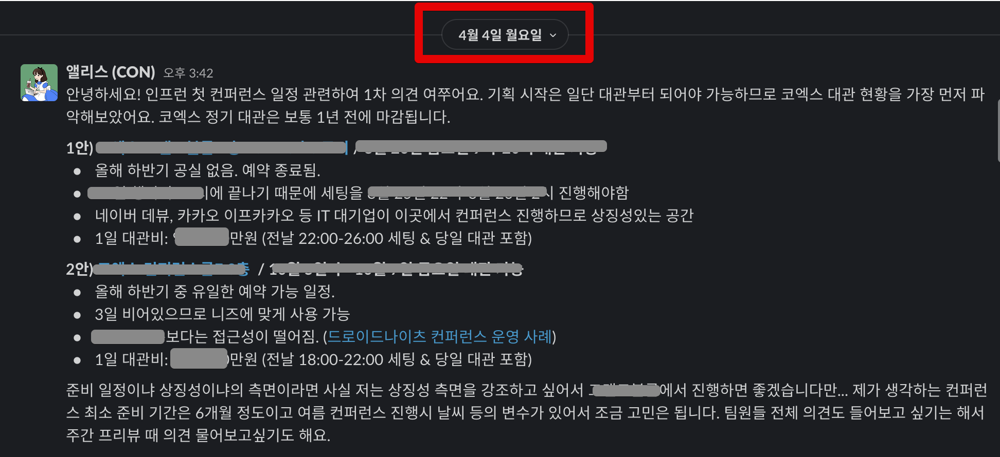
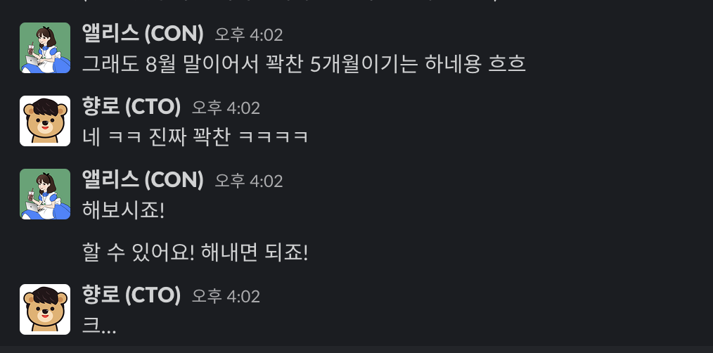

# 인프콘 2022 회고

우리 회사에서 첫 오프라인 대형 컨퍼런스인 [인프콘 2022](https://infcon.day/)을 개최했다.  
  
입사 초기에 [대표님인 쭈](https://www.hyungjoo.me/category/startup/inflearn/)와 컨퍼런스에 대한 이야기를 잠깐 나누곤 했다.  
당시 직원수가 20명+ 일때라 "아 나중에 그런거하면 너무 좋겠네요!" 하고 넘어갔다.  
시리즈 C, D쯤 되고 직원수도 100명은 넘어야 그래도 할 수 있지 않을까 생각했다.  
워낙 **회사의 타이틀을 걸고 하는 컨퍼런스는 그 규모가 컸기 때문**이다.

* [네이버의 Deview](https://deview.kr/2021)
* [카카오의 ifkakao](https://if.kakao.com/)
* [배민의 우아콘](https://woowacon.com/)
* [토스의 Slash](https://toss.im/slash-21)

그래서 "에이 이제 20명 조금 넘었는데 지금은 안되지. 몇년은 지나야 가능하겠다" 생각만 하고 넘어갔다.  
  
근데 파이콘 등 여러 컨퍼런스의 운영진으로 일을 하고, 빅테크의 DR로도 활동을 했던 [엘리스](https://www.youtube.com/channel/UCjQkARPk6IB9CCaxFqSg1Zg)의 합류로 컨퍼런스 진행에 급 물쌀을 타게 된다.  
  
엄청난 열정과 경험을 가진 앨리스로 인해서 **4월에 8월 컨퍼런스를 결정**했다.  

아무리 일정을 잘 봐줘도 꽉찬 5개월, 일반적인 계산법으로는 4개월만 남은 상황에서 진행을 결정하게 된 것이다.  
  
[우아콘 1회](https://www.youtube.com/watch?v=zMAX7g6rO_Y) 를 3개월안에 준비할때 DR분이 얼마나 바쁘게 보냈는지 봤었기 때문에 

* 4.5개월이란 기간 동안
* 외부의 연사자 수십명을 뽑아서
* 오프라인으로
* 1000명+를 참석시키는

컨퍼런스를 준비한다는게 입사한지 얼마 안된 앨리스에게는 너무 큰 부담으로 가지 않을까 싶었다.

> 실제로 준비 기간 동안 앨리스는 체력적으로 부담을 많이 느끼는듯했고, 휴가를 쓰기도 했다.

그래도 앨리스는 긍정적으로 해보겠다는 의지로 실행에 옮겼다.

정말 **스타트업이니깐 할 수 있는 결정과 실행력**이 무엇인지 다시 한번 체감하게 되었다.  
  
여튼 앨리스의 긍정적인 결정으로 인프런의 첫 컨퍼런스인 인프콘 2022 프로젝트 (가칭 **갈릴레오**) 가 시작되었다.

## 브랜딩

<iframe width="560" height="315" src="https://www.youtube.com/embed/1aaDom_K9II" title="YouTube video player" frameborder="0" allow="accelerometer; autoplay; clipboard-write; encrypted-media; gyroscope; picture-in-picture" allowfullscreen></iframe>

## 발표 준비

이번 인프콘에서 총 3개를 발표하게 되었다.  

* 키노트 - 제품 로드맵
* 세션 - 인프랩의 CTO로서 기술 세션
* 이벤트 - 개발바닥 향로로서 오프라인 토크 콘서트

7 ~ 8월이라는 2달간 역대급으로 기술 블로그 작성을 못했던 시즌이였다.  

> 나중에 2022 회고때 올리겠지만, 8월엔 [MARU 스타트업 멘토진](https://maru.org/office/connect) 에도 합류하게 되어서 더더욱 시간이 부족했다.

### 위기

인프콘 발표 막바지에 코로나에 감염되었다.  
리허설등 바쁘게 진행되어야할 시기에 일주일을 그냥 보내게 되었다.  
생각보다 코로나로 고생을 한터라 그 주에는 정말 다른걸 할 수가 없었다.

> 그래도 어떻게든 커밋은 올렸는데, 정말 무슨 정신으로 했는지 모르겠다.

## 키노트 준비
## 세션 발표

여러 주제를 고민했었다.  

* Node.js 세상에 떨어진 Java 개발자의 이야기
* Node.js에서 좋은 테스트 코드를 작성하는 방법 (혹은 인프런 백엔드 팀이 테스트 코드를 작성하는 방법)
* 테크리드로 성장하는 중입니다.

등등의 주제들을 고민 했었다.  
마지막까지 백엔드 주제를 할 확률이 높았다.  
  
그래서 "이직했더니 1레벨 Node 개발자가된 건에 대하여" 같은 라노벨 제목이 될뻔 했다.  
  
다만, 이 주제는 **너무 백엔드에 한정된 주제**이기도 했고, 첫 인프콘의 발표라면, 더군다나 CTO로서 발표하는 것이라면 **특정 영역에 해당 하는 주제로만 하는 것은 너무 협소**할 것 같았다.  
  
여태껏 인프런이 어떻게 아키텍처적으로 발전해왔는지를 소개하는 것이 컨퍼런스 순서상 맞고, 좀 더 넓게 인프런을 소개할 수 있다고 생각했다.  
그래서 **인프런 아키텍처의 과거/현재/미래**라는 주제를 선택했다.  

## 개발바닥 토크 콘서트

하필 발표 2주 전에 코로나 걸려서 리허설 해야할때를 놓치고 마지막 1주동안 리허설을 몰아서 준비를 했다.  
  
어떤 발표를 할 때 리허설을 많이 하는 편은 아니다.  
한번정도? 하고 나서, 발표장 분위기나 발표 듣는 분들 분위기 보고 그때그때 하는 이야기를 좀 변경도 하고 그러는 편이다.  
그래서 여러 리허설이 반복 되니깐 개인적으로 힘든 부분이 있었다.  

## 후기

컨퍼런스가 마무리 되고, 갈릴레오 (인프콘 핵심 TF멤버들) 들과 회고를 하면서 이런 얘기를 한적이 있다.  
  
"우리정도 사이즈의 스타트업에서 4~5개월동안, 10명이 넘는 인원이, 몇억원의 돈을 사용하는데 이만큼 C레벨의 결정을 최소화하면서 자율적으로 이만큼의 성과를 낸 프로젝트는 처음인것 같다.  
이건 오로지 TF 멤버들의 역량으로 해낸 성취라고 생각되고, 정말 대단한 성과라고 생각한다.  
자부심을 가져도 될 것 같다"  
  
컨퍼런스가 끝나고 

