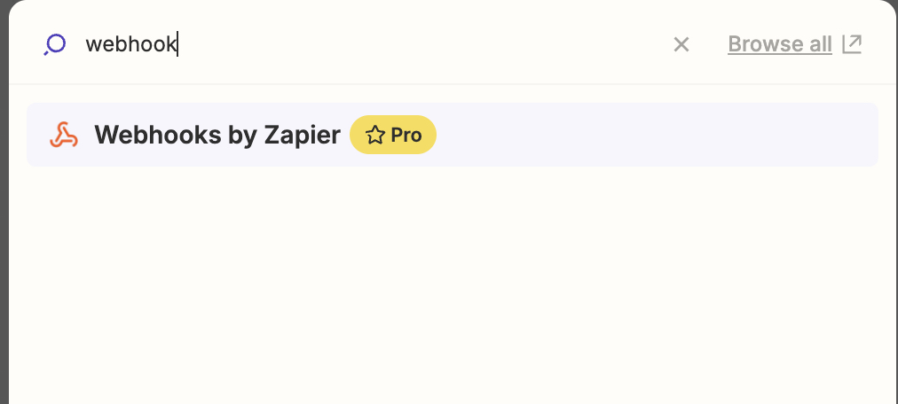

# 오프라이트 & TickTick 연동하기 (feat. Zapier)

Zapier는 Webhook이 프리미엄 구독시에만 사용할 수 있다.

다행히 오프라이트는 벌써 Zapier App으로 사용이 가능하다.  
(Beta 버전이라 이후 어떻게 요금제가 적용될지는 모르겠다.)  
  
## TickTick

TickTick 은 여태 사용해본 Todo App 중 사용성이 가장 좋았다.  
특히 **대부분의 기기에서 준수한 사용성을 가진 네이티브 앱**을 지원한다.  
나처럼 안드로이드, 맥 OS, IOS (아이패드), 윈도우를 모두 다 사용하는 사람에게는 TickTick은 아주 좋은 Todo App이다.  
  
특히, 안드로이드와 같은 모바일 기기에서 사용하기 좋은 준수한 에디터를 지원하기 때문에 이동 중에 빠르게 할일을 작성해야할때 TickTick의 Task 에디터는 아주 편하고 활용도가 높았다.  
  
아직까지 오프라이트에서는 제대로 된 모바일 앱을 출시하지 않은 상태이고, 특히나 모바일과 같은 환경에서는 네이티브 앱으로 에디터를 구현하지 않으면 사용성이 불편함이 있을 수 밖에 없다.  
  
그래서 PC에서는 오프라이트 앱을 직접 사용하더라도, 모바일에서는 TickTick을 사용하고, 이를 오프라이트에 동기화 하는 방향으로 가져가기로 했다.  

> Q. TickTick을 메인 업무 도구로 쓰면 안되나?  
> A. TickTick이 아직 통합 기능이 부족하다.  
> 현재까지 (2024.08.06) 구글 캘린더 통합만 지원한다. 
> 반면 오프라이트의 경우 슬랙, 지메일, 구글 캘린더, Zapier 등 여러 플랫폼을 지원하고 있어 파편화 된 업무 정보를 한 곳에서 볼 수 있다.

