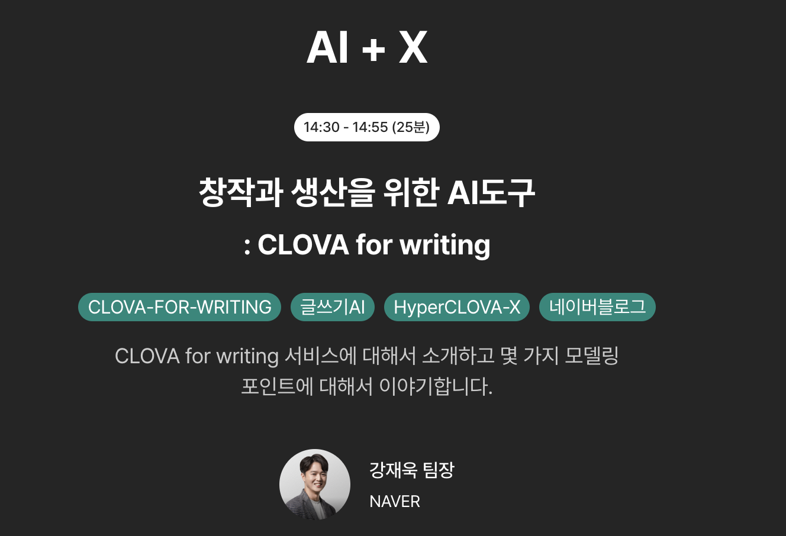

# 모두콘 2023

## 창작과 생산을 위한 AI도구: CLOVA for writing

블로그 글쓰기를 위한 AI를 만든 이야기

- 글을 쓸때 보통 어떤 고민을 하나?
  - 페르소나 분석, 글감 추천, 초안 제시 등
  - 이어쓰기, 바꿔쓰기, 요약하기 등 이 표현을 간결하게 바꾸기
  - 제목, 태그, 인사말, 맺음말쓰기 등 매번 귀찮은 일
- 이 귀찮은 일을 해결해주는 Clova For Writing
- 많은 분들의 글쓰기 워크 플로우
  - 글감 수집
  - 초안 작성
  - 초안 편집
  - 해시태그/제목 등으로 마무리

시연
- AI를 통한 본문 자동 작성
- 본문 요약
- 본문 내용 기반의 태그 자동 생성
- 적절한 제목 자동 생성

클로바 for Writing
- 전체글 생성
  - 페르소나
  - 글감
  - 초안 생성
- 부분 편집
  - 이어쓰기
  - 요약하기
  - 바꿔쓰기
- 전체 편집
  - 제목 생성
  - 태그 만들기
  - 전체 요약
  - 인사말/맺음말 쓰기

> 3월에 추가 베타 모집할 예정

### LLM 평가에 관한 이야기

LLM의 가장 어려운 점은 답변에 대한 평가이다.  
어느 답변이 더 좋은 것인가?  
  
서로 다른 모델의 결과물들 중에 어느 것이 더 좋은 것인가?
- 그 답변을 보는 사람 마다 기호/선호가 다름
- 기존까지는 항상 정답이 있는 것을 풀어내는 것들

전통적인 메트릭으로 측정 가능한 것
- 키워드 반영
  - 키워드와 초안 내 어휘가 얼마나 겹치는가
- 한계가 있음
- 

보다 입체적인 글쓰기 품질 시스템이 필요함
- 기술은 측정 가능해야만 개선 가능하다.
- 측정 시스템에 가장 힘을 쓰게 됨
- Aspect 7개, sub aspect13 를 사용함
  - 구체성
  - 페르소나 반영
  - 등등 

LLM 평가 바이어스
- 포지션 마이어스
  - 뒤에 나오는 답이 좀 더 좋다고 평가하는 것이 있음
  - 이를 해결하기 위해 순서를 거꾸로 조정해서 한번더 평가함
- Verbosity bias
  - 길게 쓰면 더 좋은 답변이라고 평가함
- Self-enhancement bias
  - 해당 모델이 직접 쓴 것을 서로 잘한다고 주장

## 금융 AI 인공지능을 이용한 험난한 투자 도전기

파이낸스 회사에서는 AI를 어떻게 바라보고 있느냐의 발표

## 도큐먼트 AI와 프로세스 혁신 (Document AI for RAG)

일반 모델은 전문적 지식활용이 불가능
Gpt4 검색활용 모델이 오픈되었으며 이를 활용한 답변정도 되야한다

정확한 검색만 가능하다면 고객은 돈을 쓴다

도큐먼트 ai 란 pdf doc등의 비정형데이터를 문서 db 에 저장

기업내부의 정보자산들은 대부분 시멘틱 구조가 깨져있다
그래서 비정형문서에서 시맨틱 구조를 복원하는 구조화 작업이 필수다

도큐먼트 ai 는 이 지점의 문제를 해결해줌

맥락의 범위가 LLM 이 해결해야할 문제의 난이도를 결정한다
시험을 오픈북으로 칠때 도서관 전체가 범위라면 찾는것이 문제가 됨

사용자의 입력만보고 사용자의 의도와 맥락이 무엇인지 알아내는 추론은 쉽지않다
매번 PDF 전체를 입력으로 삼는 방식은 비용 문제가 있음
PDF에서 질문 관련된 부분만 참고하는 방식을 해야 비용 효율적이다
다만 임베딩이 정확하지않거나 하면 GPT보다 퀄리티가 낮음

PDF 원문을 일정 길이의 청크로 나누어 임베딩하는건을 나이브한 임베딩의 문제 발생
청크 세그멘테이션 품질이 임베딩 성능 저하를 일으킨다

도큐먼트 AI를 통해 비정형 문서를 구조화 시키고 임베딩 시키자

수백만개의 벡터 사이의 유사도 기반 서치는 검색속도와 정확도 사이의 딜레마 문제가 있음

그래서 맥락을 좁히는것에 집중해야한다

비정형 문서로 존재하는  엔터프라이즈 정보자산에 도큐먼트ai 를 적용해서 구조화된 체계를 만든다
구조화된 정보체계는 ai에게 트리탐색 경로를 제공한다

맥락추론 프롬프팅

맥락 탐색이 트리형태로 구조화되면 구조내에서 효과적으로 도구를 활용하는 프롬프팅 기법과 결합해서 활용가능

## 커머스를 위한 Vision Language Model