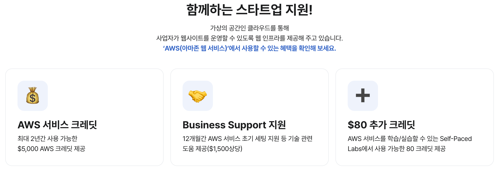
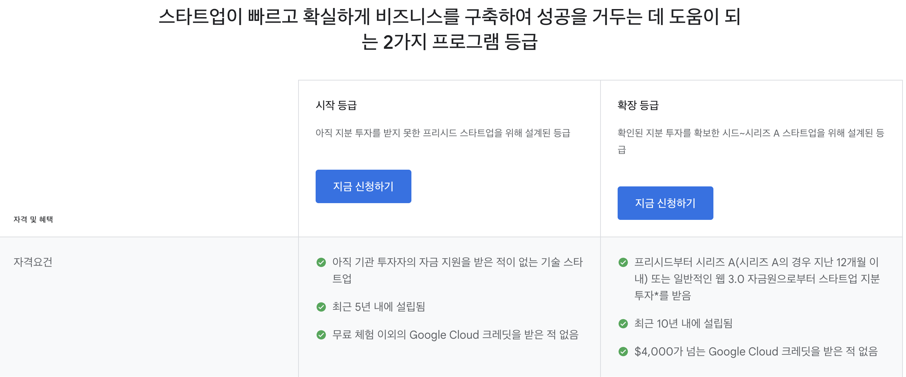
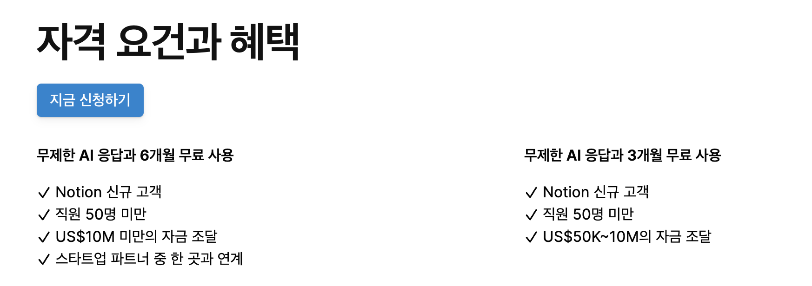

# 스타트업이 받을 수 있는 클라우드, SaaS 혜택

요즘 스타트업 제품팀과 종종 미팅을 한다.  
  
제품은 이미 출시되었는데, 이제 시작 단계라 계속해서 속도전으로 기능을 붙이는 팀들이다.  
대부분 전체 팀원이 10인 이하이거나 개발팀원이 3 ~ 7이다.  
그러다보니 **고정비**에 대한 고민을 항상 듣게 된다.  
  
트래픽이나 가입자수는 아직 보잘 것 없고,    
수익은 0원인데,  
5명 ~ 10명의 급여로 매달 수천만원씩 나가고 있는 상황.  

이런 상황에서 한달에 클라우드 사용료로 30만원이라도 나오게 되면 이걸 어떻게 아낄 수 없을까 하는 고민이 먼저 든다.  
(EC2, ALB, Route53, CloudFront, RDS, Redis, S3 등 최소한의 구색이라도 갖춘 경우)  

물론 몇천만원씩 급여를 주니 이정도는 감안할 수 있는거 아니야? 라고 할 수 있다. 
  
하지만... **월급 200만원을 받을때 한달에 9900원 유튜브 프리미엄 구독도 부담스럽다**는걸 생각하면 수천만원을 쓴다고 해서 수십만원을 그냥 쓸 수 있는 것은 아니다.  
  
**투자가 언제 들어올지, 흑자 전환이 언제될지는 아무도 모르기 때문**이다.  
그런 이유로 제품도 만들었고 개발팀도 3~7명정도 된 팀에서는 비용에 대해 아낄 수 있는 한 아끼게 된다.  
특히, 대표님이 "그거 꼭 구매해야해?" 라는 이야기를 항상 하시게 된다.  
들어오는 돈은 없는데, 나가는 돈만 계속 생기니깐.  
  
그래서 그런 분들을 만나게 되면 여러 **스타트업 지원 프로그램**들을 소개 한다.  
  
**초기 스타트업이라면 클라우드, SaaS 들의 스타트업 전용 혜택**을 받을 수 있다.  
이걸 모르고 그냥 개인 계정으로 사이드 프로젝트 하듯이 전혀 할인/혜택을 받지 않고 정직(?)하게 비용을 지불하면 너무 아깝다.    
  
아래 내용은 **스타트업이 아니더라도 무료로 쓸 수 있는 그런 혜택들은 배제**했다.  
**특정 VC나 엑설레이터 소속이어야만 받을 수 있는 혜택들도 모두 배제**했다.
대부분의 스타트업들이 사업을 하면서 쓸 수 밖에 없는 필수 서비스들만 대상으로 했다.  
  
만약 조건에 맞는 혜택이 있다면 절대 놓치지 않고 신청해서 알뜰살뜰 제품을 만들어 가기를 추천한다.

> 그 외 스타트업을 위한 지원 정책을 가진 제품이 있다면 댓글로 알려주시라.
  
## 1. AWS - $5,000 크레딧

대부분의 스타트업들 개발자분들이 인프라나 클라우드에 이해도가 높은게 아니라면 가장 무난하고 익숙한 AWS를 선택한다.  
이때 혼자 사이드 프로젝트를 하듯이 비용을 지불 하기 보다는 가능하면 **스타트업용 크레딧을 받아서** 사용해보자.  
  
#### 혜택

2년간 사용 가능한 **$5,000 (대략 600만원)** 의 크레딧을 받을 수 있으며, 여러가지 **기술 지원을 12개월간 무료**로 받을 수 있다.

#### 자격 조건

다만, 아래의 자격조건을 만족해야만 한다.
- 설립일 10년 이하
- 투자 단계 시리즈 A 이하, 투자 이력 없어도 가능
- 기업 홈페이지 보유

아래 링크로 신청하면 위 혜택을 받을 수 있다.

- [신청 링크](https://www.inflearn.com/partners/aws)

**인프런 B2B 고객이 아니여도 신청가능하다**.  

> 인프런은 어디까지나 AWS의 Activate 프로그램을 홍보해주는 역할만 하며 그 어떤 혜택도 없다.. ㅠ  
> (주변에 인프런 홍보좀...)

초기 스타트업에게 AWS의 크레딧 5,000불, 12개월 동안의 기술지원 등은 정말 큰 혜택이다.  
**내가 구성한 AWS 인프라에 대한 점검이나 과도하게 빠져나가는 비용에 대한 분석**등을 충분히 지원 받을 수 있다.  
  
가능한 이 기간 내에 AWS 클라우드의 역량을 **무료로** 충분히 쌓는 시기가 되는 것이 좋다.

### 1-1. AWS - MSP 적극 활용하기

AWS와 같은 클라우드를 직접 운영하는 분들이라면 MSP (Managed Service Provider) 파트너사를 꼭 이용해야한다.  
AWS의 아키텍처 등에 대해서는 AWS 비즈니스 서포트를 통해서도 받을 수 있지만, **전담 매니저를 통해 우리 회사에 맞게 정기적으로 컨설팅/점검**을 받으려면 이런 전문 컨설팅 기업의 도움을 받으면 좋다.

- 고객사의 초기 아키텍쳐 설계 및 컨설팅 
- 자체 빌링 솔루션 
- 초기 요금 설계 
- 사용료 실시간 모니터링 및 예측
- 요금 최적화 서비스
  
등 초기 스타트업이 고민하는 많은 부분을 담당 매니저가 배정되어 도움을 받을 수 있다.  
  
특히 우리 제품이 e-commerce나 Media service (OTT, 컨텐츠 등) 이라면 높은 Data Transfer 비용이 발생한다.  
이런 경우 CloudFront 를 사용해야만 하는데, 이때 **MSP 파트너사를 통해 일정 기간 약정 할인**을 받을 수 있다.  
물론 이외에도 다양한 할인 정책을 받아볼 수 있다.  
  
MSP 파트너사는 "규모가 있어야만 해야하는것이 아닐까" 하는 걱정하시는 분들이 계시는데, 인프런 역시 개발팀이 4명일때부터 파트너사와 함께 했다.  
규모와 관계 없이 작은 규모에서부터 함께 하면서 도움을 받길 추천한다.  
  
국내에서는 대표적으로 아래 2개 파트너사가 많은 기업에서 계약하고 있다.

- [메가존 클라우드](https://www.megazone.com/)
- [베스핀글로벌](https://www.bespinglobal.com/)

## 2. JetBrains - 50% 할인

우리 개발팀의 생산성을 책임지는 각종 IDE를 판매하는 JetBrains사의 제품 역시 스타트업이라면 **할인 혜택**을 받을 수 있다.  
  
요즘은 VSCode등 무료 도구가 발전하고 있지만, 어디까지나 많은 플러그인 생태계를 가진 웹 프론트엔드에서 충분하지 그 외 개발환경에서도 무료 도구만으로 개발 생산성을 높이는 것은 어렵다.  

WebStorm (JS/TS), PyCharm (Python), PhpStorm (php), IntelliJ (Java/Kotlin) 등을 따라갈 수가 없다.  
특히, 각종 데이터 저장소 (RDBMS, MongoDB 등) 를 사용해야할때 **DataGrip만큼 좋은 도구 찾기가 어렵다**.  

주변에서 추천 받는 이런 데이터 저장소 GUI 도구들은 대부분 RDBMS에 한정해서만 사용할 수 있거나, **무료라서** 쓰는 경우가 많다.  
그게 더 좋아서라기 보다는 "공짜 치고 이정도면 쓸만하지" 이기 때문에 훨씬 더 좋은 유료 도구를 쓸 수 있다면 그걸 사용해서 **생산성을 높이는 것이 좋다**.  
    
그런 의미에서 **JetBrains 할인을 놓치지 않는 것이 좋다**.

#### 혜택

모든 개발도구에 대해서 **최대 10개의 라이선스**에 대해 **60개월까지 50% 할인 혜택**을 받을 수 있다.

#### 자격 조건

- 비상장 기업
- 설립된지 5년 미만이(사업자 등록증의 정보 기준)
- 인터넷 상에 웹사이트 혹은 회사에 관한 공개된 자료

신청 방법은 아래 링크를 참고한다.

- [JetBrains 50% 할인 받기](https://blog.jetbrains.com/ko/2020/04/06/startup_discount_ko/)

## 3. Github - Enterprise 무료

웬만한 스타트업 팀은 Github Enterprise가 아니라 Github Team Plan으로 충분하다.  
그렇지만, Team Plan보다 상위 호환인 **Enterprise를 무료**로 쓸 수 있다면 어떨까?  
Github 에서는 스타트업 팀을 위해 Enterprise 무료 플랜을 지원한다.

#### 혜택

**12개월간** **20개 계정**에 대해 **GitHub Enterprise** 지원

#### 자격 조건

- **시리즈 A 까지**
- GitHub Enterprise 을 처음 사용하며, **이전에 GitHub Enterprise 크레딧이 없는 경우**

신청 방법은 아래 링크를 참고한다.

- [신청 링크](https://github.com/enterprise/startups)

특히 **Gihtub Action를 월간 50,000분을 쓸 수 있다**는게 좋다.  
생각보다 Github Action은 제품팀의 가제트 형사처럼 여기저기서 사용되는데, Team Plan의 3,000분은 금방 쓰게 된다.  
**50,000분이면 웬만한 팀은 절대 부족할 일이 없다**.  

> 12개월이 지나면 Team Plan을 쓰자...

## 4. Google Workspace - Business+ 무료

구글 워크스페이스는 회사를 운영하면 절대 빠질 수 없는 서비스이다.  
사내 이메일 부터 구글 드라이브, 구글 시트 등 협업에 있어서도 절대 빠지지 않는다.  
특히 구글 이메일 계정을 통한 각종 서비스들의 로그인 연동등을 고려하면 대부분 꼭 가져가는 서비스 중 하나이다.  

#### 자격 조건

기업의 규모에 따라 자격 요건이 다르다.  

조금 더 자세히 보고 싶으면 아래 링크를 참고한다.
- [자격 요건](https://cloud.google.com/startup?hl=ko)

#### 혜택

신규 가입에 한해서 **Google Workspace Business Plus 12개월간 무료** 사용이 가능하다.  
팀을 시작하고, 아직 구글 워크스페이스를 사용하고 있지 않다면 무조건 신청해야한다.

- [신청 링크](https://cloud.google.com/startup?hl=ko)

## 5. Notion - 무료

스타트업에서 올인원 워크스페이스를 구성할때 가장 먼저 언급되는 Notion 역시 스타트업 지원 프로그램이 존재한다.  
  
Notion에 대해서는 많은 스타트업들이 꼭 써야하는 제품인가에 대해서 의견이 나뉜다.  
  
이미 큰 기업에서 경험이 있는 분들은 Atlasian 제품군을 사용하고, Atlasian 제품을 선호하지 않는 분들은 Notion 외에도 Clickup 등이 사용되기 때문이다.  

다만, 10인이하 스타트업에서 Notion 이 가장 무난한 선택인것은 사실이라서 추천하게 되었다.  

#### 혜택

**3개월 무료 사용** (AI 기능 지원 포함)  
혜택이 조금 짧은게 아닌가 싶은데, 6개월 무료 지원도 존재한다.  
다만, 이를 위해서는 **연계된 스타트업 파트너사**가 있어야 한다.

#### 자격 조건

파트너사 제한이 없는 3개월 무료를 받으려면 아래 조건을 달성해야 한다.

- Notion 신규 고객
- 직원 50명 미만
- $50K~10M 사이의 투자

신청 방법은 아래 링크를 참고한다.

- [신청 링크](https://www.notion.so/ko-kr/startups)

## 마무리

> 이 외에도 스타트업 플랜을 지원하는 서비스들은 많다.  
([cloudflare](https://www.cloudflare.com/ko-kr/forstartups/?ref=blog.cloudflare.com), [MongoDB](https://www.mongodb.com/startups), [Datadog](https://www.datadoghq.com/partner/datadog-for-startups/) 등)  
> 하지만 이들은 **연계된 파트너사, VC, 엑설레이터 등에 포함되어있어야** 가능하다.  

이제 막 시작하는 스타트업을 지원하는 프로그램은 요즘 정말 많다.  
이들을 모르고 그냥 넘어가면 안된다.  
때가 지나면 헤택을 받지 못한다.  
이런 혜택을 놓치지 말고 다 받아서 **가성비 있는 생산성**을 뽑아내면 좋다.  
생산성을 해쳐가면서까지 무료로 쓰는 것도 초기 스타트업에서는 좋은 일은 아니다.  
  
그리고 이렇게 혜택을 받고 나중에 잘 된다면 이들처럼 또 다른 시작하는 스타트업을 위한 스타트업 지원 프로그램을 만든다면 좋겠다.  
  
계속해서 서로가 서로의 잘됨을 지원하는, 순환하는 스타트업 생태계가 되었으면 좋겠다.

