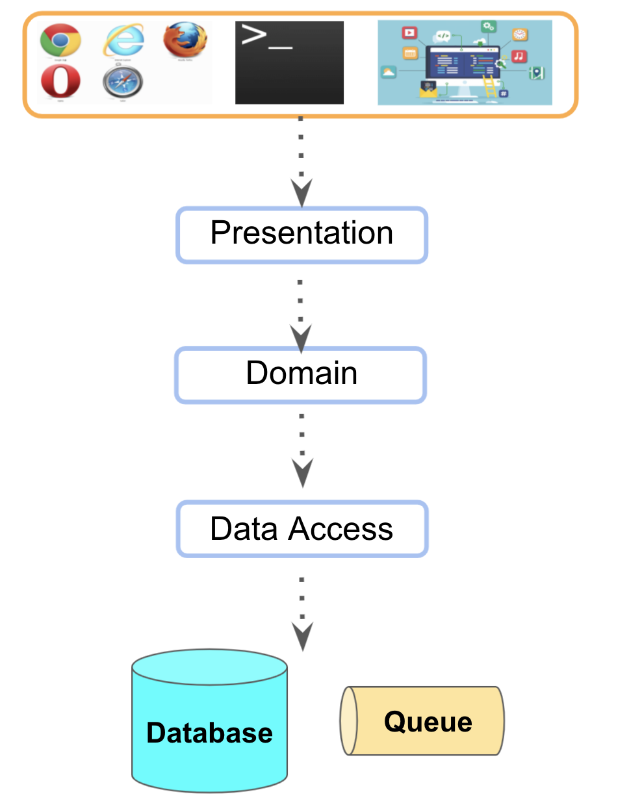
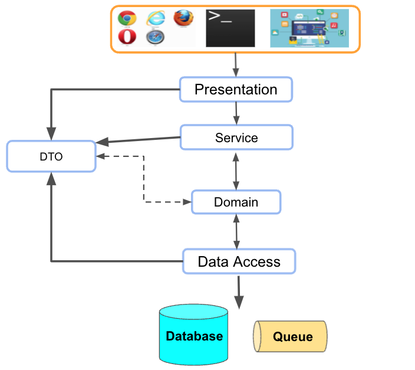
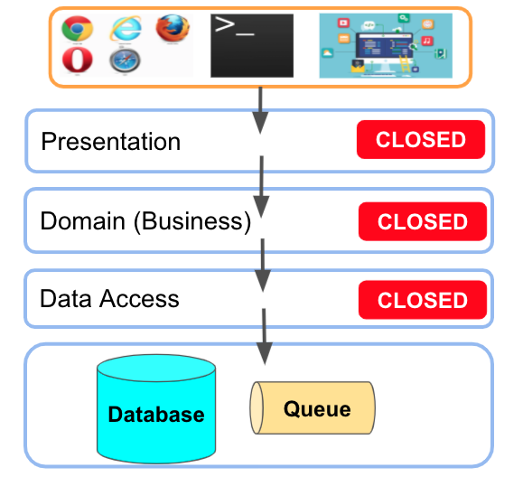

# 계층형 아키텍처

학교 다닐때 잠깐 JAVA 관련 수업을 들은적이 있다.  
그때 수업 내용은 [넷빈즈(Netbeans) IDE](https://namu.wiki/w/%EB%84%B7%EB%B9%88%EC%A6%88)를 통해 JAVA로 윈도우 애플리케이션을 만드는 것이였다.  

간단한 시간표 관리 프로그램을 만드는 과제는 얼핏보면 웹과 크게 다르지않다.  


(이미지 출처: [blog.asata.pe.kr](https://blog.asata.pe.kr/486))  

개발 자체는 꽤나 간단해서 JAVA (Swing)로 애플리케이션 UI와 로직을 작성하고, Database에 접근해서 시간표를 저장하고 불러오는 방식이였다.  

당시에는 계층 (Layer) 혹은 모듈화라는 개념이 없어서 **UI를 담당하는 클래스에서 검증, 계산, DB 접근등을 모두 처리**했었다.  

기능 자체는 잘 작동했고, 실제로 과목 점수도 잘 받았다.  

하지만 이게 실제 회사의 서비스였다면 이야기가 달라진다.  
서비스가 계속해서 발전되고 변화를 요구 받기 때문이다.  

시대의 흐름에 따라 이 프로그램을 윈도우 애플리케이션에서 **웹으로 전환**해야한다면 어떻게 될까?  
메인 Business 로직은 동일하니 (테이블 스키마까지도 동일) 주요안 코드들을 다 사용할 수 있었을까?  
UI만 다를뿐이니 JAVA Swing 코드를 걷어내고, JSP 혹은 Thymeleaf 등의 템플릿 엔진만 적용해서 WAS에 올리면 될까?  
아니면 전체를 다 새롭게 만들어야만 할까?  

당시 작성했던 코드라면 **전체를 새로 만들어야만 했다**.  

**주요 Business 로직들은 웹이나 윈도우 애플리케이션이나 동일**함에도 UI 영역과 Business 로직, 영속성 영역이 모두 한곳에서 관리되고 있었기 때문에 **UI 영역이 변경된다는 것은 모든 코드의 변화**가 필요하기 때문이다.  

비단 윈도우 애플리케이션에서 웹으로의 변화뿐만 아니라, 좀 더 작은 범위인 React <-> Vue / 저장소 (RDBMS <-> NoSQL or Messge Queue or 외부 API) / HTTP 라이브러리 (request <-> Axios) 등의 교체를 해야할때도 마찬가지다.  

각 **계층에 대한 분리가 없다면** 언제나 변화가 필요할때마다 대대적인 코드 변경이 필요하다.  
이런 상태라면 그만큼의 오류 발생율이 높아지고, 어느 부분을 변경해야할지 파악하기도 쉽지 않다.  

즉, 계층화는 꼭 필요한 작업이다.

## 1. 주요 계층

마틴 파울러의 책, PoEAA ([Pattern of Enterprise Application Architecture: 엔터프라이즈 애플리케이션 아키텍처 패턴](http://www.kyobobook.co.kr/product/detailViewKor.laf?ejkGb=KOR&mallGb=KOR&barcode=9791158390174&orderClick=LEa&Kc=)) 을 보면 대표적인 3계층을 소개한다.



* Presentation 계층
  * 사용자와 상호 작용 처리 계층
  * CLI, HTTP 요청, HTML 처리 등을 담당한다.
  * HTTP 요청 처리 및 HTML 렌더링에 대해 알고 있는 웹 계층
  * 흔히 말하는 MVC (Model / View / Controller) 도 이 계층에 속한다.
* Domain(Business or Service) 계층
  * 서비스/시스템의 핵심 로직
  * 유효성 검사 및 계산을 포함하는 Business 논리 계층
  * 애플리케이션이 수행해야하는 **도메인**과 관련된 작업들을 담당한다.
    * 입력/저장된 데이터를 기반으로한 계산
    * Presentation 계층에서 받은 데이터의 유효성 (Validation) 검사
    * 어떤 Data Access 를 선택할지 결정한다.
* Data access(Persistence) 계층
  * DAO 계층
  * Database / Message Queue / 외부 API와의 통신 등 처리
  * 데이터베이스 또는 원격 서비스에서 영구 데이터를 관리하는 방법을 분류하는 데이터 접근 계층

이 3계층외에도 다양한 N 계층이 있다.  

최근까지는 (개인적인 경험으로) 아래와 같이 좀 더 풍부한 도메인 객체 (Rich Domain Model)에 맞도록 계층을 나눠서 사용하기도 한다.



토비의 스프링 책을 보면 Business (도메인) 계층을 아래 2 계층으로 분리해서 설명한다.

* 서비스 계층
* 기반 서비스 계층

다만, 나 같은 경우 서비스와 기반 서비스로 나누자니 기존에 `@Service` 에 모든 Business 로직을 넣는 분들이 오해하실 때가 있어서 아래와 같이 도메인 / 서비스 계층으로 부르는걸 선호한다.

* 도메인 계층
  * Rich Domain 모델을 기반으로한 **순수 도메인 문제 해결에 집중하는 계층**
  * Business 로직만 담당하며, 외부의 특정 기술이나 구현 의존성을 최대한 피한다.
* 서비스 계층
  * 기반 서비스 계층 혹은 애플리케이션 계층 등으로 불린다.
  * 도메인 로직과 함께
    * 트랜잭션, 메일 & SMS 발송 등

원칙적으로는 Rich Domain Model을 구현한다면 도메인 로직은 애플리케이션 로직에 의존하면 안된다.  

의존하게 될 경우

* 도메인 로직을 다른 애플리케이션 로직에서 재사용하기가 어렵고
*

> Rich Domain Model이 처음이라면 아래 2개를 참고한다.
> * [우아한테크세미나 - 조영호](https://www.youtube.com/watch?v=dJ5C4qRqAgA)
> * [Rich Domain Model - 조영호](https://www.slideshare.net/baejjae93/rich-domain-model)


각 계층은

> 이 외에도 다양한 계층에 대한 이야기는 [토비의 스프링 3.1의 9.3 애플리케이션 아키텍처 챕터](https://ridibooks.com/books/111017526)를 읽어보면 좋다.

### 데이터 계층


> DataMapper와 Repository 두 패턴간에는 기본적으로 내세우는 기능이 다를뿐 [패턴이 지향하는 바는 다르지 않습니다](https://stackoverflow.com/questions/27996119/what-exactly-is-the-difference-between-a-data-mapper-and-a-repository).  
> 물론 DataMapper와 Repository를 완전히 분리해서 사용하는 것이 어렵지는 않지만, TypeORM이나 Spring Data JPA와 같이 이 패턴들을 지원하는 프레임워크들도 굳이 DataMapper와 Repository를 구분해서 가이드 하지 않기 때문에 이 글에서도 굳이 엄격히 구분하진 않았다.


> Active Record 패턴과 DataMapper 패턴에 대한 [마틴 파울러의 대화](https://martinfowler.com/articles/badri-hexagonal/)도 한번 보시면 좋습니다.


### DTO

DTO (Data Transfer Object) 는 도메인 객체가 도메인 계층을 벗어나지 못하도록 지원한다.  
DTO 계층이 없다면 대표적으로 다음과 같은 경우에 도메인 객체가 손상될 확률이 높다.

* Presentation 영역에서 필요한 로직과 도메인 로직을 분리할 수 있다.
  * 단순히 화면 노출에 필요한 연산 (날짜 타입 직렬화 등)은 도메인 로직이 담당하는 것이 아니다.
  * 도메인 객체를
* 도메인 로직이 오염된다.
  * 도메인 객체는 단순히 값 조작과 연산이 들어가는게 아니라 주요한 도메인 로직을 담고 있다.
  * 화면 노출 혹은 외부 API 제공에 도메인 객체가 사용된다면 `public`, `private` 등의 scope 오염부터 시작해서 굉장히 많은 부분에서 도메인 로직이 오염된다.
* 통계나 지표 등의 데이터가 필요할 경우 여러 테이블의 컬럼값을 조합해서 만들어진다.
  * 이런 경우에는 적절한 도메인 객체를 선택하기 보다는 DTO를 통해 단순히 값만 담은 형태로 제공한다.


## 계층화의 원칙

(예제는 `Typescript`와 `@type/pg` 코드를 기반으로 했다.)  

아래와 같은 코드는 좋지 못한 계층화 상태이다.

```javascript
async findById(id: number): Promise<QueryResult>
```

* 이 DataAccess 계층을 호출하는 서비스 계층은 **DataAccess 계층에 종속적인 QueryResult 를 알아야만 한다**


```javascript
async findById(id:number): Promise<User>
```


## 계층화를 해야하는 이유

서두에서 언급했지만, 계층화는 크게 3가지 이유로 필요하다

(1) 관심 범위 축소 (관심사 분리)
(2) 모듈 교체의 용이성
(3) 좀 더 용이한 테스트

### 관심 범위 축소 (관심사 분리)

Presentation 계층이 Data Access 계층으로 직접 접근을 하면 안되는 이유는 무엇일까?  
단순하게 생각해보면 불필요한 클래스를 생성할 필요가 없고, (아주 미세하지만) 여러 계층을 이동하는 것보다는 더 빠른데도 말이다.  

이 질문에 대한 답은 격리 (Closed) 계층 때문이다.  

격리 계층은 요청이 계층에서 계층으로 이동할 때 **바로 아래의 계층을 거쳐야 해당 계층 아래의 다음 계층으로 이동**해야 함을 의미한다.  

예를 들어 Presentation 계층에서 시작된 요청은 먼저 Business 계층을 거친 다음 DataAccess 계층을 거쳐 Database 계층으로 이동해야 한다.



이 개념은 계층은 아키텍처의 **한 계층의 변경이 다른 계층의 구성 요소에 영향을 미치지 않도록 한다**는 것을 의미한다.  

에를 들어 Presentation 계층에서 지속성 계층에 대한 직접 접근를 허용하면 지속성 계층 내에서 SQL에 대한 변경 사항이 Business 계층과 Presentation 계층 모두에 영향을 미치므로 구성 요소 간에 상호 의존성이 많은 매우 긴밀하게 결합된 애플리케이션이 생성됩니다.
이러한 유형의 아키텍처는 변경하기가 매우 어렵고 비용이 많이 듭니다.  

즉, 격리 계층이라는 개념은 각 계층가 다른 계층와 독립적이므로 아키텍처에서 다른 계층의 내부 작동에 대한 지식이 거의 또는 전혀 없음을 의미합니다

* JSP로 이루어진 웹 페이지를 Thymeleaf로 전환해야한다고 생각해보자.
  * Presentation 계층과 Business 계층 간에 사용되는 계약(예: 모델)이 동일하게 유지된다고 가정하면 Business 계층은 리팩토링의 영향을 받지 않고 Presentation 계층에서 사용하는 사용자 인터페이스 프레임워크 유형과 완전히 독립적입니다.  

Presentation 계층 / Domain 계층 / DataAccess 계층 이라는 3 계층에 대해 독립적으로 생각할 수 있게 된다.

* 도메인 논리 코드로 작업할 때 대부분 UI를 무시하고 데이터 소스와의 상호 작용을 필요한 데이터를 제공하고 원하는 대로 업데이트하는 추상 함수 집합으로 처리할 수 있다.
* 데이터 접근 계층에서 작업할 때 내 인터페이스에 필요한 형식으로 데이터를 랭글링하는 세부 사항에 중점을 둔다.
* Presentation 작업을 할 때 UI 동작에 집중할 수 있다. 표시하거나 업데이트할 데이터를 함수 호출에 의해 마술처럼 나타나는 것처럼 처리한다. 이러한 요소를 분리함으로써 각 부분에서 생각의 범위를 좁혀서 내가 해야 할 일을 더 쉽게 따라갈 수 있다.

이러한 범위의 축소는 개발에 대한 순서를 의미하지 않는다.  
일반적으로 계층 사이를 반복해야 한다는 것을 알았다.  
UX에 대한 초기 이해를 바탕으로 데이터 및 도메인 계층를 구축할 수도 있지만 UX를 개선할 때 데이터 계층를 변경해야 하는 도메인을 변경해야 한다.  
그러나 이러한 종류의 교차 계층 반복을 사용하더라도 변경을 수행할 때 한 번에 한 계층에 집중하는 것이 더 쉽다는 것을 알았다.  

마치 [리팩토링](http://www.yes24.com/Product/Goods/89649360)의 두 가지 모자를 사용 하여 사고 모드를 전환하는 것과 유사하다.

> 리팩토링의 2가지 모자는 리팩토링1,2 (2.2 두개의 모자) 모두에서 언급하고 있는 용어로 소프트웨어 개발의 목적이 **기능 추가**냐 **리팩토링**이냐를 명확히 구분하는 것을 **비유**한 것이다.  
> 기능을 추가할 때는 **기능 추가 모자**를 쓰고 기존 코드는 절대 건드리지 않은채 새 기능을 추가하고, 리팩토링할 때는 **리팩토링 모자**를 쓴 다음 기능추가는 절대 하지 않고 오로지 코드 재구성만 한다.  
> 항상 현재 **본인이 쓰고 있는 모자가 무엇인지** 인지하고, 그에 따른 미묘한 **작업 방식의 차이를 분명하게 인식**하는 일종의 장치처럼 사용된다.

### 모듈 대체성

또 다른 이유는 다른 모듈 구현체로 쉽게 대체하기 위함이다.  
이러한 분리를 통해 동일한 도메인 논리를 복제하지 않고도 여러 Presentation을 작성할 수 있다.  
여러 Presentation은 웹 앱과 모바일 네이티브 앱, 스크립팅용 API 또는 CLI 인터페이스가 있는 웹 앱의 개별 페이지일 수 있다.  

DataAccess를 모듈화하면 데이터베이스 기술의 변화에 ​​유연하게 대처할 수 있고 다른 계층에서는 거의 변경 없이 다른 저장소 서비스를 지원할 수 있다.  

### 용이한 테스트

마지막 3번째 장점은 테스트를 좀 더 용이하게 가능하게 해준다는 점이다.  
계층화는 자연스럽게 테스트를 위한 좋은 인터페이스를 제공한다.  

이를테면 UI 코드는 테스트하기 까다로운 경우가 많으므로 UI를 통해 프로그램에 접근하기 위해 체조를 할 필요 없이 쉽게 테스트할 수 있는 도메인 계층에 가능한 한 많은 논리를 가져오는 것이 좋다.  

데이터 접근는 느리고 어색한 경우가 많으므로 데이터 계층에서 [TestDouble](https://martinfowler.com/bliki/TestDouble.html) 를 사용 하면 Domain 로직의 테스트가 훨씬 쉽고 응답성이 좋다.

모듈 대체성과 용이한 테스트는 확실히 계층화의 장점이다.  
하지만 이 2가지 이유중 하나가 없더라도 **관심 범위 축소**라는 이유만으로도 계층화는 적용해야만 한다.

## 도메인 로직을 구분하는 방법

이 로직이 **도메인 로직인지 아닌지** 구분하는 것은 꽤나 어렵다.  
그래서 이럴때는 마틴파울러의 PEAA (엔터프라이즈 애플리케이션 아키텍처 패턴)에 나온 방법을 주로 사용하면 좋다.  

* 웹 애플리케이션이라면, CLI로 이 애플리케이션을 실행해야 한다고 가정해본다.
* RDBMS로 저장해야하는 애플리케이션이 있다면 저장 방식에 XML 파일도 추가되는 것을 가정해본다.

> 근본적으로 계층이 추가/변경되는 경우이다.

만약 위와 같이 계층이 추가/변경되기 위해서 **코드를 복사해야한다면** 그 로직이 바로 도메인 로직이다.  
