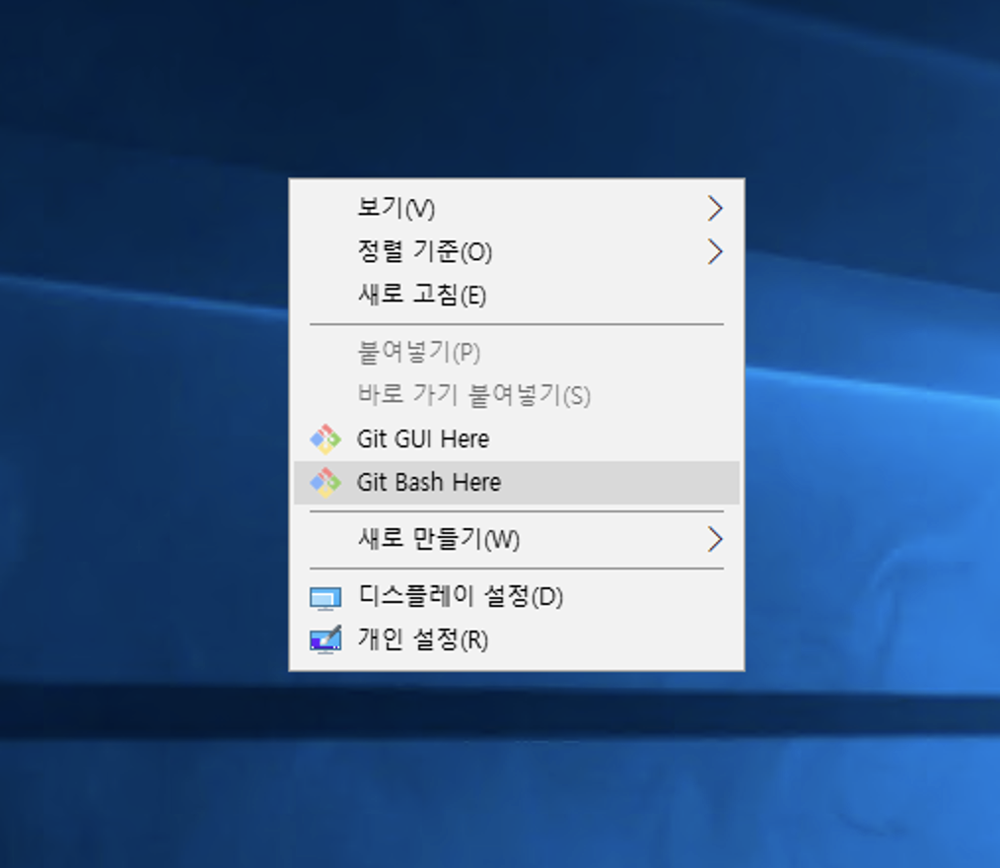
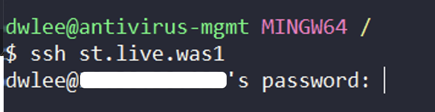
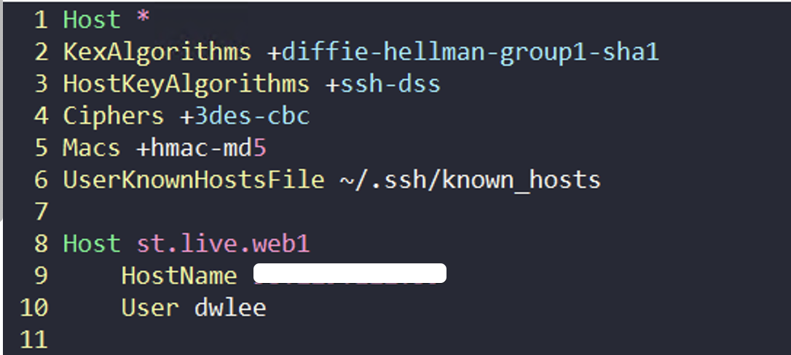
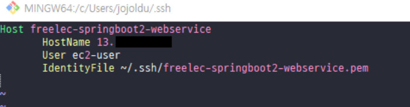
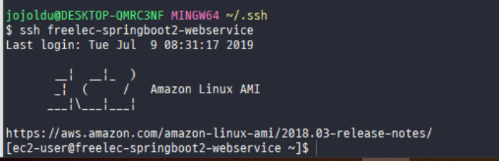
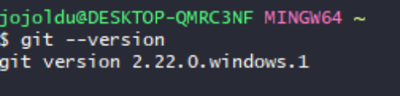
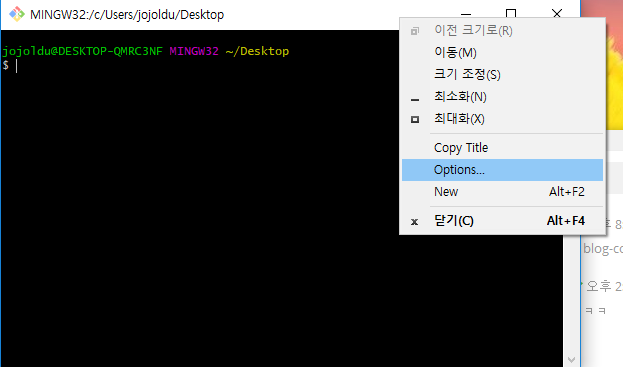
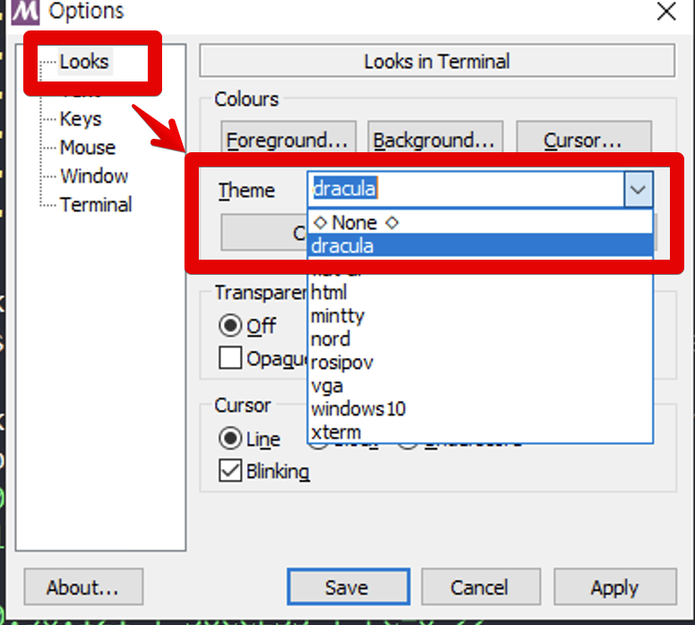

# 윈도우에서 ssh 터미널 사용하기

윈도우를 사용하게 되면 ssh로 원격 리눅스 서버로 접근시 항상 **별도의 클라이언트를 사용하게 됩니다**.  
putty 혹은 xshell 등을 이용하게 되는데, 사실 이 방식이 다른 OS (맥, 리눅스 등)에선 잘 사용되지 않습니다.  
ssh로 바로 접근이 가능하다보니 윈도우에서만 특별하게 어떤 툴을 사용하는게 마음에 들진 않습니다.  
  
저 같은 경우 최근에 윈도우와 맥OS에서 듀얼로 회사일을 처리하게 되었는데요.  
이 때문에 ssh 접속때마다 putty를 쓸려니 여간 스트레스가 아니였습니다.  
  
그래서 다른 OS와 마찬가지로 윈도우에서도 ssh 접속을 하도록 개선해보겠습니다.

## 1. 개발 환경

* 윈도우용 Git Bash가 설치되어 있어야 합니다.

보통은 Git을 **기본 옵션으로만 선택**하면 설치되어 있을테니 따로 설치하지 않으셔도 됩니다.  

## 2. ssh config 등록

윈도우 PC가 개인용일수도 있고, **원격 서버**일 수도 있으니 전체 계정을 변경하는 방법 보다는 **현재 계정에만 적용 되는 방법**으로 진행합니다.  
  
Git Bash를 실행하는 방법은 바탕화면 우클릭 -> Git Bash Here 로 하시면 됩니다.



Git Bash를 실행했다면 먼저 ```.ssh``` 디렉토리를 생성합니다.  
(이미 존재한다면 안하셔도 됩니다.)  
  
```bash
mkdir ~/.ssh
```

그리고 해당 디렉토리에 ```config``` 파일을 생성합니다.  
(아무런 확장자가 없는 파일입니다.)  
  
```bash
vim ~/.ssh/config
```

여기에 원격 서버 접속 정보를 등록합니다.  
2가지로 나눠서 진행할 예정입니다.  

* 비밀번호로 접속
* pem 파일로 접속

### 2-1. 비밀번호 접속

config 파일에 다음과 같이 호스트 정보를 등록합니다.

```bash
Host 호스트명
    HostName 호스트IP
    User 호스트사용자명
```

이렇게 등록하게 되면 이후에는 git bash에서 ```ssh 호스트명``` 만 입력하면 해당 호스트 서버로 접속할 수 있게 됩니다.  

  

접속 시도 중 아래와 같이 **no matching key** 에러가 발생한다면 이는 openSSH에서 몇몇 옵션이 enable 되어있지 않기 때문입니다.

```bash
Unable to negotiate with legacyhost: no matching key exchange method found. Their offer: diffie-hellman-group1-sha1
```

그래서 모든 호스트 정보에서 사용할 수 있도록 config 최상단 영역에 다음의 설정을 추가합니다.

```bash
Host *
KexAlgorithms +diffie-hellman-group1-sha1
HostKeyAlgorithms +ssh-dss
Ciphers +3des-cbc
Macs +hmac-md5
UserKnownHostsFile ~/.ssh/known_hosts
```

실제 config 파일의 전체 내용은 다음과 같으니 참고해보세요.



### 2-2. pem키 접속

pem키 방식 역시 위와 동일합니다.  
단지 ```pem```키 위치만 추가해주시면 됩니다.



```bash
Host 호스트명
    HostName 호스트IP
    User 호스트사용자명
    IdentityFile pem키위치
```

그리고 다시 접속을 시도해보면 아래와 같이 잘 접속되는 것을 확인할 수 있습니다.



## 3. Dracula 테마 적용하기

그냥 Git Bash를 쓰기엔 iterm2 에 비해 예쁘지가 않습니다.  
Dracula 테마를 이용해 꾸며보겠습니다.  
  
윈도우용 Git의 버전이 **최신 버전이면 Dracula 테마가 기본 내장**되어 있습니다.  
  


> 2019.07.14 기준으로 2.22.0이 최신입니다.

Git Bash 창을 우클릭 하면 아래와 같이 여러 선택 메뉴가 나오는데, 여기서 **Options**를 선택합니다.



Options에서 Looks -> Theme -> dracula를 선택합니다.



그럼 Dracula 테마가 된 것을 확인할 수 있습니다.

