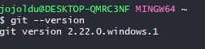

# 윈도우에서 ssh 터미널 사용하기


Git Bash를 이용하여 putty 대체하기

## Dracula 테마 적용하기

윈도우용 Git의 버전이 **최신 버전이어야만 Dracula 테마가 기본 내장**되어 있습니다.  
  


> 2019.07.14 기준으로 2.22.0이 최신입니다.


Looks -> Theme -> dracula를 선택합니다.


그럼 Dracula 테마가 된 것을 확인할 수 있습니다.

## ssh config 등록

```bash
vim ~/.ssh/config
```

```bash
Host *
KexAlgorithms +diffie-hellman-group1-sha1
HostKeyAlgorithms +ssh-dss
Ciphers +3des-cbc
Macs +hmac-md5
UserKnownHostsFile ~/.ssh/known_hosts

Host 호스트명
    HostName 호스트IP
    User 호스트사용자명

```

